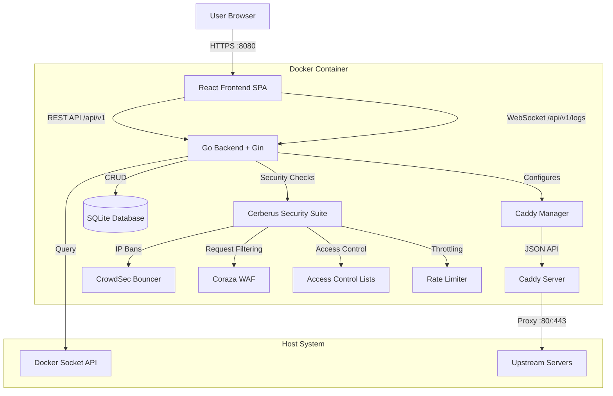
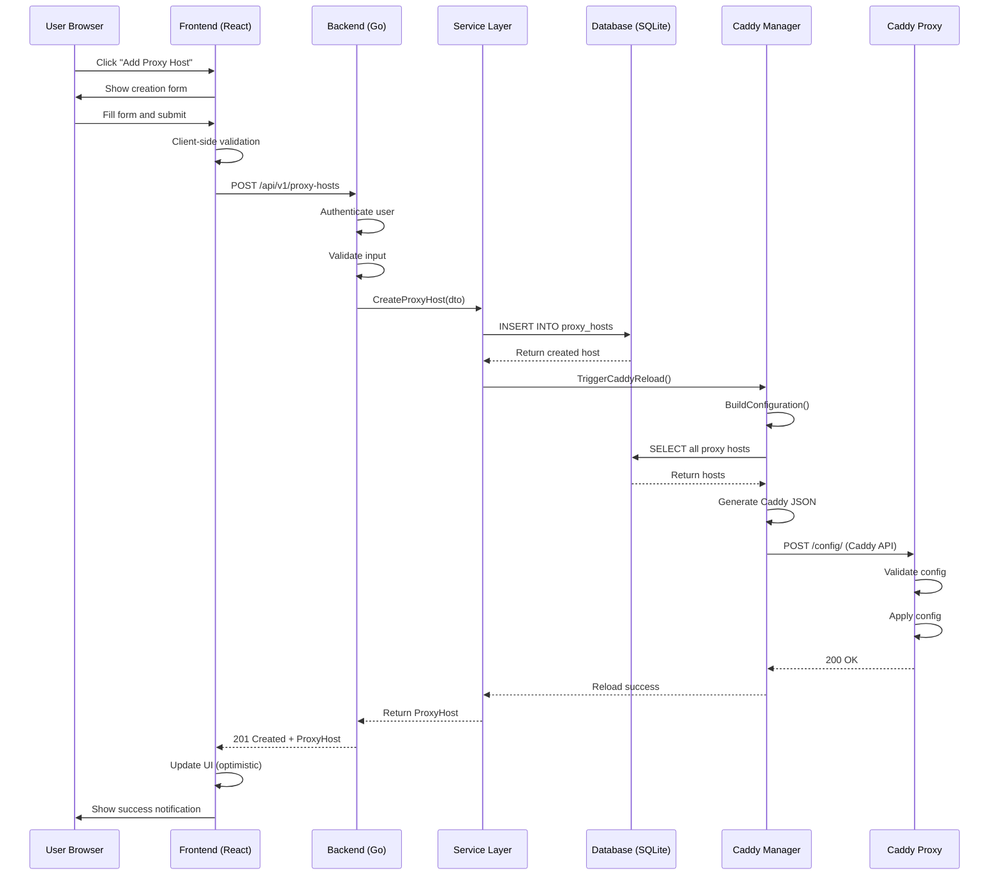
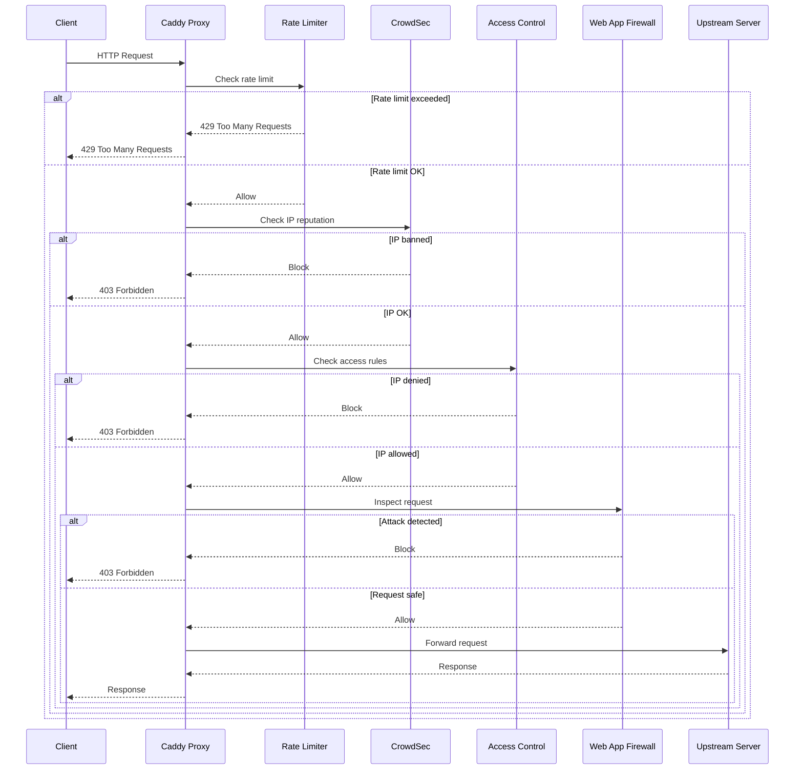
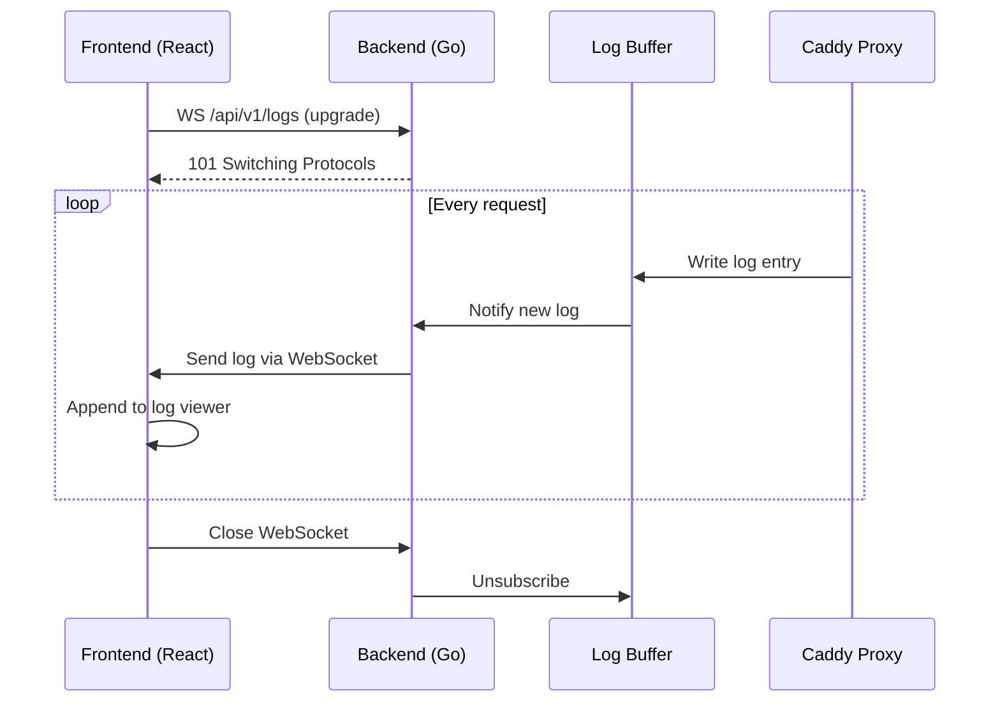
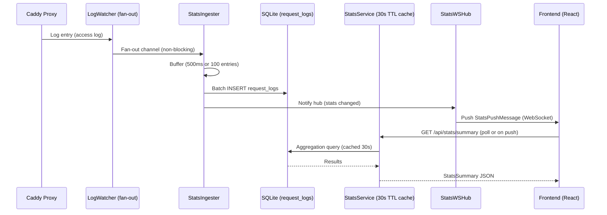
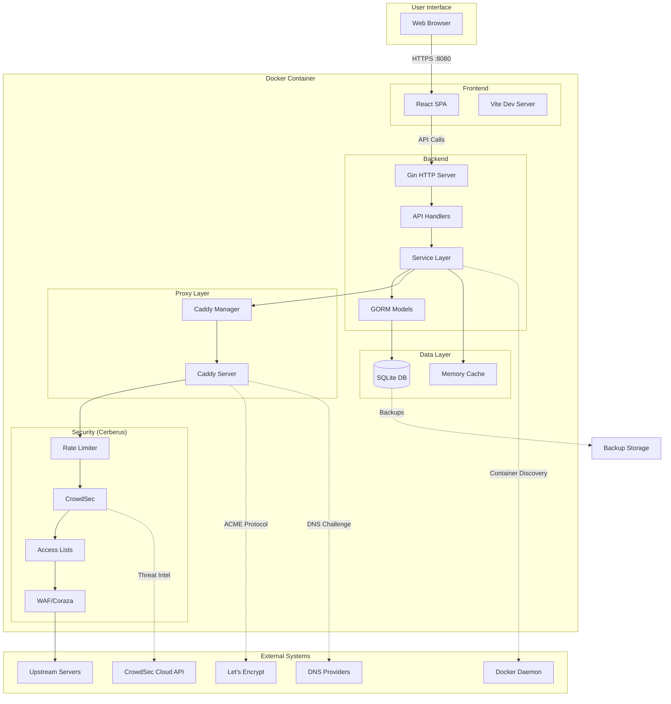

# Charon System Architecture

**Version:** 1.0
**Last Updated:** 2026-01-30
**Status:** Living Document

---

## Table of Contents

- [Overview](#overview)
- [System Architecture](#system-architecture)
- [Technology Stack](#technology-stack)
- [Directory Structure](#directory-structure)
- [Core Components](#core-components)
- [Security Architecture](#security-architecture)
- [Data Flow](#data-flow)
- [Deployment Architecture](#deployment-architecture)
- [Development Workflow](#development-workflow)
- [Testing Strategy](#testing-strategy)
- [Build & Release Process](#build--release-process)
- [Extensibility](#extensibility)
- [Known Limitations](#known-limitations)
- [Maintenance & Updates](#maintenance--updates)

---

## Overview

**Charon** is a self-hosted reverse proxy manager with a web-based user interface designed to simplify website and application hosting for home users and small teams. It eliminates the need for manual configuration file editing by providing an intuitive point-and-click interface for managing multiple domains, SSL certificates, and enterprise-grade security features.

### Core Value Proposition

**"Your server, your rules—without the headaches."**

Charon bridges the gap between simple solutions (like Nginx Proxy Manager) and complex enterprise proxies (like Traefik/HAProxy) by providing a balanced approach that is both user-friendly and feature-rich.

### Key Features

- **Web-Based Proxy Management:** No config file editing required
- **Automatic HTTPS:** Let's Encrypt and ZeroSSL integration with auto-renewal
- **DNS Challenge Support:** 15+ DNS providers for wildcard certificates
- **Docker Auto-Discovery:** One-click proxy setup for Docker containers
- **Cerberus Security Suite:** WAF, ACL, CrowdSec, Rate Limiting
- **Real-Time Monitoring:** Live logs, uptime tracking, and notifications
- **Configuration Import:** Migrate from Caddyfile or Nginx Proxy Manager
- **Supply Chain Security:** Cryptographic signatures, SLSA provenance, SBOM

---

## System Architecture

### Architectural Pattern

Charon follows a **monolithic architecture** with an embedded reverse proxy, packaged as a single Docker container. This design prioritizes simplicity, ease of deployment, and minimal operational overhead.



### Component Communication

| Source | Target | Protocol | Purpose |
|--------|--------|----------|---------|
| Frontend | Backend | HTTP/1.1 | REST API calls for CRUD operations |
| Frontend | Backend | WebSocket | Real-time log streaming |
| Backend | Caddy | HTTP/JSON | Dynamic configuration updates |
| Backend | SQLite | SQL | Data persistence |
| Backend | Docker Socket | Unix Socket/HTTP | Container discovery |
| Caddy | Upstream Servers | HTTP/HTTPS | Reverse proxy traffic |
| Cerberus | CrowdSec | HTTP | Threat intelligence sync |
| Cerberus | WAF | In-process | Request inspection |

### Design Principles

1. **Simplicity First:** Single container, minimal external dependencies
2. **Security by Default:** All security features enabled out-of-the-box
3. **User Experience:** Web UI over configuration files
4. **Modularity:** Pluggable DNS providers, notification channels
5. **Observability:** Comprehensive logging and metrics
6. **Reliability:** Graceful degradation, atomic config updates

---

## Technology Stack

### Backend

| Component | Technology | Version | Purpose |
|-----------|-----------|---------|---------|
| **Language** | Go | 1.26.0 | Primary backend language |
| **HTTP Framework** | Gin | Latest | Routing, middleware, HTTP handling |
| **Database** | SQLite | 3.x | Embedded database |
| **ORM** | GORM | Latest | Database abstraction layer |
| **Reverse Proxy** | Caddy Server | 2.11.2 | Embedded HTTP/HTTPS proxy |
| **WebSocket** | gorilla/websocket | Latest | Real-time log streaming |
| **Crypto** | golang.org/x/crypto | Latest | Password hashing, encryption |
| **Metrics** | Prometheus Client | Latest | Application metrics |
| **Notifications** | github.com/Wikid82/go_notify_yourself | Current | External delivery-engine module (Discord, Slack, Gotify, Pushover, Ntfy, Telegram, generic webhook, and email) consumed via Charon-supplied SSRF/SMTP/template adapters — see Service Layer below |
| **Docker Client** | Docker SDK | Latest | Container discovery |
| **Logging** | Logrus + Lumberjack | Latest | Structured logging with rotation |
| **Backup Archive Encryption** | filippo.io/age | Latest | Passphrase (scrypt) encryption of backup archives; audited, pure Go, streaming AEAD — avoids buffering whole archives in RAM or hand-rolling chunked AES-GCM |
| **Remote Backup Storage (S3)** | github.com/minio/minio-go/v7 | v7 | S3-compatible client (AWS S3, MinIO, Backblaze B2, Cloudflare R2); single-module dependency, path-style addressing support |
| **Remote Backup Storage (SFTP)** | github.com/pkg/sftp | Latest | SFTP client over `golang.org/x/crypto/ssh`; de-facto standard, pairs with the existing `x/crypto` dependency |
| **Remote Backup Storage (WebDAV)** | github.com/studio-b12/gowebdav | v0.13.0 | WebDAV client (Nextcloud, ownCloud, generic Apache/nginx `mod_dav`); minimal transitive deps, imperative API maps directly onto the `Uploader` interface |
| **Remote Backup Storage (OAuth)** | golang.org/x/oauth2 | v0.36.0 | Shared authorization-code flow + transparent token refresh for the Dropbox and Google Drive uploaders; Dropbox/Drive's own upload/list/delete REST calls are hand-rolled `net/http` (no vendor SDK), see `internal/services/remotestorage/` |

### Frontend

| Component | Technology | Version | Purpose |
|-----------|-----------|---------|---------|
| **Framework** | React | 19.2.3 | UI framework |
| **Language** | TypeScript | 6.x | Type-safe JavaScript |
| **Build Tool** | Vite | 8.0.0-beta.18 | Fast bundler and dev server |
| **CSS Framework** | Tailwind CSS | 4.2.1 | Utility-first CSS |
| **Routing** | React Router | 7.x | Client-side routing |
| **HTTP Client** | Fetch API | Native | API communication |
| **State Management** | React Hooks + Context | Native | Global state |
| **Internationalization** | i18next | Latest | 5 language support |
| **Unit Testing** | Vitest | 4.1.0-beta.6 | Fast unit test runner |
| **E2E Testing** | Playwright | 1.58.2 | Browser automation |
| **Theme System** | CSS Custom Properties + data-theme | N/A | `data-theme` attribute on `<html>` drives 5 built-in themes, custom colors, system mode, and logo customization |

### Infrastructure

| Component | Technology | Version | Purpose |
|-----------|-----------|---------|---------|
| **Containerization** | Docker | 24+ | Application packaging |
| **Base Image** | Debian Trixie Slim | Latest | Security-hardened base |
| **CI/CD** | GitHub Actions | N/A | Automated testing and deployment |
| **Registry** | Docker Hub + GHCR | N/A | Image distribution |
| **Security Scanning** | Trivy + Grype + Semgrep | Latest | Vulnerability detection |
| **SBOM Generation** | Syft | Latest | Software Bill of Materials |
| **Signature Verification** | Cosign | Latest | Supply chain integrity |

---

## Directory Structure

```
/projects/Charon/
├── backend/                    # Go backend source code
│   ├── cmd/                    # Application entrypoints
│   │   ├── api/                # Main API server
│   │   ├── migrate/            # Database migration tool
│   │   └── seed/               # Database seeding tool
│   ├── internal/               # Private application code
│   │   ├── api/                # HTTP handlers and routes
│   │   │   ├── handlers/       # Request handlers
│   │   │   ├── middleware/     # HTTP middleware
│   │   │   └── routes/         # Route definitions
│   │   ├── services/           # Business logic layer
│   │   │   ├── proxy_service.go
│   │   │   ├── certificate_service.go
│   │   │   ├── docker_service.go
│   │   │   ├── mail_service.go
│   │   │   ├── backup_service.go       # Backup creation, safe-restore pipeline, scheduling
│   │   │   ├── backup_remote_service.go
│   │   │   └── remotestorage/          # S3 / SFTP / WebDAV / Dropbox / Google Drive uploader implementations (Uploader interface)
│   │   ├── caddy/              # Caddy manager and config generation
│   │   │   ├── manager.go      # Dynamic config orchestration
│   │   │   └── templates.go    # Caddy JSON templates
│   │   ├── cerberus/           # Security suite
│   │   │   ├── acl.go          # Access Control Lists
│   │   │   ├── waf.go          # Web Application Firewall
│   │   │   ├── crowdsec.go     # CrowdSec integration
│   │   │   └── ratelimit.go    # Rate limiting
│   │   ├── models/             # GORM database models
│   │   ├── database/           # DB initialization and migrations
│   │   │   └── pending_restore.go      # Boot-time pending-restore swap consumer
│   │   ├── changelog/          # "What's New" changelog service (embedded JSON, no runtime network calls)
│   │   │   └── data/changelog.json     # Build-time generated changelog data (see "Release Workflow")
│   │   └── utils/              # Helper functions
│   ├── pkg/                    # Public reusable packages
│   ├── integration/            # Integration tests
│   ├── go.mod                  # Go module definition
│   └── go.sum                  # Go dependency checksums
│
├── frontend/                   # React frontend source code
│   ├── src/
│   │   ├── pages/              # Top-level page components
│   │   │   ├── Dashboard.tsx
│   │   │   ├── ProxyHosts.tsx
│   │   │   ├── Certificates.tsx
│   │   │   └── Settings.tsx
│   │   ├── components/         # Reusable UI components
│   │   │   ├── forms/          # Form inputs and validation
│   │   │   ├── modals/         # Dialog components
│   │   │   ├── tables/         # Data tables
│   │   │   └── layout/         # Layout components
│   │   ├── api/                # API client functions
│   │   ├── hooks/              # Custom React hooks
│   │   ├── context/            # React context providers (ThemeContext, AuthContext)
│   │   ├── locales/            # i18n translation files
│   │   ├── App.tsx             # Root component
│   │   └── main.tsx            # Application entry point
│   ├── public/                 # Static assets
│   ├── package.json            # NPM dependencies
│   └── vite.config.ts          # Vite configuration
│
├── .docker/                    # Docker configuration
│   ├── compose/                # Docker Compose files
│   │   ├── docker-compose.yml  # Production setup
│   │   ├── docker-compose.dev.yml
│   │   └── docker-compose.test.yml
│   ├── docker-entrypoint.sh    # Container startup script
│   └── README.md               # Docker documentation
│
├── .github/                    # GitHub configuration
│   ├── workflows/              # CI/CD pipelines
│   │   ├── *.yml               # GitHub Actions workflows
│   ├── agents/                 # GitHub Copilot agent definitions
│   │   ├── Management.agent.md
│   │   ├── Planning.agent.md
│   │   ├── Backend_Dev.agent.md
│   │   ├── Frontend_Dev.agent.md
│   │   ├── QA_Security.agent.md
│   │   ├── Doc_Writer.agent.md
│   │   ├── DevOps.agent.md
│   │   └── Supervisor.agent.md
│   ├── instructions/           # Code generation instructions
│   │   ├── *.instructions.md   # Domain-specific guidelines
│   └── skills/                 # Automation scripts
│       └── scripts/            # Task automation
│
├── scripts/                    # Build and utility scripts
│   ├── go-test-coverage.sh     # Backend coverage testing
│   ├── frontend-test-coverage.sh
│   └── docker-*.sh             # Docker convenience scripts
│
├── tests/                      # End-to-end tests
│   ├── *.spec.ts               # Playwright test files
│   └── fixtures/               # Test data and helpers
│
├── docs/                       # Documentation
│   ├── features/               # Feature documentation
│   ├── guides/                 # User guides
│   ├── api/                    # API documentation
│   ├── development/            # Developer guides
│   ├── plans/                  # Implementation plans
│   └── reports/                # QA and audit reports
│
├── configs/                    # Runtime configuration
│   └── crowdsec/               # CrowdSec configurations
│
├── data/                       # Persistent data (gitignored)
│   ├── charon.db               # SQLite database
│   ├── backups/                # Database backups
│   ├── caddy/                  # Caddy certificates
│   └── crowdsec/               # CrowdSec local database
│
├── Dockerfile                  # Multi-stage Docker build
├── Makefile                    # Build automation
├── go.work                     # Go workspace definition
├── package.json                # Frontend dependencies
├── playwright.config.js        # E2E test configuration
├── codecov.yml                 # Code coverage settings
├── README.md                   # Project overview
├── CONTRIBUTING.md             # Contribution guidelines
├── CHANGELOG.md                # Version history
├── LICENSE                     # MIT License
├── SECURITY.md                 # Security policy
└── ARCHITECTURE.md             # This file
```

### Key Directory Conventions

- **`internal/`**: Private code that should not be imported by external projects
- **`pkg/`**: Public libraries that can be reused
- **`cmd/`**: Application entrypoints (each subdirectory is a separate binary)
- **`.docker/`**: All Docker-related files (prevents root clutter)
- **`docs/implementation/`**: Archived implementation documentation
- **`docs/plans/`**: Active planning documents (`current_spec.md`)
- **`test-results/`**: Test artifacts (gitignored)

---

## Core Components

### 1. Backend (Go + Gin)

**Purpose:** RESTful API server, business logic orchestration, Caddy management

**Key Modules:**

#### API Layer (`internal/api/`)

- **Handlers:** Process HTTP requests, validate input, return responses
- **Middleware:** CORS, GZIP, authentication, logging, metrics, panic recovery
- **Routes:** Route registration and grouping (public vs authenticated)

**Example Endpoints:**

- `GET /api/v1/proxy-hosts` - List all proxy hosts
- `POST /api/v1/proxy-hosts` - Create new proxy host
- `PUT /api/v1/proxy-hosts/:id` - Update proxy host
- `DELETE /api/v1/proxy-hosts/:id` - Delete proxy host
- `WS /api/v1/logs` - WebSocket for real-time logs

#### Service Layer (`internal/services/`)

- **ProxyService:** CRUD operations for proxy hosts, validation logic
- **CertificateService:** ACME certificate provisioning and renewal
- **DockerService:** Container discovery and monitoring
- **MailService:** SMTP transport and branded HTML templates for certificate-expiry and other system emails
- **NotificationService:** GORM CRUD for providers/templates, event-type-to-provider routing, and feature-flag gating (`internal/services/notification_service.go`); outbound dispatch for all seven provider types (Discord, Slack, Gotify, Pushover, Ntfy, Telegram, generic webhook) plus email is delegated to the external `github.com/Wikid82/go_notify_yourself` module (`v0.2.0+`) through three Charon-supplied adapters — `notify_client_adapter.go` (SSRF-safe HTTP client/URL validation, wired to `internal/network`/`internal/security`), `notify_provider_adapter.go`, and `notify_email_adapter.go` (wraps `MailService` behind the module's `Mailer`/`TemplateRenderer` interfaces). `notify_provider_adapter.go`'s `buildNotifySender` maps a `NotificationProvider` row into a `map[string]any` config (`providerConfigMap`) and constructs the `Sender` by calling the module's self-registering provider factory registry (`notify.New(provider.Type, config)`) rather than a hardcoded per-provider switch/constructor call — `notify_providers_import.go` hand-picks the blank imports (`providers/discord`, `providers/slack`, `providers/gotify`, `providers/pushover`, `providers/ntfy`, `providers/telegram`, `providers/webhook`, `providers/email`) that register those factories at `init()` time, deliberately not importing `providers/all`. Charon's own supported-provider allowlist (`isSupportedNotificationProviderType`, `notification_service.go`) remains independently hardcoded and is not derived from the registry; a unit test asserts it stays a subset of `notify.RegisteredTypes()`. The formerly in-repo delivery engine (`internal/notifications/`) has been removed.
- **SettingsService:** Application settings management
- **BackupService:** Format-v2 archive creation (manifest + SHA-256 checksums), configurable cron scheduling, the safe-restore pipeline (validate → pre-restore safety backup → apply → reconcile), and optional age/scrypt archive encryption — see "Backup & Restore Subsystem" below

**Design Pattern:** Services contain business logic and call multiple repositories/managers

#### Changelog Subsystem (`internal/changelog/`)

Powers the post-login "What's New" modal. `internal/changelog.Service` reads a `//go:embed`-ed `data/changelog.json` (generated at release build time from conventional-commit history — see "Release Workflow" below) and answers "what's new since version X" against the `User.last_seen_version` / `User.changelog_opt_out` columns, via four authenticated routes under `/api/v1/changelog`. No runtime network calls or external dependencies.

#### Stats Subsystem (`internal/services/stats_*`, `internal/api/handlers/stats_*`)

The stats subsystem collects, aggregates, and broadcasts request metrics for the Dashboard Statistics feature.

**Components:**

- **`RequestLog` model** (`internal/models/request_log.go`): GORM model persisted to the `request_logs` SQLite table. Fields: `HostID`, `Timestamp`, `Method`, `StatusCode`, `BytesSent`, `DurationMs`, `ClientIPHash`. Client IPs are stored as the first 16 bytes of a SHA-256 hash (GDPR-compliant; not reversible).

- **`StatsIngester`** (`internal/services/stats_ingester.go`): Taps the existing `LogWatcher` fan-out channel. Buffers incoming entries and flushes to SQLite in batches (every 500 ms or when 100 entries accumulate). The ingester channel is non-blocking; if the buffer is full, entries are dropped and tracked via `dropped_count` (visible at `GET /api/stats/health`).

- **`StatsService`** (`internal/services/stats_service.go`): Runs aggregation queries against `request_logs` for summary counts, top hosts, status distribution, traffic volume, and request volume. All query results are cached with a 30-second TTL to limit read pressure on SQLite.

- **`StatsWSHub`** (`internal/api/handlers/stats_ws_hub.go`): Implements the `BroadcastHub` interface. Maintains a registry of active WebSocket connections and broadcasts a `StatsPushMessage` to all subscribers whenever the ingester commits a new batch. Clients receive a push signal and re-fetch aggregated data via REST.

**API Endpoints** (all require JWT authentication, mounted under `/api/stats/`):

| Method | Path | Description |
|--------|------|-------------|
| `GET` | `/summary` | 24 h / 7 d / 30 d request counts |
| `GET` | `/top-hosts` | Top hosts by request count (`period`, `limit`) |
| `GET` | `/status-distribution` | HTTP status code breakdown (`period`) |
| `GET` | `/traffic-volume` | Bytes sent over time (`bucket`) |
| `GET` | `/cert-expiry` | Upcoming SSL cert expirations (`within_days`) |
| `GET` | `/requests` | Request volume over time (`bucket`) |
| `GET` | `/health` | Ingester health including `dropped_count` |
| `WS` | `/ws` | Real-time stats push (upgrade) |

**Frontend:**

- `frontend/src/api/stats.ts` — typed API client and WebSocket helper
- `frontend/src/hooks/useStats.ts` — 6 TanStack Query hooks (one per REST endpoint)
- `frontend/src/hooks/useStatsWebSocket.ts` — WebSocket hook that triggers query invalidation on push
- `frontend/src/components/stats/` — 8 components: `RequestCountWidget`, `TopHostsChart`, `StatusDistributionChart`, `TrafficVolumeChart`, `CertExpiryList`, `ServiceHealthWidget`, `PeriodSelector`, `BucketSelector`

#### Uptime Subsystem (`internal/services/uptime_*`, `internal/api/handlers/uptime_*`)

Monitors the availability of proxy hosts and remote servers at per-monitor
intervals and serves the Uptime page. Rebuilt for scale (target ~500 monitors on
one instance) by mirroring the Stats subsystem's buffered-write / cached-read
split. Replaces the former global 1-minute `CheckAll()` + `checkAllHosts()`
ticker.

**Components:**

- **`UptimeScheduler`** (`internal/services/uptime_scheduler.go`): single
  goroutine, ~5 s tick. Maintains two in-memory schedule maps — monitors (keyed
  on the persisted `uptime_monitors.next_check_at`, written back in batches) and
  hosts (due-time = min child-monitor interval, in-memory only). Each tick runs a
  host-connectivity pass then a monitor pass; the monitor pass consults the
  worker pool's `hostState` map and skips TCP monitors of a known-down host.
  Due-times advance by the per-monitor `Interval` (30 s floor;
  `uptime.default_interval_seconds` substituted for zero / legacy / auto-created
  rows). A jittered 60 s cold-start backfill spreads past-due monitors so a
  restart does not stampede. `Rehydrate()` re-syncs the maps after a live DB
  restore.

- **`UptimeWorkerPool`** (`internal/services/uptime_worker_pool.go`): fixed-size
  pool (`uptime.worker_pool_size`, default 30) over a bounded (512) job channel
  carrying `Kind`-discriminated monitor-check and host-check jobs; drop-on-full
  increments `checks_enqueue_dropped`. Owns the **authoritative in-memory
  debounce state** — `monState` per monitor (`{status, failureCount,
  lastStatusChange, lastNotifiedDown}`) and `hostState` per host — both seeded
  from the DB at startup. The worker (not the ingester) read-modify-writes this
  state synchronously, computes status transitions, dispatches notifications, and
  on a host→down transition synthesizes `down` heartbeats for that host's TCP
  monitors. All HTTP checks share one keep-alive SSRF-safe `*http.Client`
  (`network.NewSafeHTTPClient(..., network.WithKeepAlive(100, 4, 30s))`) with the
  same `safeDialer` / no-redirect / localhost + RFC1918 policy as the retired
  per-check client. The host TCP pre-check is now a single non-blocking dial (was
  a `2s × MaxRetries` sleep-retry loop). Shutdown waits on in-flight checks
  (`workerWG`), then closes the results channel.

- **`UptimeIngester`** (`internal/services/uptime_ingester.go`): mirrors
  `StatsIngester`'s batching but is a **pure persistence mirror** — no transition
  detection, no fan-out. Receives `CheckResult` / `HostCheckResult` values on a
  channel the pool owns and closes; `Run` exits only when that channel closes (so
  no in-flight result is lost at shutdown), then does a final flush.
  Batch-inserts `uptime_heartbeats` and coalesces `uptime_monitors` /
  `uptime_hosts` column updates every 500 ms or 100 results in one transaction.
  Drop-on-full increments `heartbeats_dropped`; a dropped write can never
  suppress an alert because runtime detection never reads these columns.

- **`UptimePruner`** (`internal/services/uptime_pruner.go`): hourly, chunked
  `DELETE` (5 000 rows per chunk via `WHERE id IN (SELECT ... LIMIT n)`; 50 ms
  inter-chunk pause steady-state, 250 ms on the first cold pass) of
  `uptime_heartbeats` older than `uptime.heartbeat_retention_days` (default 90).
  `PRAGMA wal_checkpoint(TRUNCATE)` after a large prune; `PRAGMA optimize` daily;
  no downsampling and no `VACUUM`. Also owns lazy creation of
  `idx_heartbeat_monitor_created (monitor_id, created_at)` — issued as
  `CREATE INDEX IF NOT EXISTS` at the end of every clean, caught-up pass and
  retried until it lands, so a huge existing table is trimmed before the build.
  `charon migrate` builds the index eagerly, with a warning log.

- **`uptimeConfig`** (`internal/services/uptime_config.go`): a hot-reloading
  (60 s TTL) snapshot of the three `uptime.*` settings, shared by the scheduler,
  pruner, and `UptimeService`. Read-only; writes go through `POST /api/v1/settings`.

- **`UptimeSummaryService`** (`internal/services/uptime_summary_service.go`):
  serves `GET /api/v1/uptime/monitors/summary` from three windowed queries
  (monitor metadata; a `ROW_NUMBER()` recent-beats query bounded to 24 h, default
  30 beats / cap 60; a grouped 24 h-uptime query) behind a 30 s TTL cache — the
  `StatsService` pattern. Correct (just slower) before
  `idx_heartbeat_monitor_created` exists; never 503-gated. Replaces the per-card
  N+1 history fetch on the Uptime page.

- **Targeted monitor sync on mutation:** proxy-host create/update/delete already
  drive `UptimeService.SyncAndCheckForHost` / `SyncMonitorForHost` / inline
  cleanup; remote-server create/update/delete now do the same via
  `SyncAndCheckForRemoteServer` / `SyncMonitorForRemoteServer` / inline cleanup
  (`RemoteServerHandler` gains a nil-guarded `UptimeService`). The 5-minute
  `UptimeSyncLoop` is the backstop. Auto-created monitors inherit
  `uptime.default_interval_seconds` rather than a hardcoded 60.

- **Ordered graceful shutdown:** scheduler stops enqueuing → worker pool drains
  in-flight checks → pool closes the ingester channel → ingester does its final
  flush. `cmd/api/main.go` allows up to 25 s for this chain.

**Settings** (`models.Setting`, `Category = "uptime"`, editable via
`POST /api/v1/settings` and the SystemSettings "Uptime Monitoring" card):

| Key | Default | Bounds | Hot-reload |
|-----|---------|--------|-----------|
| `uptime.default_interval_seconds` | 60 | 30 – 86400 | Yes (~60 s TTL) |
| `uptime.worker_pool_size` | 30 | 1 – 200 | No — restart to apply |
| `uptime.heartbeat_retention_days` | 90 | 1 – 3650 | Yes (read each pruner pass) |

**API Endpoints** (JWT auth, mounted in the `management` group):

| Method | Path | Description |
|--------|------|-------------|
| `GET` | `/api/v1/uptime/monitors/summary` | Per-monitor status, latency, last check, 24 h uptime %, and a `recent_beats` sparkline series — one response, 30 s cached |
| `GET` | `/api/v1/uptime/monitors/:id/history` | Detailed heartbeat history for one monitor — `limit` (≤ 500), `before` cursor |
| `GET` | `/api/v1/uptime/health` | `heartbeats_dropped`, `checks_enqueue_dropped`, `queue_depth`, `worker_pool_size` |

#### Backup & Restore Subsystem (`internal/services/backup_service.go`, `internal/services/remotestorage/`, `internal/database/pending_restore.go`)

Format-v2 backup archives, a validated safe-restore pipeline, optional archive encryption, and remote storage to S3, SFTP, WebDAV, Dropbox, or Google Drive. Extends the original v1 backup system (zip + `VACUUM INTO` SQLite snapshot).

**Components:**

- **`BackupService`** (`internal/services/backup_service.go`): Creates format-v2 `.zip` archives containing the SQLite snapshot, `caddy/`, `crowdsec/`, and a `manifest.json` (SHA-256 checksum per entry, written last since checksums accumulate while each preceding entry streams into the archive). Runs the configurable `robfig/cron/v3` schedule, count-based local/remote retention pruning, and the `RestoreBackupSafe` pipeline: **validate** (manifest/checksum verification, `PRAGMA integrity_check` on a temp copy) → **safety backup** (`pre_restore`-type backup of current state, exempt from retention pruning) → **apply** (extract + `RehydrateLiveDatabase` live rehydrate via `ATTACH DATABASE`) → **reconcile** (Caddy `ApplyConfig` reload). v1 archives (no manifest) and v0 raw `.db` files (upload-only, magic-byte detected) remain restorable through the same code path. Backup creation and restore both run this way: as a tracked background goroutine (`BackupJob` model, `jobWG`, mirroring the remote-upload `sync.WaitGroup` pattern above) rather than inline on the request goroutine, with any job left `running`/`pending` at a prior crash reconciled to `failed` by `reconcileStuckBackupJobs` at the next startup. Clients get an immediate `202 Accepted` with a `job_id` and poll `GET /api/v1/backups/jobs/:job_id` for progress and the final result, instead of blocking on the original request for the archive/restore's full duration.

- **Pending-restore boot-swap** (`internal/database/pending_restore.go`, `ApplyPendingRestore`): When live rehydrate can't complete after its retry budget, the already-validated restored database is written to a durable `<DatabaseName>.pending-restore` file (fsync'd, survives a container restart — unlike the OS temp dir the old code relied on). `ApplyPendingRestore` is wired into `cmd/api/main.go` immediately **before** `database.Connect`, so it runs before GORM opens any WAL pool: it re-verifies integrity, then swaps the pending file over the live database file, or renames it to `.pending-restore.failed` and leaves the old database untouched if the second integrity check fails. **Not** wired into the `migrate`/`reset-password` CLI subcommand paths — only the running-server boot path. Because Caddy/CrowdSec files are written to disk during the "apply" step regardless of whether the database rehydrate succeeded, there is a bounded window after a fallback restore where Caddy/CrowdSec already reflect the restored state while the database itself is still pre-restore, until the next process start completes the swap — see `docs/features/disaster-recovery.md`.

- **`remotestorage` package** (`internal/services/remotestorage/`): `Uploader` interface (`Upload`, `Delete`, `List`, `Test`) implemented by `s3.go` (minio-go/v7, S3-compatible endpoints), `sftp.go` (pkg/sftp over `x/crypto/ssh`), `webdav.go` (gowebdav, SSRF-checked like S3/SFTP), `dropbox.go`, and `googledrive.go` (both hand-rolled `net/http` REST clients, no vendor SDK). SFTP uses a two-phase host-key model — an unauthenticated discovery dial that aborts before any credentials are sent, then a verified dial pinned to the confirmed `ssh.FixedHostKey`. Upload goroutines are tracked via `sync.WaitGroup` and canceled on `BackupService.Stop()` so shutdown doesn't leave an upload half-written; `BackupRemoteCopy` rows stuck in `uploading` from a prior crash are reconciled to `failed` at the next startup. `RemoteObject` carries both `Key` (the provider-native locator passed back into `Delete` — a path for S3/SFTP/WebDAV/Dropbox, an opaque file ID for Google Drive) and `Name` (always the human-readable backup filename), so retention pruning filters candidates by `Name` regardless of how the provider addresses objects.

- **OAuth token subsystem** (`internal/services/remotestorage/oauthtoken.go`, `internal/services/oauth_state_store.go`): Dropbox and Google Drive targets connect via a browser-based OAuth2 authorization flow (`golang.org/x/oauth2`) instead of a static credential, so the admin never pastes a Dropbox/Google password into Charon. `OAuthStateStore` is an in-memory, single-use, 10-minute-TTL CSRF-state store guarding the callback route (which cannot require a Charon session, since the browser arrives there directly from the provider). Access/refresh tokens are encrypted and stored in the target's existing `SecretsEncrypted` blob; a `persistingTokenSource` wraps `oauth2.Config.TokenSource` so a transparent refresh is re-encrypted and saved back automatically. The `redirect_uri` is built from the existing `app.public_url` `Setting` (the same value already used for invite-email links) — no new config surface.

- **Archive encryption:** optional age/scrypt passphrase encryption of the whole finished archive (`backup_<ts>.zip.age`), off by default. Reuses the existing `crypto.EncryptionService` (`CHARON_ENCRYPTION_KEY`) only to store a *scheduled* backup's passphrase at rest — the archive encryption itself is a separate, unrelated layer with no recovery path if the passphrase is lost.

**API Endpoints** (mounted under the existing `management` group in `internal/api/routes/routes.go`; mutating routes additionally require admin):

| Method | Path | Description |
|--------|------|-------------|
| `GET` | `/api/v1/backups` | List backups (DB-backed, reconciled with filesystem) |
| `POST` | `/api/v1/backups` | Start a backup job — `202 Accepted` + `job_id` (admin) |
| `DELETE` | `/api/v1/backups/:filename` | Delete backup (admin) |
| `GET` | `/api/v1/backups/:filename/download` | Download archive (admin — full DB dump) |
| `POST` | `/api/v1/backups/:filename/restore` | Start the safe-restore pipeline as a job — `202 Accepted` + `job_id` (admin) |
| `GET` | `/api/v1/backups/jobs/:job_id` | Poll a create/restore job's status, progress stage, and result (admin) |
| `POST` | `/api/v1/backups/upload` | Upload a backup for validation + restore (admin) |
| `POST` | `/api/v1/backups/:filename/validate` | Dry-run validation (admin) |
| `GET`/`PUT` | `/api/v1/backups/settings` | Schedule/retention/encryption settings |
| `GET`/`POST`/`PUT`/`DELETE` | `/api/v1/backups/remote-targets[/:uuid]` | Remote storage target CRUD (admin) |
| `POST` | `/api/v1/backups/remote-targets/:uuid/test` | Remote target connectivity test (admin) |
| `POST` | `/api/v1/backups/remote-targets/:uuid/oauth/start` | Begin Dropbox/Google Drive OAuth authorization (admin) |
| `GET` | `/api/v1/backups/remote-targets/oauth/:provider/callback` | OAuth provider callback — no session auth; guarded by a single-use CSRF `state` token instead |
| `POST` | `/api/v1/backups/remote-targets/:uuid/oauth/disconnect` | Clear OAuth tokens for a Dropbox/Google Drive target (admin) |

**Frontend:** `frontend/src/pages/Backups.tsx` plus `frontend/src/components/backups/` (`RestoreDialog`, `UploadBackupButton`, schedule/encryption/remote-target cards), backed by `frontend/src/hooks/useBackups.ts` and `frontend/src/api/backups.ts`.

#### Caddy Manager (`internal/caddy/`)

- **Manager:** Orchestrates Caddy configuration updates
- **Config Builder:** Generates Caddy JSON from database models
- **Reload Logic:** Atomic config application with rollback on failure
- **Security Integration:** Injects Cerberus middleware into Caddy pipelines

**Responsibilities:**

1. Generate Caddy JSON configuration from database state
2. Validate configuration before applying
3. Trigger Caddy reload via JSON API
4. Handle rollback on configuration errors
5. Integrate security layers (WAF, ACL, Rate Limiting)

#### Security Suite (`internal/cerberus/`)

- **ACL (Access Control Lists):** IP-based allow/deny rules, GeoIP blocking
- **WAF (Web Application Firewall):** Coraza engine with OWASP CRS
- **CrowdSec:** Behavior-based threat detection with global intelligence
- **Rate Limiter:** Per-IP request throttling

**Integration Points:**

- Middleware injection into Caddy request pipeline
- Database-driven rule configuration
- Metrics collection for security events

#### Database Layer (`internal/database/`)

- **Migrations:** Automatic schema versioning with GORM AutoMigrate
- **Seeding:** Default settings and admin user creation
- **Connection Management:** SQLite with WAL mode and connection pooling

**Schema Overview:**

- **ProxyHost:** Domain, upstream target, SSL config
- **RemoteServer:** Upstream server definitions
- **CaddyConfig:** Generated Caddy configuration (audit trail)
- **SSLCertificate:** Certificate metadata and renewal status
- **AccessList:** IP whitelist/blacklist rules
- **User:** Authentication and authorization
- **Setting:** Key-value configuration storage
- **ImportSession:** Import job tracking
- **RequestLog:** Per-request stats record (HostID, Timestamp, Method, StatusCode, BytesSent, DurationMs, ClientIPHash)

### 2. Frontend (React + TypeScript)

**Purpose:** Web-based user interface for proxy management

**Component Architecture:**

#### Pages (`src/pages/`)

- **Dashboard:** System overview, recent activity, quick actions
- **ProxyHosts:** List, create, edit, delete proxy configurations
- **Certificates:** Manage SSL/TLS certificates, view expiry
- **Settings:** Application settings, security configuration
- **Logs:** Real-time log viewer with filtering
- **Users:** User management (admin only)

#### Components (`src/components/`)

- **Forms:** Reusable form inputs with validation
- **Modals:** Dialog components for CRUD operations
- **Tables:** Data tables with sorting, filtering, pagination
- **Layout:** Header, sidebar, navigation

#### API Client (`src/api/`)

- Centralized API calls with error handling
- Request/response type definitions
- Authentication token management

**Example:**

```typescript
export const getProxyHosts = async (): Promise<ProxyHost[]> => {
  const response = await fetch('/api/v1/proxy-hosts', {
    headers: { Authorization: `Bearer ${getToken()}` }
  });
  if (!response.ok) throw new Error('Failed to fetch proxy hosts');
  return response.json();
};
```

#### State Management

- **React Context:** Global state for auth, theme, language
- **Local State:** Component-specific state with `useState`
- **Custom Hooks:** Encapsulate API calls and side effects

**Example Hook:**

```typescript
export const useProxyHosts = () => {
  const [hosts, setHosts] = useState<ProxyHost[]>([]);
  const [loading, setLoading] = useState(true);

  useEffect(() => {
    getProxyHosts().then(setHosts).finally(() => setLoading(false));
  }, []);

  return { hosts, loading, refresh: () => getProxyHosts().then(setHosts) };
};
```

### 3. Caddy Server

**Purpose:** High-performance reverse proxy with automatic HTTPS

**Integration:**

- Embedded as a library in the Go backend
- Configured via JSON API (not Caddyfile)
- Listens on ports 80 (HTTP) and 443 (HTTPS)

**Features Used:**

- Dynamic configuration updates without restarts
- Automatic HTTPS with Let's Encrypt and ZeroSSL
- DNS challenge support for wildcard certificates
- HTTP/2 and HTTP/3 (QUIC) support
- Request logging and metrics

**Configuration Flow:**

1. User creates proxy host via frontend
2. Backend validates and saves to database
3. Caddy Manager generates JSON configuration
4. JSON sent to Caddy via `/config/` API endpoint
5. Caddy validates and applies new configuration
6. Traffic flows through new proxy route

**Route Pattern: Emergency + Main**

For each proxy host, Charon generates **two routes** with the same domain:

1. **Emergency Route** (with path matchers):
   - Matches: `/api/v1/emergency/*` paths
   - Purpose: Bypass security features for administrative access
   - Priority: Evaluated first (more specific match)
   - Handlers: No WAF, ACL, or Rate Limiting

2. **Main Route** (without path matchers):
   - Matches: All other paths for the domain
   - Purpose: Normal application traffic with full security
   - Priority: Evaluated second (catch-all)
   - Handlers: Full Cerberus security suite

This pattern is **intentional and valid**:

- Emergency route provides break-glass access to security controls
- Main route protects application with enterprise security features
- Caddy processes routes in order (emergency matches first)
- Validator allows duplicate hosts when one has paths and one doesn't

**Example:**

```json
// Emergency Route (evaluated first)
{
  "match": [{"host": ["app.example.com"], "path": ["/api/v1/emergency/*"]}],
  "handle": [/* Emergency handlers - no security */],
  "terminal": true
}

// Main Route (evaluated second)
{
  "match": [{"host": ["app.example.com"]}],
  "handle": [/* Security middleware + proxy */],
  "terminal": true
}
```

### 4. Database (SQLite + GORM)

**Purpose:** Persistent data storage

**Why SQLite:**

- Embedded (no external database server)
- Serverless (perfect for single-user/small team)
- ACID compliant with WAL mode
- Minimal operational overhead
- Backup-friendly (single file)

**Configuration:**

- **WAL Mode:** Allows concurrent reads during writes
- **Foreign Keys:** Enforced referential integrity
- **Pragma Settings:** Performance optimizations
- **Single Writer:** `SetMaxOpenConns(1)` serializes all writes through one
  connection. The high-volume stats and uptime write paths are both funnelled
  through a buffered ingester that batch-inserts every 500 ms instead of writing
  on the request/check goroutine — this is what keeps a single write connection
  viable at ~500 uptime monitors. Authoritative uptime debounce state lives in
  memory (the worker pool's `monState` / `hostState` maps); the DB columns are a
  persistence mirror.

**Backup Strategy:**

- Configurable scheduled backups (daily/weekly presets or custom cron) to `data/backups/`, plus on-demand manual backups
- Count-based retention (default: most recent 7 backups locally, most recent 7 per remote target) — not day-based
- An automatic `pre_restore` safety backup is taken immediately before every restore, exempt from the regular retention count
- See "Backup & Restore Subsystem" above for the full pipeline

**Migrations:**

- GORM AutoMigrate for schema changes
- Manual migrations for complex data transformations
- Rollback support via backup restoration

**Data lifecycle:**

- `uptime_heartbeats` rows are hard-deleted on a rolling window
  (`uptime.heartbeat_retention_days`, default 90) by a background hourly pruner —
  the only automatic data deletion in Charon.
- The `idx_heartbeat_monitor_created` index is created lazily by that pruner
  (`CREATE INDEX IF NOT EXISTS`, retried until it lands), not by AutoMigrate, so
  an upgrade never stalls on a migration-time index build. On a very large
  existing table the first background build is still a bounded multi-minute,
  write-contending operation; `charon migrate` builds it eagerly, with a warning
  log, for an out-of-band maintenance window.

---

## Security Architecture

### Defense-in-Depth Strategy

Charon implements multiple security layers (Cerberus Suite) to protect against various attack vectors:

```mermaid
graph LR
    Internet[Internet] -->|HTTP/HTTPS| RateLimit[Rate Limiter]
    RateLimit -->|Throttled| CrowdSec[CrowdSec Bouncer]
    CrowdSec -->|Threat Intel| ACL[Access Control Lists]
    ACL -->|IP Whitelist| WAF[Web Application Firewall]
    WAF -->|OWASP CRS| Caddy[Caddy Proxy]
    Caddy -->|Proxied| Upstream[Upstream Server]

    style RateLimit fill:#f9f,stroke:#333,stroke-width:2px
    style CrowdSec fill:#bbf,stroke:#333,stroke-width:2px
    style ACL fill:#bfb,stroke:#333,stroke-width:2px
    style WAF fill:#fbb,stroke:#333,stroke-width:2px
```



### Layer 1: Rate Limiting

**Purpose:** Prevent brute-force attacks and API abuse

**Implementation:**

- Per-IP request counters with sliding window
- Configurable thresholds (e.g., 100 req/min, 1000 req/hour)
- HTTP 429 response when limit exceeded
- Admin whitelist for monitoring tools

### Layer 2: CrowdSec Integration

**Purpose:** Behavior-based threat detection

**Features:**

- Local log analysis (brute-force, port scans, exploits)
- Global threat intelligence (crowd-sourced IP reputation)
- Automatic IP banning with configurable duration
- Decision management API (view, create, delete bans)
- IP whitelist management: operators add/remove IPs and CIDRs via the management UI; entries are persisted in SQLite and regenerated into a `crowdsecurity/whitelists` parser YAML on every mutating operation and at startup

**Modes:**

- **Local Only:** No external API calls
- **API Mode:** Sync with CrowdSec cloud for global intelligence

### Layer 3: Access Control Lists (ACL)

**Purpose:** IP-based access control

**Features:**

- Per-proxy-host allow/deny rules
- CIDR range support (e.g., `192.168.1.0/24`)
- Geographic blocking via GeoIP2 (MaxMind)
- Admin whitelist (emergency access)

**Evaluation Order:**

1. Check admin whitelist (always allow)
2. Check deny list (explicit block)
3. Check allow list (explicit allow)
4. Default action (configurable allow/deny)

### Layer 4: Web Application Firewall (WAF)

**Purpose:** Inspect HTTP requests for malicious payloads

**Engine:** Coraza with OWASP Core Rule Set (CRS)

**Detection Categories:**

- SQL Injection (SQLi)
- Cross-Site Scripting (XSS)
- Remote Code Execution (RCE)
- Local File Inclusion (LFI)
- Path Traversal
- Command Injection

**Modes:**

- **Monitor:** Log but don't block (testing)
- **Block:** Return HTTP 403 for violations

### Layer 5: Application Security

**Additional Protections:**

- **SSRF Prevention:** Block requests to private IP ranges in webhooks/URL
  validation. `network.NewSafeHTTPClient` disables HTTP keep-alives by default;
  the uptime worker pool opts into a pooled variant via
  `network.WithKeepAlive(100, 4, 30s)`, where `safeDialer` still re-validates
  every new connection and the 30 s idle timeout bounds how long a reused
  connection can skip re-resolution.
- **HTTP Security Headers:** CSP, HSTS, X-Frame-Options, X-Content-Type-Options
- **Input Validation:** Server-side validation for all user inputs
- **SQL Injection Prevention:** Parameterized queries with GORM
- **XSS Prevention:** React's built-in escaping + Content Security Policy
- **Credential Encryption:** AES-GCM with key rotation for stored credentials
- **Password Hashing:** bcrypt with cost factor 12

### Emergency Break-Glass Protocol

**3-Tier Recovery System:**

1. **Admin Dashboard:** Standard access recovery via web UI
2. **Recovery Server:** Localhost-only HTTP server on port 2019
3. **Direct Database Access:** Manual SQLite update as last resort

**Emergency Token:**

- 64-character hex token set via `CHARON_EMERGENCY_TOKEN`
- Grants temporary admin access
- Rotated after each use

---

## Network Architecture

### Dual-Port Model

Charon operates with **two distinct traffic flows** on separate ports, each with different security characteristics:

#### Management Interface (Port 8080)

**Purpose:** Admin UI and REST API for Charon configuration

- **Protocol:** HTTPS (via Gin HTTP server)
- **Frontend:** React SPA served by Gin
- **Backend:** REST API at `/api/v1/*`
- **Middleware:** Standard HTTP middleware (CORS, GZIP, auth, logging, metrics, panic recovery)
- **Security:** JWT authentication, CSRF protection, input validation
- **NO Cerberus Middleware:** Rate limiting, ACL, WAF, and CrowdSec are NOT applied to management interface
- **Testing:** Playwright E2E tests verify UI/UX functionality on this port

**Why No Middleware?**

- Management interface must remain accessible even when security modules are misconfigured
- Emergency endpoints (`/api/v1/emergency/*`) require unrestricted access for system recovery
- Separation of concerns: admin access control is handled by JWT, not proxy-level security

#### Proxy Traffic (Ports 80/443)

**Purpose:** User-configured reverse proxy hosts with full security enforcement

- **Protocol:** HTTP/HTTPS (via Caddy server)
- **Routes:** User-defined proxy configurations (e.g., `app.example.com → http://localhost:3000`)
- **Middleware:** Full Cerberus Security Suite
  - Rate Limiting (Cerberus)
  - IP Reputation (CrowdSec Bouncer)
  - Access Control Lists (ACL)
  - Web Application Firewall (Coraza WAF)
- **Security:** All middleware enforced in order (Rate Limit → CrowdSec → ACL → WAF)
- **Testing:** Integration tests in `backend/integration/` verify middleware behavior

**Traffic Separation Example:**

```
┌─────────────────────────────────────────────────────────────┐
│                     Charon Container                        │
│                                                             │
│  Port 8080 (Management)        Port 80/443 (Proxy)        │
│  ┌─────────────────────┐       ┌──────────────────────┐   │
│  │ React UI            │       │ Caddy Proxy          │   │
│  │ REST API            │       │ + Cerberus           │   │
│  │ NO middleware       │       │   - Rate Limiting    │   │
│  │                     │       │   - CrowdSec         │   │
│  │ Used by:            │       │   - ACL              │   │
│  │ - Admins            │       │   - WAF              │   │
│  │ - E2E tests         │       │                      │   │
│  └─────────────────────┘       │ Used by:             │   │
│           ▲                    │ - End users          │   │
│           │                    │ - Integration tests  │   │
│           │                    └──────────────────────┘   │
│           │                             ▲                 │
└───────────┼─────────────────────────────┼─────────────────┘
            │                             │
       Admin access                  Public traffic
    (localhost:8080)              (example.com:80/443)
```

---

## Data Flow

### Request Flow: Create Proxy Host



### Request Flow: Proxy Traffic



### Real-Time Log Streaming



### Stats Ingestion & Push



---

## Deployment Architecture

### Single Container Architecture

**Rationale:** Simplicity over scalability - target audience is home users and small teams

**Container Contents:**

- Frontend static files (Vite build output)
- Go backend binary
- Embedded Caddy server
- SQLite database file
- Caddy certificates
- CrowdSec local database

### Multi-Stage Dockerfile

```dockerfile
# Stage 1: Build frontend
FROM node:23-alpine AS frontend-builder
WORKDIR /app/frontend
COPY frontend/package*.json ./
RUN npm ci --only=production
COPY frontend/ ./
RUN npm run build

# Stage 2: Build backend
FROM golang:1.26-bookworm AS backend-builder
WORKDIR /app/backend
COPY backend/go.* ./
RUN go mod download
COPY backend/ ./
RUN CGO_ENABLED=1 go build -o /app/charon ./cmd/api

# Stage 3: Install gosu for privilege dropping
FROM debian:trixie-slim AS gosu
RUN apt-get update && \
    apt-get install -y --no-install-recommends gosu && \
    rm -rf /var/lib/apt/lists/*

# Stage 4: Final runtime image
FROM debian:trixie-slim
RUN apt-get update && \
    apt-get install -y --no-install-recommends \
        ca-certificates \
        libsqlite3-0 && \
    rm -rf /var/lib/apt/lists/*
COPY --from=gosu /usr/sbin/gosu /usr/sbin/gosu
COPY --from=backend-builder /app/charon /app/charon
COPY --from=frontend-builder /app/frontend/dist /app/frontend/dist
COPY .docker/docker-entrypoint.sh /docker-entrypoint.sh
RUN chmod +x /docker-entrypoint.sh
EXPOSE 8080 80 443 443/udp
ENTRYPOINT ["/docker-entrypoint.sh"]
CMD ["/app/charon"]
```

### Port Mapping

| Port | Protocol | Purpose | Bind |
|------|----------|---------|------|
| 8080 | HTTP | Web UI + REST API | 0.0.0.0 |
| 80 | HTTP | Caddy reverse proxy | 0.0.0.0 |
| 443 | HTTPS | Caddy reverse proxy (TLS) | 0.0.0.0 |
| 443 | UDP | HTTP/3 QUIC (optional) | 0.0.0.0 |
| 2019 | HTTP | Emergency recovery (localhost only) | 127.0.0.1 |

### Volume Mounts

| Container Path | Purpose | Required |
|----------------|---------|----------|
| `/app/data` | Database, certificates, backups | **Yes** |
| `/var/run/docker.sock` | Docker container discovery | Optional |

### Environment Variables

| Variable | Purpose | Default | Required |
|----------|---------|---------|----------|
| `CHARON_ENV` | Environment (production/development) | `production` | No |
| `CHARON_ENCRYPTION_KEY` | 32-byte base64 key for credential encryption | Auto-generated | No |
| `CHARON_EMERGENCY_TOKEN` | 64-char hex for break-glass access | None | Optional |
| `CHARON_CADDY_CONFIG_ROOT` | Caddy autosave config root | `/config` | No |
| `CHARON_CADDY_LOG_DIR` | Caddy log directory | `/var/log/caddy` | No |
| `CHARON_CROWDSEC_LOG_DIR` | CrowdSec log directory | `/var/log/crowdsec` | No |
| `CHARON_PLUGINS_DIR` | DNS provider plugin directory | `/app/plugins` | No |
| `CHARON_SINGLE_CONTAINER_MODE` | Enables permission repair endpoints | `true` | No |
| `CROWDSEC_API_KEY` | CrowdSec cloud API key | None | Optional |
| `SMTP_HOST` | SMTP server for notifications | None | Optional |
| `SMTP_PORT` | SMTP port | `587` | Optional |
| `SMTP_USER` | SMTP username | None | Optional |
| `SMTP_PASS` | SMTP password | None | Optional |

### Docker Compose Example

```yaml
services:
  charon:
    image: wikid82/charon:latest
    container_name: charon
    restart: unless-stopped
    ports:
      - "8080:8080"
      - "80:80"
      - "443:443"
      - "443:443/udp"
    volumes:
      - ./data:/app/data
      - /var/run/docker.sock:/var/run/docker.sock:ro
    environment:
      - CHARON_ENV=production
      - CHARON_ENCRYPTION_KEY=${CHARON_ENCRYPTION_KEY}
    healthcheck:
      test: ["CMD", "wget", "--quiet", "--tries=1", "--spider", "http://localhost:8080/health"]
      interval: 30s
      timeout: 10s
      retries: 3
      start_period: 40s
```

### High Availability Considerations

**Current Limitations:**

- SQLite does not support clustering
- Single point of failure (one container)
- Not designed for horizontal scaling

**Future Options:**

- PostgreSQL backend for HA deployments
- Read replicas for load balancing
- Container orchestration (Kubernetes, Docker Swarm)

---

## Development Workflow

### Local Development Setup

1. **Prerequisites:**

   ```bash
   - Go 1.26+ (backend development)
   - Node.js 23+ and npm (frontend development)
   - Docker 24+ (E2E testing)
   - SQLite 3.x (database)
   ```

2. **Clone Repository:**

   ```bash
   git clone https://github.com/Wikid82/Charon.git
   cd Charon
   ```

3. **Backend Development:**

   ```bash
   cd backend
   go mod download
   go run cmd/api/main.go
   # API server runs on http://localhost:8080
   ```

4. **Frontend Development:**

   ```bash
   cd frontend
   npm install
   npm run dev
   # Vite dev server runs on http://localhost:5173
   ```

5. **Full-Stack Development (Docker):**

   ```bash
   docker-compose -f .docker/compose/docker-compose.dev.yml up
   # Frontend + Backend + Caddy in one container
   ```

### Git Workflow

**Branch Strategy:**

- `main`: Stable production branch
- `development`: Integration branch; aggregates changes promoted from `main` plus ongoing work before they reach `nightly`
- `nightly`: Nightly build/package branch; promoted weekly to `main` via a manual, merge-commit-only promotion PR
- `feature/*`: New feature development
- `fix/*`: Bug fixes
- `chore/*`: Maintenance tasks

See "Branch Promotion Chain" below for how changes flow `main` → `development` → `nightly` → `main` — note that each hop uses a *different* mechanism, not one uniform pipeline.

**Commit Convention:**

- `feat:` New user-facing feature
- `fix:` Bug fix in application code
- `chore:` Infrastructure, CI/CD, dependencies
- `docs:` Documentation-only changes
- `refactor:` Code restructuring without functional changes
- `test:` Adding or updating tests

**Example:**

```
feat: add DNS-01 challenge support for Cloudflare

Implement Cloudflare DNS provider for automatic wildcard certificate
provisioning via Let's Encrypt DNS-01 challenge.

Closes #123
```

### Branch Promotion Chain

Charon promotes changes downstream through three long-lived branches:
`main` (stable/production) → `development` (integration) → `nightly`
(nightly builds) → back to `main` weekly. Each hop is driven by a
**different mechanism**, with a different trust/automation level — this is
deliberate, not an inconsistency to "fix" into one uniform pipeline:

1. **`main` → `development`** (`.github/workflows/propagate-changes.yml`):
   fires on every successful `Docker Build, Publish & Test` run on `main`
   and opens an automated PR (labeled `auto-propagate`) into `development`.
   - Diffs that touch a path listed under `sensitive_paths` in
     `.github/propagate-config.yml` (e.g. `docs/plans/`, `.github/skills/`)
     still get a PR, but it stays in draft with a warning in the PR body
     naming the matched files, and does not get auto-merge — a human must
     review and merge it.
   - Diffs with no sensitive-path matches are opened ready-for-review and
     the workflow attempts to enable GitHub's native auto-merge
     (`mergeMethod: MERGE`, since this repo only allows merge commits).
     Auto-merge only actually takes effect once the repo-level **Settings
     → General → Pull Requests → Allow auto-merge** setting is turned on;
     until then the mutation fails safely and just logs a warning.
   - Loop prevention: the leg checks whether the triggering commit came
     from a PR sourced in `development` and skips propagating back into it
     (e.g. a `development` → `main`-sourced merge does not immediately
     reopen a `main` → `development` PR).
   - This workflow does **not** handle `development` → `nightly` — pushes
     to `development` are deliberately a no-op here (see next item).

2. **`development` → `nightly`**
   (`.github/workflows/nightly-build.yml`, job `sync-development-to-nightly`):
   a separate, pre-existing daily cron (09:00 UTC, plus `workflow_dispatch`)
   that fast-forwards `nightly` to match `origin/development`, or, if a
   fast-forward isn't possible, force-resets it (`git reset --hard
   origin/development` + force-push). This bypasses PRs entirely — it is
   not related to `propagate-changes.yml` above. An earlier draft of this
   fix added a second, PR-based `development` → `nightly` leg to
   `propagate-changes.yml`; that was dropped because it raced this cron —
   the cron's next force-reset would silently collapse the PR's diff to
   zero, leaving a dangling, unmergeable PR. `development` → `nightly`
   therefore has exactly one mechanism: this cron.

3. **`nightly` → `main`** (the weekly release,
   `.github/workflows/weekly-nightly-promotion.yml`): a separate, manual
   promotion PR, unrelated to either mechanism above. Always merged by hand
   using **"Create a merge commit"** (never squash/rebase) — see the
   "Weekly Promotion PRs" note in `CLAUDE.md`; squashing collapses commit
   history the `auto-versioning` workflow needs to parse for version bumps.

### Code Review Process

1. **Automated Checks (CI):**
   - Linters (golangci-lint, ESLint)
   - Unit tests (Go test, Vitest)
   - E2E tests (Playwright)
   - Security scans (Trivy, CodeQL, Grype)
   - Coverage validation (85% minimum)

2. **Human Review:**
   - Code quality and maintainability
   - Security implications
   - Performance considerations
   - Documentation completeness

3. **Merge Requirements:**
   - All CI checks pass
   - At least 1 approval
   - No unresolved review comments
   - Branch up-to-date with base

---

## Testing Strategy

### Test Pyramid

```
       /\        E2E (Playwright) - 10%
      /  \       Critical user flows
     /____\
    /      \     Integration (Go) - 20%
   /        \    Component interactions
  /__________\
 /            \  Unit (Go + Vitest) - 70%
/______________\ Pure functions, models
```

### E2E Tests (Playwright)

**Purpose:** Validate critical user flows in a real browser

**Scope:**

- User authentication
- Proxy host CRUD operations
- Certificate provisioning
- Security feature toggling
- Real-time log streaming

**Execution:**

```bash
# Run against Docker container
npx playwright test --project=chromium

# Run with coverage (Vite dev server)
.github/skills/scripts/skill-runner.sh test-e2e-playwright-coverage

# Debug mode
npx playwright test --debug
```

**Coverage Modes:**

- **Docker Mode:** Integration testing, no coverage (0% reported)
- **Vite Dev Mode:** Coverage collection with V8 inspector

**Why Two Modes?**

- Playwright coverage requires source maps and raw source files
- Docker serves pre-built production files (no source maps)
- Vite dev server exposes source files for coverage instrumentation

### Unit Tests (Backend - Go)

**Purpose:** Test individual functions and methods in isolation

**Framework:** Go's built-in `testing` package

**Coverage Target:** 85% minimum

**Execution:**

```bash
# Run all tests
go test ./...

# With coverage
go test -cover ./...

# VS Code task
"Test: Backend with Coverage"
```

**Test Organization:**

- `*_test.go` files alongside source code
- Table-driven tests for comprehensive coverage
- Mocks for external dependencies (database, HTTP clients)

**Example:**

```go
func TestCreateProxyHost(t *testing.T) {
    tests := []struct {
        name    string
        input   ProxyHostDTO
        wantErr bool
    }{
        {
            name:    "valid proxy host",
            input:   ProxyHostDTO{Domain: "example.com", Target: "http://localhost:8000"},
            wantErr: false,
        },
        {
            name:    "invalid domain",
            input:   ProxyHostDTO{Domain: "", Target: "http://localhost:8000"},
            wantErr: true,
        },
    }

    for _, tt := range tests {
        t.Run(tt.name, func(t *testing.T) {
            err := CreateProxyHost(tt.input)
            if (err != nil) != tt.wantErr {
                t.Errorf("CreateProxyHost() error = %v, wantErr %v", err, tt.wantErr)
            }
        })
    }
}
```

### Unit Tests (Frontend - Vitest)

**Purpose:** Test React components and utility functions

**Framework:** Vitest + React Testing Library

**Coverage Target:** 85% minimum

**Execution:**

```bash
# Run all tests
npm test

# With coverage
npm run test:coverage

# VS Code task
"Test: Frontend with Coverage"
```

**Test Organization:**

- `*.test.tsx` files alongside components
- Mock API calls with MSW (Mock Service Worker)
- Snapshot tests for UI consistency

### Integration Tests (Go)

**Purpose:** Test component interactions (e.g., API + Service + Database)

**Location:** `backend/integration/`

**Scope:**

- API endpoint end-to-end flows
- Database migrations
- Caddy manager integration
- CrowdSec API calls

**Execution:**

```bash
go test ./integration/...
```

### Pre-Commit Checks

**Automated Hooks (via `lefthook.yml`):**

**Fast Stage (< 5 seconds):**

- Trailing whitespace removal
- EOF fixer
- YAML syntax check
- JSON syntax check
- Markdown link validation
- `go vet` and golangci-lint (fast config), run separately for `backend/`
  and `agent/` (`go-vet` / `go-vet-agent`, both glob-scoped to their
  respective module directory) — `agent/` is a standalone Go module (see
  "Orthrus Agent" below) and gets the same enforcement `backend/` does, via
  a shared root-level `.golangci-fast.yml` config
- `scripts/ci/check_muzzle_allowlist_parity.go`: a structural (AST-based)
  guard that fails the commit if the Docker API allowlist declarations in
  `backend/internal/orthrus/muzzle.go` and `agent/muzzle/muzzle.go` (the two
  independently-maintained copies described in "Orthrus" below) diverge —
  glob-scoped to those two files

**Manual Stage (run explicitly):**

- Backend coverage tests (60-90s)
- Agent coverage tests (`scripts/agent-test-coverage.sh`)
- Frontend coverage tests (30-60s)
- TypeScript type checking (10-20s)

**Why Manual?**

- Coverage tests are slow and would block commits
- Developers run them on-demand before pushing
- CI enforces coverage on pull requests

### Continuous Integration (GitHub Actions)

**Workflow Triggers:**

- `push` to `main`, `feature/*`, `fix/*`
- `pull_request` to `main`

**CI Jobs:**

1. **Lint:** golangci-lint, ESLint, markdownlint, hadolint
2. **Test:** Go tests, Vitest, Playwright
3. **Security:** Trivy, CodeQL, Grype, Govulncheck, Semgrep
4. **Build:** Docker image build
5. **Coverage:** Upload to Codecov (85% gate) — `backend`, `frontend`, and
   `agent` each upload under a distinct Codecov flag
   (`.github/workflows/codecov-upload.yml`); `quality-checks.yml` runs a
   matching `agent-quality` job (go vet, lint, coverage gate) unconditionally
   on every PR, not only PRs that touch `agent/**`
6. **Supply Chain:** SBOM generation, Cosign signing

---

## Build & Release Process

### Versioning Strategy

**Semantic Versioning:** `MAJOR.MINOR.PATCH-PRERELEASE`

- **MAJOR:** Breaking changes (e.g., API contract changes)
- **MINOR:** New features (backward-compatible)
- **PATCH:** Bug fixes (backward-compatible)
- **PRERELEASE:** `-beta.1`, `-rc.1`, etc.

**Examples:**

- `1.0.0` - Stable release
- `1.1.0` - New feature (DNS provider support)
- `1.1.1` - Bug fix (GORM query fix)
- `1.2.0-beta.1` - Beta release for testing

**Version File:** `VERSION.md` (single source of truth)

### Build Pipeline (Multi-Platform)

**Platforms Supported:**

- `linux/amd64`
- `linux/arm64`

**Build Process:**

1. **Frontend Build:**

   ```bash
   cd frontend
   npm ci --only=production
   npm run build
   # Output: frontend/dist/
   ```

2. **Backend Build:**

   ```bash
   cd backend
   go build -o charon cmd/api/main.go
   # Output: charon binary
   ```

3. **Docker Image Build (per-platform, then merge):**

   To avoid the native `amd64` build and the QEMU-emulated `arm64`
   cross-compile competing for one job's CPU/time budget, `docker-build.yml`
   builds each platform independently and in parallel, then merges the
   results into a single multi-platform manifest list:

   ```bash
   # build-amd64 job (native, timeout 15m)
   docker buildx build --platform linux/amd64 --push \
     --tag ghcr.io/wikid82/charon:build-<run_id>-amd64 \
     --iidfile /tmp/image-digest-amd64.txt .

   # build-arm64 job (QEMU-emulated, timeout 25m) — runs concurrently with build-amd64
   docker buildx build --platform linux/arm64 --push \
     --tag ghcr.io/wikid82/charon:build-<run_id>-arm64 \
     --iidfile /tmp/image-digest-arm64.txt .

   # merge-and-publish job — composes both digests into one manifest list,
   # pushed under all real tags (latest, 1.2.0, pr-123, nightly, ...)
   docker buildx imagetools create \
     --tag wikid82/charon:latest --tag wikid82/charon:1.2.0 \
     ghcr.io/wikid82/charon@<amd64-digest> \
     ghcr.io/wikid82/charon@<arm64-digest>
   ```

   The two throwaway per-arch tags are never exposed to end users; the same
   `imagetools create` call runs once per registry (GHCR, then Docker Hub),
   with a digest-parity check between the two verifying they resolve to an
   identical index digest before the merged image is scanned and signed.

### Release Workflow

Versioning and release publication are handled by
[`googleapis/release-please-action`](https://github.com/googleapis/release-please-action)
(`.github/workflows/release-please.yml`), independently of the Docker
image build pipeline described below. See `VERSION.md` for the full
user-facing walkthrough; summarized here:

1. **Trigger:** Push to `main` (any commit)
2. **`release-please.yml` runs** (independently of the Docker build):
   computes releasable versions from Conventional Commit history and
   opens/updates a standing `chore(main): release X.Y.Z` pull request.
   No release ships yet at this point.
3. **A human merges that release PR** — this is the only step that
   actually cuts a release. release-please then tags the merge commit
   `vX.Y.Z` (bare, no component prefix) and creates the GitHub Release.
4. **`orthrus-build.yml` fires on the new `v*` tag** and publishes
   semver-tagged Orthrus agent images — the one workflow with a real,
   live dependency on the tag release-please creates.

**Automated Docker Image Build (GitHub Actions, `docker-build.yml`):**

Triggered independently by every push to `main`/`development` (branch
push, not the release tag):

1. **Build:** Multi-platform Docker images
2. **Test:** Run E2E tests against built image
3. **Security:** Scan for vulnerabilities (block if Critical/High)
4. **SBOM:** Generate Software Bill of Materials (Syft)
5. **Sign:** Cryptographic signature with Cosign
6. **Provenance:** Generate SLSA provenance attestation
7. **Publish:** Push to Docker Hub and GHCR

**In-app changelog data:** `scripts/generate-changelog.sh` runs during
`nightly-build.yml` (its one remaining real caller) to parse
conventional-commit history into `backend/internal/changelog/data/changelog.json`,
which is `//go:embed`-ed into the binary and powers the in-app "What's
New" modal (see "Changelog Subsystem" above). It depends only on real
`v*` tags existing in git history — not on release-please's PR/Release
mechanism directly — so it keeps working unchanged by this migration
as long as release-please continues creating bare `v*` tags.

**Mandatory rollout gates (sign-off block):**

1. Digest freshness and index digest parity across GHCR and Docker Hub
2. Per-arch digest parity across GHCR and Docker Hub
3. SBOM and vulnerability scans against immutable refs (`image@sha256:...`)
4. Artifact freshness timestamps after push
5. Evidence block with required rollout verification fields

### Supply Chain Security

**Components:**

1. **SBOM (Software Bill of Materials):**
   - Generated with Syft (CycloneDX format)
   - Lists all dependencies (Go modules, NPM packages, OS packages)
   - Attached to release as `sbom.cyclonedx.json`

2. **Container Scanning:**
   - Trivy: Fast vulnerability scanning (filesystem)
   - Grype: Deep image scanning (layers, dependencies)
   - CodeQL: Static analysis (Go, JavaScript)
   - Semgrep: Static analysis for security anti-patterns (Go, JS/TS, React, secrets, Dockerfile)

3. **Cryptographic Signing:**
   - Cosign signs Docker images with keyless signing (OIDC)
   - Signature stored in registry alongside image
   - Verification: `cosign verify wikid82/charon:latest`

4. **SLSA Provenance:**
   - Attestation of build process (inputs, outputs, environment)
   - Proves image was built by trusted CI pipeline
   - Level: SLSA Build L3 (hermetic builds)

**Verification Example:**

```bash
# Verify image signature
cosign verify \
  --certificate-identity-regexp="https://github.com/Wikid82/Charon" \
  --certificate-oidc-issuer="https://token.actions.githubusercontent.com" \
  wikid82/charon:latest

# Inspect SBOM
syft ghcr.io/wikid82/charon@sha256:<index-digest> -o json

# Scan for vulnerabilities
grype ghcr.io/wikid82/charon@sha256:<index-digest>
```

### Rollback Strategy

**Container Rollback:**

```bash
# List available versions
docker images wikid82/charon

# Roll back to previous version
docker-compose down
docker-compose up -d --pull always wikid82/charon:1.1.1
```

**Database Rollback:**

Restore is driven through the Backup & Restore API/UI, not a shell script — see
"Backup & Restore Subsystem" above and `docs/features/disaster-recovery.md`. From
the UI: **Tasks → Backups**, pick the archive, **Validate**, then **Restore**.
Equivalently via the API:

```bash
# Restore a specific archive (admin token required)
curl -X POST https://your-charon-instance/api/v1/backups/backup_2026-01-27_03-00-00.zip/restore \
  -H "Authorization: Bearer <admin-token>"
```

---

## Extensibility

### Plugin Architecture (Future)

**Current State:** Monolithic design (no plugin system)

**Planned Extensibility Points:**

1. **DNS Providers:**
   - Interface-based design for DNS-01 challenge providers
   - Current: 15+ built-in providers (Cloudflare, Route53, etc.)
   - Future: Dynamic plugin loading for custom providers

2. **Notification Channels:**
    - Current rollout is Discord-only for notifications
    - Additional services are enabled later in validated phases

3. **Authentication Providers:**
   - Current: Local database authentication
   - Future: OAuth2, LDAP, SAML integration

4. **Storage Backends:**
   - Current: SQLite (embedded)
   - Future: PostgreSQL, MySQL for HA deployments

### API Extensibility

**REST API Design:**

- Version prefix: `/api/v1/`
- Future versions: `/api/v2/` (backward-compatible)
- Deprecation policy: 2 major versions supported

**WebHooks (Future):**

- Event notifications for external systems
- Triggers: Proxy host created, certificate renewed, security event
- Payload: JSON with event type and data

### Custom Middleware (Caddy)

**Current:** Cerberus security middleware injected into Caddy pipeline

**Future:**

- User-defined middleware (rate limiting rules, custom headers)
- JavaScript/Lua scripting for request transformation
- Plugin marketplace for community contributions

---

## Known Limitations

### Architecture Constraints

1. **Single Point of Failure:**
   - Monolithic container design
   - No horizontal scaling support
   - **Mitigation:** Container restart policies, health checks

2. **Database Scalability:**
   - SQLite not designed for high concurrency
   - Write bottleneck for > 100 concurrent users
   - **Mitigation:** Optimize queries, consider PostgreSQL for large deployments

3. **Memory Usage:**
   - All proxy configurations loaded into memory
   - Caddy certificates cached in memory
   - **Mitigation:** Monitor memory usage, implement pagination

4. **Embedded Caddy:**
   - Caddy version pinned to backend compatibility
   - Cannot use standalone Caddy features
   - **Mitigation:** Track Caddy releases, update dependencies regularly

### Known Issues

1. **GORM Struct Reuse:**
    - Fixed in v1.2.0 (see [docs/implementation/gorm_security_scanner_complete.md](docs/implementation/gorm_security_scanner_complete.md))
    - Prior versions had ID leakage in Settings queries

2. **Docker Discovery:**
   - Requires `docker.sock` mount (security trade-off)
   - Only discovers containers on same Docker host
   - **Mitigation:** Use remote Docker API or Kubernetes

3. **Certificate Renewal:**
   - Let's Encrypt rate limits (50 certificates/week per domain)
   - No automatic fallback to ZeroSSL
   - **Mitigation:** Implement fallback logic, monitor rate limits

---

## Maintenance & Updates

### Keeping ARCHITECTURE.md Updated

**When to Update:**

1. **Major Feature Addition:**
   - New components (e.g., API gateway, message queue)
   - New external integrations (e.g., cloud storage, monitoring)

2. **Architectural Changes:**
   - Change from SQLite to PostgreSQL
   - Introduction of microservices
   - New deployment model (Kubernetes, Serverless)

3. **Technology Stack Updates:**
   - Major version upgrades (Go, React, Caddy)
   - Replacement of core libraries (e.g., GORM to SQLx)

4. **Security Architecture Changes:**
   - New security layers (e.g., API Gateway, Service Mesh)
   - Authentication provider changes (OAuth2, SAML)

**Update Process:**

1. **Developer:** Update relevant sections when making changes
2. **Code Review:** Reviewer validates architecture docs match implementation
3. **Quarterly Audit:** Architecture team reviews for accuracy
4. **Version Control:** Track changes via Git commit history

### Automation for Architectural Compliance

**GitHub Copilot Instructions:**

All agents (`Planning`, `Backend_Dev`, `Frontend_Dev`, `DevOps`) must reference `ARCHITECTURE.md` when:

- Creating new components
- Modifying core systems
- Changing integration points
- Updating dependencies

**CI Checks:**

- Validate directory structure matches documented conventions
- Check technology versions against `ARCHITECTURE.md`
- Ensure API endpoints follow documented patterns

### Monitoring Architectural Health

**Metrics to Track:**

- **Code Complexity:** Cyclomatic complexity per module
- **Coupling:** Dependencies between components
- **Technical Debt:** TODOs, FIXMEs, HACKs in codebase
- **Test Coverage:** Maintain 85% minimum
- **Build Time:** Frontend + Backend + Docker build duration
- **Container Size:** Track image size bloat

**Tools:**

- SonarQube: Code quality and technical debt
- Codecov: Coverage tracking and trend analysis
- Grafana: Runtime metrics and performance
- GitHub Insights: Contributor activity and velocity

---

## Diagram: Full System Overview



---

## Additional Resources

- **[README.md](README.md)** - Project overview and quick start
- **[CONTRIBUTING.md](CONTRIBUTING.md)** - Contribution guidelines
- **[docs/features.md](docs/features.md)** - Detailed feature documentation
- **[docs/api.md](docs/api.md)** - REST API reference
- **[docs/database-schema.md](docs/database-schema.md)** - Database structure
- **[docs/cerberus.md](docs/cerberus.md)** - Security suite documentation
- **[docs/getting-started.md](docs/getting-started.md)** - User guide
- **[SECURITY.md](SECURITY.md)** - Security policy and vulnerability reporting

---

**Maintained by:** Charon Development Team
**Questions?** Open an issue on [GitHub](https://github.com/Wikid82/Charon/issues) or join our community.
