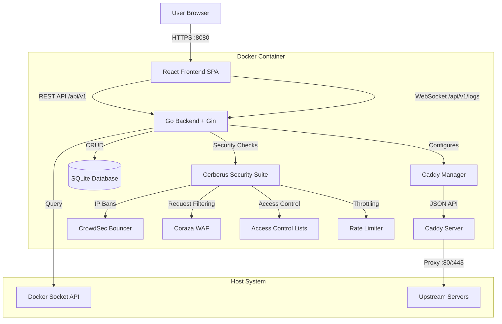
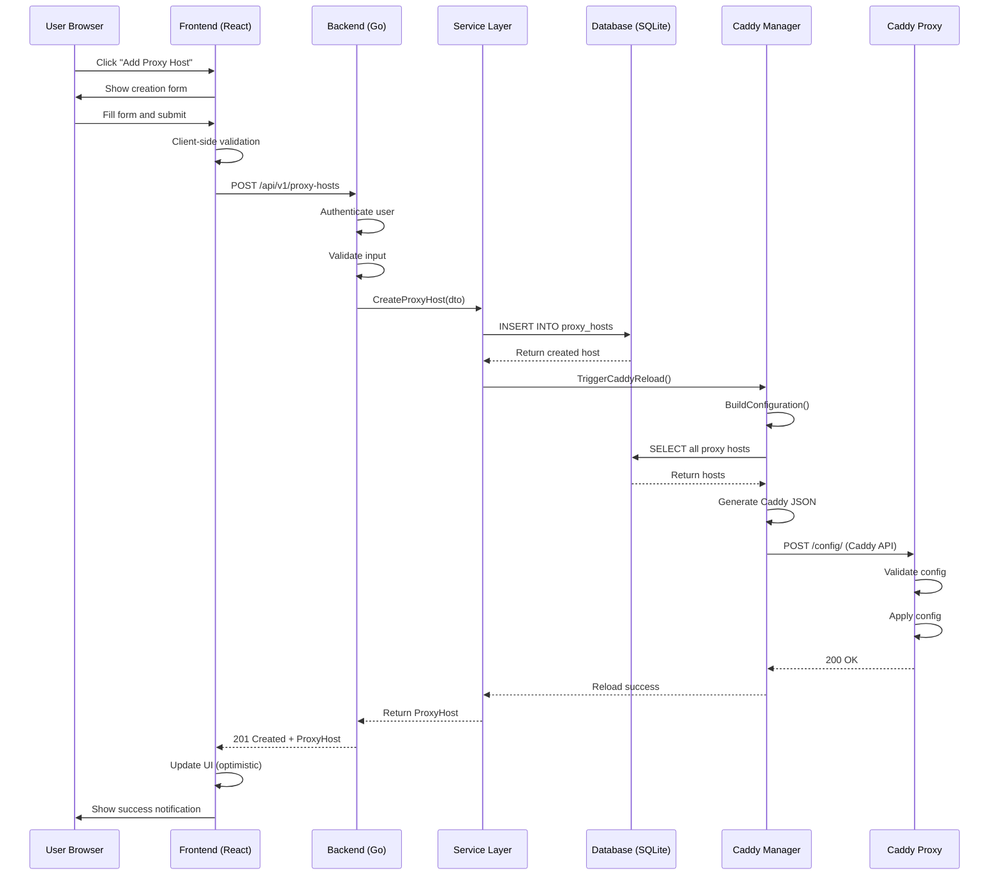
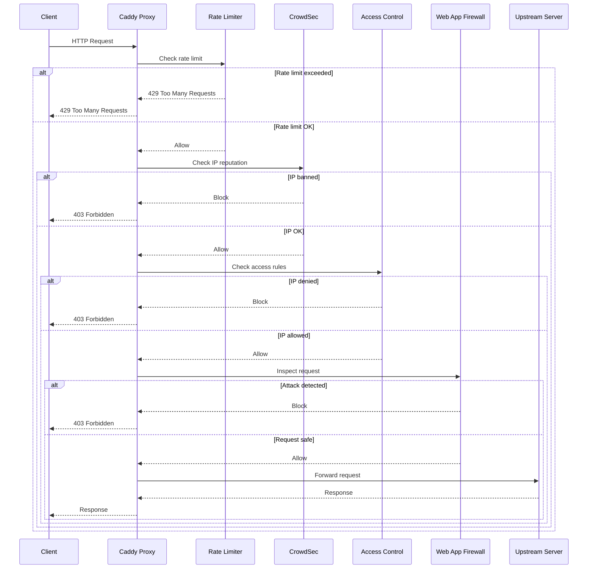
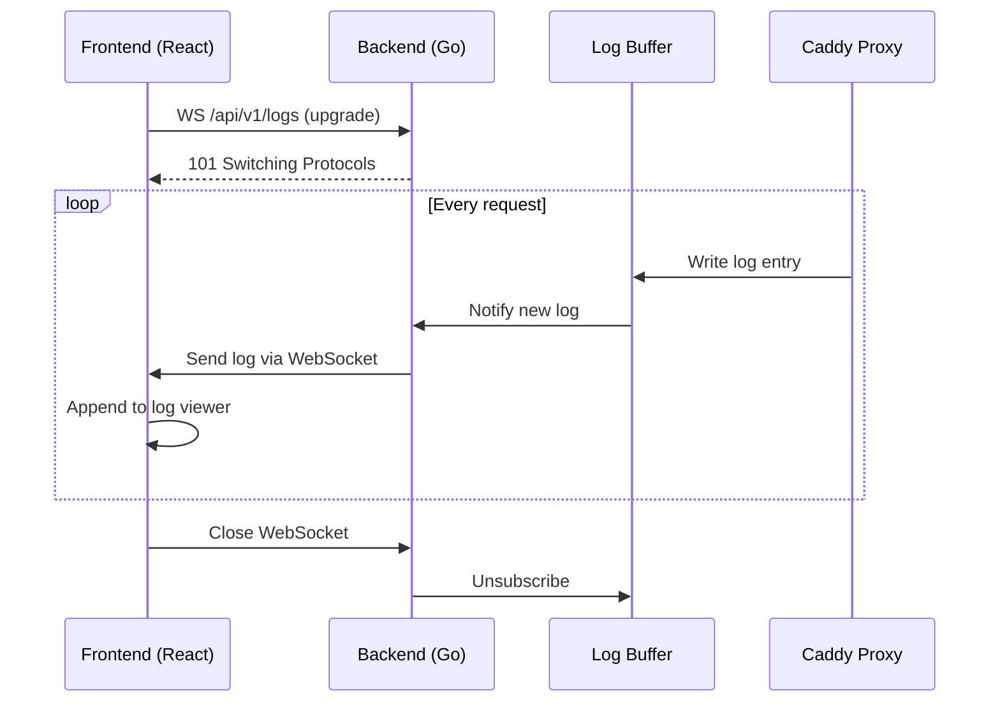
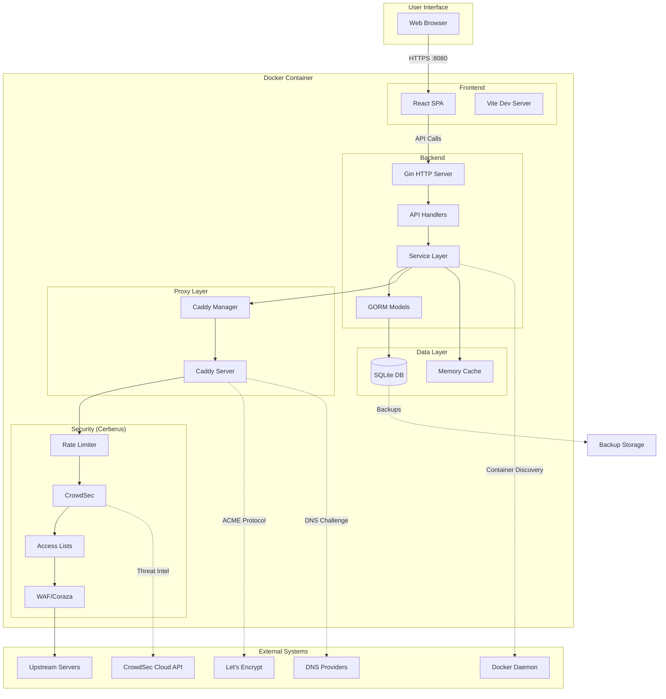

# Charon System Architecture

**Version:** 1.0
**Last Updated:** 2026-01-30
**Status:** Living Document

---

## Table of Contents

- [Overview](#overview)
- [System Architecture](#system-architecture)
- [Technology Stack](#technology-stack)
- [Directory Structure](#directory-structure)
- [Core Components](#core-components)
- [Security Architecture](#security-architecture)
- [Data Flow](#data-flow)
- [Deployment Architecture](#deployment-architecture)
- [Development Workflow](#development-workflow)
- [Testing Strategy](#testing-strategy)
- [Build & Release Process](#build--release-process)
- [Extensibility](#extensibility)
- [Known Limitations](#known-limitations)
- [Maintenance & Updates](#maintenance--updates)

---

## Overview

**Charon** is a self-hosted reverse proxy manager with a web-based user interface designed to simplify website and application hosting for home users and small teams. It eliminates the need for manual configuration file editing by providing an intuitive point-and-click interface for managing multiple domains, SSL certificates, and enterprise-grade security features.

### Core Value Proposition

**"Your server, your rules—without the headaches."**

Charon bridges the gap between simple solutions (like Nginx Proxy Manager) and complex enterprise proxies (like Traefik/HAProxy) by providing a balanced approach that is both user-friendly and feature-rich.

### Key Features

- **Web-Based Proxy Management:** No config file editing required
- **Automatic HTTPS:** Let's Encrypt and ZeroSSL integration with auto-renewal
- **DNS Challenge Support:** 15+ DNS providers for wildcard certificates
- **Docker Auto-Discovery:** One-click proxy setup for Docker containers
- **Cerberus Security Suite:** WAF, ACL, CrowdSec, Rate Limiting
- **Real-Time Monitoring:** Live logs, uptime tracking, and notifications
- **Configuration Import:** Migrate from Caddyfile or Nginx Proxy Manager
- **Supply Chain Security:** Cryptographic signatures, SLSA provenance, SBOM

---

## System Architecture

### Architectural Pattern

Charon follows a **monolithic architecture** with an embedded reverse proxy, packaged as a single Docker container. This design prioritizes simplicity, ease of deployment, and minimal operational overhead.



### Component Communication

| Source | Target | Protocol | Purpose |
|--------|--------|----------|---------|
| Frontend | Backend | HTTP/1.1 | REST API calls for CRUD operations |
| Frontend | Backend | WebSocket | Real-time log streaming |
| Backend | Caddy | HTTP/JSON | Dynamic configuration updates |
| Backend | SQLite | SQL | Data persistence |
| Backend | Docker Socket | Unix Socket/HTTP | Container discovery |
| Caddy | Upstream Servers | HTTP/HTTPS | Reverse proxy traffic |
| Cerberus | CrowdSec | HTTP | Threat intelligence sync |
| Cerberus | WAF | In-process | Request inspection |

### Design Principles

1. **Simplicity First:** Single container, minimal external dependencies
2. **Security by Default:** All security features enabled out-of-the-box
3. **User Experience:** Web UI over configuration files
4. **Modularity:** Pluggable DNS providers, notification channels
5. **Observability:** Comprehensive logging and metrics
6. **Reliability:** Graceful degradation, atomic config updates

---

## Technology Stack

### Backend

| Component | Technology | Version | Purpose |
|-----------|-----------|---------|---------|
| **Language** | Go | 1.26.0 | Primary backend language |
| **HTTP Framework** | Gin | Latest | Routing, middleware, HTTP handling |
| **Database** | SQLite | 3.x | Embedded database |
| **ORM** | GORM | Latest | Database abstraction layer |
| **Reverse Proxy** | Caddy Server | 2.11.2 | Embedded HTTP/HTTPS proxy |
| **WebSocket** | gorilla/websocket | Latest | Real-time log streaming |
| **Crypto** | golang.org/x/crypto | Latest | Password hashing, encryption |
| **Metrics** | Prometheus Client | Latest | Application metrics |
| **Notifications** | Notify (Discord-first) | Current | Discord notifications now; additional services in phased rollout |
| **Docker Client** | Docker SDK | Latest | Container discovery |
| **Logging** | Logrus + Lumberjack | Latest | Structured logging with rotation |

### Frontend

| Component | Technology | Version | Purpose |
|-----------|-----------|---------|---------|
| **Framework** | React | 19.2.3 | UI framework |
| **Language** | TypeScript | 6.x | Type-safe JavaScript |
| **Build Tool** | Vite | 6.1.9 | Fast bundler and dev server |
| **CSS Framework** | Tailwind CSS | 3.x | Utility-first CSS |
| **Routing** | React Router | 7.x | Client-side routing |
| **HTTP Client** | Fetch API | Native | API communication |
| **State Management** | React Hooks + Context | Native | Global state |
| **Internationalization** | i18next | Latest | 5 language support |
| **Unit Testing** | Vitest | 2.x | Fast unit test runner |
| **E2E Testing** | Playwright | 1.50.x | Browser automation |

### Infrastructure

| Component | Technology | Version | Purpose |
|-----------|-----------|---------|---------|
| **Containerization** | Docker | 24+ | Application packaging |
| **Base Image** | Debian Trixie Slim | Latest | Security-hardened base |
| **CI/CD** | GitHub Actions | N/A | Automated testing and deployment |
| **Registry** | Docker Hub + GHCR | N/A | Image distribution |
| **Security Scanning** | Trivy + Grype | Latest | Vulnerability detection |
| **SBOM Generation** | Syft | Latest | Software Bill of Materials |
| **Signature Verification** | Cosign | Latest | Supply chain integrity |

---

## Directory Structure

```
/projects/Charon/
├── backend/                    # Go backend source code
│   ├── cmd/                    # Application entrypoints
│   │   ├── api/                # Main API server
│   │   ├── migrate/            # Database migration tool
│   │   └── seed/               # Database seeding tool
│   ├── internal/               # Private application code
│   │   ├── api/                # HTTP handlers and routes
│   │   │   ├── handlers/       # Request handlers
│   │   │   ├── middleware/     # HTTP middleware
│   │   │   └── routes/         # Route definitions
│   │   ├── services/           # Business logic layer
│   │   │   ├── proxy_service.go
│   │   │   ├── certificate_service.go
│   │   │   ├── docker_service.go
│   │   │   └── mail_service.go
│   │   ├── caddy/              # Caddy manager and config generation
│   │   │   ├── manager.go      # Dynamic config orchestration
│   │   │   └── templates.go    # Caddy JSON templates
│   │   ├── cerberus/           # Security suite
│   │   │   ├── acl.go          # Access Control Lists
│   │   │   ├── waf.go          # Web Application Firewall
│   │   │   ├── crowdsec.go     # CrowdSec integration
│   │   │   └── ratelimit.go    # Rate limiting
│   │   ├── models/             # GORM database models
│   │   ├── database/           # DB initialization and migrations
│   │   └── utils/              # Helper functions
│   ├── pkg/                    # Public reusable packages
│   ├── integration/            # Integration tests
│   ├── go.mod                  # Go module definition
│   └── go.sum                  # Go dependency checksums
│
├── frontend/                   # React frontend source code
│   ├── src/
│   │   ├── pages/              # Top-level page components
│   │   │   ├── Dashboard.tsx
│   │   │   ├── ProxyHosts.tsx
│   │   │   ├── Certificates.tsx
│   │   │   └── Settings.tsx
│   │   ├── components/         # Reusable UI components
│   │   │   ├── forms/          # Form inputs and validation
│   │   │   ├── modals/         # Dialog components
│   │   │   ├── tables/         # Data tables
│   │   │   └── layout/         # Layout components
│   │   ├── api/                # API client functions
│   │   ├── hooks/              # Custom React hooks
│   │   ├── context/            # React context providers
│   │   ├── locales/            # i18n translation files
│   │   ├── App.tsx             # Root component
│   │   └── main.tsx            # Application entry point
│   ├── public/                 # Static assets
│   ├── package.json            # NPM dependencies
│   └── vite.config.js          # Vite configuration
│
├── .docker/                    # Docker configuration
│   ├── compose/                # Docker Compose files
│   │   ├── docker-compose.yml  # Production setup
│   │   ├── docker-compose.dev.yml
│   │   └── docker-compose.test.yml
│   ├── docker-entrypoint.sh    # Container startup script
│   └── README.md               # Docker documentation
│
├── .github/                    # GitHub configuration
│   ├── workflows/              # CI/CD pipelines
│   │   ├── *.yml               # GitHub Actions workflows
│   ├── agents/                 # GitHub Copilot agent definitions
│   │   ├── Management.agent.md
│   │   ├── Planning.agent.md
│   │   ├── Backend_Dev.agent.md
│   │   ├── Frontend_Dev.agent.md
│   │   ├── QA_Security.agent.md
│   │   ├── Doc_Writer.agent.md
│   │   ├── DevOps.agent.md
│   │   └── Supervisor.agent.md
│   ├── instructions/           # Code generation instructions
│   │   ├── *.instructions.md   # Domain-specific guidelines
│   └── skills/                 # Automation scripts
│       └── scripts/            # Task automation
│
├── scripts/                    # Build and utility scripts
│   ├── go-test-coverage.sh     # Backend coverage testing
│   ├── frontend-test-coverage.sh
│   └── docker-*.sh             # Docker convenience scripts
│
├── tests/                      # End-to-end tests
│   ├── *.spec.ts               # Playwright test files
│   └── fixtures/               # Test data and helpers
│
├── docs/                       # Documentation
│   ├── features/               # Feature documentation
│   ├── guides/                 # User guides
│   ├── api/                    # API documentation
│   ├── development/            # Developer guides
│   ├── plans/                  # Implementation plans
│   └── reports/                # QA and audit reports
│
├── configs/                    # Runtime configuration
│   └── crowdsec/               # CrowdSec configurations
│
├── data/                       # Persistent data (gitignored)
│   ├── charon.db               # SQLite database
│   ├── backups/                # Database backups
│   ├── caddy/                  # Caddy certificates
│   └── crowdsec/               # CrowdSec local database
│
├── Dockerfile                  # Multi-stage Docker build
├── Makefile                    # Build automation
├── go.work                     # Go workspace definition
├── package.json                # Frontend dependencies
├── playwright.config.js        # E2E test configuration
├── codecov.yml                 # Code coverage settings
├── README.md                   # Project overview
├── CONTRIBUTING.md             # Contribution guidelines
├── CHANGELOG.md                # Version history
├── LICENSE                     # MIT License
├── SECURITY.md                 # Security policy
└── ARCHITECTURE.md             # This file
```

### Key Directory Conventions

- **`internal/`**: Private code that should not be imported by external projects
- **`pkg/`**: Public libraries that can be reused
- **`cmd/`**: Application entrypoints (each subdirectory is a separate binary)
- **`.docker/`**: All Docker-related files (prevents root clutter)
- **`docs/implementation/`**: Archived implementation documentation
- **`docs/plans/`**: Active planning documents (`current_spec.md`)
- **`test-results/`**: Test artifacts (gitignored)

---

## Core Components

### 1. Backend (Go + Gin)

**Purpose:** RESTful API server, business logic orchestration, Caddy management

**Key Modules:**

#### API Layer (`internal/api/`)
- **Handlers:** Process HTTP requests, validate input, return responses
- **Middleware:** CORS, GZIP, authentication, logging, metrics, panic recovery
- **Routes:** Route registration and grouping (public vs authenticated)

**Example Endpoints:**
- `GET /api/v1/proxy-hosts` - List all proxy hosts
- `POST /api/v1/proxy-hosts` - Create new proxy host
- `PUT /api/v1/proxy-hosts/:id` - Update proxy host
- `DELETE /api/v1/proxy-hosts/:id` - Delete proxy host
- `WS /api/v1/logs` - WebSocket for real-time logs

#### Service Layer (`internal/services/`)
- **ProxyService:** CRUD operations for proxy hosts, validation logic
- **CertificateService:** ACME certificate provisioning and renewal
- **DockerService:** Container discovery and monitoring
- **MailService:** Email notifications for certificate expiry
- **SettingsService:** Application settings management

**Design Pattern:** Services contain business logic and call multiple repositories/managers

#### Caddy Manager (`internal/caddy/`)
- **Manager:** Orchestrates Caddy configuration updates
- **Config Builder:** Generates Caddy JSON from database models
- **Reload Logic:** Atomic config application with rollback on failure
- **Security Integration:** Injects Cerberus middleware into Caddy pipelines

**Responsibilities:**
1. Generate Caddy JSON configuration from database state
2. Validate configuration before applying
3. Trigger Caddy reload via JSON API
4. Handle rollback on configuration errors
5. Integrate security layers (WAF, ACL, Rate Limiting)

#### Security Suite (`internal/cerberus/`)
- **ACL (Access Control Lists):** IP-based allow/deny rules, GeoIP blocking
- **WAF (Web Application Firewall):** Coraza engine with OWASP CRS
- **CrowdSec:** Behavior-based threat detection with global intelligence
- **Rate Limiter:** Per-IP request throttling

**Integration Points:**
- Middleware injection into Caddy request pipeline
- Database-driven rule configuration
- Metrics collection for security events

#### Database Layer (`internal/database/`)
- **Migrations:** Automatic schema versioning with GORM AutoMigrate
- **Seeding:** Default settings and admin user creation
- **Connection Management:** SQLite with WAL mode and connection pooling

**Schema Overview:**
- **ProxyHost:** Domain, upstream target, SSL config
- **RemoteServer:** Upstream server definitions
- **CaddyConfig:** Generated Caddy configuration (audit trail)
- **SSLCertificate:** Certificate metadata and renewal status
- **AccessList:** IP whitelist/blacklist rules
- **User:** Authentication and authorization
- **Setting:** Key-value configuration storage
- **ImportSession:** Import job tracking

### 2. Frontend (React + TypeScript)

**Purpose:** Web-based user interface for proxy management

**Component Architecture:**

#### Pages (`src/pages/`)
- **Dashboard:** System overview, recent activity, quick actions
- **ProxyHosts:** List, create, edit, delete proxy configurations
- **Certificates:** Manage SSL/TLS certificates, view expiry
- **Settings:** Application settings, security configuration
- **Logs:** Real-time log viewer with filtering
- **Users:** User management (admin only)

#### Components (`src/components/`)
- **Forms:** Reusable form inputs with validation
- **Modals:** Dialog components for CRUD operations
- **Tables:** Data tables with sorting, filtering, pagination
- **Layout:** Header, sidebar, navigation

#### API Client (`src/api/`)
- Centralized API calls with error handling
- Request/response type definitions
- Authentication token management

**Example:**
```typescript
export const getProxyHosts = async (): Promise<ProxyHost[]> => {
  const response = await fetch('/api/v1/proxy-hosts', {
    headers: { Authorization: `Bearer ${getToken()}` }
  });
  if (!response.ok) throw new Error('Failed to fetch proxy hosts');
  return response.json();
};
```

#### State Management
- **React Context:** Global state for auth, theme, language
- **Local State:** Component-specific state with `useState`
- **Custom Hooks:** Encapsulate API calls and side effects

**Example Hook:**
```typescript
export const useProxyHosts = () => {
  const [hosts, setHosts] = useState<ProxyHost[]>([]);
  const [loading, setLoading] = useState(true);

  useEffect(() => {
    getProxyHosts().then(setHosts).finally(() => setLoading(false));
  }, []);

  return { hosts, loading, refresh: () => getProxyHosts().then(setHosts) };
};
```

### 3. Caddy Server

**Purpose:** High-performance reverse proxy with automatic HTTPS

**Integration:**
- Embedded as a library in the Go backend
- Configured via JSON API (not Caddyfile)
- Listens on ports 80 (HTTP) and 443 (HTTPS)

**Features Used:**
- Dynamic configuration updates without restarts
- Automatic HTTPS with Let's Encrypt and ZeroSSL
- DNS challenge support for wildcard certificates
- HTTP/2 and HTTP/3 (QUIC) support
- Request logging and metrics

**Configuration Flow:**
1. User creates proxy host via frontend
2. Backend validates and saves to database
3. Caddy Manager generates JSON configuration
4. JSON sent to Caddy via `/config/` API endpoint
5. Caddy validates and applies new configuration
6. Traffic flows through new proxy route

**Route Pattern: Emergency + Main**

For each proxy host, Charon generates **two routes** with the same domain:

1. **Emergency Route** (with path matchers):
   - Matches: `/api/v1/emergency/*` paths
   - Purpose: Bypass security features for administrative access
   - Priority: Evaluated first (more specific match)
   - Handlers: No WAF, ACL, or Rate Limiting

2. **Main Route** (without path matchers):
   - Matches: All other paths for the domain
   - Purpose: Normal application traffic with full security
   - Priority: Evaluated second (catch-all)
   - Handlers: Full Cerberus security suite

This pattern is **intentional and valid**:
- Emergency route provides break-glass access to security controls
- Main route protects application with enterprise security features
- Caddy processes routes in order (emergency matches first)
- Validator allows duplicate hosts when one has paths and one doesn't

**Example:**
```json
// Emergency Route (evaluated first)
{
  "match": [{"host": ["app.example.com"], "path": ["/api/v1/emergency/*"]}],
  "handle": [/* Emergency handlers - no security */],
  "terminal": true
}

// Main Route (evaluated second)
{
  "match": [{"host": ["app.example.com"]}],
  "handle": [/* Security middleware + proxy */],
  "terminal": true
}
```

### 4. Database (SQLite + GORM)

**Purpose:** Persistent data storage

**Why SQLite:**
- Embedded (no external database server)
- Serverless (perfect for single-user/small team)
- ACID compliant with WAL mode
- Minimal operational overhead
- Backup-friendly (single file)

**Configuration:**
- **WAL Mode:** Allows concurrent reads during writes
- **Foreign Keys:** Enforced referential integrity
- **Pragma Settings:** Performance optimizations

**Backup Strategy:**
- Automated daily backups to `data/backups/`
- Retention: 7 daily, 4 weekly, 12 monthly backups
- Backup during low-traffic periods

**Migrations:**
- GORM AutoMigrate for schema changes
- Manual migrations for complex data transformations
- Rollback support via backup restoration

---

## Security Architecture

### Defense-in-Depth Strategy

Charon implements multiple security layers (Cerberus Suite) to protect against various attack vectors:

```mermaid
graph LR
    Internet[Internet] -->|HTTP/HTTPS| RateLimit[Rate Limiter]
    RateLimit -->|Throttled| CrowdSec[CrowdSec Bouncer]
    CrowdSec -->|Threat Intel| ACL[Access Control Lists]
    ACL -->|IP Whitelist| WAF[Web Application Firewall]
    WAF -->|OWASP CRS| Caddy[Caddy Proxy]
    Caddy -->|Proxied| Upstream[Upstream Server]

    style RateLimit fill:#f9f,stroke:#333,stroke-width:2px
    style CrowdSec fill:#bbf,stroke:#333,stroke-width:2px
    style ACL fill:#bfb,stroke:#333,stroke-width:2px
    style WAF fill:#fbb,stroke:#333,stroke-width:2px
```



### Layer 1: Rate Limiting

**Purpose:** Prevent brute-force attacks and API abuse

**Implementation:**
- Per-IP request counters with sliding window
- Configurable thresholds (e.g., 100 req/min, 1000 req/hour)
- HTTP 429 response when limit exceeded
- Admin whitelist for monitoring tools

### Layer 2: CrowdSec Integration

**Purpose:** Behavior-based threat detection

**Features:**
- Local log analysis (brute-force, port scans, exploits)
- Global threat intelligence (crowd-sourced IP reputation)
- Automatic IP banning with configurable duration
- Decision management API (view, create, delete bans)

**Modes:**
- **Local Only:** No external API calls
- **API Mode:** Sync with CrowdSec cloud for global intelligence

### Layer 3: Access Control Lists (ACL)

**Purpose:** IP-based access control

**Features:**
- Per-proxy-host allow/deny rules
- CIDR range support (e.g., `192.168.1.0/24`)
- Geographic blocking via GeoIP2 (MaxMind)
- Admin whitelist (emergency access)

**Evaluation Order:**
1. Check admin whitelist (always allow)
2. Check deny list (explicit block)
3. Check allow list (explicit allow)
4. Default action (configurable allow/deny)

### Layer 4: Web Application Firewall (WAF)

**Purpose:** Inspect HTTP requests for malicious payloads

**Engine:** Coraza with OWASP Core Rule Set (CRS)

**Detection Categories:**
- SQL Injection (SQLi)
- Cross-Site Scripting (XSS)
- Remote Code Execution (RCE)
- Local File Inclusion (LFI)
- Path Traversal
- Command Injection

**Modes:**
- **Monitor:** Log but don't block (testing)
- **Block:** Return HTTP 403 for violations

### Layer 5: Application Security

**Additional Protections:**
- **SSRF Prevention:** Block requests to private IP ranges in webhooks/URL validation
- **HTTP Security Headers:** CSP, HSTS, X-Frame-Options, X-Content-Type-Options
- **Input Validation:** Server-side validation for all user inputs
- **SQL Injection Prevention:** Parameterized queries with GORM
- **XSS Prevention:** React's built-in escaping + Content Security Policy
- **Credential Encryption:** AES-GCM with key rotation for stored credentials
- **Password Hashing:** bcrypt with cost factor 12

### Emergency Break-Glass Protocol

**3-Tier Recovery System:**

1. **Admin Dashboard:** Standard access recovery via web UI
2. **Recovery Server:** Localhost-only HTTP server on port 2019
3. **Direct Database Access:** Manual SQLite update as last resort

**Emergency Token:**
- 64-character hex token set via `CHARON_EMERGENCY_TOKEN`
- Grants temporary admin access
- Rotated after each use

---

## Network Architecture

### Dual-Port Model

Charon operates with **two distinct traffic flows** on separate ports, each with different security characteristics:

#### Management Interface (Port 8080)

**Purpose:** Admin UI and REST API for Charon configuration

- **Protocol:** HTTPS (via Gin HTTP server)
- **Frontend:** React SPA served by Gin
- **Backend:** REST API at `/api/v1/*`
- **Middleware:** Standard HTTP middleware (CORS, GZIP, auth, logging, metrics, panic recovery)
- **Security:** JWT authentication, CSRF protection, input validation
- **NO Cerberus Middleware:** Rate limiting, ACL, WAF, and CrowdSec are NOT applied to management interface
- **Testing:** Playwright E2E tests verify UI/UX functionality on this port

**Why No Middleware?**
- Management interface must remain accessible even when security modules are misconfigured
- Emergency endpoints (`/api/v1/emergency/*`) require unrestricted access for system recovery
- Separation of concerns: admin access control is handled by JWT, not proxy-level security

#### Proxy Traffic (Ports 80/443)

**Purpose:** User-configured reverse proxy hosts with full security enforcement

- **Protocol:** HTTP/HTTPS (via Caddy server)
- **Routes:** User-defined proxy configurations (e.g., `app.example.com → http://localhost:3000`)
- **Middleware:** Full Cerberus Security Suite
  - Rate Limiting (Cerberus)
  - IP Reputation (CrowdSec Bouncer)
  - Access Control Lists (ACL)
  - Web Application Firewall (Coraza WAF)
- **Security:** All middleware enforced in order (Rate Limit → CrowdSec → ACL → WAF)
- **Testing:** Integration tests in `backend/integration/` verify middleware behavior

**Traffic Separation Example:**

```
┌─────────────────────────────────────────────────────────────┐
│                     Charon Container                        │
│                                                             │
│  Port 8080 (Management)        Port 80/443 (Proxy)        │
│  ┌─────────────────────┐       ┌──────────────────────┐   │
│  │ React UI            │       │ Caddy Proxy          │   │
│  │ REST API            │       │ + Cerberus           │   │
│  │ NO middleware       │       │   - Rate Limiting    │   │
│  │                     │       │   - CrowdSec         │   │
│  │ Used by:            │       │   - ACL              │   │
│  │ - Admins            │       │   - WAF              │   │
│  │ - E2E tests         │       │                      │   │
│  └─────────────────────┘       │ Used by:             │   │
│           ▲                    │ - End users          │   │
│           │                    │ - Integration tests  │   │
│           │                    └──────────────────────┘   │
│           │                             ▲                 │
└───────────┼─────────────────────────────┼─────────────────┘
            │                             │
       Admin access                  Public traffic
    (localhost:8080)              (example.com:80/443)
```

---

## Data Flow

### Request Flow: Create Proxy Host



### Request Flow: Proxy Traffic



### Real-Time Log Streaming



---

## Deployment Architecture

### Single Container Architecture

**Rationale:** Simplicity over scalability - target audience is home users and small teams

**Container Contents:**
- Frontend static files (Vite build output)
- Go backend binary
- Embedded Caddy server
- SQLite database file
- Caddy certificates
- CrowdSec local database

### Multi-Stage Dockerfile

```dockerfile
# Stage 1: Build frontend
FROM node:23-alpine AS frontend-builder
WORKDIR /app/frontend
COPY frontend/package*.json ./
RUN npm ci --only=production
COPY frontend/ ./
RUN npm run build

# Stage 2: Build backend
FROM golang:1.26-bookworm AS backend-builder
WORKDIR /app/backend
COPY backend/go.* ./
RUN go mod download
COPY backend/ ./
RUN CGO_ENABLED=1 go build -o /app/charon ./cmd/api

# Stage 3: Install gosu for privilege dropping
FROM debian:trixie-slim AS gosu
RUN apt-get update && \
    apt-get install -y --no-install-recommends gosu && \
    rm -rf /var/lib/apt/lists/*

# Stage 4: Final runtime image
FROM debian:trixie-slim
RUN apt-get update && \
    apt-get install -y --no-install-recommends \
        ca-certificates \
        libsqlite3-0 && \
    rm -rf /var/lib/apt/lists/*
COPY --from=gosu /usr/sbin/gosu /usr/sbin/gosu
COPY --from=backend-builder /app/charon /app/charon
COPY --from=frontend-builder /app/frontend/dist /app/frontend/dist
COPY .docker/docker-entrypoint.sh /docker-entrypoint.sh
RUN chmod +x /docker-entrypoint.sh
EXPOSE 8080 80 443 443/udp
ENTRYPOINT ["/docker-entrypoint.sh"]
CMD ["/app/charon"]
```

### Port Mapping

| Port | Protocol | Purpose | Bind |
|------|----------|---------|------|
| 8080 | HTTP | Web UI + REST API | 0.0.0.0 |
| 80 | HTTP | Caddy reverse proxy | 0.0.0.0 |
| 443 | HTTPS | Caddy reverse proxy (TLS) | 0.0.0.0 |
| 443 | UDP | HTTP/3 QUIC (optional) | 0.0.0.0 |
| 2019 | HTTP | Emergency recovery (localhost only) | 127.0.0.1 |

### Volume Mounts

| Container Path | Purpose | Required |
|----------------|---------|----------|
| `/app/data` | Database, certificates, backups | **Yes** |
| `/var/run/docker.sock` | Docker container discovery | Optional |

### Environment Variables

| Variable | Purpose | Default | Required |
|----------|---------|---------|----------|
| `CHARON_ENV` | Environment (production/development) | `production` | No |
| `CHARON_ENCRYPTION_KEY` | 32-byte base64 key for credential encryption | Auto-generated | No |
| `CHARON_EMERGENCY_TOKEN` | 64-char hex for break-glass access | None | Optional |
| `CHARON_CADDY_CONFIG_ROOT` | Caddy autosave config root | `/config` | No |
| `CHARON_CADDY_LOG_DIR` | Caddy log directory | `/var/log/caddy` | No |
| `CHARON_CROWDSEC_LOG_DIR` | CrowdSec log directory | `/var/log/crowdsec` | No |
| `CHARON_PLUGINS_DIR` | DNS provider plugin directory | `/app/plugins` | No |
| `CHARON_SINGLE_CONTAINER_MODE` | Enables permission repair endpoints | `true` | No |
| `CROWDSEC_API_KEY` | CrowdSec cloud API key | None | Optional |
| `SMTP_HOST` | SMTP server for notifications | None | Optional |
| `SMTP_PORT` | SMTP port | `587` | Optional |
| `SMTP_USER` | SMTP username | None | Optional |
| `SMTP_PASS` | SMTP password | None | Optional |

### Docker Compose Example

```yaml
services:
  charon:
    image: wikid82/charon:latest
    container_name: charon
    restart: unless-stopped
    ports:
      - "8080:8080"
      - "80:80"
      - "443:443"
      - "443:443/udp"
    volumes:
      - ./data:/app/data
      - /var/run/docker.sock:/var/run/docker.sock:ro
    environment:
      - CHARON_ENV=production
      - CHARON_ENCRYPTION_KEY=${CHARON_ENCRYPTION_KEY}
    healthcheck:
      test: ["CMD", "wget", "--quiet", "--tries=1", "--spider", "http://localhost:8080/health"]
      interval: 30s
      timeout: 10s
      retries: 3
      start_period: 40s
```

### High Availability Considerations

**Current Limitations:**
- SQLite does not support clustering
- Single point of failure (one container)
- Not designed for horizontal scaling

**Future Options:**
- PostgreSQL backend for HA deployments
- Read replicas for load balancing
- Container orchestration (Kubernetes, Docker Swarm)

---

## Development Workflow

### Local Development Setup

1. **Prerequisites:**
   ```bash
   - Go 1.26+ (backend development)
   - Node.js 23+ and npm (frontend development)
   - Docker 24+ (E2E testing)
   - SQLite 3.x (database)
   ```

2. **Clone Repository:**
   ```bash
   git clone https://github.com/Wikid82/Charon.git
   cd Charon
   ```

3. **Backend Development:**
   ```bash
   cd backend
   go mod download
   go run cmd/api/main.go
   # API server runs on http://localhost:8080
   ```

4. **Frontend Development:**
   ```bash
   cd frontend
   npm install
   npm run dev
   # Vite dev server runs on http://localhost:5173
   ```

5. **Full-Stack Development (Docker):**
   ```bash
   docker-compose -f .docker/compose/docker-compose.dev.yml up
   # Frontend + Backend + Caddy in one container
   ```

### Git Workflow

**Branch Strategy:**
- `main`: Stable production branch
- `feature/*`: New feature development
- `fix/*`: Bug fixes
- `chore/*`: Maintenance tasks

**Commit Convention:**
- `feat:` New user-facing feature
- `fix:` Bug fix in application code
- `chore:` Infrastructure, CI/CD, dependencies
- `docs:` Documentation-only changes
- `refactor:` Code restructuring without functional changes
- `test:` Adding or updating tests

**Example:**
```
feat: add DNS-01 challenge support for Cloudflare

Implement Cloudflare DNS provider for automatic wildcard certificate
provisioning via Let's Encrypt DNS-01 challenge.

Closes #123
```

### Code Review Process

1. **Automated Checks (CI):**
   - Linters (golangci-lint, ESLint)
   - Unit tests (Go test, Vitest)
   - E2E tests (Playwright)
   - Security scans (Trivy, CodeQL, Grype)
   - Coverage validation (85% minimum)

2. **Human Review:**
   - Code quality and maintainability
   - Security implications
   - Performance considerations
   - Documentation completeness

3. **Merge Requirements:**
   - All CI checks pass
   - At least 1 approval
   - No unresolved review comments
   - Branch up-to-date with base

---

## Testing Strategy

### Test Pyramid

```
       /\        E2E (Playwright) - 10%
      /  \       Critical user flows
     /____\
    /      \     Integration (Go) - 20%
   /        \    Component interactions
  /__________\
 /            \  Unit (Go + Vitest) - 70%
/______________\ Pure functions, models
```

### E2E Tests (Playwright)

**Purpose:** Validate critical user flows in a real browser

**Scope:**
- User authentication
- Proxy host CRUD operations
- Certificate provisioning
- Security feature toggling
- Real-time log streaming

**Execution:**
```bash
# Run against Docker container
npx playwright test --project=chromium

# Run with coverage (Vite dev server)
.github/skills/scripts/skill-runner.sh test-e2e-playwright-coverage

# Debug mode
npx playwright test --debug
```

**Coverage Modes:**
- **Docker Mode:** Integration testing, no coverage (0% reported)
- **Vite Dev Mode:** Coverage collection with V8 inspector

**Why Two Modes?**
- Playwright coverage requires source maps and raw source files
- Docker serves pre-built production files (no source maps)
- Vite dev server exposes source files for coverage instrumentation

### Unit Tests (Backend - Go)

**Purpose:** Test individual functions and methods in isolation

**Framework:** Go's built-in `testing` package

**Coverage Target:** 85% minimum

**Execution:**
```bash
# Run all tests
go test ./...

# With coverage
go test -cover ./...

# VS Code task
"Test: Backend with Coverage"
```

**Test Organization:**
- `*_test.go` files alongside source code
- Table-driven tests for comprehensive coverage
- Mocks for external dependencies (database, HTTP clients)

**Example:**
```go
func TestCreateProxyHost(t *testing.T) {
    tests := []struct {
        name    string
        input   ProxyHostDTO
        wantErr bool
    }{
        {
            name:    "valid proxy host",
            input:   ProxyHostDTO{Domain: "example.com", Target: "http://localhost:8000"},
            wantErr: false,
        },
        {
            name:    "invalid domain",
            input:   ProxyHostDTO{Domain: "", Target: "http://localhost:8000"},
            wantErr: true,
        },
    }

    for _, tt := range tests {
        t.Run(tt.name, func(t *testing.T) {
            err := CreateProxyHost(tt.input)
            if (err != nil) != tt.wantErr {
                t.Errorf("CreateProxyHost() error = %v, wantErr %v", err, tt.wantErr)
            }
        })
    }
}
```

### Unit Tests (Frontend - Vitest)

**Purpose:** Test React components and utility functions

**Framework:** Vitest + React Testing Library

**Coverage Target:** 85% minimum

**Execution:**
```bash
# Run all tests
npm test

# With coverage
npm run test:coverage

# VS Code task
"Test: Frontend with Coverage"
```

**Test Organization:**
- `*.test.tsx` files alongside components
- Mock API calls with MSW (Mock Service Worker)
- Snapshot tests for UI consistency

### Integration Tests (Go)

**Purpose:** Test component interactions (e.g., API + Service + Database)

**Location:** `backend/integration/`

**Scope:**
- API endpoint end-to-end flows
- Database migrations
- Caddy manager integration
- CrowdSec API calls

**Execution:**
```bash
go test ./integration/...
```

### Pre-Commit Checks

**Automated Hooks (via `.pre-commit-config.yaml`):**

**Fast Stage (< 5 seconds):**
- Trailing whitespace removal
- EOF fixer
- YAML syntax check
- JSON syntax check
- Markdown link validation

**Manual Stage (run explicitly):**
- Backend coverage tests (60-90s)
- Frontend coverage tests (30-60s)
- TypeScript type checking (10-20s)

**Why Manual?**
- Coverage tests are slow and would block commits
- Developers run them on-demand before pushing
- CI enforces coverage on pull requests

### Continuous Integration (GitHub Actions)

**Workflow Triggers:**
- `push` to `main`, `feature/*`, `fix/*`
- `pull_request` to `main`

**CI Jobs:**
1. **Lint:** golangci-lint, ESLint, markdownlint, hadolint
2. **Test:** Go tests, Vitest, Playwright
3. **Security:** Trivy, CodeQL, Grype, Govulncheck
4. **Build:** Docker image build
5. **Coverage:** Upload to Codecov (85% gate)
6. **Supply Chain:** SBOM generation, Cosign signing

---

## Build & Release Process

### Versioning Strategy

**Semantic Versioning:** `MAJOR.MINOR.PATCH-PRERELEASE`

- **MAJOR:** Breaking changes (e.g., API contract changes)
- **MINOR:** New features (backward-compatible)
- **PATCH:** Bug fixes (backward-compatible)
- **PRERELEASE:** `-beta.1`, `-rc.1`, etc.

**Examples:**
- `1.0.0` - Stable release
- `1.1.0` - New feature (DNS provider support)
- `1.1.1` - Bug fix (GORM query fix)
- `1.2.0-beta.1` - Beta release for testing

**Version File:** `VERSION.md` (single source of truth)

### Build Pipeline (Multi-Platform)

**Platforms Supported:**
- `linux/amd64`
- `linux/arm64`

**Build Process:**

1. **Frontend Build:**
   ```bash
   cd frontend
   npm ci --only=production
   npm run build
   # Output: frontend/dist/
   ```

2. **Backend Build:**
   ```bash
   cd backend
   go build -o charon cmd/api/main.go
   # Output: charon binary
   ```

3. **Docker Image Build:**
   ```bash
   docker buildx build \
     --platform linux/amd64,linux/arm64 \
     --tag wikid82/charon:latest \
     --tag wikid82/charon:1.2.0 \
     --push .
   ```

### Release Workflow

**Automated Release (GitHub Actions):**

1. **Trigger:** Push tag `v1.2.0`
2. **Build:** Multi-platform Docker images
3. **Test:** Run E2E tests against built image
4. **Security:** Scan for vulnerabilities (block if Critical/High)
5. **SBOM:** Generate Software Bill of Materials (Syft)
6. **Sign:** Cryptographic signature with Cosign
7. **Provenance:** Generate SLSA provenance attestation
8. **Publish:** Push to Docker Hub and GHCR
9. **Release Notes:** Generate changelog from commits
10. **Notify:** Send release notification (Discord, email)

**Mandatory rollout gates (sign-off block):**

1. Digest freshness and index digest parity across GHCR and Docker Hub
2. Per-arch digest parity across GHCR and Docker Hub
3. SBOM and vulnerability scans against immutable refs (`image@sha256:...`)
4. Artifact freshness timestamps after push
5. Evidence block with required rollout verification fields

### Supply Chain Security

**Components:**

1. **SBOM (Software Bill of Materials):**
   - Generated with Syft (CycloneDX format)
   - Lists all dependencies (Go modules, NPM packages, OS packages)
   - Attached to release as `sbom.cyclonedx.json`

2. **Container Scanning:**
   - Trivy: Fast vulnerability scanning (filesystem)
   - Grype: Deep image scanning (layers, dependencies)
   - CodeQL: Static analysis (Go, JavaScript)

3. **Cryptographic Signing:**
   - Cosign signs Docker images with keyless signing (OIDC)
   - Signature stored in registry alongside image
   - Verification: `cosign verify wikid82/charon:latest`

4. **SLSA Provenance:**
   - Attestation of build process (inputs, outputs, environment)
   - Proves image was built by trusted CI pipeline
   - Level: SLSA Build L3 (hermetic builds)

**Verification Example:**
```bash
# Verify image signature
cosign verify \
  --certificate-identity-regexp="https://github.com/Wikid82/Charon" \
  --certificate-oidc-issuer="https://token.actions.githubusercontent.com" \
  wikid82/charon:latest

# Inspect SBOM
syft ghcr.io/wikid82/charon@sha256:<index-digest> -o json

# Scan for vulnerabilities
grype ghcr.io/wikid82/charon@sha256:<index-digest>
```

### Rollback Strategy

**Container Rollback:**
```bash
# List available versions
docker images wikid82/charon

# Roll back to previous version
docker-compose down
docker-compose up -d --pull always wikid82/charon:1.1.1
```

**Database Rollback:**
```bash
# Restore from backup
docker exec charon /app/scripts/restore-backup.sh \
  /app/data/backups/charon-20260127.db
```

---

## Extensibility

### Plugin Architecture (Future)

**Current State:** Monolithic design (no plugin system)

**Planned Extensibility Points:**

1. **DNS Providers:**
   - Interface-based design for DNS-01 challenge providers
   - Current: 15+ built-in providers (Cloudflare, Route53, etc.)
   - Future: Dynamic plugin loading for custom providers

2. **Notification Channels:**
    - Current rollout is Discord-only for notifications
    - Additional services are enabled later in validated phases

3. **Authentication Providers:**
   - Current: Local database authentication
   - Future: OAuth2, LDAP, SAML integration

4. **Storage Backends:**
   - Current: SQLite (embedded)
   - Future: PostgreSQL, MySQL for HA deployments

### API Extensibility

**REST API Design:**
- Version prefix: `/api/v1/`
- Future versions: `/api/v2/` (backward-compatible)
- Deprecation policy: 2 major versions supported

**WebHooks (Future):**
- Event notifications for external systems
- Triggers: Proxy host created, certificate renewed, security event
- Payload: JSON with event type and data

### Custom Middleware (Caddy)

**Current:** Cerberus security middleware injected into Caddy pipeline

**Future:**
- User-defined middleware (rate limiting rules, custom headers)
- JavaScript/Lua scripting for request transformation
- Plugin marketplace for community contributions

---

## Known Limitations

### Architecture Constraints

1. **Single Point of Failure:**
   - Monolithic container design
   - No horizontal scaling support
   - **Mitigation:** Container restart policies, health checks

2. **Database Scalability:**
   - SQLite not designed for high concurrency
   - Write bottleneck for > 100 concurrent users
   - **Mitigation:** Optimize queries, consider PostgreSQL for large deployments

3. **Memory Usage:**
   - All proxy configurations loaded into memory
   - Caddy certificates cached in memory
   - **Mitigation:** Monitor memory usage, implement pagination

4. **Embedded Caddy:**
   - Caddy version pinned to backend compatibility
   - Cannot use standalone Caddy features
   - **Mitigation:** Track Caddy releases, update dependencies regularly

### Known Issues

1. **GORM Struct Reuse:**
    - Fixed in v1.2.0 (see [docs/implementation/gorm_security_scanner_complete.md](docs/implementation/gorm_security_scanner_complete.md))
    - Prior versions had ID leakage in Settings queries

2. **Docker Discovery:**
   - Requires `docker.sock` mount (security trade-off)
   - Only discovers containers on same Docker host
   - **Mitigation:** Use remote Docker API or Kubernetes

3. **Certificate Renewal:**
   - Let's Encrypt rate limits (50 certificates/week per domain)
   - No automatic fallback to ZeroSSL
   - **Mitigation:** Implement fallback logic, monitor rate limits

---

## Maintenance & Updates

### Keeping ARCHITECTURE.md Updated

**When to Update:**

1. **Major Feature Addition:**
   - New components (e.g., API gateway, message queue)
   - New external integrations (e.g., cloud storage, monitoring)

2. **Architectural Changes:**
   - Change from SQLite to PostgreSQL
   - Introduction of microservices
   - New deployment model (Kubernetes, Serverless)

3. **Technology Stack Updates:**
   - Major version upgrades (Go, React, Caddy)
   - Replacement of core libraries (e.g., GORM to SQLx)

4. **Security Architecture Changes:**
   - New security layers (e.g., API Gateway, Service Mesh)
   - Authentication provider changes (OAuth2, SAML)

**Update Process:**

1. **Developer:** Update relevant sections when making changes
2. **Code Review:** Reviewer validates architecture docs match implementation
3. **Quarterly Audit:** Architecture team reviews for accuracy
4. **Version Control:** Track changes via Git commit history

### Automation for Architectural Compliance

**GitHub Copilot Instructions:**

All agents (`Planning`, `Backend_Dev`, `Frontend_Dev`, `DevOps`) must reference `ARCHITECTURE.md` when:
- Creating new components
- Modifying core systems
- Changing integration points
- Updating dependencies

**CI Checks:**

- Validate directory structure matches documented conventions
- Check technology versions against `ARCHITECTURE.md`
- Ensure API endpoints follow documented patterns

### Monitoring Architectural Health

**Metrics to Track:**

- **Code Complexity:** Cyclomatic complexity per module
- **Coupling:** Dependencies between components
- **Technical Debt:** TODOs, FIXMEs, HACKs in codebase
- **Test Coverage:** Maintain 85% minimum
- **Build Time:** Frontend + Backend + Docker build duration
- **Container Size:** Track image size bloat

**Tools:**

- SonarQube: Code quality and technical debt
- Codecov: Coverage tracking and trend analysis
- Grafana: Runtime metrics and performance
- GitHub Insights: Contributor activity and velocity

---

## Diagram: Full System Overview



---

## Additional Resources

- **[README.md](README.md)** - Project overview and quick start
- **[CONTRIBUTING.md](CONTRIBUTING.md)** - Contribution guidelines
- **[docs/features.md](docs/features.md)** - Detailed feature documentation
- **[docs/api.md](docs/api.md)** - REST API reference
- **[docs/database-schema.md](docs/database-schema.md)** - Database structure
- **[docs/cerberus.md](docs/cerberus.md)** - Security suite documentation
- **[docs/getting-started.md](docs/getting-started.md)** - User guide
- **[SECURITY.md](SECURITY.md)** - Security policy and vulnerability reporting

---

**Maintained by:** Charon Development Team
**Questions?** Open an issue on [GitHub](https://github.com/Wikid82/Charon/issues) or join our community.
