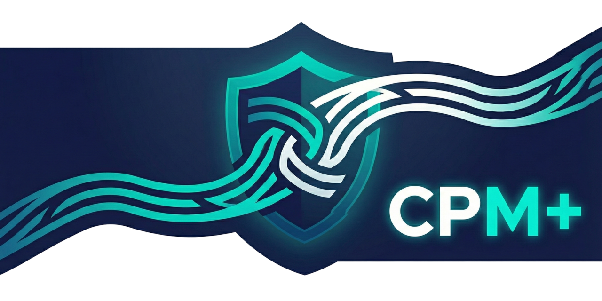

<p align="center">
  
</p>

<h1 align="center">Caddy Proxy Manager+</h1>

<p align="center">
  <strong>The friendly way to manage your reverse proxy</strong><br>
  Point, click, done. No config files needed.
</p>

<p align="center">
  <a href="LICENSE"></a>
  <a href="https://github.com/Wikid82/cpmp/releases"></a>
  <a href="https://github.com/Wikid82/cpmp/actions"></a>
</p>

---

## ✨ Top Features

| Feature | Description |
|---------|-------------|
| 🎨 **Beautiful Dark UI** | Modern interface that's easy on the eyes, works on any device |
| 🔐 **Automatic HTTPS** | Free SSL certificates from Let's Encrypt, auto-renewed |
| 🛡️ **Built-in Security** | CrowdSec integration, geo-blocking, IP access lists |
| 📊 **Uptime Monitoring** | Know when your services go down with smart notifications |
| 🐳 **Docker Discovery** | Auto-detect containers on local and remote Docker hosts |
| 📥 **Easy Import** | Bring your existing Caddy or NPM configs with one click |
| 💾 **Backup & Restore** | Never lose your settings, export anytime |
| 🔍 **Health Checks** | Test connections before saving |
| 🌐 **WebSocket Support** | Perfect for real-time apps and chat services |
| ⚡ **Zero Downtime** | Hot-reload configuration without restarts |

**[See all features →](https://wikid82.github.io/cpmp/features)**

---

## 🚀 Quick Start

```bash
services:
  cpmp:
    image: ghcr.io/wikid82/cpmp:latest
    container_name: cpmp
    restart: unless-stopped
    ports:
      - "80:80"        # HTTP (Caddy proxy)
      - "443:443"      # HTTPS (Caddy proxy)
      - "443:443/udp"  # HTTP/3 (Caddy proxy)
      - "8080:8080"    # Management UI (CPM+)
    environment:
      - CPM_ENV=production
      - TZ=UTC # Set timezone (e.g., America/New_York)
      - CPM_HTTP_PORT=8080
      - CPM_DB_PATH=/app/data/cpm.db
      - CPM_FRONTEND_DIR=/app/frontend/dist
      - CPM_CADDY_ADMIN_API=http://localhost:2019
      - CPM_CADDY_CONFIG_DIR=/app/data/caddy
      - CPM_CADDY_BINARY=caddy
      - CPM_IMPORT_CADDYFILE=/import/Caddyfile
      - CPM_IMPORT_DIR=/app/data/imports
      # Security Services (Optional)
      #- CPM_SECURITY_CROWDSEC_MODE=disabled # disabled, local, external
      #- CPM_SECURITY_CROWDSEC_API_URL= # Required if mode is external
      #- CPM_SECURITY_CROWDSEC_API_KEY= # Required if mode is external
      #- CPM_SECURITY_WAF_MODE=disabled # disabled, enabled
      #- CPM_SECURITY_RATELIMIT_ENABLED=false
      #- CPM_SECURITY_ACL_ENABLED=false
    extra_hosts:
      - "host.docker.internal:host-gateway"
    volumes:
      - <path_to_cpm_data>:/app/data
      - <path_to_caddy_data>:/data
      - <path_to_caddy_config>:/config
      - /var/run/docker.sock:/var/run/docker.sock:ro # For local container discovery
      # Mount your existing Caddyfile for automatic import (optional)
      # - ./my-existing-Caddyfile:/import/Caddyfile:ro
      # - ./sites:/import/sites:ro # If your Caddyfile imports other files
    healthcheck:
      test: ["CMD", "wget", "--no-verbose", "--tries=1", "--spider", "http://localhost:8080/api/v1/health"]
      interval: 30s
      timeout: 10s
      retries: 3
      start_period: 40s
```

Open **http://localhost:8080** — that's it! 🎉

**[Full documentation →](https://wikid82.github.io/cpmp/)**

---

## 💬 Community

- 🐛 **Found a bug?** [Open an issue](https://github.com/Wikid82/cpmp/issues)
- 💡 **Have an idea?** [Start a discussion](https://github.com/Wikid82/cpmp/discussions)
- 📋 **Roadmap** [View the project board](https://github.com/users/Wikid82/projects/7)

## 🤝 Contributing

We welcome contributions! See our [Contributing Guide](CONTRIBUTING.md) to get started.

---

<p align="center">
  <a href="LICENSE"><strong>MIT License</strong></a> ·
  <a href="https://wikid82.github.io/cpmp/"><strong>Documentation</strong></a> ·
  <a href="https://github.com/Wikid82/cpmp/releases"><strong>Releases</strong></a>
</p>

<p align="center">
  <em>Built with ❤️ by <a href="https://github.com/Wikid82">@Wikid82</a></em><br>
  <sub>Powered by <a href="https://caddyserver.com/">Caddy Server</a> · Inspired by <a href="https://nginxproxymanager.com/">Nginx Proxy Manager</a></sub>
</p>
