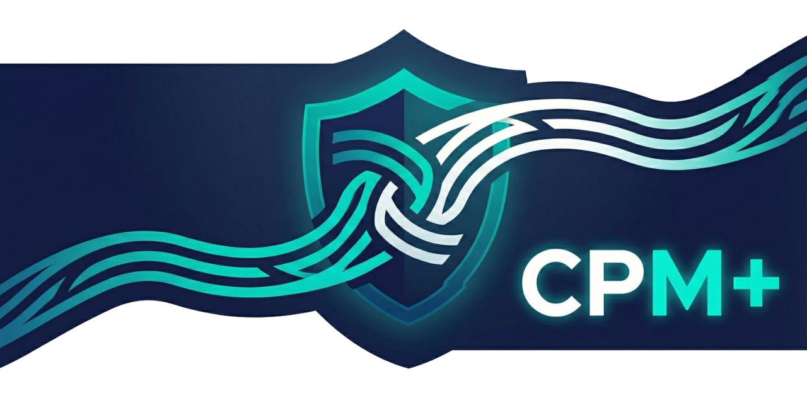

<p align="center">
  
</p>

<h1 align="center">Charon</h1>

<br>

<p align="center">
  <a href="https://www.repostatus.org/#active"></a>
 <a href="https://hub.docker.com/r/wikid82/charon"></a>
  <a href="https://github.com/Wikid82/charon/releases"></a>
  <br>
  <a href="https://codecov.io/gh/Wikid82/Charon" ></a>
 <a href="LICENSE"></a>
  <a href="SECURITY.md"></a>
  <br>
  <a href="https://github.com/Wikid82/Charon/actions/workflows/e2e-tests-split.yml"></a>
  <a href="https://github.com/Wikid82/Charon/actions/workflows/cerberus-integration.yml"></a><br>
  <a href="https://github.com/Wikid82/Charon/actions/workflows/crowdsec-integration.yml"></a>
  <a href="https://github.com/Wikid82/Charon/actions/workflows/waf-integration.yml"></a>
  <a href="https://github.com/Wikid82/Charon/actions/workflows/rate-limit-integration.yml"></a>
</p>
<br>
<p align="center"><strong>Your server, your rules—without the headaches.</strong></p>

<p align="center">
Simply manage multiple websites and self-hosted applications. Click, save, done. No code, no config files, no PhD required.
</p>

---

## Why Charon?

You want your apps accessible online. You don't want to become a networking expert first.

**The problem:** Managing reverse proxies usually means editing config files, memorizing cryptic syntax, and hoping you didn't break everything.

**Charon's answer:** A web interface where you click boxes and type domain names. That's it.

- ✅ **Your blog** gets a green lock (HTTPS) automatically
- ✅ **Your chat server** works without weird port numbers
- ✅ **Your admin panel** blocks everyone except you
- ✅ **Everything stays up** even when you make changes

---

## 🐕 Cerberus Security Suite

### 🕵️‍♂️ **CrowdSec Integration**

- Protects your applications from attacks using behavior-based detection and automated remediation.

### 🔐 **Access Control Lists (ACLs)**

- Define fine-grained access rules for your applications, controlling who can access what and under which conditions.

### 🧱 **Web Application Firewall (WAF)**

- Protects your applications from common web vulnerabilities such as SQL injection, XSS, and more using Coraza.

### ⏱️ **Rate Limiting**

- Protect your applications from abuse by limiting the number of requests a user or IP can make within a certain timeframe.

---

## ✨ Top 10 Features

### 🎯 **Point & Click Management**

No config files. No terminal commands. Just click, type your domain name, and you're live. If you can use a website, you can run Charon.

### 🔐 **Automatic HTTPS Certificates**

Free SSL certificates that request, install, and renew themselves. Your sites get the green padlock without you lifting a finger.

### 🌐 **DNS Challenge for Wildcard Certificates**

Secure all your subdomains with a single `*.example.com` certificate. Supports 15+ DNS providers including Cloudflare, Route53, DigitalOcean, and Google Cloud DNS. Credentials are encrypted and automatically rotated.

### 🛡️ **Enterprise-Grade Security Built In**

Web Application Firewall, rate limiting, geographic blocking, access control lists, and intrusion detection via CrowdSec. Protection that "just works."

### 🔐 **Supply Chain Security**

Verifiable builds with cryptographic signatures, SLSA provenance attestation, and comprehensive SBOMs. Verify what you run with transparent, tamper-proof evidence.

### 🌐 **Smart Proxy Headers**

Automatically adds standard headers (X-Real-IP, X-Forwarded-Proto, etc.) so your backend applications see real client IPs, enforce HTTPS correctly, and log accurately—with full backward compatibility for existing hosts.

### 🐳 **Instant Docker Discovery**

Already running apps in Docker? Charon finds them automatically and offers one-click proxy setup. No manual configuration required.

### 📊 **Real-Time Monitoring & Logs**

See exactly what's happening with live request logs, uptime monitoring, and instant notifications when something goes wrong.

### 📥 **Migration Made Easy**

Import your existing configurations with one click:
- **Caddyfile** — Migrate from other Caddy setups
- **Nginx** — Import from Nginx based configurations (Coming Soon)
- **Traefik** - Import from Traefik based configurations (Coming Soon)
- **CrowdSec** - Import from CrowdSec configurations (WIP)
- **JSON Import** — Restore from Charon backups or generic JSON configs

Already invested in another reverse proxy? Bring your work with you.

### ⚡ **Live Configuration Changes**

Update domains, add security rules, or modify settings instantly—no container restarts needed.* Your sites stay up while you make changes.

### 🌍 **Multi-App Management**

Run dozens of websites, APIs, or services from a single dashboard. Perfect for homelab enthusiasts and small teams managing multiple projects.

### 🚀 **Zero-Dependency Deployment**

One Docker container. No databases to install. No external services required. No complexity—just pure simplicity.

### 💯 **100% Free & Open Source**

No premium tiers. No feature paywalls. No usage limits. Everything you see is yours to use, forever, backed by the MIT license.

<sup>* Note: Initial security engine setup (CrowdSec) requires a one-time container restart to initialize the protection layer. All subsequent changes happen live.</sup>

**[Explore All Features →](https://wikid82.github.io/charon/features)**

---

## Quick Start

### Container Registries

Charon is available from two container registries:

**Docker Hub (Recommended):**

```bash
docker pull wikid82/charon:latest
```

**GitHub Container Registry:**

```bash
docker pull ghcr.io/wikid82/charon:latest
```

### Docker Compose (Recommended)

Save this as `docker-compose.yml`:

```yaml
services:
  charon:
    # Docker Hub (recommended)
    image: wikid82/charon:latest
    # Alternative: GitHub Container Registry
    # image: ghcr.io/wikid82/charon:latest
    container_name: charon
    restart: unless-stopped
    ports:
      - "80:80"
      - "443:443"
      - "443:443/udp"
      - "8080:8080"
    volumes:
      - ./charon-data:/app/data
      - /var/run/docker.sock:/var/run/docker.sock:ro
    environment:
      - CHARON_ENV=production
      # Generate with: openssl rand -base64 32
      - CHARON_ENCRYPTION_KEY=your-32-byte-base64-key-here

```

**Using Nightly Builds:**

To test the latest nightly build (automated daily at 02:00 UTC):

```yaml
services:
  charon:
    # Docker Hub
    image: wikid82/charon:nightly
    # Alternative: GitHub Container Registry
    # image: ghcr.io/wikid82/charon:nightly
    # ... rest of configuration
```

> **Note:** Nightly builds are for testing and may contain experimental features. Use `latest` for production.

Then run:

```bash
docker-compose up -d
```

### Docker Run (One-Liner)

**Stable Release (Docker Hub):**

```bash
docker run -d \
  --name charon \
  -p 80:80 \
  -p 443:443 \
  -p 443:443/udp \
  -p 8080:8080 \
  -v ./charon-data:/app/data \
  -v /var/run/docker.sock:/var/run/docker.sock:ro \
  -e CHARON_ENV=production \
  -e CHARON_ENCRYPTION_KEY=your-32-byte-base64-key-here \
  wikid82/charon:latest
```

**Stable Release (GitHub Container Registry):**

```bash
docker run -d \
  --name charon \
  -p 80:80 \
  -p 443:443 \
  -p 443:443/udp \
  -p 8080:8080 \
  -v ./charon-data:/app/data \
  -v /var/run/docker.sock:/var/run/docker.sock:ro \
  -e CHARON_ENV=production \
  -e CHARON_ENCRYPTION_KEY=your-32-byte-base64-key-here \
  ghcr.io/wikid82/charon:latest
```

**Nightly Build (Testing - Docker Hub):**

```bash
docker run -d \
  --name charon \
  -p 80:80 \
  -p 443:443 \
  -p 443:443/udp \
  -p 8080:8080 \
  -v ./charon-data:/app/data \
  -v /var/run/docker.sock:/var/run/docker.sock:ro \
  -e CHARON_ENV=production \
  -e CHARON_ENCRYPTION_KEY=your-32-byte-base64-key-here \
  wikid82/charon:nightly
```

> **Note:** Nightly builds include the latest development features and are rebuilt daily at 02:00 UTC. Use for testing only. Also available via GHCR: `ghcr.io/wikid82/charon:nightly`

### What Just Happened?

1. Charon downloaded and started
2. The web interface opened on port 8080
3. Your websites will use ports 80 (HTTP) and 443 (HTTPS)

**Open <http://localhost:8080>** and start adding your websites!

### Requirements

**Server:**

- Docker 20.10+ or Docker Compose V2
- Linux, macOS, or Windows with WSL2

**Browser:**

- Tested with React 19.2.3
- Compatible with modern browsers:
  - Chrome/Edge 90+
  - Firefox 88+
  - Safari 14+
  - Opera 76+

> **Note:** If you encounter errors after upgrading, try a hard refresh (`Ctrl+Shift+R`) or clearing your browser cache. See [Troubleshooting Guide](docs/troubleshooting/react-production-errors.md) for details.

### Development Setup

**Requirements:**

- **go 1.26.0+** — Download from [go.dev/dl](https://go.dev/dl/)
- **Node.js 20+** and npm
- Docker 20.10+

**Install golangci-lint** (for contributors): `go install github.com/golangci/golangci-lint/cmd/golangci-lint@latest`

**GORM Security Scanner:** Charon includes an automated security scanner that detects GORM vulnerabilities (ID leaks, exposed secrets, DTO embedding issues). Runs automatically in CI on all PRs. Run locally via:

```bash
# VS Code: Command Palette → "Lint: GORM Security Scan"
# Or via pre-commit:
pre-commit run --hook-stage manual gorm-security-scan --all-files
# Or directly:
./scripts/scan-gorm-security.sh --report
```

See [GORM Security Scanner Documentation](docs/implementation/gorm_security_scanner_complete.md) for details.

See [CONTRIBUTING.md](CONTRIBUTING.md) for complete development environment setup.

**Note:** GitHub Actions CI uses `GOTOOLCHAIN: auto` to automatically download and use go 1.26.0, even if your system has an older version installed. For local development, ensure you have go 1.26.0+ installed.

### Environment Configuration

Before running Charon or E2E tests, configure required environment variables:

1. **Copy the example environment file:**
   ```bash
   cp .env.example .env
   ```

2. **Configure required secrets:**
   ```bash
   # Generate encryption key (32 bytes, base64-encoded)
   openssl rand -base64 32

   # Generate emergency token (64 characters hex)
   openssl rand -hex 32
   ```

3. **Add to `.env` file:**
   ```bash
   CHARON_ENCRYPTION_KEY=<paste_encryption_key_here>
   CHARON_EMERGENCY_TOKEN=<paste_emergency_token_here>
   ```

4. **Verify configuration:**
   ```bash
   # Encryption key should be ~44 chars (base64)
   grep CHARON_ENCRYPTION_KEY .env | cut -d= -f2 | wc -c

   # Emergency token should be 64 chars (hex)
   grep CHARON_EMERGENCY_TOKEN .env | cut -d= -f2 | wc -c
   ```

⚠️ **Security:** Never commit actual secret values to the repository. The `.env` file is gitignored.

📖 **More Info:** See [Getting Started Guide](docs/getting-started.md) for detailed setup instructions.

### Upgrading? Run Migrations

If you're upgrading from a previous version with persistent data:

```bash
docker exec charon /app/charon migrate
docker restart charon
```

This ensures security features (especially CrowdSec) work correctly.

**Important:** If you had CrowdSec enabled before the upgrade, it will **automatically restart** after migration. You don't need to manually re-enable it via the GUI. See [Migration Guide](https://wikid82.github.io/charon/migration-guide) for details.

---

## 🔔 Smart Notifications

Stay informed about your infrastructure with flexible notification support.

### Supported Services

Charon integrates with popular notification platforms using JSON templates for rich formatting:

- **Discord** — Rich embeds with colors, fields, and custom formatting
- **Slack** — Block Kit messages with interactive elements
- **Gotify** — Self-hosted push notifications with priority levels
- **Telegram** — Instant messaging with Markdown support
- **Generic Webhooks** — Connect to any service with custom JSON payloads

### JSON Template Examples

**Discord Rich Embed:**

```json
{
  "embeds": [{
    "title": "🚨 {{.Title}}",
    "description": "{{.Message}}",
    "color": 15158332,
    "timestamp": "{{.Timestamp}}",
    "fields": [
      {"name": "Host", "value": "{{.HostName}}", "inline": true},
      {"name": "Event", "value": "{{.EventType}}", "inline": true}
    ]
  }]
}
```

**Slack Block Kit:**

```json
{
  "blocks": [
    {
      "type": "header",
      "text": {"type": "plain_text", "text": "🔔 {{.Title}}"}
    },
    {
      "type": "section",
      "text": {"type": "mrkdwn", "text": "*Event:* {{.EventType}}\n*Message:* {{.Message}}"}
    }
  ]
}
```

### Available Template Variables

All JSON templates support these variables:

| Variable | Description | Example |
|----------|-------------|---------|
| `{{.Title}}` | Event title | "SSL Certificate Renewed" |
| `{{.Message}}` | Event details | "Certificate for example.com renewed" |
| `{{.EventType}}` | Type of event | "ssl_renewal", "uptime_down" |
| `{{.Severity}}` | Severity level | "info", "warning", "error" |
| `{{.HostName}}` | Affected host | "example.com" |
| `{{.Timestamp}}` | ISO 8601 timestamp | "2025-12-24T10:30:00Z" |

**[📖 Complete Notification Guide →](docs/features/notifications.md)**

---

## 🚨 Emergency Break Glass Access

Charon provides a **3-Tier Break Glass Protocol** for emergency lockout recovery when security modules (ACL, WAF, CrowdSec) block access to the admin interface.

### Emergency Recovery Quick Reference

**Tier 1 (Preferred):** Use emergency token via main endpoint

```bash
curl -X POST https://charon.example.com/api/v1/emergency/security-reset \
  -H "X-Emergency-Token: $CHARON_EMERGENCY_TOKEN"
```

**Tier 2 (If Tier 1 blocked):** Use emergency server via SSH tunnel

```bash
ssh -L 2019:localhost:2019 admin@server
curl -X POST http://localhost:2019/emergency/security-reset \
  -H "X-Emergency-Token: $CHARON_EMERGENCY_TOKEN" \
  -u admin:password
```

**Tier 3 (Catastrophic):** Direct SSH access - see [Emergency Runbook](docs/runbooks/emergency-lockout-recovery.md)

### Tier 1: Emergency Token (Layer 7 Bypass)

**Use when:** The application is accessible but security middleware is blocking you.

```bash
# Set emergency token (generate with: openssl rand -hex 32)
export CHARON_EMERGENCY_TOKEN=your-64-char-hex-token

# Use token to disable security
curl -X POST https://charon.example.com/api/v1/emergency/security-reset \
  -H "X-Emergency-Token: $CHARON_EMERGENCY_TOKEN"
```

**Response:**

```json
{
  "success": true,
  "message": "All security modules have been disabled",
  "disabled_modules": [
    "feature.cerberus.enabled",
    "security.acl.enabled",
    "security.waf.enabled",
    "security.rate_limit.enabled",
    "security.crowdsec.enabled"
  ]
}
```

### Tier 2: Emergency Server (Sidecar Port)

**Use when:** Caddy/CrowdSec is blocking at the reverse proxy level, or you need a separate entry point.

**Prerequisites:**

- Emergency server enabled in configuration
- SSH access to Docker host
- Knowledge of Basic Auth credentials (if configured)

**Setup:**

```yaml
# docker-compose.yml
environment:
  - CHARON_EMERGENCY_SERVER_ENABLED=true
  - CHARON_EMERGENCY_BIND=127.0.0.1:2019  # Localhost only
  - CHARON_EMERGENCY_USERNAME=admin
  - CHARON_EMERGENCY_PASSWORD=your-strong-password
```

**Usage:**

```bash
# 1. SSH to server and create tunnel
ssh -L 2019:localhost:2019 admin@server.example.com

# 2. Access emergency endpoint (from local machine)
curl -X POST http://localhost:2019/emergency/security-reset \
  -H "X-Emergency-Token: $CHARON_EMERGENCY_TOKEN" \
  -u admin:your-strong-password
```

### Tier 3: Direct System Access (Physical Key)

**Use when:** All application-level recovery methods have failed.

**Prerequisites:**

- SSH or console access to Docker host
- Root or sudo privileges
- Knowledge of container name

**Emergency Procedures:**

```bash
# SSH to host
ssh admin@docker-host.example.com

# Clear CrowdSec bans
docker exec charon cscli decisions delete --all

# Disable security via database
docker exec charon sqlite3 /app/data/charon.db \
  "UPDATE settings SET value='false' WHERE key LIKE 'security.%.enabled';"

# Restart container
docker restart charon
```

### When to Use Each Tier

| Scenario | Tier | Solution |
|----------|------|----------|
| ACL blocked your IP | Tier 1 | Emergency token via main port |
| Caddy/CrowdSec blocking at Layer 7 | Tier 2 | Emergency server on separate port |
| Complete system failure | Tier 3 | Direct SSH + database access |

### Security Considerations

**⚠️ Emergency Server Security:**

- The emergency server should **NEVER** be exposed to the public internet
- Always bind to localhost (127.0.0.1) only
- Use SSH tunneling or VPN access to reach the port
- Optional Basic Auth provides defense in depth
- Port 2019 should be blocked by firewall rules from public access

**🔐 Emergency Token Security:**

- Store token in secrets manager (Vault, AWS Secrets Manager, Azure Key Vault)
- Rotate token every 90 days or after use
- Never commit token to version control
- Use HTTPS when calling emergency endpoint (HTTP leaks token)
- Monitor audit logs for emergency token usage

**� API Key & Credential Management:**

- **Never log sensitive credentials**: Charon automatically masks API keys in logs (e.g., `abcd...xyz9`)
- **Secure storage**: CrowdSec API keys stored with 0600 permissions (owner read/write only)
- **No HTTP exposure**: API keys never returned in API responses
- **No cookie storage**: Keys never stored in browser cookies
- **Regular rotation**: Rotate CrowdSec bouncer keys every 90 days (recommended)
- **Environment variables**: Use `CHARON_SECURITY_CROWDSEC_API_KEY` for production deployments
- **Compliance**: Implementation addresses CWE-312, CWE-315, CWE-359 (GDPR, PCI-DSS, SOC 2)

For detailed security practices, see:
- 📘 [API Key Handling Guide](docs/security/api-key-handling.md)
- 🛡️ [Security Best Practices](docs/SECURITY_PRACTICES.md)

**�📍 Management Network Configuration:**

```yaml
# Restrict emergency access to trusted networks only
environment:
  - CHARON_MANAGEMENT_CIDRS=10.0.0.0/8,172.16.0.0/12,192.168.0.0/16
```

Default: RFC1918 private networks + localhost

### Complete Documentation

📖 **[Emergency Lockout Recovery Runbook](docs/runbooks/emergency-lockout-recovery.md)** — Complete procedures for all 3 tiers
🔄 **[Emergency Token Rotation Guide](docs/runbooks/emergency-token-rotation.md)** — Token rotation procedures
⚙️ **[Configuration Examples](docs/configuration/emergency-setup.md)** — Docker Compose and secrets manager integration
🛡️ **[Security Documentation](docs/security.md)** — Break glass protocol architecture

---

## Getting Help

**[📖 Full Documentation](https://wikid82.github.io/charon/)** — Everything explained simply
**[🚀 5-Minute Guide](https://wikid82.github.io/charon/getting-started)** — Your first website up and running
**[🔐 Supply Chain Security](docs/guides/supply-chain-security-user-guide.md)** — Verify signatures and build provenance
**[� Maintenance](docs/maintenance/)** — Keeping Charon running smoothly
**[�🛠️ Troubleshooting](docs/troubleshooting/)** — Common issues and solutions
**[💬 Ask Questions](https://github.com/Wikid82/charon/discussions)** — Friendly community help
**[🐛 Report Problems](https://github.com/Wikid82/charon/issues)** — Something broken? Let us know

---
