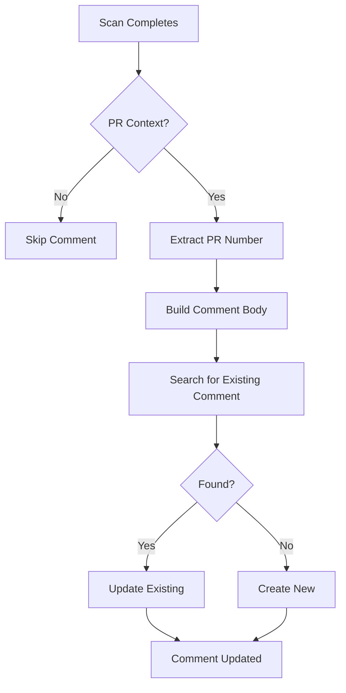

# Supply Chain Security Comment Format Reference

Quick reference for the PR comment format used by the supply chain security workflow.

## Comment Identifier

All comments include a hidden HTML identifier for update tracking:

```html
<!-- supply-chain-security-comment -->
```

This allows the `peter-evans/create-or-update-comment` action to find and update the same comment on each scan run.

---

## Comment Sections

### 1. Header

```markdown
## 🔒 Supply Chain Security Scan

**Last Updated**: YYYY-MM-DD HH:MM:SS UTC
**Workflow Run**: [#RUN_NUMBER](WORKFLOW_URL)

---
```

### 2. Status (varies by condition)

#### A. Waiting for Image

```markdown
### ⏳ Status: Waiting for Image

The Docker image has not been built yet. This scan will run automatically once the docker-build workflow completes.

_This is normal for PR workflows._
```

#### B. SBOM Validation Failed

```markdown
### ⚠️ Status: SBOM Validation Failed

The Software Bill of Materials (SBOM) could not be validated. Please check the [workflow logs](WORKFLOW_URL) for details.

**Action Required**: Review and resolve SBOM generation issues.
```

#### C. No Vulnerabilities

```markdown
### ✅ Status: No Vulnerabilities Detected

🎉 Great news! No security vulnerabilities were found in this image.

| Severity | Count |
|----------|-------|
| 🔴 Critical | 0 |
| 🟠 High | 0 |
| 🟡 Medium | 0 |
| 🔵 Low | 0 |
```

#### D. Critical Vulnerabilities

```markdown
### 🚨 Status: Critical Vulnerabilities Detected

⚠️ **Action Required**: X critical vulnerabilities require immediate attention!

| Severity | Count |
|----------|-------|
| 🔴 Critical | X |
| 🟠 High | X |
| 🟡 Medium | X |
| 🔵 Low | X |
| **Total** | **X** |

📋 [View detailed vulnerability report](WORKFLOW_URL)
```

#### E. High-Severity Vulnerabilities

```markdown
### ⚠️ Status: High-Severity Vulnerabilities Detected

X high-severity vulnerabilities found. Please review and address.

| Severity | Count |
|----------|-------|
| 🔴 Critical | 0 |
| 🟠 High | X |
| 🟡 Medium | X |
| 🔵 Low | X |
| **Total** | **X** |

📋 [View detailed vulnerability report](WORKFLOW_URL)
```

#### F. Other Vulnerabilities

```markdown
### 📊 Status: Vulnerabilities Detected

Security scan found X vulnerabilities.

| Severity | Count |
|----------|-------|
| 🔴 Critical | 0 |
| 🟠 High | 0 |
| 🟡 Medium | X |
| 🔵 Low | X |
| **Total** | **X** |

📋 [View detailed vulnerability report](WORKFLOW_URL)
```

### 3. Footer

```markdown
---

<sub><!-- supply-chain-security-comment --></sub>
```

---

## Emoji Legend

| Emoji | Meaning | Usage |
|-------|---------|-------|
| 🔒 | Security | Main header |
| ⏳ | Waiting | Image not ready |
| ✅ | Success | No vulnerabilities |
| ⚠️ | Warning | Medium/High severity |
| 🚨 | Alert | Critical vulnerabilities |
| 📊 | Info | General vulnerabilities |
| 🎉 | Celebration | All clear |
| 📋 | Document | Link to report |
| 🔴 | Critical | Critical severity |
| 🟠 | High | High severity |
| 🟡 | Medium | Medium severity |
| 🔵 | Low | Low severity |

---

## Status Priority

When multiple conditions exist, the status is determined by:

1. **Critical vulnerabilities** → 🚨 Critical status
2. **High vulnerabilities** → ⚠️ High status
3. **Other vulnerabilities** → 📊 General status
4. **No vulnerabilities** → ✅ Success status

---

## Variables Available

In the workflow, these variables are used to build the comment:

| Variable | Source | Description |
|----------|--------|-------------|
| `TIMESTAMP` | `date -u` | UTC timestamp |
| `IMAGE_EXISTS` | Step output | Whether Docker image is available |
| `SBOM_VALID` | Step output | SBOM validation status |
| `CRITICAL` | Environment | Critical vulnerability count |
| `HIGH` | Environment | High severity count |
| `MEDIUM` | Environment | Medium severity count |
| `LOW` | Environment | Low severity count |
| `TOTAL` | Calculated | Sum of all vulnerabilities |

---

## Comment Update Logic



The `peter-evans/create-or-update-comment` action:

1. Searches for comments by `github-actions[bot]`
2. Filters by content containing `<!-- supply-chain-security-comment -->`
3. Updates if found, creates if not found
4. Uses `edit-mode: replace` to fully replace content

---

## Integration Points

### Triggered By

- `docker-build.yml` workflow completion (via `workflow_run`)
- Direct `pull_request` events
- Scheduled runs (Mondays 00:00 UTC)
- Manual dispatch

### Data Sources

- **Syft**: SBOM generation
- **Grype**: Vulnerability scanning
- **GitHub Container Registry**: Docker images
- **GitHub API**: PR comments

### Outputs

- PR comment (updated in place)
- Step summary in workflow
- Artifact upload (SBOM)

---

## Example Timeline

```
PR Created
  ↓
Docker Build Starts
  ↓
Docker Build Completes
  ↓
Supply Chain Scan Starts
  ↓
Image Available? → No
  ↓
Comment Posted: "⏳ Waiting for Image"
  ↓
[Wait 5 minutes]
  ↓
Docker Build Completes
  ↓
Supply Chain Re-runs
  ↓
Scan Completes
  ↓
Comment Updated: "✅ No Vulnerabilities" or "⚠️ X Vulnerabilities"
```

---

## Testing Checklist

- [ ] Comment appears on new PR
- [ ] Comment updates instead of duplicating
- [ ] Timestamp reflects latest scan
- [ ] Vulnerability counts are accurate
- [ ] Links to workflow run work
- [ ] Emoji render correctly
- [ ] Table formatting is preserved
- [ ] Hidden identifier is present
- [ ] Comment updates when vulnerabilities fixed
- [ ] Comment updates when new vulnerabilities introduced
