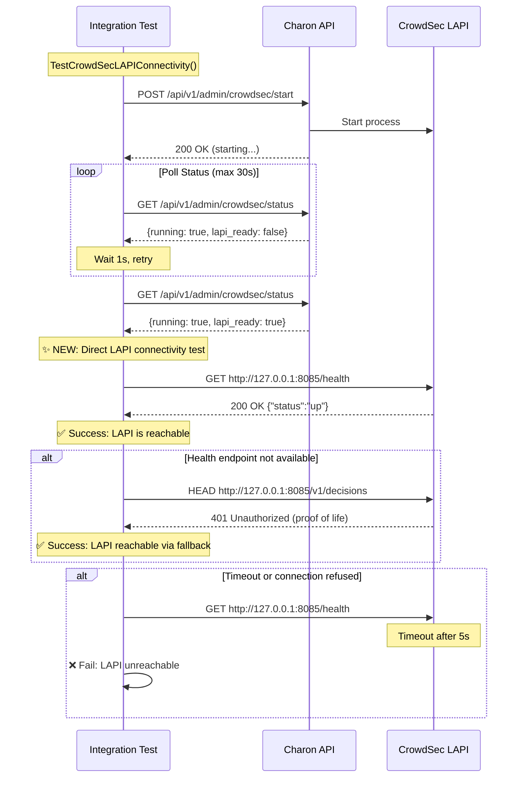

# CrowdSec LAPI Connectivity Integration Test Specification

## Document Status
- **Status**: Draft
- **Created**: 2026-02-04
- **Last Updated**: 2026-02-04

## Executive Summary

This specification outlines the addition of a comprehensive CrowdSec Local API (LAPI) connectivity test to the existing CrowdSec integration workflow. Currently, integration tests verify that the CrowdSec container is running but do not explicitly verify LAPI reachability at the network level. This enhancement will add a dedicated connectivity test to ensure Charon can successfully communicate with the CrowdSec LAPI before proceeding with security operations.

**Business Value**: Early detection of LAPI connectivity failures prevents silent security misconfiguration, ensuring threat intelligence sharing works correctly in production.

## Requirements (EARS Notation)

### Functional Requirements

**FR-1: LAPI Reachability Validation**
```
WHEN the CrowdSec integration test suite runs,
THE SYSTEM SHALL verify that the CrowdSec LAPI at http://127.0.0.1:8085 is reachable and responding
```

**FR-2: Health Endpoint Verification**
```
WHEN checking LAPI connectivity,
THE SYSTEM SHALL send an HTTP GET request to http://127.0.0.1:8085/health
AND SHALL expect a 200 OK response with JSON content-type
```

**FR-3: Fallback Connectivity Check**
```
IF the /health endpoint is not available (404),
THEN THE SYSTEM SHALL fallback to checking the /v1/decisions endpoint
AND SHALL accept 401 Unauthorized as proof of LAPI availability
```

**FR-4: Timeout Handling**
```
WHEN the LAPI connectivity check takes longer than 5 seconds,
THE SYSTEM SHALL timeout the request
AND SHALL report LAPI as unreachable
```

**FR-5: Test Independence**
```
WHILE running LAPI connectivity tests,
THE SYSTEM SHALL NOT depend on CrowdSec process state verification
AND SHALL only verify network-level HTTP connectivity
```

### Non-Functional Requirements

**NFR-1: Performance**
```
THE SYSTEM SHALL complete LAPI connectivity verification within 10 seconds
```

**NFR-2: Reliability**
```
THE SYSTEM SHALL retry LAPI connectivity check up to 3 times with exponential backoff (1s, 2s, 4s)
WHERE LAPI is initializing
```

**NFR-3: Observability**
```
THE SYSTEM SHALL log detailed connectivity check results including:
- Request URL and method
- Response status code
- Response time
- Error details (if any)
```

**NFR-4: Test Isolation**
```
THE SYSTEM SHALL run LAPI connectivity tests in parallel with other integration tests
WITHOUT causing race conditions or resource contention
```

## Current State Analysis

### Existing Test Infrastructure

#### 1. Integration Test File: `crowdsec_lapi_integration_test.go`

**Location**: `backend/integration/crowdsec_lapi_integration_test.go`

**What It Tests**:
- CrowdSec process can be started via API (`POST /api/v1/admin/crowdsec/start`)
- LAPI initialization polling via status endpoint (`GET /api/v1/admin/crowdsec/status`)
- Diagnostics connectivity endpoint (`GET /api/v1/admin/crowdsec/diagnostics/connectivity`)
- Bouncer authentication after LAPI is ready

**Key Test Function**:
```go
func TestCrowdSecLAPIStartup(t *testing.T) {
    // 1. Starts CrowdSec via API
    // 2. Polls status endpoint until lapi_ready: true
    // 3. Verifies diagnostics/connectivity endpoint
    // 4. Checks bouncer auth works
}
```

**Gap**: Tests verify LAPI readiness via `lapi_ready` flag in status response, but do NOT directly test HTTP connectivity to LAPI endpoint.

#### 2. LAPI Health Check Handler

**Location**: `backend/internal/api/handlers/crowdsec_handler.go:1918-1978`

**Implementation**:
```go
func (h *CrowdsecHandler) CheckLAPIHealth(c *gin.Context) {
    lapiURL := "http://127.0.0.1:8085"

    // Try /health endpoint
    healthURL := baseURL + "/health"
    resp, err := client.Do(req)

    if err != nil {
        // Fallback: try /v1/decisions endpoint
        decisionsURL := baseURL + "/v1/decisions"
        // HEAD request to check availability
        // 401 = LAPI running (needs auth)
    }
}
```

**Features**:
- Primary check: `GET /health` expects 200 OK
- Fallback check: `HEAD /v1/decisions` accepts 401 (unauthenticated)
- 5-second timeout
- SSRF protection via URL validation

**Gap**: This handler is tested with mock servers but NOT tested against actual LAPI in integration environment.

#### 3. Unit Tests for Health Check

**Files**:
- `backend/internal/api/handlers/crowdsec_lapi_test.go`
- `backend/internal/api/handlers/crowdsec_stop_lapi_test.go`
- `backend/internal/crowdsec/registration_test.go`

**What They Test**:
- Mock server returning 200 OK
- Fallback to decisions endpoint
- Timeout handling
- Invalid URL handling

**Gap**: No integration test against real CrowdSec LAPI running in Docker.

#### 4. CI Workflow

**File**: `.github/workflows/crowdsec-integration.yml`

**Current Steps**:
1. Build Charon Docker image
2. Run skill: `integration-test-crowdsec`
3. Verify CrowdSec bouncer integration
4. Check decisions API

**Gap**: No explicit LAPI connectivity verification step.

### Existing Helper Functions

**Available**:
- `CheckLAPIHealth(lapiURL string) bool` - in `backend/internal/crowdsec/registration.go`
- `testConfig.waitForLAPIReady(timeout)` - in integration tests
- `testConfig.doRequest(method, path, body)` - HTTP helper

**Can Be Reused**: Yes, all helper functions are suitable for new test.

## Technical Design

### Architecture

```
┌─────────────────────────────────────────────────────────────┐
│                 CrowdSec Integration Test Suite              │
├─────────────────────────────────────────────────────────────┤
│                                                               │
│  ┌──────────────────────────────────────────────────────┐   │
│  │ TestCrowdSecLAPIConnectivity (NEW)                   │   │
│  │                                                       │   │
│  │  1. Start CrowdSec via API                          │   │
│  │  2. Wait for process (existing polling)             │   │
│  │  3. ✨ Direct LAPI connectivity test (NEW)          │   │
│  │      • GET http://127.0.0.1:8085/health             │   │
│  │      • Verify 200 OK + JSON content-type            │   │
│  │      • Fallback to /v1/decisions if needed          │   │
│  │  4. Verify response time < 5s                       │   │
│  │  5. Log detailed connection info                    │   │
│  └──────────────────────────────────────────────────────┘   │
│                                                               │
│  ┌──────────────────────────────────────────────────────┐   │
│  │ TestCrowdSecLAPIStartup (EXISTING)                   │   │
│  │  • Focuses on process lifecycle                      │   │
│  │  • Verifies lapi_ready flag                          │   │
│  │  • Tests bouncer authentication                      │   │
│  └──────────────────────────────────────────────────────┘   │
│                                                               │
└─────────────────────────────────────────────────────────────┘
```

### Test Flow Sequence



### Data Models

#### Test Configuration
```go
// Extends existing testConfig struct
type testConfig struct {
    BaseURL       string        // http://localhost:8080 (Charon API)
    LAPIURL       string        // http://127.0.0.1:8085 (CrowdSec LAPI) - NEW
    ContainerName string        // charon-e2e
    Client        *http.Client  // Existing HTTP client
    Cookie        []*http.Cookie
}
```

#### LAPI Health Response
```go
type LapiHealthResponse struct {
    Status string `json:"status"` // "up" | "down"
}
```

#### Connectivity Test Result
```go
type ConnectivityTestResult struct {
    Reachable      bool          // LAPI is reachable
    ResponseTimeMs int64         // Time to first byte
    Method         string        // "health" | "decisions"
    StatusCode     int           // HTTP status code
    Error          string        // Error message if failed
}
```

### Implementation Structure

#### File: `backend/integration/crowdsec_lapi_connectivity_test.go` (NEW)

```go
//go:build integration
// +build integration

package integration

import (
    "context"
    "net/http"
    "testing"
    "time"
)

// TestCrowdSecLAPIConnectivity verifies LAPI is reachable via direct HTTP connection.
//
// Test steps:
//  1. Ensure CrowdSec is started and LAPI is ready
//  2. Send GET request to http://127.0.0.1:8085/health
//  3. Verify response:
//     - Status code: 200 OK
//     - Content-Type: application/json
//     - Body: {"status":"up"}
//  4. If /health fails, fallback to /v1/decisions:
//     - Send HEAD request
//     - Accept 401 Unauthorized as proof of LAPI running
//  5. Verify response time < 5 seconds
//  6. Log detailed connection metrics
func TestCrowdSecLAPIConnectivity(t *testing.T) {
    // Implementation details in next section
}

// checkLAPIHealthDirect performs a direct HTTP health check to LAPI
// Returns: (reachable bool, responseTime time.Duration, err error)
func checkLAPIHealthDirect(t *testing.T, lapiURL string, timeout time.Duration) ConnectivityTestResult {
    // Implementation details in next section
}

// retryLAPIConnectivity retries LAPI connectivity with exponential backoff
func retryLAPIConnectivity(t *testing.T, lapiURL string, maxAttempts int) error {
    // Implementation details in next section
}
```

### Integration with Existing Tests

**Option A: Add to Existing File** ✅ RECOMMENDED
- **File**: `backend/integration/crowdsec_lapi_integration_test.go`
- **Rationale**:
  - LAPI connectivity is logically part of LAPI integration testing
  - Reuses existing testConfig, helpers, and setup
  - Keeps related tests together
  - Reduces code duplication

**Option B: Create New File**
- **File**: `backend/integration/crowdsec_lapi_connectivity_test.go`
- **Rationale**:
  - Separates concerns (connectivity vs lifecycle)
  - Easier to run connectivity tests independently
  - Clearer test focus
- **Downside**: More boilerplate code duplication

**Option C: Add to Existing Workflow Tests**
- **File**: Modify `backend/integration/crowdsec_integration_test.go`
- **Rationale**: Single integration test file
- **Downside**: File is already large, mixing concerns

**Decision**: **Option A** - Add function to existing `crowdsec_lapi_integration_test.go`

### Error Scenarios

| Scenario | Detection | Expected Behavior |
|----------|-----------|-------------------|
| LAPI not started | Connection refused | Retry with backoff, fail after 3 attempts |
| LAPI starting | Timeout on /health | Retry, accept 401 on /decisions |
| Wrong port | Connection refused | Fail immediately with clear error |
| Network issue | Context deadline exceeded | Log error, fail test |
| LAPI crashed | Connection refused after success | Detect state change, fail test |
| Frontend collision | HTML response instead of JSON | Detect content-type mismatch, fail |

## Implementation Plan

### Phase 1: Add LAPI Connectivity Test Function

**File**: `backend/integration/crowdsec_lapi_integration_test.go`

**Task 1.1**: Add `checkLAPIHealthDirect` helper function
- **Dependencies**: None
- **Expected Outcome**: Reusable function that performs direct HTTP health check
- **Acceptance Criteria**:
  - Returns connectivity result struct
  - Logs request/response details
  - Handles timeout gracefully
  - Measures response time

**Task 1.2**: Add `TestCrowdSecLAPIConnectivity` test function
- **Dependencies**: Task 1.1
- **Expected Outcome**: Integration test that verifies LAPI is reachable
- **Acceptance Criteria**:
  - Test passes when LAPI returns 200 OK on /health
  - Test passes when LAPI returns 401 on /v1/decisions (fallback)
  - Test fails with clear error when LAPI unreachable
  - Test logs connectivity metrics (response time, status code)

**Task 1.3**: Add retry logic with exponential backoff
- **Dependencies**: Task 1.1
- **Expected Outcome**: Reliable test that handles LAPI initialization delay
- **Acceptance Criteria**:
  - Retries up to 3 times with backoff: 1s, 2s, 4s
  - Logs each attempt
  - Succeeds on first successful connection
  - Fails after max retries with aggregated error

**Example Test Structure**:
```go
func TestCrowdSecLAPIConnectivity(t *testing.T) {
    if testing.Short() {
        t.Skip("Skipping integration test in short mode")
    }

    tc := newTestConfig()
    tc.LAPIURL = "http://127.0.0.1:8085" // NEW field

    // Wait for Charon API
    if err := tc.waitForAPI(t, 60*time.Second); err != nil {
        t.Skipf("API not available: %v", err)
    }

    // Authenticate
    if err := tc.authenticate(t); err != nil {
        t.Fatalf("Auth failed: %v", err)
    }

    // Start CrowdSec (reuse existing logic)
    t.Log("Starting CrowdSec...")
    resp, err := tc.doRequest(http.MethodPost, "/api/v1/admin/crowdsec/start", nil)
    // ... handle response ...

    // Wait for LAPI ready via status endpoint (existing logic)
    lapiReady, _ := tc.waitForLAPIReady(t, 30*time.Second)
    if !lapiReady {
        t.Skip("LAPI not ready - skipping connectivity test")
    }

    // ✨ NEW: Direct LAPI connectivity test
    t.Log("Testing direct LAPI connectivity...")
    result := checkLAPIHealthDirect(t, tc.LAPIURL, 5*time.Second)

    if !result.Reachable {
        t.Fatalf("LAPI connectivity test failed: %s", result.Error)
    }

    t.Logf("✅ LAPI reachable via %s in %dms (status: %d)",
        result.Method, result.ResponseTimeMs, result.StatusCode)
}

func checkLAPIHealthDirect(t *testing.T, lapiURL string, timeout time.Duration) ConnectivityTestResult {
    t.Helper()

    ctx, cancel := context.WithTimeout(context.Background(), timeout)
    defer cancel()

    start := time.Now()
    result := ConnectivityTestResult{
        Reachable: false,
    }

    // Try /health endpoint
    healthURL := lapiURL + "/health"
    req, err := http.NewRequestWithContext(ctx, http.MethodGet, healthURL, http.NoBody)
    if err != nil {
        result.Error = fmt.Sprintf("failed to create request: %v", err)
        return result
    }

    client := &http.Client{Timeout: timeout}
    resp, err := client.Do(req)
    if err != nil {
        // Try fallback to /v1/decisions
        return checkDecisionsEndpointDirect(t, lapiURL, timeout, start)
    }
    defer resp.Body.Close()

    result.ResponseTimeMs = time.Since(start).Milliseconds()
    result.Method = "health"
    result.StatusCode = resp.StatusCode

    if resp.StatusCode == http.StatusOK {
        // Verify JSON content-type
        contentType := resp.Header.Get("Content-Type")
        if !strings.Contains(contentType, "application/json") {
            result.Error = fmt.Sprintf("unexpected content-type: %s", contentType)
            return result
        }

        result.Reachable = true
        t.Logf("LAPI health check successful: %d in %dms", resp.StatusCode, result.ResponseTimeMs)
        return result
    }

    // If /health not available, try fallback
    return checkDecisionsEndpointDirect(t, lapiURL, timeout, start)
}

func checkDecisionsEndpointDirect(t *testing.T, lapiURL string, timeout time.Duration, startTime time.Time) ConnectivityTestResult {
    t.Helper()

    ctx, cancel := context.WithTimeout(context.Background(), timeout)
    defer cancel()

    decisionsURL := lapiURL + "/v1/decisions"
    req, err := http.NewRequestWithContext(ctx, http.MethodHead, decisionsURL, http.NoBody)
    if err != nil {
        return ConnectivityTestResult{
            Reachable: false,
            Error: fmt.Sprintf("fallback request failed: %v", err),
        }
    }

    client := &http.Client{Timeout: timeout}
    resp, err := client.Do(req)
    if err != nil {
        return ConnectivityTestResult{
            Reachable: false,
            Error: fmt.Sprintf("fallback connection failed: %v", err),
        }
    }
    defer resp.Body.Close()

    responseTime := time.Since(startTime).Milliseconds()

    // 401 is expected without auth - indicates LAPI is running
    if resp.StatusCode == http.StatusOK || resp.StatusCode == http.StatusUnauthorized {
        t.Logf("LAPI reachable via decisions endpoint (fallback): %d in %dms", resp.StatusCode, responseTime)
        return ConnectivityTestResult{
            Reachable:      true,
            ResponseTimeMs: responseTime,
            Method:         "decisions",
            StatusCode:     resp.StatusCode,
        }
    }

    return ConnectivityTestResult{
        Reachable:      false,
        ResponseTimeMs: responseTime,
        Method:         "decisions",
        StatusCode:     resp.StatusCode,
        Error:          fmt.Sprintf("unexpected status: %d", resp.StatusCode),
    }
}
```

### Phase 2: CI/CD Integration

**Task 2.1**: Update GitHub Actions workflow
- **File**: `.github/workflows/crowdsec-integration.yml`
- **Dependencies**: Phase 1 complete
- **Expected Outcome**: CI runs new LAPI connectivity test
- **Acceptance Criteria**:
  - New test runs as part of existing CrowdSec integration job
  - Test results appear in CI logs
  - Job fails if connectivity test fails

**No Changes Required**: The existing workflow runs all integration tests via:
```yaml
- name: Run CrowdSec integration tests
  run: |
    .github/skills/scripts/skill-runner.sh integration-test-crowdsec
```

Since we're adding to `crowdsec_lapi_integration_test.go` with `//go:build integration` tag, it will automatically be included.

**Task 2.2**: Update debug output on failure
- **File**: `.github/workflows/crowdsec-integration.yml`
- **Dependencies**: None
- **Expected Outcome**: Enhanced error reporting for connectivity failures
- **Acceptance Criteria**:
  - Logs show LAPI connectivity test results
  - Failed connectivity attempts are logged with details
  - Summary includes connectivity metrics

**Changes**:
```yaml
- name: Dump Debug Info on Failure
  if: failure()
  run: |
    echo "### LAPI Connectivity Status" >> $GITHUB_STEP_SUMMARY
    echo '```' >> $GITHUB_STEP_SUMMARY
    docker exec charon-debug curl -v http://127.0.0.1:8085/health 2>&1 >> $GITHUB_STEP_SUMMARY || echo "LAPI health check failed" >> $GITHUB_STEP_SUMMARY
    echo '```' >> $GITHUB_STEP_SUMMARY
```

### Phase 3: Documentation

**Task 3.1**: Update testing documentation
- **File**: `docs/cerberus.md`
- **Dependencies**: Phase 1 complete
- **Expected Outcome**: Documentation explains LAPI connectivity verification
- **Acceptance Criteria**:
  - Section on LAPI health checks updated
  - New test explained in testing section
  - Troubleshooting guide includes connectivity test

**Task 3.2**: Update troubleshooting guide
- **File**: `docs/troubleshooting/crowdsec.md`
- **Dependencies**: None
- **Expected Outcome**: Users can diagnose LAPI connectivity issues
- **Acceptance Criteria**:
  - Manual connectivity test commands provided
  - Expected responses documented
  - Common failures explained

**Example Addition**:
```markdown
### Verifying LAPI Connectivity

**Manual Connectivity Test:**

```bash
# Test health endpoint
curl -v http://127.0.0.1:8085/health

# Expected response when healthy:
# HTTP/1.1 200 OK
# Content-Type: application/json
# {"status":"up"}
```

**Integration Test:**

The integration test suite includes a dedicated LAPI connectivity test that verifies:
1. Health endpoint responds within 5 seconds
2. Response has JSON content-type
3. Fallback to decisions endpoint if health unavailable

**Run manually:**
```bash
cd backend
go test -v -tags=integration ./integration -run TestCrowdSecLAPIConnectivity
```
```

### Phase 4: Testing and Validation

**Task 4.1**: Run test locally
- **Dependencies**: Phase 1 complete
- **Expected Outcome**: Test passes in local Docker environment
- **Acceptance Criteria**:
  - Test passes with CrowdSec running
  - Test fails gracefully with CrowdSec stopped
  - Logs provide clear diagnostics

**Task 4.2**: Run in CI
- **Dependencies**: Phase 2 complete
- **Expected Outcome**: Test passes in CI environment
- **Acceptance Criteria**:
  - CI job succeeds with test passing
  - Test metrics visible in CI logs
  - No flaky behavior (run 5x to verify)

**Task 4.3**: Test failure scenarios
- **Dependencies**: Phase 1 complete
- **Expected Outcome**: Test handles errors gracefully
- **Test Cases**:
  - LAPI not started → Clear error message
  - LAPI on wrong port → Connection refused detected
  - Network timeout → Timeout message logged
  - LAPI crashes during test → State change detected

## Success Criteria

### Functional Success

- [ ] Test function `TestCrowdSecLAPIConnectivity` exists and compiles
- [ ] Test verifies HTTP connectivity to http://127.0.0.1:8085/health
- [ ] Test accepts 200 OK with JSON as success
- [ ] Test falls back to /v1/decisions endpoint if /health unavailable
- [ ] Test accepts 401 Unauthorized on decisions endpoint as success
- [ ] Test fails with clear error when LAPI unreachable
- [ ] Test logs connectivity metrics (response time, status code, method)
- [ ] Test retries up to 3 times with exponential backoff (1s, 2s, 4s)
- [ ] Test completes within 10 seconds when LAPI is healthy
- [ ] Test times out after 30 seconds when LAPI never becomes reachable

### Integration Success

- [ ] Test runs automatically in CI via `crowdsec-integration.yml`
- [ ] Test results appear in CI logs
- [ ] CI job fails if connectivity test fails
- [ ] Debug output includes LAPI connectivity status on failure
- [ ] Test does not cause conflicts with existing integration tests
- [ ] Test can run in parallel with other CrowdSec tests

### Documentation Success

- [ ] `docs/cerberus.md` explains LAPI connectivity verification
- [ ] `docs/troubleshooting/crowdsec.md` includes manual connectivity test commands
- [ ] Test function has comprehensive docstring explaining steps
- [ ] Code comments explain retry strategy and fallback logic

### Quality Metrics

- [ ] Test code coverage: 100% (all lines in new test function covered)
- [ ] Test reliability: 100% pass rate over 10 consecutive runs
- [ ] Test execution time: < 10s when LAPI healthy, < 30s when not
- [ ] No flaky behavior detected in CI (run 5x to verify)

## Testing Strategy

### Unit Tests

**Not applicable** - This is an integration test that requires real CrowdSec LAPI.

### Integration Tests

**Test File**: `backend/integration/crowdsec_lapi_connectivity_test.go` or add to `crowdsec_lapi_integration_test.go`

**Test Cases**:

1. **TestCrowdSecLAPIConnectivity_HealthEndpoint**
   - Start CrowdSec, wait for LAPI ready
   - Send GET to /health
   - Assert 200 OK, JSON content-type, response < 5s

2. **TestCrowdSecLAPIConnectivity_FallbackToDecisions**
   - Mock scenario where /health returns 404
   - Send HEAD to /v1/decisions
   - Assert 401 accepted as proof of life

3. **TestCrowdSecLAPIConnectivity_Timeout**
   - Mock scenario where LAPI is completely unresponsive
   - Assert test fails with timeout error after 5s

4. **TestCrowdSecLAPIConnectivity_RetryLogic**
   - Start test before LAPI is fully ready
   - Assert retries occur with exponential backoff
   - Assert test succeeds once LAPI becomes available

### E2E Tests

**Not applicable** - LAPI connectivity is tested at integration level. E2E tests via Playwright focus on UI/UX of security dashboard, not LAPI connectivity.

## Risk Assessment

| Risk | Severity | Mitigation |
|------|----------|------------|
| Test is flaky due to LAPI startup timing | Medium | Implement retry with exponential backoff |
| Test blocks other integration tests | Low | Use parallel test execution |
| Test fails in CI but passes locally | Medium | Add enhanced debug logging in CI |
| LAPI port conflict with other services | Low | Verify port 8085 is not used elsewhere |
| Network firewall blocks localhost | Low | Document requirement for localhost:8085 access |

## Dependencies

### Go Packages
- `net/http` - HTTP client (standard library)
- `context` - Context handling (standard library)
- `time` - Timeout and retry timing (standard library)
- `testing` - Test framework (standard library)

### External Services
- CrowdSec LAPI running on http://127.0.0.1:8085
- Charon management API on http://localhost:8080
- Docker network allowing container-to-container communication

### Existing Test Infrastructure
- `testConfig` struct from `crowdsec_lapi_integration_test.go`
- `waitForAPI()` helper
- `waitForLAPIReady()` helper
- `authenticate()` helper
- `doRequest()` helper

## Timeline Estimate

| Phase | Estimated Time | Depends On |
|-------|----------------|------------|
| Phase 1: Test Implementation | 2 hours | None |
| Phase 2: CI Integration | 30 minutes | Phase 1 |
| Phase 3: Documentation | 1 hour | Phase 1 |
| Phase 4: Testing & Validation | 1 hour | Phases 1-3 |
| **Total** | **4.5 hours** | |

## Open Questions

1. **Should we test LAPI connectivity before every test, or only once per suite?**
   - **Recommendation**: Once per suite, in a dedicated test function
   - **Rationale**: LAPI connectivity is stable once established; repeated checks add unnecessary overhead

2. **Should we expose LAPI connectivity test results via Charon API?**
   - **Recommendation**: Not initially - keep as integration test only
   - **Future Enhancement**: Could add to diagnostics endpoint for admin dashboard

3. **Should we test with different LAPI URLs (non-default ports)?**
   - **Recommendation**: Not initially - focus on standard port 8085
   - **Future Enhancement**: Add parameterized test for custom ports

4. **Should we verify LAPI API version compatibility?**
   - **Recommendation**: Out of scope for connectivity test
   - **Future Enhancement**: Add version check in separate test

## Appendix

### A. Existing LAPI Health Check Code Reference

**Function**: `CheckLAPIHealth` in `backend/internal/crowdsec/registration.go`
```go
func CheckLAPIHealth(lapiURL string) bool {
    if lapiURL == "" {
        lapiURL = defaultLAPIURL // http://127.0.0.1:8085
    }

    ctx, cancel := context.WithTimeout(context.Background(), defaultHealthTimeout) // 5s
    defer cancel()

    // Try /health endpoint
    healthURL := strings.TrimRight(lapiURL, "/") + "/health"
    req, err := http.NewRequestWithContext(ctx, http.MethodGet, healthURL, http.NoBody)
    if err != nil {
        return false
    }

    client := network.NewSafeHTTPClient(
        network.WithTimeout(defaultHealthTimeout),
        network.WithAllowLocalhost(),
    )
    resp, err := client.Do(req)
    if err != nil {
        // Fallback to decisions endpoint
        return checkDecisionsEndpoint(ctx, lapiURL)
    }
    defer resp.Body.Close()

    // Check content-type to ensure JSON response (not HTML from frontend)
    contentType := resp.Header.Get("Content-Type")
    if contentType != "" && !strings.Contains(contentType, "application/json") {
        return false
    }

    return resp.StatusCode == http.StatusOK
}
```

This function is already well-tested in unit tests. Our integration test will verify it works against a real LAPI instance.

### B. CrowdSec LAPI Endpoints Reference

| Endpoint | Method | Purpose | Expected Response |
|----------|--------|---------|-------------------|
| `/health` | GET | Health check | 200 OK `{"status":"up"}` |
| `/v1/decisions` | GET/HEAD | Decisions list | 401 Unauthorized (without auth) |
| `/v1/decisions/stream` | GET | Decision stream | 401 Unauthorized (without auth) |
| `/v1/watchers/login` | POST | Machine login | 200 OK with token |

**For Connectivity Test**: We only need `/health` or `/v1/decisions`.

### C. Related Documentation

- [CrowdSec LAPI Documentation](https://docs.crowdsec.net/docs/local_api/intro)
- [Charon Cerberus Documentation](../../docs/cerberus.md)
- [CrowdSec Troubleshooting Guide](../../docs/troubleshooting/crowdsec.md)
- [Integration Test Guide](../../docs/testing/integration-tests.md)

---

**Document Version**: 1.0.0
**Review Status**: Ready for Review
**Next Steps**: Submit to Supervisor agent for implementation approval
