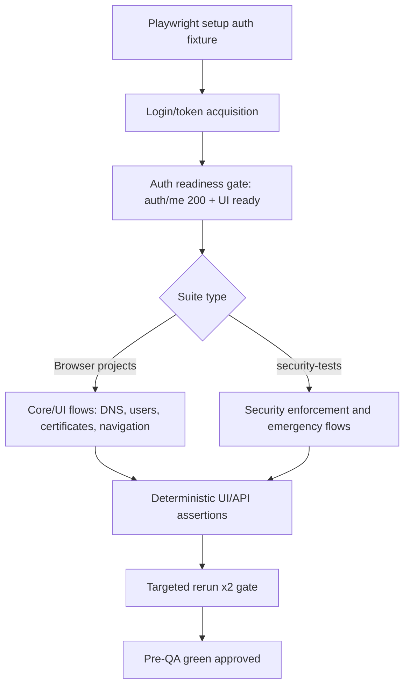

## 1. Introduction

This document replaces the previous skip-focused plan and defines the end-to-end execution strategy to get Charon Playwright suites fully green with no hidden skip debt.

Objective:

- QA unblock scope is a frozen target matrix that MUST finish with `0 failed`, `0 skipped`, and `0 did-not-run`.
- All frozen-matrix E2E suites execute and pass in the exact mapped Playwright projects.
- Security suites run only in `security-tests` where required.
- Browser suites (`chromium`, `firefox`, `webkit`) are deterministic and flake-resistant.
- Configuration files (`.gitignore`, `codecov.yml`, `.dockerignore`, `Dockerfile`) are aligned to reduce CI noise and improve repeatability.

Primary source artifacts reviewed:

- `docs/plans/CI_REMEDIATION_MASTER_PLAN.md`
- `docs/reports/e2e_skip_registry_2026-02-13.md`
- `docs/reports/e2e_fail_skip_ledger_2026-02-13.md`

## 2. Research Findings

### 2.1 Existing architecture and execution topology

Backend and route wiring (`backend/internal/api/routes/routes.go`) confirms:

- Auth/session APIs used heavily by E2E:
  - `POST /api/v1/auth/login`
  - `POST /api/v1/auth/logout`
  - `POST /api/v1/auth/refresh`
  - `GET /api/v1/auth/me`
- Security feature APIs relied on by settings/security workflows:
  - `GET /api/v1/security/status`
  - `PATCH /api/v1/security/acl`
  - `PATCH /api/v1/security/waf`
  - `PATCH /api/v1/security/crowdsec`
  - `PATCH /api/v1/security/rate-limit`
- Access list APIs used by workflow/data consistency tests:
  - `GET/POST/PUT/DELETE /api/v1/access-lists`

Frontend pages/components directly mapped to failing suites:

- `frontend/src/pages/DNSProviders.tsx`
- `frontend/src/components/dns-providers/ManualDNSChallenge.tsx`
- `frontend/src/pages/UsersPage.tsx`
- `frontend/src/components/ProxyHostForm.tsx`
- `frontend/src/pages/Certificates.tsx`
- `frontend/src/components/RequireAuth.tsx`

### 2.2 High-impact suite clusters (evidence-based)

Primary remediation suites:

- `tests/settings/user-lifecycle.spec.ts`
- `tests/core/multi-component-workflows.spec.ts`
- `tests/core/data-consistency.spec.ts`
- `tests/manual-dns-provider.spec.ts`
- `tests/core/admin-onboarding.spec.ts`
- `tests/modal-dropdown-triage.spec.ts`
- `tests/core/certificates.spec.ts`
- `tests/core/authentication.spec.ts`
- `tests/core/navigation.spec.ts`

Authentication/session fixture dependency surface:

- `tests/fixtures/auth-fixtures.ts`
- Core helpers: `getAuthToken`, `loginWithCredentials`, `refreshTokenIfNeeded`, `loginUser`, `logoutUser`, `createUserViaApi`

Observed failure patterns from code and baseline reports:

- Race/readiness failures around `auth/me` and post-login state transitions.
- Mixed security toggle propagation timing (settings updates not immediately reflected in UI/API assertions).
- Manual DNS tests relying on route mocks and challenge visibility that can drift by timing/state.
- Dropdown/modal selectors in triage suites using brittle targeting patterns.
- Certificate suite includes permissive expectations that mask true failures.

### 2.3 Config and pipeline hygiene findings

- `playwright.config.js` already separates `security-tests` and browser projects correctly.
- `.gitignore` currently allows root-level scan/report artifacts to linger and pollute workspace/PR diffs.
- `.dockerignore` should prioritize excluding test/output/docs-heavy artifacts from build context.
- `codecov.yml` is strict on patch/project coverage and needs explicit handling of E2E/generated noise.
- `Dockerfile` supports runtime, but E2E reproducibility depends on deterministic env/runtime contracts and avoiding accidental context bloat.

## 3. Technical Specifications

### 3.1 EARS requirements

- WHEN Playwright executes browser projects, THE SYSTEM SHALL run only browser-targeted suites and produce deterministic results with no retry masking.
- WHEN Playwright executes `security-tests`, THE SYSTEM SHALL run security-only suites with Cerberus-enabled state and explicit preconditions.
- WHEN an auth-dependent test starts, THE SYSTEM SHALL confirm valid auth token/session and successful `GET /api/v1/auth/me` before asserting UI state.
- WHEN wildcard/manual DNS scenarios are tested, THE SYSTEM SHALL provide deterministic challenge state using scoped mocks and verified cleanup.
- IF a security toggle is changed from UI/API, THEN THE SYSTEM SHALL expose a deterministic synchronization point before downstream assertions.
- IF a test cannot satisfy preconditions, THEN THE SYSTEM SHALL fail with explicit diagnostics and SHALL NOT use skip masking, quarantine, or did-not-run allowances.

### 3.7 Frozen QA Unblock Matrix Artifact

Artifact ID: `QA_UNBLOCK_MATRIX_FROZEN_2026-02-13`

Policy:

- This matrix is frozen for QA unblock and cannot be expanded or reduced during execution.
- Every row must execute and finish with expected status `pass`.
- Any `failed`, `skipped`, `timedOut`, `interrupted`, or `did-not-run` result fails the gate.

| Suite | Project | Expected Status |
|---|---|---|
| `tests/settings/user-lifecycle.spec.ts` | `chromium` | `pass` |
| `tests/settings/user-lifecycle.spec.ts` | `firefox` | `pass` |
| `tests/settings/user-lifecycle.spec.ts` | `webkit` | `pass` |
| `tests/core/multi-component-workflows.spec.ts` | `chromium` | `pass` |
| `tests/core/multi-component-workflows.spec.ts` | `firefox` | `pass` |
| `tests/core/multi-component-workflows.spec.ts` | `webkit` | `pass` |
| `tests/core/data-consistency.spec.ts` | `chromium` | `pass` |
| `tests/core/data-consistency.spec.ts` | `firefox` | `pass` |
| `tests/core/data-consistency.spec.ts` | `webkit` | `pass` |
| `tests/manual-dns-provider.spec.ts` | `chromium` | `pass` |
| `tests/manual-dns-provider.spec.ts` | `firefox` | `pass` |
| `tests/manual-dns-provider.spec.ts` | `webkit` | `pass` |
| `tests/core/admin-onboarding.spec.ts` | `chromium` | `pass` |
| `tests/core/admin-onboarding.spec.ts` | `firefox` | `pass` |
| `tests/core/admin-onboarding.spec.ts` | `webkit` | `pass` |
| `tests/modal-dropdown-triage.spec.ts` | `chromium` | `pass` |
| `tests/modal-dropdown-triage.spec.ts` | `firefox` | `pass` |
| `tests/modal-dropdown-triage.spec.ts` | `webkit` | `pass` |
| `tests/core/certificates.spec.ts` | `chromium` | `pass` |
| `tests/core/certificates.spec.ts` | `firefox` | `pass` |
| `tests/core/certificates.spec.ts` | `webkit` | `pass` |
| `tests/core/authentication.spec.ts` | `chromium` | `pass` |
| `tests/core/authentication.spec.ts` | `firefox` | `pass` |
| `tests/core/authentication.spec.ts` | `webkit` | `pass` |
| `tests/core/navigation.spec.ts` | `chromium` | `pass` |
| `tests/core/navigation.spec.ts` | `firefox` | `pass` |
| `tests/core/navigation.spec.ts` | `webkit` | `pass` |

### 3.2 API and contract requirements (no new endpoint required unless explicitly noted)

Required stable contracts (must be treated as blockers if unstable):

- `GET /api/v1/auth/me`: must return 200 with consistent user payload after login refresh boundaries.
- `GET /api/v1/security/status`: must reflect toggle changes within bounded synchronization window.
- `PATCH /api/v1/security/*`: must return deterministic success/failure and invalidate relevant cache.
- `GET/POST /api/v1/access-lists` and related endpoints: must be strongly consistent for immediate read-after-write assertions used by multi-component workflows.

Optional contract hardening (only if required by failures):

- Add explicit operation-complete payload fields for security patch endpoints (for deterministic UI waiters).

### 3.3 Database schema expectations

No schema migration is planned by default.

Escalation rule:

- IF auth/security consistency issues are traced to persistence-layer defaults or stale records, THEN create a separate migration spec before code changes.

### 3.4 Component-level design responsibilities

#### Frontend focus areas

- `frontend/src/components/RequireAuth.tsx`
  - Ensure auth gate uses a single source of truth for token + user state readiness.
- `frontend/src/pages/DNSProviders.tsx`
  - Stabilize manual challenge visibility/load path and fallback behavior.
- `frontend/src/components/dns-providers/ManualDNSChallenge.tsx`
  - Stabilize status transitions (`pending` → `verifying` → terminal states) for testability.
- `frontend/src/pages/UsersPage.tsx`
  - Modal/selection reliability and deterministic host permission rendering.
- `frontend/src/components/ProxyHostForm.tsx`
  - Selector stability and predictable async behavior for domain/provider/dropdowns.
- `frontend/src/pages/Certificates.tsx` + dependent list components
  - Deterministic list/loading states and no permissive pass conditions.

#### Backend focus areas

- `backend/internal/api/handlers/auth_handler.go`
  - Session cookie/token lifecycle consistency (`login`, `refresh`, `me`, `logout`).
- `backend/internal/api/handlers/security_handler.go`
  - Toggle/cache invalidation and observable state transition timing.
- `backend/internal/api/handlers/access_list_handler.go`
  - Stable CRUD/test behavior under immediate read-after-write.

### 3.5 Data flow and synchronization design

Synchronization requirements:

- Replace ad-hoc sleeps with API-backed waiters and stable UI readiness signals.
- Keep route mocking test-scoped and paired cleanup (`route`/`unroute`).

### 3.6 Error handling and edge-case matrix

| Area | Edge Case | Required Handling |
|---|---|---|
| Auth | token present but stale user state | force refresh path then re-check `auth/me` |
| Auth | cookie vs localStorage divergence | unify guard and fixture refresh behavior |
| Security toggles | API success but stale status read | explicit poll window with fail-fast timeout |
| Manual DNS | no active challenge found | deterministic challenge seed or scoped fallback mock |
| Modals/dropdowns | element attached but not interactable | role-based locator and visible+enabled precondition |
| Certificates | permissive expectation masks fail | replace permissive assertions with strict contract checks |

## 4. Implementation Plan

### Phase 0: Pre-run environment gate (mandatory)

Owner: DevOps

Work packets:

1. Apply testing protocol rebuild decision before any matrix execution:
  - Rebuild E2E container if app/runtime/build inputs changed, or if container state is not healthy/trusted.
  - Reuse running container only for test-only changes when health is already confirmed.
2. Verify runtime health before matrix runs:
  - Management UI health endpoint reachable (`:8080`).
  - Emergency endpoint reachable (`:2020`) when required by targeted tests.
  - Container health status is `healthy`.
3. Persist environment-gate verdict in execution log: `rebuild-required` or `reuse-allowed` with evidence.

Gate:

- No Phase 1 start until rebuild decision and health verification both pass.

Handoff criteria:

- DevOps provides a pass/fail environment gate record consumed by QA Security in Phase 5.

Complexity: Low

### Phase 1: Playwright behavior contract and baseline capture (mandatory first)

1. Capture fresh fail/skip ledger for target suites only.
2. Freeze target suite list and expected project mapping.
3. Define precondition contract in tests before feature-level edits.

Deliverables:

- Updated fail/skip matrix appended to `docs/reports/e2e_fail_skip_ledger_2026-02-13.md`.
- Explicit project-routing map per suite.

Complexity: Medium

### Phase 2: Backend remediation (auth + security + ACL consistency)

Work packets:

1. Auth reliability:
   - Files: `backend/internal/api/handlers/auth_handler.go`, auth service dependencies.
   - Goal: eliminate intermittent `auth/me` readiness failures post-login/refresh/logout cycles.
2. Security state propagation:
   - Files: `backend/internal/api/handlers/security_handler.go`.
   - Goal: deterministic status observability after patch/enable/disable actions.
3. Access list consistency:
   - Files: `backend/internal/api/handlers/access_list_handler.go` and service layer.
   - Goal: immediate read-after-write consistency for tests.

Validation:

- Targeted Go tests for changed packages.
- Targeted Playwright suites that consume these APIs.

Complexity: High

### Phase 3: Frontend remediation (state, selectors, deterministic UX)

Work packets:

1. Auth guard and lifecycle:
   - Files: `frontend/src/components/RequireAuth.tsx`, auth hooks/store dependencies.
2. Manual DNS flow stabilization:
   - Files: `frontend/src/pages/DNSProviders.tsx`, `frontend/src/components/dns-providers/ManualDNSChallenge.tsx`.
3. Modal/dropdown hardening:
   - Files: `frontend/src/pages/UsersPage.tsx`, `frontend/src/components/ProxyHostForm.tsx`.
4. Certificates UX contract:
   - Files: `frontend/src/pages/Certificates.tsx` and certificate list dependencies.

Validation:

- Frontend lint + TS checks.
- Targeted Playwright runs on affected suites.

Complexity: High

### Phase 4: Test suite hardening and flake elimination

Work packets:

1. Auth fixture hardening:
   - File: `tests/fixtures/auth-fixtures.ts`.
   - Goal: centralize token refresh/readiness checks and remove duplicate race-prone paths.
2. Manual DNS test alignment:
   - File: `tests/manual-dns-provider.spec.ts`.
   - Goal: deterministic challenge setup, strict assertions, no skip masking.
3. Workflow/data consistency synchronization:
   - Files: `tests/core/multi-component-workflows.spec.ts`, `tests/core/data-consistency.spec.ts`.
   - Goal: API-backed sync points, eliminate timing flake.
4. Triage and strictness:
   - Files: `tests/modal-dropdown-triage.spec.ts`, `tests/core/certificates.spec.ts`.
   - Goal: robust locators, remove permissive success conditions.

Validation:

- Execute targeted suites across all browser projects.
- Repeat run twice; both runs must be green.

Complexity: High

### Phase 5: QA Security ownership, gate validation, and unblock sign-off

Owner: QA Security

Work packets:

1. Validate execution strictly against `QA_UNBLOCK_MATRIX_FROZEN_2026-02-13`.
2. Verify determinism policy enforcement:
  - No retry masking (`--retries=0` for gate runs).
  - No quarantine lists or temporary excludes.
  - No did-not-run allowance for any frozen matrix row.
3. Confirm frozen matrix success scope for unblock:
  - Aggregate result is exactly `0 failed / 0 skipped / 0 did-not-run`.

Gate:

- QA unblock is denied unless the frozen matrix exactly matches expected `pass` for all rows.

Handoff criteria:

- QA Security publishes signed gate verdict: `QA_UNBLOCK_APPROVED` or `QA_UNBLOCK_REJECTED`, with matrix evidence.

Complexity: Medium

### Phase 6: DevOps ownership for CI parity and handoff

Owner: DevOps

Work packets:

1. Reconcile outputs with:
   - `docs/plans/CI_REMEDIATION_MASTER_PLAN.md`
   - `docs/reports/e2e_skip_registry_2026-02-13.md`
   - `docs/reports/e2e_fail_skip_ledger_2026-02-13.md`
2. Confirm no reintroduced skip debt in targeted suites.
3. Verify CI command parity with local execution.
4. Ensure CI gate commands validate against the same frozen matrix and determinism policy.

Gate:

- No Supervisor handoff until CI parity and frozen-matrix enforcement are confirmed.

Handoff criteria:

- DevOps provides final execution package with environment-gate record, QA Security verdict, and CI parity evidence.

Complexity: Medium

## 5. Config Review and Required Recommendations

### 5.1 `.gitignore`

Recommendation:

- Add/normalize ignores for root-level generated outputs that should never be committed:
  - `playwright-report/`, `test-results/`, `.playwright-artifacts/` (if used), `coverage/e2e/` artifacts policy-defined.
  - security scan outputs and temporary SARIF/JSON/TXT reports generated during local runs.

Rationale:

- Reduce PR noise and prevent stale artifact interference with triage.

### 5.2 `codecov.yml`

Recommendation:

- Keep strict patch coverage policy; do not relax thresholds.
- Ensure generated E2E artifacts and transient files are excluded consistently from coverage paths.
- Add explicit patch triage process in plan execution notes (copy missing lines from Codecov Patch view to task list).

Rationale:

- Preserve quality gate while preventing false negatives from non-source artifacts.

### 5.3 `.dockerignore`

Recommendation:

- Exclude non-runtime directories from build context where safe:
  - large docs/report outputs, Playwright artifacts, local test outputs, and temporary scan files.
- Keep only build/runtime-essential files in Docker context for reproducibility and speed.

Rationale:

- Faster deterministic builds and reduced accidental cache invalidation.

### 5.4 `Dockerfile`

Recommendation:

- Keep image behavior stable; avoid introducing test-only variability.
- Validate that runtime env defaults required by E2E are explicit and reproducible.
- Ensure no unnecessary build context dependencies remain after `.dockerignore` tightening.

Rationale:

- E2E reliability depends on predictable runtime behavior, not ad-hoc local state.

## 6. Subagent Execution Matrix

| Subagent | Scope | File Focus | Exit Criteria |
|---|---|---|---|
| Playwright | test hardening + deterministic waits | `tests/**`, `tests/fixtures/auth-fixtures.ts` | target suites green x2 |
| Backend | auth/security/ACL consistency | `backend/internal/api/handlers/**`, service deps | API contracts stable under targeted runs |
| Frontend | state and interaction reliability | `frontend/src/pages/**`, `frontend/src/components/**` | deterministic UI behavior in target suites |
| QA Security | frozen-matrix gate enforcement + unblock decision | `docs/plans/current_spec.md`, Playwright run artifacts, matrix evidence | `0 failed / 0 skipped / 0 did-not-run` on frozen matrix and signed QA verdict |
| DevOps | environment gate + CI parity + release handoff | `.docker/compose/**`, `playwright.config.js`, `.gitignore`, `.dockerignore`, `codecov.yml`, `Dockerfile`, docs reports | environment gate pass + CI parity pass + handoff package delivered |

## 7. Validation Strategy

Execution order:

1. Run Phase 0 environment gate (rebuild decision + health verification).
2. Execute frozen matrix artifact rows in mapped projects with `--retries=0`.
3. Run security-targeted set in `security-tests`.
4. Repeat full frozen matrix a second time (must also pass).
5. Run lint/typecheck and relevant backend tests.

Determinism gate rule:

- No retry masking, no quarantine, no did-not-run allowance.

QA gate rule:

- No QA handoff until two consecutive frozen-matrix green runs are achieved with exact scope match.

## 8. Acceptance Criteria

- [ ] Frozen matrix (`QA_UNBLOCK_MATRIX_FROZEN_2026-02-13`) completes with `0 failed / 0 skipped / 0 did-not-run`.
- [ ] All frozen matrix rows execute and pass in exact suite-to-project mapping.
- [ ] `auth/me` readiness failures are eliminated in user lifecycle flows.
- [ ] Manual DNS provider tests run deterministically without skip masking.
- [ ] Security toggle propagation is deterministic for workflow/data consistency suites.
- [ ] Dropdown/modal triage scenarios are stable with robust selectors/interactions.
- [ ] Certificate tests use strict assertions (no permissive masking patterns).
- [ ] Determinism policy is enforced: no retries for gate runs, no quarantine, no did-not-run allowance.
- [ ] Phase 0 pre-run environment gate evidence is present and valid.
- [ ] QA Security gate verdict is recorded and approved for unblock.
- [ ] DevOps CI parity gate verdict is recorded before Supervisor handoff.
- [ ] `.gitignore`, `.dockerignore`, `codecov.yml`, and `Dockerfile` recommendations are implemented and validated.
- [ ] Baseline docs/reports are updated to reflect final green state.
- [ ] Pre-QA green gate passes twice consecutively.

## 9. Risks and Mitigations

- Risk: Hidden coupling between fixtures and UI state causes intermittent regressions.
  - Mitigation: centralize readiness gates and remove duplicated auth logic.
- Risk: Security state propagation latency causes false negatives.
  - Mitigation: bounded poll contracts and backend cache invalidation checks.
- Risk: Overfitting tests to implementation details.
  - Mitigation: prefer user-facing role/label locators and API-level readiness only.

## 10. Handoff

Decision summary (for Supervisor review):

- Decision: Replace skip-retarget-only plan with full green-suite execution spec spanning backend, frontend, tests, and config hygiene.
- Rationale: Current blockers are not only skip/routing issues; they include product behavior and determinism gaps.
- Impact: Enables parallel subagent execution with explicit ownership and measurable gates.
- Review target: Supervisor agent validates task sequencing, ownership, and gate criteria before implementation begins.

Next action:

- Submit this plan to Supervisor for approval, then execute phases in order with strict gate enforcement.
