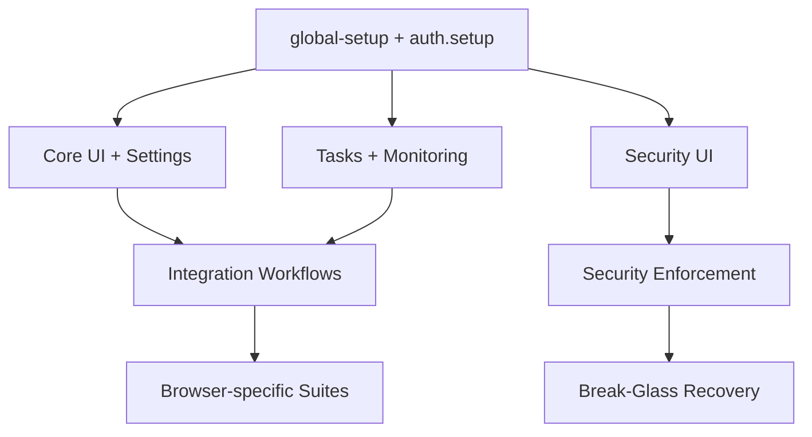

## 1. Introduction

This plan replaces the current spec with a comprehensive, phased remediation
strategy for the Playwright E2E test suite under [tests](tests). The goal is to
stabilize execution, align dependencies, and sequence remediation work so that
core management flows, security controls, and integration workflows become
reliable in Docker-based E2E runs.

## 2. Research Findings

### 2.1 Test Harness and Global Dependencies

- Global setup and teardown are enforced by
   [tests/global-setup.ts](tests/global-setup.ts),
   [tests/auth.setup.ts](tests/auth.setup.ts), and
   [tests/security-teardown.setup.ts](tests/security-teardown.setup.ts).
- Global setup validates the emergency token, checks health endpoints, and
   resets security settings, which impacts all security-enforcement suites.
- Multiple suites depend on the emergency server (port 2020) and Cerberus
   modules with explicit admin whitelist configuration.

### 2.2 Test Inventory and Feature Areas

- Core management flows: authentication, navigation, dashboard, proxy hosts,
   certificates, access lists in [tests/core](tests/core).
- DNS providers and ACME workflows: [tests/dns-provider-crud.spec.ts]
   (tests/dns-provider-crud.spec.ts),
   [tests/dns-provider-types.spec.ts](tests/dns-provider-types.spec.ts),
   [tests/manual-dns-provider.spec.ts](tests/manual-dns-provider.spec.ts).
- Monitoring: uptime and log streaming in
   [tests/monitoring](tests/monitoring).
- Settings: system, account, SMTP, notifications, encryption, user management
   in [tests/settings](tests/settings).
- Tasks and imports: backups, Caddyfile import flows, CrowdSec import, and log
   viewing in [tests/tasks](tests/tasks).
- Security UI: dashboard, WAF, CrowdSec, headers, rate limiting, and audit logs
   in [tests/security](tests/security).
- Security enforcement: ACL, WAF, rate limits, CrowdSec, emergency token, and
   break-glass recovery in [tests/security-enforcement](tests/security-enforcement).
- Integration workflows: cross-feature scenarios in
   [tests/integration](tests/integration).
- Browser-specific regressions for import flows in
   [tests/webkit-specific](tests/webkit-specific) and
   [tests/firefox-specific](tests/firefox-specific).
- Debug and diagnostics: certificates and Caddy import debug coverage in
   [tests/debug/certificates-debug.spec.ts](tests/debug/certificates-debug.spec.ts),
   [tests/tasks/caddy-import-gaps.spec.ts](tests/tasks/caddy-import-gaps.spec.ts),
   [tests/tasks/caddy-import-cross-browser.spec.ts](tests/tasks/caddy-import-cross-browser.spec.ts),
   and [tests/debug](tests/debug).
- UI triage and regression coverage: dropdown/modal coverage in
   [tests/modal-dropdown-triage.spec.ts](tests/modal-dropdown-triage.spec.ts) and
   [tests/proxy-host-dropdown-fix.spec.ts](tests/proxy-host-dropdown-fix.spec.ts).
- Shared utilities validation: wait helpers in
   [tests/utils/wait-helpers.spec.ts](tests/utils/wait-helpers.spec.ts).

### 2.3 Dependency and Ordering Constraints

- The security-enforcement suite assumes Cerberus can be toggled on, and its
   final tests intentionally restore admin whitelist state
   (see [tests/security-enforcement/zzzz-break-glass-recovery.spec.ts]
   (tests/security-enforcement/zzzz-break-glass-recovery.spec.ts)).
- Admin whitelist blocking is designed to run last using a zzz prefix
   (see [tests/security-enforcement/zzz-admin-whitelist-blocking.spec.ts]
   (tests/security-enforcement/zzz-admin-whitelist-blocking.spec.ts)).
- Emergency server tests depend on port 2020 availability
   (see [tests/security-enforcement/emergency-server](tests/security-enforcement/emergency-server)).
- Some import suites use real APIs and TestDataManager cleanup; others mock
   requests. Remediation must avoid mixing mocked and real flows in a single
   phase without clear isolation.

### 2.4 Runtime and Flake Hotspots

- Security-enforcement suites include extended retries, network propagation
   delays, and rate limit loops.
- Import debug and gap-coverage suites perform real uploads, data creation, and
   commit flows, making them sensitive to backend state and Caddy reload timing.
- Monitoring WebSocket tests require stable log streaming state.

## 3. Technical Specifications

### 3.1 Test Grouping and Shards

- **Foundation:** global setup, auth storage state, security teardown.
- **Core UI:** authentication, navigation, dashboard, proxy hosts, certificates,
   access lists.
- **Settings:** system, account, SMTP, notifications, encryption, users.
- **Tasks:** backups, logs, Caddyfile import, CrowdSec import.
- **Monitoring:** uptime monitoring and real-time logs.
- **Security UI:** Cerberus dashboard, WAF config, headers, rate limiting,
   CrowdSec config, audit logs.
- **Security Enforcement:** ACL/WAF/CrowdSec/rate limit enforcement, emergency
   token and break-glass recovery, admin whitelist blocking.
- **Integration:** proxy + cert, proxy + DNS, backup restore, import workflows,
   multi-feature workflows.
- **Browser-specific:** WebKit and Firefox import regressions.
- **Debug/POC:** diagnostics and investigation suites (Caddy import debug).

### 3.2 Dependency Graph (High-Level)



### 3.3 Runtime Estimates (Docker Mode)

| Group | Suite Examples | Expected Runtime | Prerequisites |
| --- | --- | --- | --- |
| Foundation | global setup + auth | 1-2 min | Docker E2E container, emergency token |
| Core UI | core specs | 6-10 min | Auth storage state, clean data |
| Settings | settings specs | 6-10 min | Auth storage state |
| Tasks | backups/import/logs | 10-16 min | Auth storage state, API mocks and real flows |
| Monitoring | monitoring specs | 5-8 min | WebSocket stability |
| Security UI | security specs | 10-14 min | Cerberus enabled, admin whitelist |
| Security Enforcement | enforcement specs | 15-25 min | Emergency token, port 2020, admin whitelist |
| Integration | integration specs | 12-20 min | Stable core + settings + tasks |
| Browser-specific | firefox/webkit | 8-12 min | Import baseline stable |
| Debug/POC | caddy import debug | 4-6 min | Docker logs available |

Assumed worker count: 4 (default) except security-enforcement which requires
`--workers=1`. Serial execution increases runtime for enforcement suites.

### 3.4 Environment Preconditions

- E2E container built and healthy via
   `.github/skills/scripts/skill-runner.sh docker-rebuild-e2e`.
- Ports 8080 (UI/API) and 2020 (emergency server) reachable.
- `CHARON_EMERGENCY_TOKEN` configured and valid.
- Admin whitelist includes test runner ranges when Cerberus is enabled.
- Caddy admin health endpoints reachable for import workflows.

### 3.5 Emergency Server and Security Prerequisites

- Port 2020 (emergency server) available and reachable for
   [tests/security-enforcement/emergency-server](tests/security-enforcement/emergency-server).
- Port 2019 is reserved for the Caddy admin API; use 2020 for emergency server
   tests to avoid conflicts.
- Basic Auth credentials required for emergency server tests. Defaults in test
   fixtures are `admin` / `changeme` and should match the E2E compose config.
- Admin whitelist bypass must be configured before enforcement tests that
   toggle Cerberus settings.

## 4. Implementation Plan

### Phase 1: Foundation and Test Harness Reliability

Objective: Ensure the shared test harness is stable before touching feature
flows.

- Validate global setup and storage state creation
   (see [tests/global-setup.ts](tests/global-setup.ts) and
   [tests/auth.setup.ts](tests/auth.setup.ts)).
- Confirm emergency server availability and credentials for break-glass suites.
- Establish baseline run for core login/navigation suites.

Estimated runtime: 2-4 minutes

Success criteria:

- Storage state created once and reused without re-auth flake.
- Emergency token validation passes and security reset executes.

### Phase 2: Core UI, Settings, Monitoring, and Task Flows

Objective: Remediate the highest-traffic user journeys and tasks.

- Core UI: authentication, navigation, dashboard, proxy hosts, certificates,
   access lists (core CRUD and navigation).
- Settings: system, account, SMTP, notifications, encryption, users.
- Monitoring: uptime and real-time logs.
- Tasks: backups, logs viewing, and base Caddyfile import flows.
- Include modal/dropdown triage coverage and wait helpers validation.

Estimated runtime: 25-40 minutes

Success criteria:

- Core CRUD and navigation pass without retries.
- Monitoring WebSocket tests pass without timeouts.
- Backups and log viewing flows pass with mocks and deterministic waits.

### Phase 3: Security UI and Enforcement

Objective: Stabilize Cerberus UI configuration and enforcement workflows.

- Security dashboard and configuration pages.
- WAF, headers, rate limiting, CrowdSec, audit logs.
- Enforcement suites, including emergency token and whitelist blocking order.

Estimated runtime: 30-45 minutes

Success criteria:

- Security UI toggles and pages load without state leakage.
- Enforcement suites pass with Cerberus enabled and whitelist configured.
- Break-glass recovery restores bypass state for subsequent suites.

### Phase 4: Integration, Browser-Specific, and Debug Suites

Objective: Close cross-feature and browser-specific regressions.

- Integration workflows: proxy + cert, proxy + DNS, backup restore, import to
   production, multi-feature workflows.
- Browser-specific Caddy import regressions (Firefox/WebKit).
- Debug/POC suites (Caddy import debug, diagnostics) run as opt-in,
   including caddy-import-gaps and cross-browser import coverage.

Estimated runtime: 25-40 minutes

Success criteria:

- Integration workflows pass with stable TestDataManager cleanup.
- Browser-specific import tests show consistent API request handling.
- Debug suites remain optional and do not block core pipelines.

## 5. Acceptance Criteria (EARS)

- WHEN the E2E harness initializes, THE SYSTEM SHALL validate emergency token
   and create a reusable auth state without flake.
- WHEN core management tests execute, THE SYSTEM SHALL complete CRUD flows
   without manual retries or timeouts.
- WHEN security enforcement suites execute, THE SYSTEM SHALL apply Cerberus
   settings with admin whitelist bypass and SHALL restore security state after
   completion.
- WHEN integration workflows execute, THE SYSTEM SHALL complete cross-feature
   journeys without data collisions or residual state.

## 6. Quick Start Commands

```bash
# Rebuild and start E2E container
.github/skills/scripts/skill-runner.sh docker-rebuild-e2e

# PHASE 1: Foundation
cd /projects/Charon
npx playwright test tests/global-setup.ts tests/auth.setup.ts --project=firefox

# PHASE 2: Core UI, Settings, Tasks, Monitoring
# NOTE: PLAYWRIGHT_SKIP_SECURITY_DEPS=1 is automatically set in E2E scripts
# Security suites will NOT execute as dependencies
npx playwright test tests/core --project=firefox
npx playwright test tests/settings --project=firefox
npx playwright test tests/tasks --project=firefox
npx playwright test tests/monitoring --project=firefox

# PHASE 3: Security UI and Enforcement (SERIAL)
npx playwright test tests/security --project=firefox
npx playwright test tests/security-enforcement --project=firefox --workers=1

# PHASE 4: Integration, Browser-Specific, Debug (Optional)
npx playwright test tests/integration --project=firefox
npx playwright test tests/firefox-specific --project=firefox
npx playwright test tests/webkit-specific --project=webkit
npx playwright test tests/debug --project=firefox
npx playwright test tests/tasks/caddy-import-gaps.spec.ts --project=firefox
```

## 7. Risks and Mitigations

- Risk: Security suite state leaks across tests. Mitigation: enforce admin
   whitelist reset and break-glass recovery ordering.
- Risk: File-name ordering (zzz-) not enforced without `--workers=1`.
   Mitigation: document `--workers=1` requirement and make it mandatory in
   CI and quick-start commands.
- Risk: Emergency server unavailable. Mitigation: gate enforcement suites on
   health checks and document port 2020 requirements.
- Risk: Import suites combine mocked and real flows. Mitigation: isolate by
   phase and keep debug suites opt-in.
- Risk: Missing test suites hide regressions. Mitigation: inventory now
   includes all suites and maps them to phases.

## 8. Dependencies and Impacted Files

- Harness: [tests/global-setup.ts](tests/global-setup.ts),
   [tests/auth.setup.ts](tests/auth.setup.ts),
   [tests/security-teardown.setup.ts](tests/security-teardown.setup.ts).
- Core UI: [tests/core](tests/core).
- Settings: [tests/settings](tests/settings).
- Tasks: [tests/tasks](tests/tasks).
- Monitoring: [tests/monitoring](tests/monitoring).
- Security UI: [tests/security](tests/security).
- Security enforcement: [tests/security-enforcement](tests/security-enforcement).
- Integration: [tests/integration](tests/integration).
- Browser-specific: [tests/firefox-specific](tests/firefox-specific),
   [tests/webkit-specific](tests/webkit-specific).

## 9. Confidence Score

Confidence: 79 percent

Rationale: The suite inventory and dependencies are well understood. The main
unknowns are timing-sensitive security propagation and emergency server
availability in varied environments.
