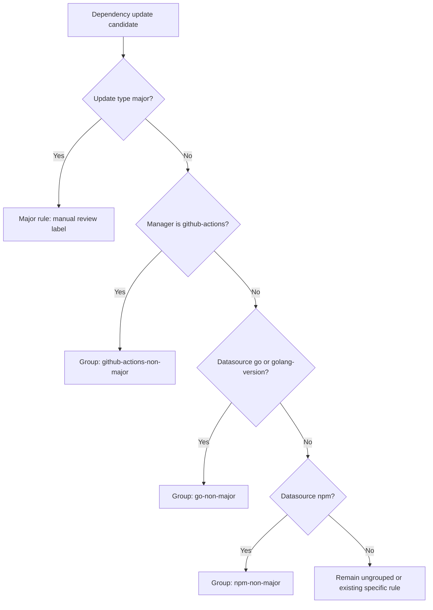

## Introduction

### Overview

This specification defines how to split Renovate non-major dependency updates into separate PR groupings by dependency type instead of the current single mixed group.

Target groupings:

1. GitHub Actions dependencies
2. Go dependencies
3. NPM dependencies

### Objectives

1. Remove the current cross-ecosystem grouping behavior.
2. Keep safety constraints for majors and pinned version boundaries.
3. Ensure migration can be validated with deterministic Renovate config checks and dry runs.
4. Complete in one PR with ordered logical commits and minimal back-and-forth user requests.

## Research Findings

### Files Reviewed

1. [.github/renovate.json](.github/renovate.json)
2. [docs/plans/current_spec.md](docs/plans/current_spec.md)
3. [.gitignore](.gitignore)
4. [codecov.yml](codecov.yml)
5. [.dockerignore](.dockerignore)
6. [Dockerfile](Dockerfile)
7. [ARCHITECTURE.md](ARCHITECTURE.md)
8. [.github/instructions/copilot-instructions.md](.github/instructions/copilot-instructions.md)
9. [.github/instructions/spec-driven-workflow-v1.instructions.md](.github/instructions/spec-driven-workflow-v1.instructions.md)

### Current Renovate Behavior

Current configuration contains a package rule that groups all non-major updates into one PR:

- File: [.github/renovate.json](.github/renovate.json)
- Location: packageRules first entry (description contains "THE MEGAZORD")
- Keys currently driving broad grouping:
  - groupName: non-major-updates
  - matchUpdateTypes: minor, patch, pin, digest
  - matchPackageNames: ["*"]

This rule is the root cause of mixed PRs across ecosystems.

### Existing Safety Rules That Must Be Preserved

The following constraints already exist and must remain in place:

1. Major update manual review rule:
   - matchUpdateTypes: ["major"]
   - labels: ["manual-review"]
   - automerge: false
2. Go module major-path/version constraints:
   - github.com/jackc/pgx/v4 < 5.0.0
   - jackc/pgx via github-tags in >= 4.0.0 < 5.0.0
   - go-jose v3/v4 boundaries
3. Dockerfile and custom regex managers for security-patched pins.

### Dependency Source Mapping Needed for Correct Grouping

1. GitHub Actions dependencies:
   - Manager: github-actions
   - Additional workflow values managed by custom.regex should not be auto-classified as actions unless datasource indicates action versions.
2. Go dependencies:
   - Datasources primarily: go, golang-version
   - One known go-related github-tags case exists for jackc/pgx fallback rule.
3. NPM dependencies:
   - Datasource: npm
   - Includes npm packages matched by datasource npm only.

## Requirements (EARS)

1. WHEN Renovate processes non-major updates, THE SYSTEM SHALL create separate groups for GitHub Actions, Go, and NPM dependencies.
2. WHEN a dependency update is major, THE SYSTEM SHALL keep it outside non-major grouped flow and require manual review labeling.
3. WHEN existing package-specific safety constraints are evaluated, THE SYSTEM SHALL preserve allowedVersions and sourceUrl mapping behavior unchanged.
4. IF a dependency does not match GitHub Actions, Go, or NPM grouping rules, THEN THE SYSTEM SHALL leave it ungrouped (or governed by existing specific rules) rather than forcing inclusion into another ecosystem group.
5. WHEN configuration changes are introduced, THE SYSTEM SHALL pass Renovate config validation and dry-run inspection before merge.

### Confidence Score

92%

Rationale: the required behavior is isolated to [.github/renovate.json](.github/renovate.json), current grouping cause is explicit, and migration risk is primarily rule precedence, which is manageable with dry-run validation.

## Technical Specifications

### Primary File to Edit

1. [.github/renovate.json](.github/renovate.json)

### Exact JSON Keys to Edit

Within root key packageRules in [.github/renovate.json](.github/renovate.json):

1. Replace the current broad grouping object (MEGAZORD) with three ecosystem-specific non-major group rules.
2. Keep existing development-branch non-major automerge behavior rule, but ensure it applies cleanly with new grouped rules.
3. Keep all existing package-specific safety and lookup rules unchanged unless explicitly required for precedence fixes.

### Proposed Rule Set Changes

#### Rule A: GitHub Actions non-major grouping

- matchManagers: ["github-actions"]
- matchUpdateTypes: ["minor", "patch", "pin", "digest"]
- groupName: "github-actions-non-major"
- groupSlug: "github-actions-non-major"

#### Rule B: Go non-major grouping

- matchDatasources: ["go", "golang-version"]
- matchUpdateTypes: ["minor", "patch", "pin", "digest"]
- groupName: "go-non-major"
- groupSlug: "go-non-major"

#### Rule C: Go github-tags fallback grouping (targeted)

- matchDatasources: ["github-tags"]
- matchManagers: ["custom.regex"]
- matchFileNames: ["Dockerfile"]
- matchPackageNames: ["jackc/pgx"]
- matchUpdateTypes: ["minor", "patch", "pin", "digest"]
- groupName: "go-non-major"
- groupSlug: "go-non-major"

#### Rule D: NPM non-major grouping

- matchDatasources: ["npm"]
- matchUpdateTypes: ["minor", "patch", "pin", "digest"]
- groupName: "npm-non-major"
- groupSlug: "npm-non-major"

### Rule Precedence and Ordering

Order in packageRules matters for predictable merge behavior. Place grouping rules before broad branch behavior toggles and before highly specific package constraints, with this order:

1. Ecosystem grouping rules (Actions, Go, Go github-tags fallback, NPM)
2. Development branch non-major behavior rule
3. Existing custom labels and package-specific allowedVersions/sourceUrl rules
4. Major manual-review rule

### Data Flow (Renovate matching intent)



## Migration and Safety Considerations

### Migration Risks

1. Incorrect matcher breadth could absorb unrelated dependencies.
2. Rule ordering could override or dilute existing allowedVersions constraints.
3. Incomplete handling of custom.regex managed values could cause unexpected PR distribution.

### Mitigations

1. Use datasource and manager matchers, not wildcard package names.
2. Add explicit targeted fallback for jackc/pgx github-tags only.
3. Keep existing package-specific safety rules intact and later in rule order.
4. Validate using printed final config and dry-run PR prediction before merge.

### Backward Compatibility

1. No schema change needed.
2. No runtime application behavior change.
3. Existing Renovate dashboard behavior remains, but grouped PR topology changes from one mixed PR to three ecosystem-focused PR streams.

## Ancillary File Review (Only If Necessary)

Reviewed for this change request:

1. [.gitignore](.gitignore)
2. [codecov.yml](codecov.yml)
3. [.dockerignore](.dockerignore)
4. [Dockerfile](Dockerfile)

Decision: no updates required.

Reasoning:

1. Grouping behavior is fully controlled in [.github/renovate.json](.github/renovate.json).
2. No new artifacts, coverage behavior, or Docker build context changes are introduced by this planning scope.
3. [Dockerfile](Dockerfile) contains renovate annotations already and does not require structural adjustment for grouping itself.

## Implementation Plan

### Phase 1: Configuration Refactor (Single-file change)

Objective: replace mixed grouping with ecosystem-specific grouping.

Tasks:

1. Edit packageRules in [.github/renovate.json](.github/renovate.json).
2. Remove the broad wildcard non-major grouping rule.
3. Insert Actions, Go, Go github-tags fallback, and NPM grouping rules.
4. Preserve existing safety rules unchanged unless ordering needs explicit adjustment.

Expected output:

1. One updated config with deterministic grouping strategy.

### Phase 2: Validation and Safety Gates

Objective: confirm behavior and avoid unintended rule interactions.

Tasks:

1. Run Renovate config validation.
2. Run Renovate dry-run with printed config and explicit config path.
3. Verify expected grouping outcomes in logs:
   - GitHub Actions updates grouped only in github-actions-non-major
   - Go datasource updates grouped only in go-non-major
   - NPM datasource updates grouped only in npm-non-major
   - major updates remain manual-review and not grouped with non-major
4. Verify existing allowedVersions/sourceUrl package rules still apply.
5. Persist validation and dry-run evidence artifacts for deterministic review.

Expected output:

1. Validation log proving no schema or precedence errors.
2. Dry-run evidence of the new grouping topology.
3. Artifacts saved at test-results/renovate/validate.log and test-results/renovate/dry-run.log.

### Phase 3: Documentation and Handoff

Objective: finalize planning-to-implementation handoff with minimal user interaction.

Tasks:

1. Keep this spec as source of truth for implementation.
2. Delegate implementation to Supervisor after user approval in a single handoff request.

Expected output:

1. One implementation-ready PR execution path.

## Validation Steps

### Required

1. Renovate schema validation:

```bash
mkdir -p test-results/renovate
npx renovate-config-validator /projects/Charon/.github/renovate.json \
   > test-results/renovate/validate.log 2>&1
```

2. Local dry-run with full logs:

```bash
npx renovate \
   --platform=local \
   --dry-run=full \
   --print-config \
   --base-dir=/projects/Charon \
   --config-file=/projects/Charon/.github/renovate.json \
   > test-results/renovate/dry-run.log 2>&1
```

### Validation Checklist

1. Config validator returns success.
2. test-results/renovate/validate.log exists and records successful validation.
3. test-results/renovate/dry-run.log exists and includes print-config output with expected rules.
4. No duplicate or conflicting groupName/groupSlug assignments for the same dependency.
5. Non-major updates appear in three ecosystem buckets.
6. No forced cross-ecosystem grouping remains.
7. Major updates are still manually reviewed.

## Acceptance Criteria

1. packageRules no longer contains wildcard non-major grouping that mixes all ecosystems.
2. GitHub Actions non-major updates are grouped separately.
3. Go non-major updates are grouped separately.
4. NPM non-major updates are grouped separately.
5. Existing safety constraints (major handling and allowedVersions) remain intact.
6. Validator and dry-run indicate no regressions in rule matching.

## Commit Slicing Strategy

### Decision

Single PR with ordered logical commits.

Why:

1. Scope is tightly focused to one configuration file.
2. Splitting into multiple PRs would add overhead without reducing risk.
3. Ordered commits inside one PR provide safe review checkpoints and clean rollback.

### Trigger Reasons

1. Scope: dependency automation policy refinement only.
2. Risk: medium, due to matcher precedence.
3. Cross-domain impact: low at runtime, medium in CI automation behavior.
4. Review size: small and suitable for one PR.

### Commit 1

Scope:

1. Remove wildcard mixed non-major group rule.
2. Add explicit ecosystem-specific grouping rules for GitHub Actions, Go, and NPM.
3. Add targeted go github-tags fallback grouping for jackc/pgx.

Files:

1. [.github/renovate.json](.github/renovate.json)

Dependencies:

1. None.

Validation gate:

1. JSON syntax valid.
2. Renovate config validator passes.

### Commit 2

Scope:

1. Rule-order stabilization if needed after dry-run evidence.
2. No functional broadening beyond requested ecosystems.

Files:

1. [.github/renovate.json](.github/renovate.json)

Dependencies:

1. Commit 1 completed.

Validation gate:

1. Dry-run confirms exactly three non-major grouped tracks by dependency type.
2. Major and safety constraints unaffected.

### Commit 3

Scope:

1. Optional documentation note in PR body only (no repo file change required) summarizing grouping migration.

Files:

1. No repository file changes required.

Dependencies:

1. Commit 2 dry-run output collected.

Validation gate:

1. Reviewer can map expected PR behavior to new rules quickly.

### Rollback and Contingency (PR-level)

1. Immediate rollback path: revert PR to restore previous grouping behavior.
2. Contingency if dry-run reveals misclassification:
   - tighten matcher fields by datasource/manager
   - keep unclassified dependencies ungrouped
   - rerun validator and dry-run before merge

## Handoff

After approval of this plan, hand off to Supervisor agent to execute the changes in one PR with ordered commits and validation evidence.
