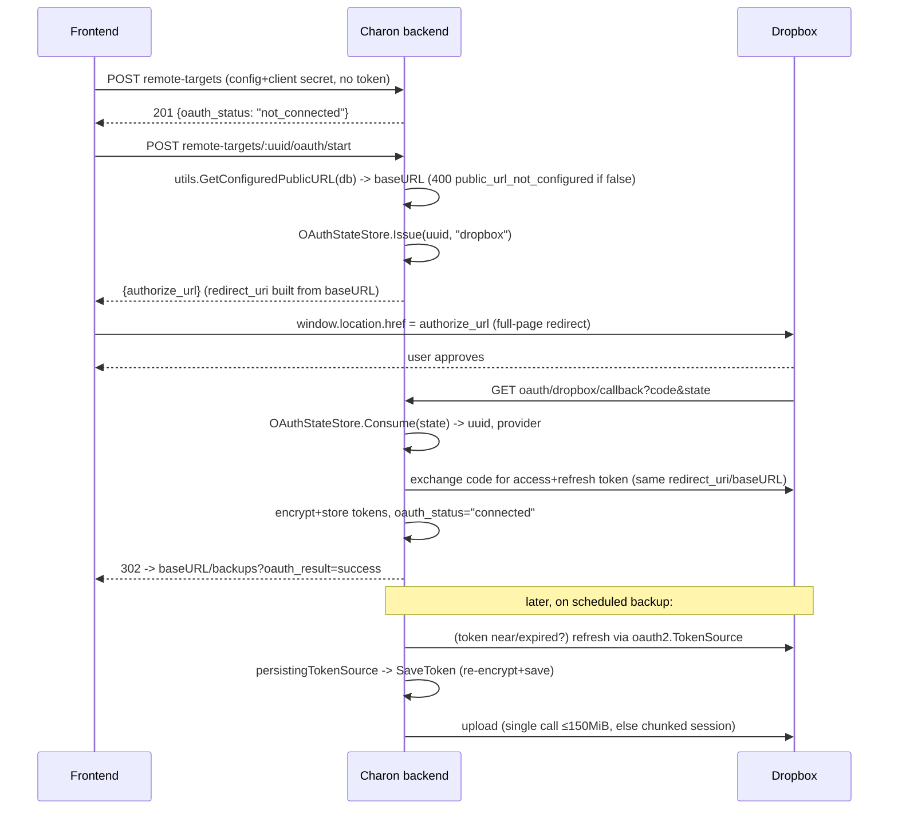
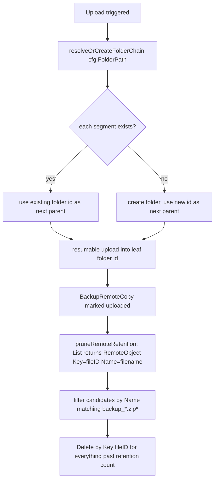

# Remote Backup Storage — WebDAV, Dropbox, Google Drive Providers (Issue #32 Phase 2)

**Author:** Planning Agent (Principal Architect)
**Date:** 2026-07-13
**Branch:** `feature/backuprestore`
**Type:** Extension of the just-shipped S3/SFTP remote-storage-target system — NOT a
greenfield design. Prior plan archived at
`docs/plans/archive/current_spec.backup-remote-s3-sftp_2026-07-13.md` (§ references
below to "the S3/SFTP plan" point there).

---

## Table of Contents

1. [Introduction](#1-introduction)
2. [Research Findings](#2-research-findings)
   - 2.1 [Existing architecture (verified in source)](#21-existing-architecture-verified-in-source)
   - 2.2 [The "DNS-provider precedent" — corrected](#22-the-dns-provider-precedent--corrected)
   - 2.3 [Existing "test connection" flow](#23-existing-test-connection-flow)
   - 2.4 [Public-URL gap for OAuth redirect_uri](#24-public-url-gap-for-oauth-redirect_uri)
   - 2.5 [External dependency research](#25-external-dependency-research)
3. [Technical Specifications](#3-technical-specifications)
   - 3.1 [EARS Requirements](#31-ears-requirements)
   - 3.2 [Config/Secrets Design & the Locator Abstraction](#32-configsecrets-design--the-locator-abstraction)
   - 3.3 [API Contracts](#33-api-contracts)
   - 3.4 [GORM Model Changes](#34-gorm-model-changes)
   - 3.5 [Backend Component Design](#35-backend-component-design)
   - 3.6 [Frontend Component Design](#36-frontend-component-design)
   - 3.7 [Data Flow](#37-data-flow)
   - 3.8 [Security Considerations](#38-security-considerations)
   - 3.9 [Error Handling & Edge Cases](#39-error-handling--edge-cases)
4. [Implementation Plan (Phases)](#4-implementation-plan-phases)
5. [Acceptance Criteria](#5-acceptance-criteria)
6. [Commit Slicing Strategy](#6-commit-slicing-strategy)
7. [Ignore-File & Repo Hygiene Review](#7-ignore-file--repo-hygiene-review)
8. [Open Questions for the User](#8-open-questions-for-the-user)

---

## 1. Introduction

### 1.1 Overview

Charon just shipped `RemoteStorageTarget` with two provider types, `s3` and `sftp`
(`backend/internal/services/remotestorage/{s3,sftp}.go`). This plan adds three more
provider types to the same abstraction — **generic WebDAV**, **Dropbox**, and
**Google Drive** — as one feature in one PR (CLAUDE.md "One Feature = One PR"). All
three are additive: existing `s3`/`sftp` targets, config shapes, and API responses
are unaffected byte-for-byte.

WebDAV is a same-shape extension of the existing pattern (admin-entered
host/credentials, SSRF-checked, no new architecture). Dropbox and Google Drive
introduce something Charon has never had: an **OAuth2 authorization-code flow**, and
Google Drive additionally introduces a storage model with **no path concept**
(parent-file-ID trees instead), which the retention/pruning logic must generalize to
handle without regressing S3/SFTP/WebDAV.

### 1.2 Objectives

1. `remotestorage.Uploader` implementations for WebDAV (`webdav.go`), Dropbox
   (`dropbox.go`), and Google Drive (`googledrive.go`), matching the existing
   S3/SFTP style, error-handling, and SSRF conventions.
2. A shared OAuth2 token-lifecycle subsystem (authorize, callback, encrypted
   token storage, transparent refresh) used identically by Dropbox and Google
   Drive.
3. A generalized `RemoteObject` (`Key` vs. `Name`) so retention pruning works
   whether the provider addresses objects by path (S3/SFTP/WebDAV/Dropbox) or by
   opaque file ID (Google Drive).
4. Extend `RemoteTargetConfig`/`RemoteTargetSecrets` and the two switch statements
   (`validateRemoteTargetConfig`, `remotestorage.New`) without turning the config
   struct into an unbounded flat bag for every future provider.
5. Frontend: extend `RemoteTargetFormDialog` with three new type options, an
   OAuth "Connect" step for Dropbox/Google Drive, and a connection-status badge.
6. Zero regression to `s3`/`sftp` targets, zero change to their wire format.

### 1.3 Non-Goals

- No Dropbox Business / Team-space or Google Shared Drive support — personal/App
  Folder scope only (see §8 Open Questions).
- No support for WebDAV `Digest` auth (Basic auth + bearer token only) — matches
  what self-hosted WebDAV servers (Nextcloud, ownCloud, generic Apache/nginx
  `mod_dav`) commonly expose over Basic auth today.
- Charon does not ship a bundled Dropbox/Google OAuth "app" — each self-hosted
  instance's admin registers their own App/Project in the respective developer
  console and pastes the resulting Client ID/Secret into Charon (§2.4, §8). This
  is a deployment/setup **documentation** requirement, not code.
- No multi-instance/HA support for the OAuth CSRF state store (in-memory,
  single-process — matches Charon's existing single-binary architecture).

---

## 2. Research Findings

### 2.1 Existing architecture (verified in source)

**Model — `backend/internal/models/remote_storage_target.go`:** `Type string
gorm:"index;not null;size:10"` (⚠ **too narrow for `google_drive` — 12 chars — must
widen, §3.4**), `ConfigJSON`/`SecretsEncrypted` both `json:"-"`, `KeyVersion int`,
`LastTestAt`/`LastTestStatus`/`LastError`. `BeforeCreate` server-generates `UUID`.

**Model — `backend/internal/models/backup_remote_copy.go`:** `RemoteKey string` is a
**display label only** — retention pruning never reads it back as a delete key (see
below), so nothing here needs to change for opaque-ID providers.

**Service — `backend/internal/services/backup_remote_service.go`** (464 lines):

- `RemoteTargetConfig` (lines 24–39) and `RemoteTargetSecrets` (line 45) are flat
  structs; handlers decode/encode only the fields relevant to `Type`.
- `validateRemoteTargetConfig` (line ~313): `switch targetType { case "s3": ...;
  case "sftp": ...; default: error }`.
- `ErrEncryptionKeyMissing` sentinel (line ~72) with a comment citing the
  "DNS-provider precedent" — **see §2.2, this needs correcting**.
- `TriggerUpload` → `uploadToTarget` → computes `remoteKey :=
  joinRemotePrefix(config.PathPrefix, record.Filename)`, calls
  `uploader.Upload(ctx, localPath, remoteKey)`, then
  `pruneRemoteRetention(ctx, uploader, config.PathPrefix, retentionCount)`.
- `pruneRemoteRetention` (line ~380): calls `uploader.List(ctx, pathPrefix)`,
  filters candidates via `base := path.Base(obj.Key); strings.HasPrefix(base,
  "backup_") && strings.Contains(base, ".zip")`, sorts by `LastModified` desc,
  deletes everything past `retentionCount` via `uploader.Delete(ctx, obj.Key)`.
  **This is the exact spot that breaks for Google Drive** — `obj.Key` there would
  be a Drive file ID, not something `path.Base` + a `"backup_"` prefix check can
  filter on. Fixed by the `Key`/`Name` split in §3.2.
- **Existing SFTP precedent worth reusing exactly, not reinventing:** for
  `sftp`-type targets, `config.PathPrefix` (the outer struct's S3 field) is always
  empty — SFTP's own `SFTPConfig.Path` (parsed independently, inside
  `remotestorage.New`) supplies the directory, and the `remoteKey`/`prefix`
  arguments passed through the shared orchestration code are effectively just the
  bare filename. WebDAV, Dropbox, and Google Drive follow this same precedent:
  their folder scope lives in their own nested sub-config (§3.2), consumed
  entirely inside their own `Uploader` implementation — **no changes are needed to
  `uploadToTarget`/`pruneRemoteRetention`'s call signatures**, only to
  `RemoteObject` itself (§3.2).

**`backend/internal/services/remotestorage/`:**

- `remotestorage.go`: `Uploader` interface (`Upload`, `Delete`, `List`, `Test`),
  `RemoteObject{Key, Size, LastModified}`, `New(target, secrets map[string]string)`
  factory switching on `target.Type`.
- `ssrf.go`: `ValidateHostSSRF` (config-save-time) + `safeDialer`/`dialContext`
  (dial-time, defeats DNS-rebinding TOCTOU) — RFC1918 allowed, loopback/link-local
  /metadata/reserved blocked. Indirected through package-level vars
  (`ssrfValidateHost`, `ssrfValidateDialAddress`) purely for test substitution.
- `s3.go` (152 lines): `minio-go/v7`, SSRF-checked endpoint, SSRF-safe HTTP
  transport `DialContext`, `Test` = `BucketExists` + put/delete marker object.
- `sftp.go` (337 lines): `pkg/sftp` + `x/crypto/ssh`, two-phase host-key model
  (unauthenticated discovery dial that aborts before any credential is sent, then
  a verified dial pinned via `ssh.FixedHostKey`).

**Frontend:** `RemoteTargetFormDialog.tsx` (364 lines) — local `useState` per
field, a `type: 's3' | 'sftp'` radio switch, `buildConfig()`/`buildSecrets()`
functions that branch on `type`, secret inputs always blank-on-edit
("leave blank to keep current"). `RemoteTargetsCard.tsx` — list with a status
Badge (`ok|failed|never`) and a lightning-bolt "Test" button
(`useTestRemoteTarget` → `POST .../:uuid/test`). `frontend/src/api/backups.ts`
holds the `RemoteTarget*` types/functions (NOT `frontend/src/api/remoteServers.ts`,
which is an unrelated Docker-remote-host feature — confirmed by reading both
files; do not confuse the two).

### 2.2 The "DNS-provider precedent" — corrected

The task brief for this plan assumed the DNS-provider code establishes an
"OAuth-like credential-flow" pattern (callback routes, token refresh, state-param
CSRF) that Dropbox/Google Drive should follow for consistency. **This is not what
exists.** Reading `backend/internal/models/dns_provider.go`,
`dns_provider_credential.go`, and `backend/internal/services/dns_provider_service.go`
(711 lines) confirms DNS providers use **static API-token credentials** exactly like
S3/SFTP: a `CredentialsEncrypted` AES-256-GCM blob, no OAuth, no callback route, no
token refresh. A repo-wide grep for `oauth2|/callback|redirect_uri` across
`backend/internal` and `backend/cmd` returns **zero matches**, and `backend/go.mod`
has no `golang.org/x/oauth2` or any OAuth-shaped dependency.

**Conclusion:** the only real precedent is the encrypted-secrets-blob storage
pattern itself (`SecretsEncrypted` / `CredentialsEncrypted`, `crypto.EncryptionService`,
`ErrEncryptionKeyMissing` degrade-gracefully behavior) — which Dropbox/Google Drive
do reuse (§3.2). The OAuth authorization flow, callback routes, CSRF state
protection, and token-refresh subsystem have **no prior art in this codebase** and
are designed fresh in this plan (§3.5). This is flagged explicitly so the
implementing engineer doesn't go looking for an OAuth pattern to copy that isn't
there.

### 2.3 Existing "test connection" flow

`POST /api/v1/backups/remote-targets/:uuid/test` → `BackupRemoteService.Test` →
builds an `Uploader` from decrypted secrets → calls `uploader.Test(ctx)` → records
`LastTestAt`/`LastTestStatus`/`LastError` on the target row.
`respondRemoteTargetError` (handler, line ~228) maps sentinel errors to specific
HTTP status + `error_code` (today only `ErrEncryptionKeyMissing` → `503
encryption_key_missing`). There's also a stateless `TestDraft` endpoint
(SFTP-only today) for host-key discovery before a target has been saved. This
sentinel-error → `error_code` pattern is exactly what generalizes cleanly to "test
requires a completed OAuth flow, not just network reachability" (§3.5, §3.9) — no
new UI concept needed, just a new sentinel error consumed by the same generic
`toast.error(error.message)` path already in `RemoteTargetsCard.tsx`.

### 2.4 Public-URL source for OAuth redirect_uri — corrected (was: "no concept exists")

**Correction to an earlier draft of this plan:** Charon already has a configured
public-URL concept — it does not need to be invented. Verified in source:

- `backend/internal/models/setting.go` — generic `Setting{Key, Value, Type,
  Category}` key-value table (already `AutoMigrate`d, already used pervasively).
- `backend/internal/utils/url.go` — `GetConfiguredPublicURL(db *gorm.DB) (string,
  bool)` reads the `Setting` row keyed `"app.public_url"` and normalizes it via
  `normalizeConfiguredPublicURL`, which explicitly **rejects** userinfo, query,
  fragment, and any path beyond `/` and returns `scheme://host` only — exactly the
  shape an OAuth `redirect_uri` base needs, already built and already validated on
  write.
- `backend/internal/api/handlers/settings_handler.go` — `ValidatePublicURL` (format
  check) and `TestPublicURL` (SSRF-safe connectivity probe) handlers, wired at
  `backend/internal/api/routes/routes.go:400-401` as `POST
  /api/v1/settings/validate-url` and `POST /api/v1/settings/test-url`.
- `frontend/src/pages/SystemSettings.tsx` — existing admin UI to enter/validate
  this value.
- Already in production use for invite-email links —
  `backend/internal/api/handlers/user_handler.go:583,634,1013` all call
  `utils.GetConfiguredPublicURL(h.DB)`.
- Stored in the DB (`Setting` row), not an env var — **hot-reloadable, no process
  restart needed** to pick up a change, unlike `backend/internal/config/config.go`
  env vars.

**Resolution:** Dropbox/Google Drive's `oauth/start` handler calls the existing
`utils.GetConfiguredPublicURL(h.DB)` exactly like `user_handler.go` already does,
and returns `400 public_url_not_configured` when it returns `false` (§3.3, R10).
**No new env var, no new config field, no new admin-UI surface — this reuses an
existing, already-validated, already-SSRF-tested piece of infrastructure
end-to-end.** The `X-Charon-URL` header precedent from `orthrus_handler.go:161`
remains irrelevant for the reasons the earlier draft gave (request-supplied,
unauthenticated callback context) — it's simply moot now that a proper configured
value already exists.

### 2.5 External dependency research

**WebDAV client.** `golang.org/x/net/webdav` (already an indirect dep via
`golang.org/x/net`) is a **server**-side handler, not a client — not usable here.
Evaluated client candidates:

| Candidate | License | Notes |
|---|---|---|
| `github.com/studio-b12/gowebdav` | MIT | Long-running project (2014–present), minimal transitive deps (stdlib + already-present `x/net`), imperative API (`Mkdir`, `MkdirAll`, `Remove`, `ReadDir`, `Stat`, `Read`/`ReadStream`, `Write`/`WriteStream`) that maps almost 1:1 onto Charon's `Uploader` interface |
| `github.com/emersion/go-webdav` | MIT | Part of the well-regarded emersion mail/groupware suite (`go-imap`, `go-smtp`); more general (shared CalDAV/CardDAV abstractions Charon doesn't need), client surface less mature than its server side, more moving parts for the same four operations |
| Hand-rolled `net/http` PROPFIND/MKCOL/PUT/DELETE | — | Rejected: WebDAV's XML multistatus response parsing, `Depth` header semantics, and `423 Locked` handling are exactly the kind of "don't hand-roll a protocol a library already gets right" case CLAUDE.md's LEVERAGE principle calls out |

**Recommendation: `github.com/studio-b12/gowebdav`.** Its API surface is the
closest match to the four `Uploader` methods, keeping the adapter code (and the
audit surface of unused features) minimal. **Action item for the implementing
commit:** re-verify the pinned version's current maintenance status/license at
`go get` time — this recommendation is based on the library's design fit, not a
live star-count/commit-date check performed during planning.

**Dropbox API.** No Dropbox-maintained Go SDK exists;
`github.com/dropbox/dropbox-sdk-go-unofficial` is community-maintained, generates
the *entire* Dropbox API surface (Paper, Team, Sharing, Business — far beyond
upload/delete/list), and pulls a correspondingly large dependency tree for four
endpoints Charon needs. **Recommendation: hand-roll a thin REST client** over
`net/http` against `content.dropboxapi.com` (upload) and `api.dropboxapi.com`
(delete/list/account) — these are plain JSON/HTTP-header-encoded-argument calls,
not a protocol worth a library. Confirmed current (per training-data knowledge,
**re-verify at implementation time**) single-request upload limit:
**`/2/files/upload` caps at 150 MiB**; above that, use the chunked
**upload session** flow: `upload_session/start` → repeated
`upload_session/append_v2` → `upload_session/finish` (commit with
`mode: "overwrite"`, target path). Recommend an 8 MiB chunk size (safely under the
150 MiB per-call cap, small enough to keep memory bounded while streaming a large
archive).

**Google Drive API.** The official `google.golang.org/api/drive/v3` module is part
of the umbrella `google.golang.org/api` package — a single generated client
covering hundreds of Google APIs, far heavier than the four calls Charon needs
(`files.create`, `files.list`, `files.get`/delete, resumable upload).
**Recommendation: hand-roll a thin REST client** over `net/http` against
`www.googleapis.com/drive/v3/...`, using the **resumable upload** protocol
(`POST .../upload/drive/v3/files?uploadType=resumable` → session URI → `PUT` the
body) for all uploads regardless of size — Google explicitly supports and
recommends resumable upload for any file size, so there is no need for a
small-file/large-file branch (unlike Dropbox, where the API itself imposes a hard
per-call cap that forces branching).

**OAuth2 token lifecycle (shared by both).** **Recommendation: use the official
`golang.org/x/oauth2` module** (new direct dependency; the module itself has no
further heavy transitive deps) for both providers' authorize-URL construction,
code-for-token exchange, and — critically — transparent refresh via
`oauth2.Config.TokenSource`, which already implements "refresh if `Expiry` has
passed" correctly. This is the one piece of the OAuth flow that **is** worth
leveraging a library for (correct, security-sensitive expiry/refresh handling);
everything else (the REST upload/list/delete calls) is thin and provider-specific
enough that hand-rolling is the leaner choice. `oauth2.TokenSource` does not
persist refreshed tokens itself — Charon wraps it in a small
`persistingTokenSource` (§3.5) that re-encrypts and saves whenever the token
changes.

**Net new dependencies:** `golang.org/x/oauth2`, `github.com/studio-b12/gowebdav`.
No new dependency for Dropbox/Google Drive REST calls (plain `net/http`, already a
transitive/stdlib dependency).

---

## 3. Technical Specifications

### 3.1 EARS Requirements

| ID | Requirement (EARS) |
|---|---|
| R1 | WHEN an admin creates a `webdav` target, THE SYSTEM SHALL validate the supplied URL's host against the same SSRF policy as S3/SFTP (RFC1918 allowed; loopback/link-local/metadata/reserved blocked) at both config-save and dial time. |
| R2 | WHEN an admin creates a `dropbox` or `google_drive` target, THE SYSTEM SHALL persist the target in a "pending" (not-yet-connected) state accepting only non-secret config + OAuth client credentials, and SHALL NOT require an access/refresh token to exist at creation time. |
| R3 | WHEN an admin initiates OAuth for a `dropbox`/`google_drive` target, THE SYSTEM SHALL generate a single-use, time-bound (10 min) CSRF `state` token bound to that target's UUID, and SHALL reject any callback whose `state` does not match an unexpired, unconsumed value it issued. |
| R4 | WHEN the OAuth callback completes successfully, THE SYSTEM SHALL exchange the authorization code for an access + refresh token, encrypt and store both (plus expiry) in the target's existing `SecretsEncrypted` blob, set `oauth_status = "connected"`, and redirect the browser to a frontend URL that surfaces success without ever placing tokens in the URL or in frontend-visible state. |
| R5 | WHEN an access token is expired or near-expiry at the time of Test/Upload/List/Delete, THE SYSTEM SHALL transparently refresh it using the stored refresh token before the operation proceeds, and SHALL persist the refreshed token back to encrypted storage. |
| R6 | IF a refresh attempt fails because the refresh token itself was revoked (provider returns `invalid_grant`), THEN THE SYSTEM SHALL set `oauth_status = "revoked"` and SHALL surface a distinct, actionable error (not a generic connectivity failure) instructing the admin to reconnect. |
| R7 | WHEN retention pruning runs against a Google Drive target, THE SYSTEM SHALL filter delete-candidates by the human-readable `Name` field (never the opaque `Key`/file-ID), across **every page** of a paginated `List` result (R12), so the existing `backup_*.zip*` filename convention keeps working identically to S3/SFTP/WebDAV/Dropbox regardless of how many backups exist in the target folder. |
| R8 | WHEN a Google Drive target's configured folder path does not yet exist, THE SYSTEM SHALL create the full parent-folder chain on first upload, and SHALL treat a not-yet-existing folder as an empty listing (not an error) for `List`/retention purposes — mirroring the existing SFTP `os.IsNotExist` → empty-list behavior. |
| R9 | IF `CHARON_ENCRYPTION_KEY` is absent, THEN remote-target credential storage SHALL remain unavailable for all five provider types identically (existing `ErrEncryptionKeyMissing` behavior, unchanged). |
| R10 | IF `utils.GetConfiguredPublicURL(db)` (existing `Setting` key `app.public_url`, §2.4) returns `false`, THEN THE SYSTEM SHALL refuse to start a Dropbox/Google Drive OAuth flow with a `400 public_url_not_configured` error rather than construct a redirect_uri that cannot possibly match the provider's registered value. |
| R11 | WHEN a Dropbox upload exceeds 150 MiB, THE SYSTEM SHALL use the chunked upload-session flow instead of the single-request endpoint. |
| R12 | WHEN a Dropbox or Google Drive `List` call's response indicates more results exist (Dropbox `has_more`/`cursor`; Drive `nextPageToken`), THE SYSTEM SHALL follow the cursor/page-token chain and accumulate entries across **all** pages before returning, so retention pruning never silently misses objects once a target folder exceeds one page — this MUST be implemented in the initial release, not deferred as a documented limitation, because an invisible retention candidate is a silent correctness failure rather than a visible error. |

### 3.2 Config/Secrets Design & the Locator Abstraction

**Decision on `RemoteTargetConfig` growth (cross-cutting question 2).** The
existing flat S3/SFTP fields (`Endpoint`, `Region`, `Bucket`, `Host`, `Port`, ...)
are **left exactly as-is** — no wire-format change, no migration, zero risk to
already-configured production targets. Every new provider gets its own **nested,
pointer-typed sub-config field**, so the struct grows by one field per provider
forever, instead of by every provider's individual settings forever:

```go
type RemoteTargetConfig struct {
	// --- existing s3/sftp flat fields, unchanged ---
	Endpoint, Region, Bucket, PathPrefix       string
	UseSSL, ForcePathStyle                     bool
	Host, Path, Username, HostKeyFingerprint   string
	Port                                       int

	// --- new: one nested pointer per new provider type ---
	WebDAV      *WebDAVConfig      `json:"webdav,omitempty"`
	Dropbox     *DropboxConfig     `json:"dropbox,omitempty"`
	GoogleDrive *GoogleDriveConfig `json:"google_drive,omitempty"`
}

type WebDAVConfig struct {
	URL                string `json:"url"`
	Username           string `json:"username,omitempty"`
	BasePath           string `json:"base_path,omitempty"`
	InsecureSkipVerify bool   `json:"insecure_skip_verify,omitempty"`
}

type DropboxConfig struct {
	AppKey     string `json:"app_key"`               // Dropbox "App key" — not secret
	FolderPath string `json:"folder_path,omitempty"` // e.g. "/charon-backups"
}

type GoogleDriveConfig struct {
	ClientID   string `json:"client_id"`             // Google OAuth Client ID — not secret
	FolderPath string `json:"folder_path,omitempty"` // e.g. "Charon/Backups"; resolved/created as a parent-ID chain
}
```

`validateRemoteTargetConfig`/`remotestorage.New` read from `config.WebDAV` /
`.Dropbox` / `.GoogleDrive`, nil-checked with a "config required" error — see §3.5
for the exact switch diffs. A future 6th provider adds one more nested field and
one more struct; it never touches the existing four.

**`RemoteTargetSecrets` additions** (flat — justified because these five fields
are a fixed, provider-agnostic shape every OAuth2/bearer-auth provider needs, not
an unbounded per-provider set):

```go
type RemoteTargetSecrets struct {
	// --- existing s3/sftp fields, unchanged ---
	AccessKeyID, SecretAccessKey, Password, PrivateKeyPEM, Passphrase string

	// --- new ---
	BearerToken       string `json:"bearer_token,omitempty"`        // WebDAV bearer-auth alternative to Password
	OAuthClientSecret string `json:"oauth_client_secret,omitempty"` // Dropbox "App secret" / Google Client Secret
	OAuthAccessToken  string `json:"oauth_access_token,omitempty"`
	OAuthRefreshToken string `json:"oauth_refresh_token,omitempty"`
	OAuthExpiresAt    string `json:"oauth_expires_at,omitempty"`    // RFC3339; empty = not yet obtained
}
```

WebDAV reuses the existing `Password` field for Basic auth (no new field needed —
username is non-secret and lives in `WebDAVConfig.Username`, exactly mirroring how
SFTP's `Username` already lives in config, not secrets).

**The Locator abstraction (cross-cutting question 5's "generalized key/locator"
ask).** `RemoteObject` gains one field:

```go
type RemoteObject struct {
	// Key is the provider-native locator passed back into Delete: a path for
	// S3/SFTP/WebDAV/Dropbox, or an opaque file ID for Google Drive. Never
	// assume Key is human-readable or contains the filename.
	Key          string
	// Name is always the human-readable backup filename (e.g.
	// "backup_2026-07-13_03-00-00.zip"), independent of how Key addresses the
	// object. Retention-candidate filtering in pruneRemoteRetention MUST use
	// Name, never Key, so the "backup_*.zip*" convention works identically
	// across every provider including Google Drive's opaque IDs.
	Name         string
	Size         int64
	LastModified time.Time
}
```

Required one-line diff in `backup_remote_service.go`'s `pruneRemoteRetention`:
`base := path.Base(obj.Key)` → `base := obj.Name`. WebDAV/Dropbox's new `List`
implementations set `Name: path.Base(Key)`; Google Drive's `List` sets `Name` from
the Drive API's `files.name` field and `Key` from `files.id`. This is the
**entire** generalization needed — no interface method signatures change,
`Upload`/`Delete` still take/return a single opaque string exactly as today.

**Correctness-critical consequence — `s3.go`/`sftp.go` MUST be edited in the same
commit as this diff, not left "unchanged."** Verified in source:
`s3.go:128`/`sftp.go:245` construct `RemoteObject{Key, Size, LastModified}` today
with **no `Name` field at all**. The instant `pruneRemoteRetention` switches its
filter from `path.Base(obj.Key)` to `obj.Name`, every object returned by the
*existing, unmodified* `s3.go`/`sftp.go` `List()` methods would have `Name == ""`
— `strings.HasPrefix("", "backup_")` is always false, so **no retention candidate
would ever match again for any already-configured S3/SFTP target**, and old
backups would silently accumulate on every remote target in production forever
(pruning fails permanently open, not closed — no error, no log, nothing visible).
This is exactly the kind of regression the "no behavior change to s3/sftp" goal
exists to prevent, so `s3.go`'s and `sftp.go`'s `List()` methods **must** also add
`Name: path.Base(obj.Key)` / `Name: entry.Name()` respectively, landing in the
same commit as the `RemoteObject.Name` field itself (§6 Commit 2) — never split
across commits, since an intermediate commit boundary with the field added but
`s3.go`/`sftp.go` not yet updated would itself be a broken intermediate state.

### 3.3 API Contracts

All new routes live under the existing `management` group in `routes.go`
(`RequireManagementAccess` + `requireAdmin` inside handlers), same as S3/SFTP,
**except** the OAuth callback route (see below — it cannot require Charon auth,
since the browser arrives there directly from Dropbox/Google with no Charon
session).

**No new config.** `redirect_uri` for both OAuth providers is built from the
already-existing `utils.GetConfiguredPublicURL(db)` (`Setting` key
`app.public_url`, §2.4) — the same value the admin already sets in
`SystemSettings.tsx` for invite-email links. It must match a URI registered in the
provider's app console (§8) but requires zero new config surface: no new env var,
no new `Setting` key, no new admin-UI field.

**Auth policy summary (extends the S3/SFTP plan's table):**

| Route | Auth |
|---|---|
| `POST /api/v1/backups/remote-targets/:uuid/oauth/start` | admin |
| `GET /api/v1/backups/remote-targets/oauth/:provider/callback` | **none at the gin-middleware level** — protected instead by the single-use, time-bound `state` CSRF token (§3.5, §3.8); `:provider` is `dropbox` or `google_drive` |
| `POST /api/v1/backups/remote-targets/:uuid/oauth/disconnect` | admin |

Every other remote-target route (`GET/POST/PUT/DELETE .../remote-targets[/:uuid]`,
`.../test`, `.../test-draft`) is unchanged and now also accepts
`type: "webdav" \| "dropbox" \| "google_drive"`.

**Create/Update request — WebDAV example (no OAuth, single-call save, same
lifecycle as S3/SFTP today):**

```json
{
  "name": "Nextcloud",
  "type": "webdav",
  "enabled": true,
  "config": {
    "webdav": {
      "url": "https://nas.example.com/remote.php/dav/files/charon/",
      "username": "charon",
      "base_path": "/charon-backups",
      "insecure_skip_verify": false
    }
  },
  "secrets": { "password": "…" }
}
```

**Create request — Dropbox / Google Drive (two-step lifecycle, see §3.6 for why):**

Step 1 — `POST /api/v1/backups/remote-targets` (saves config + client
credentials, **no token yet**):

```json
{
  "name": "Dropbox",
  "type": "dropbox",
  "enabled": true,
  "config": { "dropbox": { "app_key": "abc123", "folder_path": "/charon-backups" } },
  "secrets": { "oauth_client_secret": "…" }
}
```

Response (`oauth_status: "not_connected"` — new field, all types):

```json
{
  "uuid": "…", "name": "Dropbox", "type": "dropbox", "enabled": true,
  "config": { "dropbox": { "app_key": "abc123", "folder_path": "/charon-backups" } },
  "secrets_set": true,
  "oauth_status": "not_connected", "oauth_connected_at": null,
  "last_test_at": null, "last_test_status": "never", "last_error": "",
  "created_at": "…", "updated_at": "…"
}
```

Step 2 — `POST /api/v1/backups/remote-targets/:uuid/oauth/start`:

```json
// 200 response
{ "authorize_url": "https://www.dropbox.com/oauth2/authorize?client_id=abc123&response_type=code&redirect_uri=…&state=…" }
// 400 if the "app.public_url" Setting is unset/unconfigured (utils.GetConfiguredPublicURL returns false):
{ "error": "...", "error_code": "public_url_not_configured" }
```

Frontend does a **full-page redirect** (`window.location.href = authorize_url`,
§3.6 rationale) to that URL. After user approval, the provider redirects the
browser to:

```
GET /api/v1/backups/remote-targets/oauth/dropbox/callback?code=…&state=…
```

which — after validating `state` and exchanging `code` for tokens — issues a
**302** to `${configuredPublicURL}/backups?oauth_result=success&provider=dropbox&target=<uuid>`
(`configuredPublicURL` = `utils.GetConfiguredPublicURL(db)`'s value — the same one
used to build the authorize URL in step 2, guaranteeing the two are byte-identical
as OAuth2 requires) (or `oauth_result=error&message=…` on failure; message is a
short, non-sensitive code, never a raw provider error body). Google Drive's step
2/callback are identical, mounted at `.../oauth/google_drive/callback`.

`POST .../:uuid/oauth/disconnect` clears the four OAuth secret fields, sets
`oauth_status = "not_connected"`, `oauth_connected_at = null`. Does not delete the
target itself (matches the existing "leave blank to keep current" secret-update
philosophy — disconnecting is a deliberate, separate action from deleting).

**Test response generalization:** `POST .../:uuid/test` on a `dropbox`/
`google_drive` target with `oauth_status != "connected"` returns:

```json
// 409
{ "error": "target has not completed OAuth authorization", "error_code": "oauth_not_connected" }
```

A target whose refresh token was revoked out-of-band (user revoked Charon's
access in their Dropbox/Google account settings) surfaces:

```json
// 409
{ "error": "OAuth authorization was revoked; reconnect this target", "error_code": "oauth_revoked" }
```

Both follow the exact `respondRemoteTargetError` sentinel-error pattern already
used for `ErrEncryptionKeyMissing` (§2.3) — no new response-shaping code, two new
`case` branches.

**Complexity:** Medium (WebDAV is a same-shape addition; the OAuth routes are the
genuinely new surface).

### 3.4 GORM Model Changes

`backend/internal/models/remote_storage_target.go`:

```go
// widened: "google_drive" is 12 chars, the existing size:10 truncates it on any
// backend enforcing the column-size hint (SQLite itself ignores VARCHAR(n), but
// the model must stop lying about the constraint for portability/correctness)
Type string `json:"type" gorm:"index;not null;size:20"` // s3|sftp|webdav|dropbox|google_drive

// new — additive, nullable/zero-value-safe columns
OAuthStatus      string     `json:"oauth_status,omitempty" gorm:"size:20"`   // ""|not_connected|connected|revoked — "" for non-OAuth types (s3/sftp/webdav)
OAuthConnectedAt *time.Time `json:"oauth_connected_at,omitempty"`
```

`&models.RemoteStorageTarget{}` is **already registered** in the `AutoMigrate` call
in `backend/internal/api/routes/routes.go` (line 137) — no change needed there;
GORM's `AutoMigrate` adds new columns to an existing table idempotently. This is a
plain additive migration: existing rows get `OAuthStatus = ""`,
`OAuthConnectedAt = NULL`, both harmless defaults for `s3`/`sftp`/`webdav` targets
that never touch these fields.

**Why not put OAuth expiry/status only inside `SecretsEncrypted`?** `oauth_status`
needs to be readable by `GET /remote-targets` (list view badge) without a
decrypt round-trip per row — mirrors the existing `LastTestStatus`/`LastTestAt`
plaintext-column pattern already on this exact model for the same reason (cheap
list-view status without touching secrets). The actual token
material/expiry-for-refresh-purposes stays inside `SecretsEncrypted` exactly like
every other credential (§3.2) — only the coarse status enum is promoted to a
plaintext column, matching precedent, not inventing a new one.

**No new tables.** The OAuth CSRF `state` store (§3.5) is deliberately **in-memory,
not persisted** — it's short-lived (10 min TTL), single-use, and Charon is a
single-process binary (no multi-replica deployment to coordinate across), so a DB
table would add persistence-layer overhead for zero durability benefit (a lost
in-flight OAuth handshake across a restart is a harmless "please click Connect
again," not a state-loss risk to anything durable, since the DB-side no target
data is written until the callback where completes the exchange).

### 3.5 Backend Component Design

**Package layout** (all new files in the existing `remotestorage` package, no new
package boundary needed beyond it):

```
backend/internal/services/remotestorage/
├── remotestorage.go       (extend: RemoteObject.Name, New() switch +3 cases)
├── ssrf.go                (unchanged; reused by webdav.go)
├── s3.go, sftp.go         (⚠ MODIFIED, not unchanged — their List() implementations
│                           must each start setting RemoteObject.Name: path.Base(Key)
│                           the moment RemoteObject gains that field, or every
│                           existing S3/SFTP target's retention pruning silently
│                           stops matching any candidate — see the correctness
│                           argument below and §6 Commit 2's file list)
├── webdav.go              (new)
├── dropbox.go             (new)
├── googledrive.go         (new)
└── oauthtoken.go          (new — shared token-lifecycle helper for dropbox.go/googledrive.go)
```

```
backend/internal/services/
├── backup_remote_service.go   (extend: pruneRemoteRetention uses obj.Name; +OAuth methods)
└── oauth_state_store.go        (new)
```

```
backend/internal/api/handlers/
└── backup_remote_handler.go    (extend: +OAuth start/callback/disconnect handlers, +2 error_code cases)
```

**`webdav.go`** — mirrors `sftp.go`'s shape: `newWebDAVUploader(cfg WebDAVConfig,
secrets WebDAVSecrets) (Uploader, error)` validates `cfg.URL`'s host via
`ssrfValidateHost` (same indirected var as `s3.go`/`sftp.go`, so the existing
test-substitution seam covers WebDAV for free), constructs a `gowebdav.Client`
whose underlying `http.Client.Transport` dials through `dialContext` (the same
SSRF-safe dial-time re-check `s3.go` already uses for its `http.Transport`).
`Upload` = `client.MkdirAll(dir) + client.WriteStream(path, file, mode)`. `Delete`
= `client.Remove(path)`. `List` = `client.ReadDir(basePath)` filtered to
non-directory entries, `Name`/`Key` both set to the entry's path (WebDAV has real
paths, so no Key/Name divergence here — same as S3/SFTP). `Test` = `MkdirAll` +
write/delete a `charon-connection-test` marker file, identical semantics to
`sftp.go`'s `Test`.

**`dropbox.go`** — `newDropboxUploader(cfg DropboxConfig, secrets
RemoteTargetSecrets, tokenSaver TokenSaver) (Uploader, error)`. No SSRF check
(fixed vendor hosts `content.dropboxapi.com`/`api.dropboxapi.com`, never
user-supplied — see §3.8 for the explicit "no user-supplied host sneaks in"
verification). Constructs an `*http.Client` from `oauthtoken.NewClient(ctx, cfg
oauth2.Config, tokenSet, tokenSaver)` (§ below). `Upload`: if local file size ≤
150 MiB, single `POST content.dropboxapi.com/2/files/upload` with the
`Dropbox-API-Arg` header carrying `{path, mode:"overwrite"}`; else chunked
upload-session flow (`start`/`append_v2`/`finish`, 8 MiB chunks, R11). `Delete`:
`POST api.dropboxapi.com/2/files/delete_v2 {"path": key}`. `List`: **paginated —
must be built as a cursor-follow loop, not a single call.** `list_folder` is
documented to page its results (a `has_more: true` + `cursor` in the response
means more entries exist); a single-call implementation would silently make
older-than-page-1 objects invisible to retention pruning the moment a Dropbox
folder holds enough backups to span a second page — a silent correctness failure
(R7), not a visible error, so it must be built now rather than deferred like the
chunked-upload-resume limitation (§3.9). `List` therefore issues
`POST .../2/files/list_folder {"path": cfg.FolderPath}`, then while the response's
`has_more` is `true`, repeats `POST .../2/files/list_folder/continue
{"cursor": cursor}` and accumulates entries across all pages before returning,
mapping each entry to `RemoteObject{Key: entry.path_lower, Name: entry.name, Size,
LastModified: entry.server_modified}` — folder-not-found (`path/not_found` API
error on the first call) is treated as an empty list, mirroring SFTP's
`os.IsNotExist` behavior (R8's sibling case for Dropbox). `Test`:
`POST .../2/users/get_current_account` (cheap, token-validating, no side effects,
single call — no pagination concern for this endpoint) — this is the "test
requires a valid token, not just reachability" generalization (cross-cutting Q3)
made concrete.

**`googledrive.go`** — `newGoogleDriveUploader(cfg GoogleDriveConfig, secrets
RemoteTargetSecrets, tokenSaver TokenSaver) (Uploader, error)`. No SSRF check
(fixed `www.googleapis.com`). **Folder resolution** (the "no path concept" gap,
R8): `resolveOrCreateFolderChain(ctx, client, cfg.FolderPath)` splits
`cfg.FolderPath` on `/`, and for each segment issues `GET
/drive/v3/files?q='{parentId}' in parents and name='{segment}' and
mimeType='application/vnd.google-apps.folder' and trashed=false` — if found, use
that ID as the next `parentId`; if not found, `POST /drive/v3/files
{name, mimeType: folder, parents:[parentId]}` and use the new ID. Root parent
starts at `"root"`. This chain is walked fresh on every `Upload`/`List` call (no
caching of resolved folder IDs across calls — infrequent daily-backup cadence
makes the extra round trips immaterial, and caching would reintroduce a staleness
bug if the user renames/deletes the folder out-of-band). `Upload`: resolve
parent chain, then resumable-upload protocol
(`POST .../upload/drive/v3/files?uploadType=resumable` with
`{name, parents:[parentId]}` metadata → `PUT` the file body to the returned
session URI). `Delete(key)`: `DELETE /drive/v3/files/{key}` (permanent delete, not
trash — matches the "actually free space" intent of retention pruning, same
argument as why S3/SFTP/WebDAV/Dropbox deletes are permanent). `List`: resolve
parent chain (if any segment is missing, per R8 return `nil, nil` — empty, not an
error), then **paginated — must be built as a page-token-follow loop, not a
single call.** `files.list` defaults to a page size on the order of 100–1000 and
returns a `nextPageToken` when more results exist; exactly like Dropbox above, a
single-call `List` would silently make objects beyond page 1 invisible to
retention pruning once a Drive folder holds enough backups, a silent correctness
failure (R7) rather than a visible error, so this is built now, not deferred.
`List` issues `GET /drive/v3/files?q='{leafId}' in parents and trashed=false&
pageSize=1000`, then while the response includes a non-empty `nextPageToken`,
repeats the same query with `&pageToken={token}` and accumulates `files` entries
across all pages before returning, mapping each to `RemoteObject{Key: file.id,
Name: file.name, Size: file.size, LastModified: parsed file.modifiedTime}` —
**this is the provider where `Key != Name` actually matters** (§3.2). `Test`:
resolve the folder chain (validates both a working token and folder access) +
`GET /drive/v3/about?fields=user` (cheap token-validating call, single page, no
pagination concern for this endpoint).

**`oauthtoken.go`** — shared by both OAuth providers:

```go
// TokenSaver persists a refreshed token back to the encrypted secrets blob.
// Implemented by BackupRemoteService so remotestorage stays GORM-free (mirrors
// why remotestorage is its own package at all — see remotestorage.go's package doc).
type TokenSaver interface {
	SaveToken(ctx context.Context, accessToken, refreshToken string, expiresAt time.Time) error
}

// NewClient wraps oauth2.Config.TokenSource in a persisting layer: every call
// to Token() that returns a *different* AccessToken than the one that came in
// (i.e. a refresh happened) triggers saver.SaveToken before the HTTP call
// proceeds. This is the standard idiom recommended for golang.org/x/oauth2
// consumers that need refreshed tokens to survive process restarts.
func NewClient(ctx context.Context, conf oauth2.Config, tok *oauth2.Token, saver TokenSaver) *http.Client
```

Sentinel errors (consumed by `respondRemoteTargetError`, §2.3/§3.3):

```go
var ErrOAuthNotConnected = errors.New("oauth authorization required before this target can be used")
var ErrOAuthRevoked      = errors.New("oauth refresh token was revoked")
```

`newDropboxUploader`/`newGoogleDriveUploader` return `ErrOAuthNotConnected` when
`secrets.OAuthAccessToken == ""`; a refresh call failing with the provider's
`invalid_grant` response is translated to `ErrOAuthRevoked` and the caller
(`BackupRemoteService`) sets `OAuthStatus = "revoked"` before propagating.

**`oauth_state_store.go`** (new, in `services`, not `remotestorage` — it's
gin/handler-adjacent orchestration, not an upload-protocol concern):

```go
type OAuthStateStore struct {
	mu     sync.Mutex
	states map[string]oauthStateEntry // state -> {targetUUID, provider, expiresAt}
}
func NewOAuthStateStore() *OAuthStateStore
func (s *OAuthStateStore) Issue(targetUUID, provider string) (state string)   // crypto/rand, 32 bytes, base64url
func (s *OAuthStateStore) Consume(state string) (targetUUID, provider string, ok bool) // one-time: deletes on read; false if missing/expired
```

10-minute TTL, lazy-expired on `Consume` plus an opportunistic sweep on `Issue`.
`BackupRemoteService` gains a `states *OAuthStateStore` field, constructed once in
`NewBackupRemoteService`.

**`validateRemoteTargetConfig` diff (concrete, cross-cutting Q4):**

```go
switch targetType {
case "s3": /* unchanged */
case "sftp": /* unchanged */
case "webdav":
	if config.WebDAV == nil || strings.TrimSpace(config.WebDAV.URL) == "" {
		return fmt.Errorf("webdav url is required")
	}
	host, err := hostOf(config.WebDAV.URL) // net/url.Parse + .Hostname()
	if err != nil { return fmt.Errorf("webdav: invalid url: %w", err) }
	if err := remotestorage.ValidateHostSSRF(host); err != nil {
		return fmt.Errorf("webdav url failed SSRF validation: %w", err)
	}
case "dropbox":
	if config.Dropbox == nil || strings.TrimSpace(config.Dropbox.AppKey) == "" {
		return fmt.Errorf("dropbox app_key is required")
	}
	// no SSRF check — fixed vendor hosts, see §3.8
case "google_drive":
	if config.GoogleDrive == nil || strings.TrimSpace(config.GoogleDrive.ClientID) == "" {
		return fmt.Errorf("google_drive client_id is required")
	}
	// no SSRF check — fixed vendor hosts, see §3.8
default:
	return fmt.Errorf("unknown remote storage target type %q", targetType)
}
```

**`remotestorage.New` diff (concrete, cross-cutting Q4):**

```go
switch target.Type {
case "s3": /* unchanged */
case "sftp": /* unchanged */
case "webdav":
	var cfg RemoteTargetConfigOuter // unmarshal target.ConfigJSON as today
	return newWebDAVUploader(*cfg.WebDAV, WebDAVSecrets{
		Username: cfg.WebDAV.Username,
		Password: secrets["password"],
		BearerToken: secrets["bearer_token"],
	})
case "dropbox":
	var cfg RemoteTargetConfigOuter
	return newDropboxUploader(*cfg.Dropbox, secretsFromMap(secrets), tokenSaver)
case "google_drive":
	var cfg RemoteTargetConfigOuter
	return newGoogleDriveUploader(*cfg.GoogleDrive, secretsFromMap(secrets), tokenSaver)
default:
	return nil, fmt.Errorf("remotestorage: unknown remote storage target type %q", target.Type)
}
```

`tokenSaver` requires plumbing a `TokenSaver` implementation into
`remotestorage.New`'s call sites — `New`'s signature gains a third parameter
(`tokenSaver remotestorage.TokenSaver`), and `BackupRemoteService.uploaderFor` (its
sole production caller) passes itself (implements `SaveToken` by re-encrypting
into that target's `SecretsEncrypted` and saving). Test fakes pass `nil`
(unused by `s3`/`sftp`/`webdav`, which ignore the parameter).

### 3.6 Frontend Component Design

**Why a two-step lifecycle for Dropbox/Google Drive (answers cross-cutting Q1):**
S3/SFTP/WebDAV save everything in one `Create` call because there's nothing that
requires leaving the app. OAuth fundamentally requires a navigation to the
provider's consent screen and back, so the target must exist (with a UUID) before
that round trip so the callback has something to attach tokens to.

**Redirect-based flow, not popup + `postMessage` (concrete recommendation, Q1):**
A full-page redirect is preferred over popup/`window.postMessage` here for three
concrete reasons: (1) **E2E-testability** — Playwright drives real navigations far
more reliably than asserting on popup-window lifecycle and cross-window
`postMessage`, and this codebase's DoD hard-requires Playwright coverage of every
new flow; (2) **no popup-blocker fragility** — some browser configurations/
extensions block `window.open` even from a direct click handler, especially for
cross-origin OAuth consent screens; (3) **forward-compatibility with COOP** — Charon
does not currently set `Cross-Origin-Opener-Policy` (verified: no COOP header in
`security_headers_service.go`), but if that ever changes for the admin UI, a
`same-origin` COOP severs `window.opener` on any cross-origin popup navigation,
silently breaking `postMessage`-based flows; a full-page redirect has no such
failure mode. In-progress form state (name, folder path — never secrets) is not
persisted across the redirect at all: the target is already saved server-side by
step 1, so there's nothing left to restore client-side after the round trip.

**`RemoteTargetFormDialog.tsx`:** `type` radio group extends to five options (`s3
| sftp | webdav | dropbox | google_drive`). WebDAV branch is structurally
identical to the SFTP branch (URL/username/base_path/insecure-checkbox inputs +
password field, blank-on-edit). Dropbox/Google Drive branch: App
Key/Client ID + App/Client Secret (password input) + Folder Path fields, and the
submit button reads **"Save & Connect"** instead of "Create" for these two types
— `onSuccess` of the create mutation immediately calls a new
`useStartRemoteTargetOAuth()` mutation for the just-created UUID, then does
`window.location.href = result.authorize_url` (no `onClose()` — the page is
navigating away regardless).

**`RemoteTargetsCard.tsx`:** on mount, reads `oauth_result`/`provider`/`target`
(success) or `oauth_result=error`/`message` from `window.location.search`; shows
the existing `toast.success`/`toast.error`, strips the query string via
`history.replaceState`, and invalidates `REMOTE_TARGETS_QUERY_KEY`. Each row gains
an OAuth status `Badge` (`not_connected|connected|revoked`, shown only when
`type` is `dropbox`/`google_drive`) reusing the existing `Badge` component and
`STATUS_VARIANT`-style mapping. A row with `oauth_status !== "connected"` shows a
**"Connect"**/**"Reconnect"** button (same `useStartRemoteTargetOAuth` mutation,
targeting the existing UUID) instead of/alongside the Test button.

**Generalizing "Test connection" for OAuth (cross-cutting Q3, concrete answer):**
no new frontend code is needed beyond the status badge above — clicking the
existing "Test" button on a not-yet-connected target hits the existing
`useTestRemoteTarget` mutation, gets the new `oauth_not_connected`/`oauth_revoked`
`error_code` from the backend, and surfaces it through the **already-existing**
generic `onError: (error) => toast.error(error.message)` path in both
`RemoteTargetsCard.tsx` and `RemoteTargetFormDialog.tsx`. The generalization lives
entirely server-side (sentinel error → `error_code`); the frontend's error
handling was already generic enough to need zero changes for this specific
concern.

**API layer (`frontend/src/api/backups.ts`):** extend `RemoteTargetConfig` with
optional `webdav?/dropbox?/google_drive?` nested objects (mirrors §3.2's backend
struct exactly — same nesting, same optionality); extend `RemoteTarget` with
`oauth_status: 'not_connected' | 'connected' | 'revoked' | ''` and
`oauth_connected_at: string | null`; new functions `startRemoteTargetOAuth(uuid)`,
`disconnectRemoteTargetOAuth(uuid)`.

**Hooks (`useRemoteTargets.ts`):** `useStartRemoteTargetOAuth()`,
`useDisconnectRemoteTargetOAuth()` — same `useMutation` + `invalidateQueries`
shape as every other mutation hook in this file.

**i18n:** new keys under `backups.remoteTargets.*` for the three new type labels,
WebDAV field labels, Dropbox/Google Drive field labels, `oauthStatus.*`
(`notConnected|connected|revoked`), `connect`/`reconnect`/`disconnect` button
labels, and OAuth result toast messages — added to all 5 locales
(`de,en,es,fr,zh`), matching the existing `translation.json` structure verified in
§2.1 (estimated ~35 new keys).

### 3.7 Data Flow

**WebDAV upload (no OAuth — same shape as S3/SFTP today):**

```mermaid
sequenceDiagram
    participant BS as BackupRemoteService
    participant U as webdav.Uploader
    participant W as WebDAV server

    BS->>U: Upload(ctx, localPath, remoteKey)
    U->>U: ssrfValidateHost(cfg.URL host) [already checked at save-time; re-checked at dial-time]
    U->>W: MkdirAll(basePath/dir) via gowebdav (dial through SSRF-safe transport)
    U->>W: WriteStream(basePath/remoteKey, file)
    W-->>U: 201/204
    U-->>BS: nil
```

**Dropbox OAuth connect + upload:**



**Google Drive folder resolution + retention (the Locator-abstraction payoff):**



### 3.8 Security Considerations

| Area | Measure |
|---|---|
| SSRF — WebDAV | User-supplied `url` host validated via the existing `ssrfValidateHost`/`dialContext` indirection (RFC1918 allowed, loopback/link-local/metadata/reserved blocked) at both config-save and dial time — identical policy to S3/SFTP, zero new SSRF logic invented |
| SSRF — Dropbox/Google Drive | **No SSRF check** — both target only fixed, hardcoded vendor API hostnames, never a user-supplied value. Explicitly verified no user-controlled host sneaks in anywhere in the OAuth path: the `redirect_uri` base comes from `utils.GetConfiguredPublicURL(db)` — the same admin-configured, already-`TestPublicURL`-validated value used today for invite-email links (§2.4) — set only by an admin via `SystemSettings.tsx`, not attacker- or lower-privileged-user-reachable, so it is out of scope for the SSRF policy that exists to protect against admin-entered-but-still-adversarial remote-target hosts. `TestPublicURL`'s own SSRF-safe connectivity probe (already shipped) is the relevant control on that value, not this feature's SSRF policy |
| OAuth CSRF | Every `oauth/start` issues a fresh, single-use, 10-minute-TTL `state` token bound to the specific target UUID + provider; the callback route rejects any `state` it did not issue or that was already consumed, closing the classic OAuth login-CSRF hole (an attacker tricking a victim into authorizing the *attacker's* Dropbox account into the victim's Charon instance) |
| Callback route auth | Deliberately outside `RequireManagementAccess` (the browser arrives with no Charon session) — its entire security rests on the unguessable, single-use `state` value; this is called out explicitly as the one route in this feature that is not JWT-gated, and is documented as such in code comments at the route registration site |
| Token storage | Access/refresh tokens live inside the existing AES-256-GCM `SecretsEncrypted` blob — same encryption, same key, same `ErrEncryptionKeyMissing` degrade-gracefully behavior as every other credential type (R9); never serialized into any API response (only the coarse `oauth_status` enum is) |
| Token refresh | `golang.org/x/oauth2`'s `TokenSource` (audited, standard-library-adjacent, not hand-rolled) handles expiry detection + refresh-request construction; Charon's only added logic is persisting the refreshed token, not the refresh protocol itself |
| Secrets never echoed | `oauth_client_secret`/`oauth_access_token`/`oauth_refresh_token` follow the exact same write-only convention as `access_key_id`/`private_key_pem` today — never appear in any GET/POST/PUT response body, only derived booleans/enums do |
| Secrets never logged | Same existing rule (S3/SFTP plan §3.9) extends unchanged: no credential/token value in any log field or wrapped error string |
| GORM security | New/changed model fields use parameterized GORM APIs only; `./scripts/scan-gorm-security.sh --check` must report zero CRITICAL/HIGH (DoD 1.5 — triggered, `backend/internal/models/**` changes) |
| Dropbox/Drive REST clients | Hand-rolled `net/http` clients (§2.5) must set request timeouts and reuse a bounded `http.Client` (no per-call client construction) — same hygiene as `s3.go`'s `http.Transport` |
| Audit | OAuth connect/disconnect/token-refresh-failure events logged through the existing `securityService`/request-logger pattern already used for target create/update/delete |

### 3.9 Error Handling & Edge Cases

| Scenario | Handling |
|---|---|
| `app.public_url` `Setting` unconfigured, admin clicks "Save & Connect" | `oauth/start` returns `400 public_url_not_configured`; frontend surfaces via existing toast path; target row still exists in `not_connected` state (not deleted) so the admin can retry immediately after setting `app.public_url` in `SystemSettings.tsx` — **no process restart needed**, since `GetConfiguredPublicURL` reads the `Setting` row fresh on every call |
| Callback arrives with unknown/expired/reused `state` | `400` "invalid or expired authorization state" — no target mutation occurs; user is instructed to retry the Connect flow from scratch |
| Callback arrives with a `state` valid but the provider returned an `error` param (user clicked Deny) | Redirect to `{configuredPublicURL}/backups?oauth_result=error&message=authorization_denied` — target remains `not_connected`, no partial-token state |
| Token refresh fails with `invalid_grant` (user revoked access in Dropbox/Google's own settings) | `oauth_status -> "revoked"`; next Test/Upload surfaces `oauth_revoked` `error_code`; scheduled-backup upload failure is recorded on the `BackupRemoteCopy` row exactly like any other upload failure (existing behavior, unchanged) — it never fails the backup itself |
| Dropbox upload session interrupted mid-chunk (network failure) | No resume-from-offset logic in v1 of this feature — the whole upload session is abandoned and the `BackupRemoteCopy` row is marked `failed`; the next scheduled run retries from scratch (documented limitation, §8) |
| Google Drive folder segment name collides with an existing **file** (not folder) of the same name | `resolveOrCreateFolderChain`'s lookup query filters `mimeType='application/vnd.google-apps.folder'`, so a same-named file is invisible to it and a new folder is created alongside — documented as an acceptable edge case (Drive permits duplicate names by design; the folder path here is Charon-managed and expected to be a dedicated, otherwise-empty tree) |
| Google Drive folder deleted out-of-band between uploads | Next `Upload`/`List` call re-resolves (and recreates, for `Upload`) the chain — no caching means no stale-ID failure mode (§3.5) |
| WebDAV server returns `423 Locked` on write | Surfaced as a plain upload failure (recorded on `BackupRemoteCopy`, not retried mid-run) — no special lock-wait/retry logic in v1 (documented limitation, §8) |
| Existing `s3`/`sftp` targets after this migration | Byte-identical behavior — `oauth_status` defaults to `""` and is simply never read/written for these two types; `Type` column widening from `size:10` to `size:20` is a no-op for values that already fit |

---

## 4. Implementation Plan (Phases)

**Phase 1 — Playwright Tests (spec behavior, `test.fixme`).** New specs for
WebDAV create/edit/test flows and Dropbox/Google Drive create→connect→callback→
status-badge flows (mocked OAuth redirect via route interception, since real
provider consent screens aren't reachable in CI). Extends
`tests/tasks/backups-remote-targets.spec.ts` conventions (mock fixtures, existing
`RemoteTargetResponse` interface extended with `oauth_status`/`oauth_connected_at`).

**Phase 2 — Backend Foundation (no behavior change).** `RemoteObject.Name` field +
`pruneRemoteRetention` one-line fix; `RemoteTargetConfig`/`Secrets` struct
extensions (§3.2); `RemoteStorageTarget` model column changes (§3.4); `oauthtoken.go`
scaffolding + `golang.org/x/oauth2`/`gowebdav` added to `go.mod`; `OAuthStateStore`.
WebDAV implemented first within this phase's *behavior* commit since it has no
OAuth dependency (simplest concrete provider, per the task's ordering guidance).

**Phase 3 — Backend Implementation (behavior).** `webdav.go`, `dropbox.go`,
`googledrive.go`; `validateRemoteTargetConfig`/`remotestorage.New` switch
extensions; OAuth start/callback/disconnect handlers + routes; `respondRemoteTargetError`
new cases; full unit test suite per provider (fakes for Dropbox/Drive REST calls,
a local WebDAV-compatible test server or `gowebdav` against `httptest.Server` for
WebDAV).

**Phase 4 — Frontend Implementation.** `RemoteTargetFormDialog.tsx` five-way type
switch + OAuth connect step; `RemoteTargetsCard.tsx` status badge + reconnect
button + OAuth-result query-param handling; API client + hooks extensions; i18n
×5.

**Phase 5 — Integration, Hardening, Documentation.** Flip Playwright specs live;
`docs/features/backup-restore.md` update (provider list); new
`docs/features/backup-remote-oauth-setup.md` (Dropbox App Console + Google Cloud
Console app-registration walkthrough — the deployment/setup doc the Non-Goals
section calls out as not-code); `ARCHITECTURE.md` dependency table + directory
tree update; ignore-file fixes (§7); full DoD sweep.

---

## 5. Acceptance Criteria

- [ ] `s3`/`sftp` targets: zero behavior change, zero wire-format change, existing
      tests green unmodified.
- [ ] **Regression guard for the `RemoteObject.Name` generalization:** a test
      exercises the *real* `s3.go`/`sftp.go` `List()` implementations (not a fake
      `Uploader`) end-to-end through `pruneRemoteRetention`, proving retention
      pruning still deletes candidates beyond the retention count for S3/SFTP
      after the `Name` field is introduced — this is the regression the `Name`
      generalization could silently cause if `s3.go`/`sftp.go` weren't updated to
      populate it (§3.5, §6 Commit 2).
- [ ] WebDAV target: create/edit/test/upload/delete/list round-trip against a real
      or `httptest`-backed WebDAV server, including SSRF rejection of a
      loopback/link-local/metadata URL at both save and dial time.
- [ ] Dropbox target: two-step create→connect lifecycle; CSRF `state` rejected if
      unknown/reused/expired; token refresh transparently occurs and persists on
      an expired-token Test/Upload; chunked upload path exercised by a synthetic
      file `> 150 MiB`; `oauth_not_connected`/`oauth_revoked` error codes surfaced
      correctly; **multi-page `list_folder`/`list_folder/continue` cursor-follow
      exercised by a fake backend returning `has_more: true` across ≥2 pages, with
      retention pruning correctly seeing objects from every page.**
- [ ] Google Drive target: folder-chain resolution creates missing segments;
      retention pruning correctly deletes by `Key` (file ID) while filtering
      candidates by `Name`; a not-yet-existing folder yields an empty `List`, not
      an error; `oauth_not_connected`/`oauth_revoked` error codes surfaced
      correctly; **multi-page `files.list`/`nextPageToken` follow exercised by a
      fake backend returning `nextPageToken` across ≥2 pages, with retention
      pruning correctly seeing objects from every page.**
- [ ] `GET /remote-targets` never includes any of `oauth_client_secret`,
      `oauth_access_token`, `oauth_refresh_token`, `bearer_token`, or WebDAV
      password in any response, for any of the 5 types.
- [ ] `app.public_url` `Setting` unconfigured → `oauth/start` returns `400
      public_url_not_configured`, no partial state persisted; configuring it (no
      restart) immediately unblocks a retry.
- [ ] All Playwright specs pass (`npx playwright test --project=firefox`).
- [ ] `scripts/go-test-coverage.sh` and `scripts/frontend-test-coverage.sh` ≥ 85%.
- [ ] `./scripts/scan-gorm-security.sh --check` zero CRITICAL/HIGH.
- [ ] `lefthook run pre-commit` clean (staticcheck, CodeQL Go/JS).
- [ ] `go build ./...` and `npm run build` clean; `npm run type-check` clean.
- [ ] i18n keys present in all 5 locales.
- [ ] `docs/features/backup-restore.md`, `ARCHITECTURE.md`, and the new OAuth
      setup doc updated.

---

## 6. Commit Slicing Strategy

**Decision: ONE feature = ONE PR** (stays on `feature/backuprestore`), merged only
when complete. No worktrees (CLAUDE.md); all work on the current branch. Six
ordered commits — one more than the S3/SFTP plan's five, because the shared
OAuth-token-refresh subsystem needs to land as its own foundation commit before
either OAuth provider is built on top of it (per the task's explicit guidance),
and WebDAV (no OAuth) is sliced in right after general foundation as the simplest
concrete provider.

### Commit 1 — `test(e2e): add WebDAV/Dropbox/Google Drive remote-target specs as fixmes`

- **Scope:** New/extended Playwright specs, all `test.fixme`, encoding the target
  behavior for all three providers including the OAuth redirect+callback UX
  (mocked via route interception).
- **Files:** `tests/tasks/backups-remote-targets.spec.ts` (extended), new fixture
  helpers in `tests/utils/phase5-helpers.ts` for `oauth_status`/nested
  `webdav|dropbox|google_drive` config shapes.
- **Dependencies:** none.
- **Gate:** `npx playwright test --project=firefox` — existing S3/SFTP specs
  stay green; new specs skipped as fixme.

### Commit 2 — `refactor(backend): OAuth token subsystem + Locator abstraction + WebDAV foundation (no behavior change to s3/sftp)`

- **Scope:** Foundation/types/contracts. `RemoteObject.Name` +
  `pruneRemoteRetention` fix **+ the matching `s3.go`/`sftp.go` `List()` updates
  that make that fix a no-op for those two providers (see the correctness
  argument in §3.2 — these two files are explicitly IN SCOPE for this commit,
  not "unchanged"; omitting them silently breaks retention pruning for every
  existing production S3/SFTP target)**; `RemoteTargetConfig`/`Secrets` struct
  extensions (§3.2, nested pointers + flat OAuth/bearer fields);
  `RemoteStorageTarget` model column changes (§3.4, `Type` widened to `size:20`,
  `+OAuthStatus`, `+OAuthConnectedAt`); `oauthtoken.go` (`TokenSaver` interface,
  `persistingTokenSource`, sentinel errors); `OAuthStateStore`; `webdav.go`
  fully implemented (no OAuth dependency — the "simplest concrete provider
  first" per task guidance); `go.mod`/`go.sum` gains `golang.org/x/oauth2` +
  `github.com/studio-b12/gowebdav`.
- **Files:** `backend/internal/services/remotestorage/{remotestorage,webdav,oauthtoken}.go`
  (new/extended), **`backend/internal/services/remotestorage/{s3,sftp}.go`
  (MODIFIED — add `Name: path.Base(obj.Key)` / `Name: entry.Name()` to each
  `List()` implementation; this is the commit's one behavior-preserving-but-
  load-bearing touch to files the earlier draft of this plan incorrectly left
  out of scope)**, `backend/internal/services/oauth_state_store.go` (new),
  `backend/internal/models/remote_storage_target.go`,
  `backend/internal/services/backup_remote_service.go` (struct extensions +
  the one-line `pruneRemoteRetention` fix only — no new OAuth methods yet),
  `backend/go.mod`/`go.sum`, unit tests for `RemoteObject`/pruning fix,
  `oauthtoken.go`, `OAuthStateStore`, and `webdav.go` (incl. a `httptest`-backed
  WebDAV round-trip and an SSRF-rejection test mirroring `s3.go`'s existing
  ones), **and a regression test that exercises the real `s3.go`/`sftp.go`
  `List()` implementations (against a fake S3-compatible/SFTP backend, not a
  fake `Uploader`) end-to-end through `pruneRemoteRetention`, asserting objects
  beyond the retention count are still deleted after this commit — this is the
  gate that catches the exact regression class described above if it recurs**.
- **Dependencies:** Commit 1 (fixtures).
- **Gate:** `go build ./... && go test ./...`; GORM scan clean; staticcheck
  clean; existing S3/SFTP tests green unmodified; **the new real-`List()`
  retention regression test passes.**

### Commit 3 — `feat(backend): Dropbox and Google Drive uploaders + OAuth routes`

- **Scope:** Behavior, built on Commit 2's subsystem. `dropbox.go`,
  `googledrive.go` (folder-chain resolution, resumable/chunked upload,
  Key≠Name `List`, **cursor/page-token-follow pagination loop for both — R12,
  built now, not deferred**); `validateRemoteTargetConfig`/`remotestorage.New`
  +3 case branches (webdav wired here too if not already exercised via routes
  in Commit 2 — route wiring is genuinely new even though the uploader
  existed); OAuth start/callback/disconnect handlers + routes (`oauth/start`
  calls the **existing** `utils.GetConfiguredPublicURL(h.DB)` — no new config
  field, §2.4); `respondRemoteTargetError` +2 cases.
- **Files:** `backend/internal/services/remotestorage/{dropbox,googledrive}.go`
  (new), `backend/internal/services/backup_remote_service.go` (OAuth
  start/callback/disconnect methods, `validateRemoteTargetConfig` cases),
  `backend/internal/api/handlers/backup_remote_handler.go` (OAuth handlers,
  error cases — including the `public_url_not_configured` 400 built on the
  existing `utils.GetConfiguredPublicURL`), `backend/internal/api/routes/routes.go`
  (new routes, callback route registered outside `management` group; **no
  `backend/internal/config/config.go` change — `app.public_url` is a `Setting`
  row, not an env var**), table-driven unit tests for every new path: CSRF
  state reject/accept/replay, token-refresh-persists-on-expiry,
  chunked-upload-path for a synthetic `>150MiB` file, **multi-page
  `list_folder`/`list_folder_continue` and `files.list`/`nextPageToken`
  cursor-follow tests (≥2 pages, asserting all entries are accumulated)**,
  folder-chain create-if-missing, retention pruning against Drive's opaque
  `Key`/`Name` split, `oauth/start` returning `public_url_not_configured` when
  no `app.public_url` `Setting` row exists, fake `Uploader`/fake HTTP
  round-trippers for Dropbox/Drive REST calls (no live network calls in unit
  tests).
- **Dependencies:** Commit 2.
- **Gate:** `go test ./...` incl. all new suites; `scripts/go-test-coverage.sh`
  ≥ 85%; GORM + CodeQL Go clean.

### Commit 4 — `feat(frontend): WebDAV/Dropbox/Google Drive remote-target UI`

- **Scope:** API client, hooks, form dialog five-way type switch, OAuth
  connect/reconnect UX, status badge, i18n ×5.
- **Files:** `frontend/src/api/backups.ts` (+ tests), `frontend/src/hooks/useRemoteTargets.ts`
  (+ tests), `frontend/src/components/backups/{RemoteTargetFormDialog,RemoteTargetsCard}.tsx`
  (+ Vitest/MSW tests), `frontend/src/locales/{de,en,es,fr,zh}/translation.json`.
- **Dependencies:** Commit 3 (real API shapes).
- **Gate:** `npm run type-check`, `npm run build`,
  `scripts/frontend-test-coverage.sh` ≥ 85%; CodeQL JS clean.

### Commit 5 — `feat: enable WebDAV/Dropbox/Google Drive E2E + hardening pass`

- **Scope:** Flip Commit 1's `test.fixme` → live; fix whatever E2E surfaces;
  security review pass over the OAuth callback route specifically (state
  replay, error-path information leakage).
- **Files:** `tests/tasks/backups-remote-targets.spec.ts`, any hardening diffs
  surfaced by E2E across the files touched in Commits 2–4.
- **Dependencies:** Commits 1–4.
- **Gate:** `npx playwright test --project=firefox` fully green (no fixme
  remaining for this feature).

### Commit 6 — `docs: WebDAV/Dropbox/Google Drive remote storage documentation`

- **Scope:** Docs + repo hygiene.
- **Files:** `docs/features/backup-restore.md` (provider list correction), new
  `docs/features/backup-remote-oauth-setup.md` (Dropbox App Console + Google
  Cloud Console registration walkthrough, explaining that the redirect URI
  registered there must match the `app.public_url` `Setting` already
  configurable in `SystemSettings.tsx`),
  `ARCHITECTURE.md` (dependency table, directory tree, subsystem description),
  `docs/features.md`, `.gitignore`/`.dockerignore`/`.codecov.yml`/`Dockerfile`
  per §7.
- **Dependencies:** Commits 1–5.
- **Gate:** Full DoD (§5), every checkbox.

### Rollback & Contingency (PR-level)

- Each commit is revertible in reverse order; Commit 2 keeps `s3`/`sftp`
  byte-compatible, so reverting 3–6 restores exactly the just-shipped S3/SFTP
  system with unused foundation types sitting idle (harmless).
- If Dropbox/Google Drive OAuth review surfaces a blocking security concern late,
  Commit 2's WebDAV support is independently shippable — the commit boundary is
  drawn so WebDAV never depends on the OAuth commits, only the reverse holds.
- If either vendor's API behaves unexpectedly against a real account during
  Commit 3 (rate limits, undocumented response shapes), the fix is isolated to
  `dropbox.go`/`googledrive.go` — the shared `oauthtoken.go` subsystem and the
  `Uploader` interface itself are not expected to need changes.
- Emergency: the PR merges only complete; there is no partial-merge state to
  roll back in production.

---

## 7. Ignore-File & Repo Hygiene Review

| File | Finding | Action (Commit 6) |
|---|---|---|
| `.gitignore` | No entry needed — no new local-only data directories are introduced (OAuth state is in-memory, not on disk) | No change |
| `.dockerignore` | No entry needed for the same reason; new Go/TS source files are ordinary build inputs | No change |
| `codecov.yml` (repo root — note: no leading dot, confirmed by directory listing; CLAUDE.md's DoD refers to it as `.codecov.yml` but the actual file is `codecov.yml`) | No `ignore:` glob excludes `backend/internal/services/remotestorage/**` or `backend/internal/services/oauth_state_store.go` today — new files land inside tracked coverage automatically. The existing precedent of excluding `backend/pkg/dnsprovider/builtin/**` ("tested via integration tests, not unit tests") does **not** apply here: unlike DNS provider plugins, the new `webdav.go`/`dropbox.go`/`googledrive.go` are exercised by real unit tests against `httptest.Server`/fake HTTP round-trippers (§6 Commit 2/3), so no new ignore entry is needed or appropriate | No change |
| `Dockerfile` | New Go deps (`golang.org/x/oauth2`, `github.com/studio-b12/gowebdav`) are pure Go, no CGO/system packages — same conclusion the S3/SFTP plan reached for `age`/`minio-go`/`pkg/sftp` | No change expected; verify `make trivy` still passes |
| `docs/plans/current_spec.md` | Previous (S3/SFTP) plan archived | Done: `docs/plans/archive/current_spec.backup-remote-s3-sftp_2026-07-13.md` |

---

## 8. Open Questions for the User

1. ~~**Dropbox/Google Drive scope**~~ — **resolved, no longer an open
   question.** User confirmed personal-account App Folder / My Drive scope
   only for v1 (no Dropbox Business/Team-space, no Google Shared Drives) —
   the plan's "self-hosted homelab" assumption stands as designed. No spec
   changes required; Commit 3 proceeds on this basis.
2. **Chunked-upload resume:** should an interrupted Dropbox upload-session or
   Google Drive resumable-upload be resumed from its last acknowledged byte
   offset (both APIs support this) rather than restarted from scratch on the
   next scheduled run? Flagged as a documented v1 limitation (§3.9) rather than
   built now — confirm this is acceptable for the initial release or should be
   pulled into scope.
3. ~~`CHARON_PUBLIC_URL` UX~~ — **resolved, no longer an open question.** An
   earlier draft of this plan incorrectly assumed no public-URL config existed
   and proposed a new restart-requiring env var. §2.4 corrects this: Charon
   already has `utils.GetConfiguredPublicURL(db)` backed by a `Setting` row
   (`app.public_url`), which is hot-reloadable (no restart) and already
   surfaced in `SystemSettings.tsx`. This plan reuses it as-is; nothing further
   to confirm here.
4. ~~**WebDAV auth breadth**~~ — **resolved, no longer an open question.**
   User confirmed Basic auth + bearer token is sufficient coverage for v1 (no
   Digest auth), matching the plan's assumption that target self-hosted WebDAV
   servers (Nextcloud/ownCloud/generic Apache `mod_dav`) predominantly support
   Basic over HTTPS. No spec changes required; Non-Goals (§1.3) stands as
   designed.

**Remaining open question for implementation:** #2 (chunked-upload resume) is
still open — not yet confirmed by the user. Proceeding with the documented v1
limitation (no resume, restart-from-scratch on next scheduled run, §3.9) as
the default unless the user says otherwise; this is a non-blocking, additive
enhancement that can be pulled into a future iteration without touching the
shipped interface.
