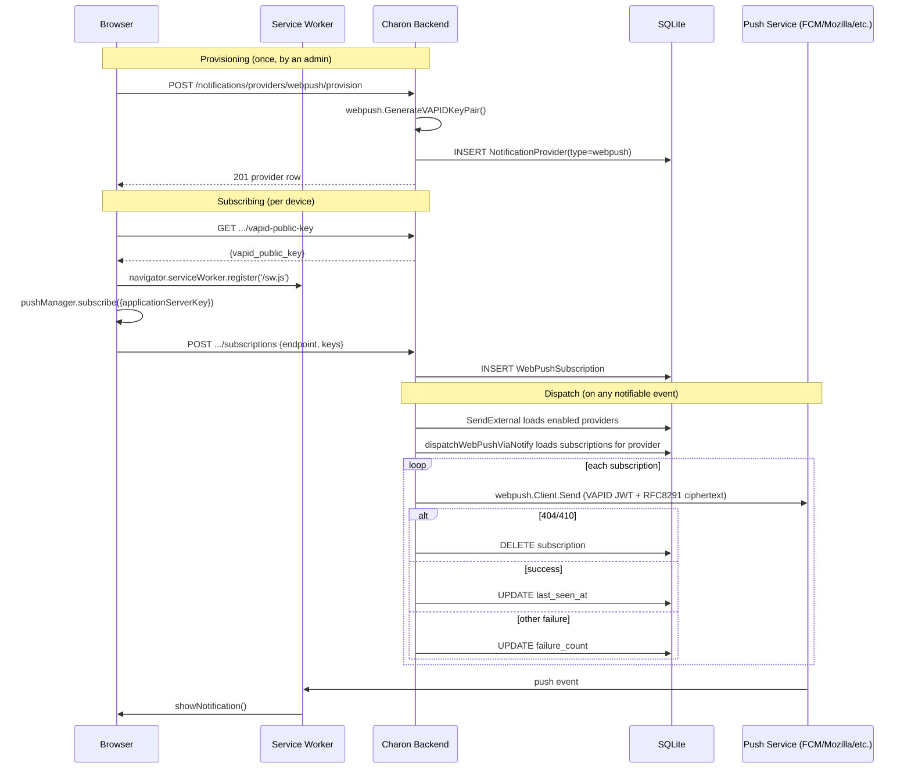

# Technical Spec — Web Push Notification Provider (go_notify_yourself v0.3.0)

**Status:** Draft for review
**Scope model:** ONE feature = ONE PR, delivered as an ordered sequence of logical commits (see [§9 Commit Slicing Strategy](#9-commit-slicing-strategy)). No PR splitting.
**Branch:** `development` (per `CLAUDE.md`: no worktrees, work on the current working branch).

---

## 1. Introduction

### 1.1 Overview

`go_notify_yourself` v0.3.0 (released, local clone verified at tag `v0.3.0`,
commit `9411a45`) adds a `providers/webpush` package implementing direct
browser Web Push (RFC 8030 transport, RFC 8291 payload encryption, RFC 8292
VAPID JWT auth) — no third-party relay. Charon currently pins v0.2.2.

This feature adds Web Push as a ninth notification provider type so a
Charon admin can receive host-down/cert-expiry/security-event alerts as
native OS/browser push notifications, without installing a
Telegram/Discord/Pushover account. It requires:

1. Bumping `go.mod` to `go_notify_yourself v0.3.0`.
2. A data model resolving Web Push's one-VAPID-identity-to-N-subscriptions
   shape against Charon's existing one-row-per-destination
   `NotificationProvider` table.
3. New backend endpoints for VAPID public-key distribution and subscription
   lifecycle (register/unregister), wired through the existing
   authenticated `management` route group.
4. A frontend service worker + subscribe/unsubscribe UI in `Notifications.tsx`.
5. Allowlist wiring through every gate `notification_service.go` already
   enforces per provider type (blank import, supported-type switch,
   dispatch-enabled feature flag, JSON-template support, config-field
   mapping).

### 1.2 Objectives / Goals

1. An admin can enable Web Push from the Notifications page, generating (or
   using an existing) app-wide VAPID identity with zero manual key entry.
2. An admin's browser can subscribe/unsubscribe independently per
   device/browser profile; multiple admins/devices can hold independent
   subscriptions simultaneously.
3. `SendExternal` fans a single logical notification out to every active
   subscription under the Web Push provider row, respecting the same
   per-event-type preference toggles (`NotifyProxyHosts`, `NotifyCerts`,
   etc.) every other provider type already has.
4. A subscription the push service reports as dead (404/410) is pruned
   automatically on next send, without operator intervention.
5. No behavior change to any of the other 8 provider types.
6. Full Definition of Done passes: 85% coverage, staticcheck clean, E2E
   specs for the new flow, type-check clean, GORM security scan clean
   (new model + migration).

### 1.3 Non-Goals

- No push-notification support for anonymous/unauthenticated visitors —
  subscriptions are created by an authenticated Charon user's browser only
  (see §3.6 auth model).
- No mobile app / native push (APNs/FCM SDK) — this is purely W3C Push API
  in a browser context, which is what `providers/webpush` implements.
- No UI for editing an individual subscription's delivery hints (TTL,
  Urgency, Topic) — Charon sets sane fixed defaults; only VAPID identity
  and per-event-type preferences are admin-configurable, consistent with
  how other providers expose no per-message delivery-hint UI either.
- No automated VAPID key rotation UI in this PR (see §7 Risks — flagged as
  a documented follow-up, not silently deferred).

---

## 2. Research Findings

### 2.1 `go_notify_yourself` v0.3.0 — `providers/webpush`

Verified directly against the local clone (`/projects/go_notify_yourself`,
tag `v0.3.0`):

- **`webpush.Config`** (`providers/webpush/webpush.go`) mixes two field
  groups in one struct, confirmed by the package doc comment:
  - VAPID **application identity** (shared across every subscriber):
    `VAPIDPublicKey`, `VAPIDPrivateKey`, `VAPIDSubject` (all
    base64url-no-padding strings; `VAPIDSubject` must be `mailto:` or
    `https:` prefixed).
  - One subscriber's **destination** (per browser/device):
    `Endpoint`, `P256dh`, `Auth` — the three fields of a browser
    `PushSubscription`.
  - Delivery hints: `TTL` (int, seconds; 0 → `DefaultTTL` = 4 weeks),
    `Urgency` (`"very-low"|"low"|"normal"|"high"`, optional), `Topic`
    (≤32 URL-safe base64 chars, optional).
  - Payload templating: `Template`/`CustomTemplate` — same
    minimal/detailed/custom convention as every other JSON-payload
    provider (`providers/internal/render`).
- **`webpush.Client`** (`New(cfg Config, w *transport.Wrapper) *Client`)
  implements `notify.Sender` (`Send(ctx, Message) error`) **unchanged** —
  confirmed via `var _ notify.Sender = (*Client)(nil)` in `webpush.go`. The
  package doc comment states the intended fan-out pattern explicitly: *"a
  host application fanning a Message out to many subscribers constructs one
  `*Client` per subscription (cheap: New does no I/O) and calls Send on
  each, exactly like fanning out to many Sender values of any other
  provider type."* This resolves the open design question from project
  memory — no new interface shape is needed.
- **`webpush.GenerateVAPIDKeyPair() (publicKey, privateKey string, err error)`**
  (`providers/webpush/vapid.go`) generates a P-256 keypair, base64url
  (no padding) encoded, matching `Config.VAPIDPublicKey`/`VAPIDPrivateKey`.
  Its doc comment is explicit: *"Intended to be called once at application
  setup time... every existing PushSubscription is bound to the exact
  public key it was created with... rotating this keypair invalidates every
  existing subscription."* — this is the authoritative confirmation that
  VAPID identity is app-wide and effectively-immutable-in-practice, driving
  the singleton design in §3.2.
- **Registration** (`providers/webpush/register.go`) follows the identical
  `init()` → `notify.Register("webpush", factory)` pattern as every other
  provider (compared directly against `providers/pushover/register.go`).
  Expected config keys, read from the factory: `transport` (required,
  `*transport.Wrapper`), `vapid_public_key`, `vapid_private_key`,
  `vapid_subject`, `endpoint`, `p256dh`, `auth` (all required strings),
  `ttl` (optional int), `urgency`, `topic`, `template`, `custom_template`
  (optional strings). Registered name is `"webpush"` (lowercase, no
  underscore) — `docs/INTEGRATION.md` §3.6 in the module repo calls this
  out explicitly as a naming convention every provider must follow.
- **Dead-subscription signal — important gap found in research, not in the
  task brief's assumptions:** `transport.Wrapper.Send`
  (`transport/wrapper.go` line ~223) returns errors for non-2xx responses
  as a **plain formatted string**:
  `fmt.Errorf("provider returned status %d: %s", resp.StatusCode, hint)` —
  there is **no typed/sentinel error** (no `StatusError` type, no
  `errors.Is`-compatible marker) anywhere in `transport/` or `webpush/`.
  Detecting a 404/410 "subscription gone" signal (the standard Web Push
  convention for "prune this subscription") therefore requires parsing the
  numeric status code out of that formatted string on the Charon side —
  this is called out explicitly as a design risk in §7 and a required
  implementation detail in §3.5, since it was not something the task brief
  could confirm without reading `transport/wrapper.go` directly.
- `docs/INTEGRATION.md` (module repo) §"webpush" gives a worked example:
  `sender := webpush.New(webpush.Config{...}, wrapper)`, looping
  `for host, sub := range subscribers`, logging (not swallowing) each
  `Send` error independently — confirming per-subscription error isolation
  is the intended fan-out contract, not "abort on first failure."

### 2.2 Charon's current notification-provider architecture

- **`models.NotificationProvider`** (`backend/internal/models/notification_provider.go`)
  is a flat GORM row = one destination. `Type` discriminates row meaning;
  `URL`/`Token` are repurposed per type (see mapping table below). Also
  carries `ServiceConfig string` — **a JSON-blob column already present on
  the model, tagged `// JSON blob for typed service config`, and currently
  unused by any provider type** (`grep` across `internal/` found zero other
  references). This is the designed escape hatch for a provider whose
  config doesn't fit the URL/Token shape — see §3.2 for why Web Push uses
  it instead of adding new columns.
- Per-type field mapping (`notify_provider_adapter.go`
  `providerConfigMap`, read directly from source, not inferred):

  | Type | `URL` column | `Token` column (never exposed, `json:"-"`) |
  |---|---|---|
  | discord | webhook URL | — |
  | slack | (unused placeholder) | webhook URL |
  | gotify | server URL | API token |
  | pushover | user key | API token |
  | ntfy | topic URL | auth token |
  | telegram | chat ID | bot token |
  | webhook/generic | target URL | — |

- **Dispatch fan-out today is one row = one `notify.Sender` = one goroutine**
  (`notification_service.go` `SendExternal`, confirmed at the `for _,
  provider := range providers { ... go s.dispatchViaNotify(...) }` loop —
  each provider row gets exactly one `buildNotifySender` call and one
  `Send`). Web Push breaks this 1:1 assumption; §3.5 defines the new
  fan-out shape.
- **Allowlist gates that must be extended for `webpush`** (all confirmed by
  direct read, not assumed from the task brief):
  - `notify_providers_import.go` — blank-import list; comment explicitly
    states it is kept in sync by hand with
    `isSupportedNotificationProviderType`, guarded by
    `notification_service_registry_consistency_test.go`
    (`TestSupportedProviderAllowlistIsSubsetOfRegisteredTypes`), which
    **must** gain `"webpush"` in its literal `supportedTypes` slice.
  - `notification_service.go`:
    - `isSupportedNotificationProviderType` (line ~136) — add `"webpush"`.
    - `isDispatchEnabled` (line ~145) — add a `"webpush"` case reading a
      new `FlagWebPushServiceEnabled` flag.
    - `supportsJSONTemplates` (line ~127) — **decision: add `"webpush"`**.
      Web Push payload is JSON (encrypted client-side by the module, but
      the plaintext the admin/Charon controls via `Template`/
      `CustomTemplate` is JSON, exactly like every other
      `supportsJSONTemplates` type) — confirmed by `webpush.Config`'s
      `Template string` field using the identical
      `providers/internal/render` convention.
    - `SendExternal` (line ~212) — the per-event-type `shouldSend` switch
      needs no changes (it already switches on `eventType`, not provider
      type); the dispatch loop needs a new branch for `webpush` (see §3.5)
      analogous to the existing `email` special-case branch
      (`dispatchEmailViaNotify`), since webpush also cannot go through the
      generic single-`Sender`-per-row `dispatchViaNotify` unmodified.
  - `notification_feature_flags.go` — add
    `FlagWebPushServiceEnabled = "feature.notifications.service.webpush.enabled"`.
  - `notify_provider_adapter.go` — `providerConfigMap`'s switch does **not**
    gain a `webpush` case (Web Push's per-subscription config is built
    per-subscription in the new dispatch path, not via the generic
    single-row `buildNotifySender` — see §3.5). `resolveTemplateFields` is
    reused unchanged (webpush respects the same
    minimal/detailed/custom + legacy-detailed-template translation as every
    other JSON provider).
  - `notify_client_adapter.go` — **no changes needed.** The shared
    `*transport.Wrapper` (`NewNotifyTransportWrapper`) is provider-agnostic;
    its `notifyURLValidator` wraps `security.ValidateExternalURL`, confirmed
    by reading `internal/security/url_validator.go` to have **no
    provider-specific host allowlist** — only scheme (`https` required
    outside dev), hostname format, and private-IP/localhost blocking. This
    matters because Web Push endpoints are on arbitrary, unpredictable push
    -service hosts (`fcm.googleapis.com`, `updates.push.services.mozilla.com`,
    `*.notify.windows.com`, etc., varying per browser vendor) — unlike
    Discord's fixed-host validation, no new host allowlist is needed or
    possible to maintain.
- **Auth model**: `backend/internal/api/routes/routes.go` line ~372-373:
  `management := protected.Group("/"); management.Use(middleware.RequireManagementAccess())`
  — every existing notification-provider route
  (`/notifications/providers*`) sits under this authenticated group. The
  new VAPID-public-key and subscription endpoints will sit under the same
  group (§3.6) — these are **not** anonymous/public endpoints; Web Push in
  Charon is "the logged-in admin's own browser opts in to receiving this
  instance's alerts," not a public subscription surface.
- **`c.Get("userID")`** is the established convention
  (`internal/api/middleware/auth.go`, confirmed via grep across
  `internal/api/middleware/*_test.go`) for retrieving the authenticated
  user inside a handler — used to scope a `WebPushSubscription` row to the
  user who created it (§3.2), enabling per-user unsubscribe-my-own-device
  semantics without a new authorization concept.
- **Migration registration**: `internal/api/routes/routes.go`
  `db.AutoMigrate(...)` (line ~112) lists every persistent model
  explicitly, most recently `models.BackupJob{}`. The new
  `models.WebPushSubscription{}` must be added here (models are listed in
  FK-dependency order — `WebPushSubscription` has an FK to
  `NotificationProvider`, so it can be added anywhere after that model,
  which is already present at line ~125).
- **Singleton-row precedent**: `models.SecurityConfig`
  (`internal/models/security_config.go`) is Charon's existing "one global
  config row" pattern — single table, one seeded row
  (`models.SeedDefaultSecurityConfig`, called unconditionally on every
  startup in `routes.go`), sensitive field excluded from JSON
  (`BreakGlassHash string json:"-"`). This is the direct precedent for how
  Web Push's VAPID private key should never leave the backend (§3.2) —
  reusing `NotificationProvider.Token`'s existing `json:"-"` contract
  rather than inventing a new pattern.
- **No existing PWA/service-worker infrastructure** in `frontend/`
  (confirmed: no `sw.js`, no `vite-plugin-pwa`, no `workbox` reference
  anywhere in `frontend/`). The service worker file and its registration
  are a greenfield addition (§3.7).
- **Frontend provider-type list**
  (`frontend/src/api/notifications.ts` line 3):
  `SUPPORTED_NOTIFICATION_PROVIDER_TYPES = ['discord', 'gotify', 'webhook',
  'email', 'telegram', 'slack', 'pushover', 'ntfy']` — needs `'webpush'`
  appended, plus a `SupportedNotificationProviderType` type-narrowing
  update, mirrored in `Notifications.tsx`'s `isSupportedProviderType`/
  `normalizeProviderType` helpers (both derive from the same const, so no
  separate list to maintain there).

---

## 3. Technical Specifications

### 3.1 The one-to-many resolution (central design decision)

**Decision: Option (a) from the task brief — a single `NotificationProvider`
row (`Type = "webpush"`) holds the VAPID application identity, and a new
child table `WebPushSubscription` holds each browser's destination,
FK'd to that provider row.**

Rejected alternative (Option b, "some other shape" — e.g. a fully separate
top-level model/dispatch path decoupled from `NotificationProvider`):
rejected because it would require duplicating every piece of
`NotificationProvider`-keyed machinery Web Push still legitimately needs —
`Enabled` toggle, the six `NotifyXxx` per-event-type preference booleans,
`Name`, the `SendExternal` dispatch-loop membership, the
`isDispatchEnabled`/feature-flag gate, and the provider list/delete UI
pattern. None of that is Web-Push-specific; only the "one row, N
destinations" shape is. Keeping Web Push as a `NotificationProvider` row
lets 90% of the existing dispatch/preferences/allowlist machinery apply
unchanged, isolating the actually-novel part (fan-out over subscriptions)
to one new function (§3.5).

**Singleton constraint**: exactly one `Type = "webpush"` row may exist at a
time. This mirrors `GenerateVAPIDKeyPair`'s own documented invariant (§2.1):
rotating the VAPID keypair invalidates every existing subscription, so
"multiple Web Push provider rows" would either mean multiple independent
VAPID identities (which the UI has no reason to expose — there is exactly
one Charon instance and one set of admin browsers) or be nonsensical
duplicate identities. No other provider type has this constraint today;
this is a deliberate, documented deviation from the generic
create-any-number-of-rows pattern, called out explicitly rather than
silently special-cased.

**Enforcement (revised per Supervisor review — DB-level, not service-layer
alone)**: an earlier version of this spec enforced the singleton purely as
a service-layer pre-check in `NotificationService.CreateProvider`
(`SELECT COUNT(*) FROM notification_providers WHERE type = 'webpush'`
before `INSERT`, rejecting with 409 if count > 0). **Supervisor traced this
and confirmed it is not atomic**: two concurrent provisioning requests can
each run the `COUNT` and both observe `0` before either commits its
`INSERT`, because SQLite's `sqlDB.SetMaxOpenConns(1)` in
`backend/internal/database/database.go:144` only serializes individual
statements through the single connection — it does not make the
`COUNT`-then-`INSERT` *sequence* atomic across two separate request
goroutines interleaving their statements on that one connection. The
result is two independent `webpush` provider rows with two independent
VAPID identities, silently breaking the invariant this whole section
argues for. This is the same class of check-then-act race already fixed
elsewhere in this codebase for `UptimeHost` creation (GitHub issue #1221,
see `ensureUptimeHost` in `backend/internal/services/uptime_service.go:408-416`),
which resolved it with a DB-level unique index plus `clause.OnConflict`.

The fix here (see §3.3.4 for the exact migration, §3.4.1 for the resulting
API error shape): a **DB-level partial unique index**,
`CREATE UNIQUE INDEX idx_webpush_singleton ON notification_providers(type)
WHERE type = 'webpush'` (SQLite supports partial indexes), makes the
second concurrent `INSERT` fail at the database regardless of what either
caller's `COUNT` observed — this is the actual enforcement mechanism, and
it is safe under concurrent writers by construction (unlike the
count-then-insert sequence). Unlike `ensureUptimeHost`'s
`OnConflict{DoNothing}`-then-refetch (appropriate there because a second
caller wanting "the host row" is happy to receive the winner's row), a
second `webpush` provisioning attempt is treated as a genuine conflict the
caller should see and react to (they may not realize a provider already
exists), so `CreateProvider` catches the resulting constraint-violation
error and maps it to `409`, using this codebase's existing
detection idiom (`errors.Is(err, gorm.ErrDuplicatedKey) ||
strings.Contains(err.Error(), "UNIQUE constraint failed")`, already used
in `backend/internal/api/handlers/custom_theme_handler.go:71,121` and
`backend/internal/services/crowdsec_whitelist_service.go:67`) rather than
introducing a new error-detection pattern. The service-layer `COUNT` check
is retained as a cheap, non-authoritative fast-path (returns a clear 409
without waiting on a constraint-violation round trip in the common,
uncontended case) — but the index is what actually guarantees the
invariant, and the 409-on-constraint-violation path is what makes that
guarantee visible to the loser of a race instead of surfacing as an
unhandled 500.

### 3.2 VAPID identity storage

- **`VAPIDPrivateKey` → `NotificationProvider.Token`** (existing column,
  already `json:"-"`, already the established "never expose this" contract
  used by gotify/pushover/ntfy/telegram tokens and Slack's webhook URL).
  No schema change.
- **`VAPIDPublicKey` and `VAPIDSubject` → `NotificationProvider.ServiceConfig`**
  (existing unused JSON-blob column), as:
  ```json
  {"vapid_public_key": "BN...", "vapid_subject": "mailto:admin@example.com"}
  ```
  Both values are safe to expose in the provider-list API response (the
  public key is, by construction, public; the subject is an
  operator-supplied contact URI already visible in the Web Push form) —
  unlike `Token`, `ServiceConfig` is not `json:"-"`, which is intentional:
  the frontend needs `vapid_public_key` to call
  `PushManager.subscribe({applicationServerKey: ...})` and it is served
  from the provider row the admin already fetches. (The dedicated
  `GET /notifications/providers/webpush/vapid-public-key` endpoint in §3.6
  exists for the *subscribing browser's* convenience/caching, not because
  the key is sensitive.)
- **Provisioning**: auto-generated on first use, no manual key entry.
  `POST /notifications/providers/webpush/provision` (§3.6) calls
  `webpush.GenerateVAPIDKeyPair()`, requires the admin to supply only
  `name` and `vapid_subject` (validated server-side: must start with
  `mailto:` or `https://`, per `webpush.Client.Send`'s own runtime check —
  duplicating that validation client- and server-side avoids a
  provision-succeeds-but-every-send-fails footgun), then creates the
  singleton `NotificationProvider` row. This is a **dedicated endpoint**,
  not the generic `POST /notifications/providers` create form — the
  generic form's `URL`/`Token` text inputs don't apply to Web Push (no
  webhook URL to paste), and key generation is a server-side action, not
  client-submitted config. `Notifications.tsx`'s existing per-type
  conditional-fields pattern (see `isGotify`/`isTelegram`/... constants at
  lines 147-152) already renders a different field set per `type`, so
  Web Push's "Provision" button replacing the URL/Token fields is
  consistent with that existing per-type branching, not a new UI paradigm.
  **Race-safety** (see §3.1 "Enforcement" and §3.3.4): the handler behind
  this endpoint calls `NotificationService.CreateProvider`, which after
  its cheap `COUNT`-based fast-path check still relies on the DB-level
  partial unique index as the actual source of truth. If the `INSERT`
  fails with a unique-constraint violation on `idx_webpush_singleton`
  (i.e., a concurrent request won the race), `CreateProvider` returns a
  sentinel error that the handler maps to the same `409` as the fast-path
  case (§3.4.1) — the caller cannot distinguish "lost a race" from
  "checked after someone else already provisioned," which is correct,
  since both are the same user-facing fact ("a Web Push provider already
  exists").

### 3.3 Database schema

#### 3.3.1 `NotificationProvider` (existing table — no column additions)

Reused as-is: `Type = "webpush"`, `Token` = VAPID private key,
`ServiceConfig` = `{"vapid_public_key","vapid_subject"}` JSON, `Name`,
`Enabled`, and the existing six `NotifyXxx` booleans all apply unchanged.
`URL` is left empty for this type (matching Slack's existing
"unused placeholder" pattern for a type whose real destination lives
elsewhere).

#### 3.3.2 New table: `WebPushSubscription`

New file `backend/internal/models/webpush_subscription.go`:

```go
package models

import (
	"time"

	"github.com/google/uuid"
	"gorm.io/gorm"
)

// WebPushSubscription is one browser/device's Web Push destination,
// created when an authenticated Charon user's browser completes
// PushManager.subscribe() and POSTs the resulting PushSubscription to the
// backend. Each row is fanned out to individually by
// NotificationService.dispatchWebPushViaNotify (one webpush.Client per
// row), all sharing the parent NotificationProvider's VAPID identity.
type WebPushSubscription struct {
	ID         string `gorm:"primaryKey" json:"id"`
	ProviderID string `gorm:"index;not null" json:"provider_id"` // FK -> NotificationProvider.ID (Type="webpush")
	UserID     string `gorm:"index;not null" json:"user_id"`     // FK -> User.ID; owner, for scoped unsubscribe

	// PushSubscription destination (from the browser's PushSubscription
	// object; see webpush.Config's matching field doc comments).
	Endpoint string `gorm:"uniqueIndex;type:text;not null" json:"endpoint"`
	P256dh   string `gorm:"type:text;not null" json:"-"` // subscriber DH public key; not attacker-sensitive but never needed client-side after registration
	Auth     string `gorm:"type:text;not null" json:"-"` // subscriber auth secret; same rationale

	// Display/diagnostic metadata, not used for dispatch.
	UserAgent string `json:"user_agent,omitempty" gorm:"type:text"`

	// Pruning bookkeeping (§3.5).
	LastSeenAt     time.Time  `json:"last_seen_at"`               // updated on successful send or (re)registration
	LastFailureAt  *time.Time `json:"last_failure_at,omitempty"`
	FailureCount   int        `json:"failure_count" gorm:"default:0"`

	CreatedAt time.Time `json:"created_at"`
	UpdatedAt time.Time `json:"updated_at"`
}

func (s *WebPushSubscription) BeforeCreate(tx *gorm.DB) (err error) {
	if s.ID == "" {
		s.ID = uuid.New().String()
	}
	return
}
```

Design notes:
- `Endpoint` is `uniqueIndex` — the same browser subscribing twice (e.g.
  re-subscribing after clearing site data produces the same or a new
  endpoint depending on browser; if identical, `POST .../subscribe` is
  idempotent via upsert-on-conflict, see §3.6) must not create duplicate
  rows that both receive the same push.
- `P256dh`/`Auth` are `json:"-"` — while not bearer-token-equivalent secrets
  the way `NotificationProvider.Token` is, they are per-subscriber
  encryption material with no legitimate reason to round-trip back to any
  frontend after registration (the frontend already has them locally from
  `PushManager.subscribe()`); withholding them is defense-in-depth
  consistent with the project's "never expose what the client doesn't need
  back" convention.
- `FailureCount`/`LastFailureAt` back a **soft-delete-after-N-failures**
  policy rather than instant deletion on the first non-410 failure (a
  transient 5xx from the push service should not nuke a subscription) —
  see §3.5 for the exact pruning rule.

#### 3.3.3 Migration registration

`backend/internal/api/routes/routes.go`, `db.AutoMigrate(...)` block
(§2.2): add `&models.WebPushSubscription{}` immediately after
`&models.NotificationProvider{}` (FK dependency ordering — GORM's
auto-migrate doesn't strictly require FK-target-first ordering for SQLite,
but the file's existing comments show this codebase's convention of
ordering by FK dependency, e.g. `ProxyGroup{}` before `ProxyHost{}`).

```go
&models.NotificationProvider{},
&models.WebPushSubscription{}, // Web Push subscriptions — FK to NotificationProvider (Type="webpush")
&models.NotificationTemplate{},
```

#### 3.3.4 Singleton enforcement: partial unique index (race-condition fix)

**Added per Supervisor review** — see §3.1 "Enforcement" for the full
rationale. GORM struct tags (`gorm:"uniqueIndex"`) cannot express a
*partial* (`WHERE`-qualified) index, so this cannot be expressed as a
`WebPushSubscription`/`NotificationProvider` struct tag; it is created via
a raw, idempotent `db.Exec` immediately after the `AutoMigrate(...)` call
in `backend/internal/api/routes/routes.go`, following the same
post-AutoMigrate idempotent-migration-step pattern already used there for
`migrateViewerToPassthrough` (`routes.go:64-69`, called at `routes.go:151`):

```go
// Enforce the Web Push provider singleton invariant at the database
// level — a service-layer COUNT-then-INSERT check alone is not atomic
// under concurrent requests (see docs/plans/current_spec.md §3.1).
// IF NOT EXISTS makes this idempotent across restarts, matching every
// other startup migration step in this function.
if err := db.Exec(`CREATE UNIQUE INDEX IF NOT EXISTS idx_webpush_singleton
    ON notification_providers(type) WHERE type = 'webpush'`).Error; err != nil {
    return uptimeShutdown, fmt.Errorf("create webpush singleton index: %w", err)
}
```

Placement: after the main `AutoMigrate(...)` block (the `notification_providers`
table must exist first) and before any code path that could call
`NotificationService.CreateProvider` — i.e., before `Register`/`RegisterWithDeps`
finishes wiring routes. Failure to create the index fails startup loudly
(matching the existing `auto migrate: %w` error-return convention
immediately above it in the same function) rather than silently running
without the safety guarantee.

**SQLite partial-index support**: confirmed available — SQLite has
supported partial indexes (the `WHERE` clause on `CREATE INDEX`) since
3.8.0 (2015); this codebase's SQLite driver/runtime is well past that
baseline (no version-gating needed).

**Test coverage for this commit** (see §9 Commit Slicing Strategy, commit 3):
a concurrency test that fires two goroutines both calling
`NotificationService.CreateProvider` with `Type: "webpush"` against the
same `*gorm.DB` and asserts exactly one succeeds and the other's `Insert`
returns a unique-constraint-violation error — this is the regression test
for the exact race Supervisor identified, and it must fail against the
pre-fix (service-layer-`COUNT`-only) code to prove it actually exercises
the race rather than passing vacuously.

#### 3.3.5 GORM Security Scan

Per CLAUDE.md §1.5, this change touches `internal/models/**` and adds a
migration — `./scripts/scan-gorm-security.sh --check` is a **mandatory**
gate before this PR merges (see §8).

### 3.4 API contracts

All routes below are mounted on the existing authenticated `management`
group (`routes.go` line ~372: `management.Use(middleware.RequireManagementAccess())`),
matching every existing `/notifications/*` route.

| Method | Path | Purpose | Auth |
|---|---|---|---|
| `POST` | `/notifications/providers/webpush/provision` | Generate VAPID keypair + create the singleton provider row | `RequireManagementAccess()`; provisioning is destructive-ish (any existing subscriptions become orphaned if re-run — see §7) so handler additionally checks `RequireRole(admin)`, mirroring `Test`/`Preview`'s existing admin-only pattern on this same route group |
| `GET` | `/notifications/providers/webpush/vapid-public-key` | Serve the current VAPID public key for `PushManager.subscribe` | `RequireManagementAccess()` (any authenticated user, not just admin — a non-admin user's browser can still subscribe to receive alerts, same as any authenticated user can view the Notifications page) |
| `POST` | `/notifications/providers/webpush/subscriptions` | Register (upsert) a browser's `PushSubscription` | `RequireManagementAccess()` |
| `GET` | `/notifications/providers/webpush/subscriptions` | List the **current user's own** subscriptions (for the "manage this device's subscription" UI state) | `RequireManagementAccess()` |
| `DELETE` | `/notifications/providers/webpush/subscriptions/:id` | Unsubscribe; 404 if the subscription isn't owned by the caller | `RequireManagementAccess()`; ownership checked in-handler (`subscription.UserID == c.GetString("userID")`), returning 404 (not 403) for a foreign ID to avoid confirming existence, consistent with this codebase's existing `respondSanitizedProviderError` pattern of not leaking cross-tenant existence |

#### 3.4.0 Authorization model — resolved (§7 risk 5 closed by user decision)

**Decision** (resolves the open question previously logged as §7 risk 5 —
this is now settled, not reopened): any authenticated user with management
access (`RequireManagementAccess()` — any role other than
`RolePassthrough`, so `RoleUser` included, not just `RoleAdmin`) may
self-service subscribe/list/unsubscribe their own Web Push destination, and
read the VAPID public key needed to do so. This is what the table above
already specifies for the four non-provision routes; provisioning itself
stays admin-only (`RequireRole(admin)`, row 1) since it creates the shared
singleton identity.

**The security-event forwarding carve-out.** The four security-event
`NotifyXxx` toggles on a provider row (`NotifySecurityWAFBlocks`,
`NotifySecurityACLDenies`, `NotifySecurityRateLimitHits`,
`NotifySecurityCrowdSecDecisions`) are what actually gate whether security
telemetry gets forwarded to a given destination (`notification_service.go`
lines 243-249, `enhanced_security_notification_service.go` lines 110-119).
The exfiltration scenario Supervisor flagged: a low-privileged (`RoleUser`)
account self-service-subscribes a device pointed at an endpoint it
controls, then flips those four toggles on to have Charon forward WAF
blocks / ACL denies / rate-limit hits / CrowdSec decisions to it.

**Finding**: this is already closed by existing code, with no new gate to
add. All four toggles are fields on `notificationProviderUpsertRequest`
(`backend/internal/api/handlers/notification_provider_handler.go:37-40`)
and are only ever set through the **generic**
`PUT /notifications/providers/:id` endpoint (`Update`,
`notification_provider_handler.go:216`) — there is no webpush-specific
"update my provider's toggles" route in this spec, and there never has
been one for any provider type. `Update` already calls `requireAdmin(c)`
unconditionally as its first line (`notification_provider_handler.go:217-219`,
same as `Create` at line 174), for **every** provider type, not just
webpush — this was confirmed by reading the handler, not assumed. So a
`RoleUser` caller can self-service-subscribe a device (via the five
webpush-specific routes above) but literally cannot reach a code path that
sets `NotifySecurityWAFBlocks` etc. on any provider, webpush included —
`Update` rejects them with `403` before the request body is even
inspected for which fields it's trying to change.

**Consequence for implementation scope**: per the task's
root-cause-analysis instruction to prefer the minimum change that closes
the flagged gap, **no code change is needed here** — this is a
documentation/spec-confirmation finding, not a new webpush-specific
carve-out on `Update`, and not a tightening of the existing (already
admin-gated) behavior for other provider types either. A `RoleUser`
self-service subscriber receives whatever event categories (proxy hosts,
remote servers, domains, certs, uptime, and — only if an admin already
turned them on — the four security categories) are already enabled on the
webpush provider row at the time they subscribe; they cannot themselves
enable any category, security or otherwise, since all toggle changes go
through the same admin-gated `Update` endpoint. This matches the
requested shape exactly: self-service opt-in preserved, security-telemetry
forwarding to arbitrary endpoints impossible for a non-admin.
**Phase 2/commit 6 should add a regression test** asserting a `RoleUser`
token gets `403` from `PUT /notifications/providers/:id` when the target
row is `Type = "webpush"` with a body that sets any `NotifySecurityXxx`
field to `true` — this pins the *current* behavior so a future refactor of
`Update`'s auth check cannot silently reopen the gap Supervisor identified,
even though today's code already prevents it.

#### 3.4.1 `POST /notifications/providers/webpush/provision`

Request:
```json
{ "name": "Browser Push", "vapid_subject": "mailto:admin@example.com" }
```
Response `201`:
```json
{
  "id": "uuid",
  "name": "Browser Push",
  "type": "webpush",
  "enabled": true,
  "service_config": "{\"vapid_public_key\":\"BN...\",\"vapid_subject\":\"mailto:admin@example.com\"}",
  "notify_proxy_hosts": true,
  "...": "...same NotificationProvider JSON shape as every other provider"
}
```
Errors: `400` invalid/missing `vapid_subject` scheme; `409` a `webpush`
provider row already exists (`{"error": "a Web Push provider is already configured"}`)
— returned both for the common case (service-layer `COUNT` fast-path finds
an existing row) and the race case (the `INSERT` loses to a concurrent
request at the `idx_webpush_singleton` partial unique index; see §3.1
"Enforcement" and §3.3.4). Both paths produce the identical response body
— the client has no way to tell them apart and does not need to.

#### 3.4.2 `GET /notifications/providers/webpush/vapid-public-key`

Response `200`: `{"vapid_public_key": "BN..."}`. `404` if no `webpush`
provider row exists yet (frontend shows a "not yet enabled" state, prompting
provisioning by an admin) or if `Enabled = false` (subscribing while
disabled would create dead-on-arrival subscriptions).

#### 3.4.3 `POST /notifications/providers/webpush/subscriptions`

Request (body is the browser's `PushSubscription.toJSON()` shape,
matching the W3C spec verbatim so the frontend can forward it with no
reshaping):
```json
{
  "endpoint": "https://fcm.googleapis.com/fcm/send/...",
  "keys": { "p256dh": "BN...", "auth": "xy..." },
  "user_agent": "Mozilla/5.0 ..."
}
```
Response `201` (new) or `200` (idempotent re-registration of an existing
`endpoint`, refreshing `LastSeenAt`/`UserAgent`/resetting `FailureCount`):
```json
{ "id": "uuid", "endpoint": "https://fcm.googleapis.com/fcm/send/..." }
```
Validation: `endpoint` required, must parse as an `https://` URL (reject
`http://` outright — Web Push endpoints are always HTTPS in production;
this is a basic format check, not a re-run of `security.ValidateExternalURL`,
since the actual SSRF-safe validation happens at send time via the shared
`transport.Wrapper`, §2.2); `keys.p256dh`/`keys.auth` required
non-empty strings. `404` if no `webpush` provider is provisioned.
`503` (`{"error": "Web Push provider is disabled"}`) if the singleton row's
`Enabled = false`.

#### 3.4.4 `GET /notifications/providers/webpush/subscriptions`

Response `200`: array of `{id, endpoint, user_agent, created_at, last_seen_at}`
for the caller's own `UserID` only (never another user's rows — reinforces
per-user device management without a cross-user admin view in this PR;
an admin wanting to see *all* subscribers' device counts is a documented
non-goal/follow-up, §7).

#### 3.4.5 `DELETE /notifications/providers/webpush/subscriptions/:id`

`204` on success. `404` if not found or not owned by the caller.

### 3.5 Dispatch fan-out design

New function in `notification_service.go`, invoked from `SendExternal`'s
existing per-provider dispatch loop as a new branch parallel to the
existing `email` special case:

```go
if strings.ToLower(strings.TrimSpace(provider.Type)) == "email" {
    go s.dispatchEmailViaNotify(ctx, provider, eventType, title, message)
    continue
}
if strings.ToLower(strings.TrimSpace(provider.Type)) == "webpush" {
    go s.dispatchWebPushViaNotify(ctx, provider, eventType, title, message, data)
    continue
}
```

`dispatchWebPushViaNotify` (new, `notify_webpush_adapter.go` — new file,
mirroring the existing per-concern-file split of
`notify_provider_adapter.go`/`notify_email_adapter.go`/`notify_client_adapter.go`):

1. Parse `provider.ServiceConfig` → `vapid_public_key`, `vapid_subject`;
   `provider.Token` → `vapid_private_key`. Malformed/missing → log and
   return (matches `dispatchViaNotify`'s existing "log and return" error
   style, no panics).
2. `s.DB.Where("provider_id = ?", provider.ID).Find(&subscriptions)`.
3. For each subscription, construct one `webpush.Client` via
   `webpush.New(webpush.Config{VAPIDPublicKey: ..., VAPIDPrivateKey: ...,
   VAPIDSubject: ..., Endpoint: sub.Endpoint, P256dh: sub.P256dh, Auth:
   sub.Auth, Template: tmpl, CustomTemplate: customTemplate}, s.notifyWrapper)`
   (reusing `resolveTemplateFields`, unchanged, from
   `notify_provider_adapter.go`) and call `Send` — **sequentially within
   the already-async outer goroutine, not one goroutine per subscription**.
   Rationale: `SendExternal` already backgrounds each *provider* dispatch in
   its own goroutine (`go s.dispatchWebPushViaNotify(...)`); nesting a
   second layer of per-subscription goroutines is unbounded fan-out with no
   cap (a provider with hundreds of stale subscriptions would spawn
   hundreds of concurrent outbound HTTP requests) — sequential-within-one-
   goroutine bounds concurrency to 1 outbound push service call at a time
   per dispatch event, trading a little latency (bounded further by
   `transport.Wrapper`'s existing 3-attempt/200ms-2s retry policy applying
   per subscription) for predictable resource usage. This is flagged as a
   documented, deliberate trade-off in §7, not an oversight — a future
   worker-pool-bounded-concurrency improvement is a legitimate follow-up if
   subscription counts grow large in practice, but is out of scope here
   (no existing precedent in this codebase for bounded worker pools in the
   notification path to follow).
4. **Partial-failure handling** (per-subscription, independent — matching
   the module's own `docs/INTEGRATION.md` example of logging each error
   independently rather than aborting):
   - `Send` returns `nil`: update `LastSeenAt = now()`, reset
     `FailureCount = 0`.
   - `Send` returns an error: parse the numeric HTTP status out of the
     error string via a small helper,
     `extractHTTPStatusFromNotifyError(err error) (status int, ok bool)`,
     using a regex (`provider returned status (\d+)`) matched against
     `err.Error()` — **necessary because, per §2.1, `transport.Wrapper`
     exposes no typed status error.** This is fragile-by-construction
     (an upstream wording change silently breaks detection) so:
     - If `ok && (status == 404 || status == 410)`: delete the subscription
       row immediately (standard Web Push "subscription is gone" signal —
       RFC 8030 doesn't mandate this status/action pairing itself, but it
       is the universal convention every push service and every Web Push
       client library follows).
     - Otherwise (`!ok`, or any other status, or a non-HTTP transport
       error): increment `FailureCount`, set `LastFailureAt = now()`; if
       `FailureCount >= 10` (new const `webpushMaxConsecutiveFailures`),
       delete the row as presumed-dead (a bound on rows accumulating
       forever from a subscription failing for non-404/410 reasons, e.g. a
       push service outage that never resolves before it starts returning
       410) — chosen instead of never deleting on ambiguous failures, since
       an unbounded table of permanently-failing rows is its own
       maintenance problem, and instead of deleting on the very first
       ambiguous failure, since a single transient failure (network blip,
       push service 503) must not nuke a live subscription.
     - Log every failure via the existing `logger.Log().WithError(err)...`
       convention (`dispatchViaNotify`'s existing style) — never silent.
5. This function does not return an error to `SendExternal` (matching the
   fire-and-forget style of every existing `dispatchXxxViaNotify`); it logs
   per-subscription outcomes only.

### 3.6 Frontend

#### 3.6.1 Service worker

New file `frontend/public/sw.js` (static asset, served at `/sw.js` — root
scope required so `PushManager.subscribe` can receive pushes for the whole
origin, per the W3C Push API's same-scope requirement). Minimal handler:

```js
self.addEventListener('push', (event) => {
  const data = event.data ? event.data.json() : {};
  const title = data.title || 'Charon';
  event.waitUntil(
    self.registration.showNotification(title, {
      body: data.message || data.body || '',
      icon: '/favicon.png',
      data,
    })
  );
});

self.addEventListener('notificationclick', (event) => {
  event.notification.close();
  event.waitUntil(clients.openWindow('/'));
});
```

The JSON shape (`title`/`message`) matches the `minimal`/`detailed`
template's existing field names (`render.MinimalTemplate`), so no new
payload contract is invented — the service worker just needs to
`JSON.parse` what `dispatchWebPushViaNotify` already renders via the shared
template engine.

#### 3.6.2 API client — `frontend/src/api/notifications.ts`

- `SUPPORTED_NOTIFICATION_PROVIDER_TYPES` gains `'webpush'`.
- New typed functions:
  - `provisionWebPush(data: {name: string; vapid_subject: string}): Promise<NotificationProvider>`
  - `getWebPushVapidPublicKey(): Promise<{vapid_public_key: string}>`
  - `subscribeWebPush(subscription: PushSubscriptionJSON & {user_agent?: string}): Promise<{id: string; endpoint: string}>`
  - `listWebPushSubscriptions(): Promise<WebPushSubscription[]>`
  - `unsubscribeWebPush(id: string): Promise<void>`
- New exported type `WebPushSubscription` (id, endpoint, user_agent,
  created_at, last_seen_at) matching §3.4.4's response shape.

#### 3.6.3 UI — `frontend/src/pages/Notifications.tsx`

Following the existing per-type conditional-field pattern
(`isGotify`/`isTelegram`/.../`isNtfy` constants, lines 147-152): add
`isWebPush = type === 'webpush'`. When `isWebPush`:
- If no `webpush` provider row exists yet: render a "Provision Web Push"
  button (calls `provisionWebPush`) instead of the generic URL/Token
  fields, consistent with §3.2's dedicated-provisioning-flow decision.
- If provisioned: render a browser-side "Enable push notifications on this
  device" toggle that, on enable, does:
  1. `Notification.requestPermission()` (browser permission prompt).
  2. `navigator.serviceWorker.register('/sw.js')`.
  3. `registration.pushManager.subscribe({userVisibleOnly: true,
     applicationServerKey: urlBase64ToUint8Array(vapidPublicKey)})` (a
     small base64url→`Uint8Array` helper is required — the browser
     `PushManager` API needs the raw bytes, not the string Charon stores;
     this is standard boilerplate for every Web Push frontend integration,
     not Charon-specific).
  4. `subscribeWebPush(subscription.toJSON())`.
  - On disable: `subscription.unsubscribe()` (browser-side) then
    `unsubscribeWebPush(id)` (backend-side) — both directions, so a
    revoked browser permission and a deleted backend row stay consistent.
- The per-event-type `NotifyXxx` checkboxes already rendered generically
  for every provider type require no changes — they apply to the
  `NotificationProvider` row exactly as they do for every other type.

### 3.7 `go.mod` bump

```
github.com/Wikid82/go_notify_yourself v0.2.2 → v0.3.0
```
`go get github.com/Wikid82/go_notify_yourself@v0.3.0 && go mod tidy` in
`backend/`. No other dependency in the module's own `go.mod` changed
between v0.2.2 and v0.3.0 in a way that adds a new transitive dependency
Charon doesn't already have (the module's diff between these tags is the
webpush package plus its supporting stdlib-only `crypto/ecdsa`,
`crypto/elliptic` usage — no new third-party import) — **verify this
holds at implementation time** via `go mod why` / diffing `go.sum` before
and after the bump, since this spec's research window only inspected the
webpush package's own imports, not a full `go.sum` diff. Flag any
unexpected new transitive dependency to the `qa-security` agent's
Trivy/CodeQL pass rather than assuming it's clean.

### 3.8 Error handling summary

| Failure | Handling |
|---|---|
| `webpush.GenerateVAPIDKeyPair()` fails (crypto/rand exhaustion — effectively never) | `500`, logged, provision endpoint returns error, no row created |
| Second provision attempt while a `webpush` row exists | `409`, no mutation |
| Two provision requests race concurrently (both pass the `COUNT` fast-path before either's `INSERT` commits) | The `idx_webpush_singleton` partial unique index (§3.3.4) fails the losing `INSERT`; `CreateProvider` catches the constraint-violation error and returns the same `409` as the non-race case (§3.4.1) — never a raw `500` |
| `PushManager.subscribe` rejected by browser (permission denied) | Frontend-only; no backend call made; UI shows a non-blocking inline message, no `NotificationXxx` internal-notification row created (matches: permission denial isn't a Charon-side error) |
| `POST .../subscriptions` with malformed `PushSubscription` shape | `400`, validation message, no row created |
| Send to a subscription returns 404/410 | Row deleted, no admin-facing internal notification generated (silent, expected steady-state cleanup — consistent with no other provider type raising an internal notification on send failure either) |
| Send to a subscription fails for another reason, `FailureCount < 10` | Logged only, row retained, `FailureCount` incremented |
| Send to a subscription fails, `FailureCount` reaches 10 | Row deleted, logged at `Warn` (elevated from the default failure `Error` log, to make bulk pruning visible in logs without a dedicated internal-notification row) |
| VAPID keypair provisioned, but zero subscriptions exist yet | `dispatchWebPushViaNotify` finds zero rows, no-op, no error |
| `provider.Enabled = false` | Same as every other type: `SendExternal`'s outer `Where("enabled = ?", true)` query already excludes it before `dispatchWebPushViaNotify` is ever called — no separate check needed inside the new function |

---

## 4. Component Design / Data Flow



---

## 5. Implementation Plan

### Phase 1: Playwright Tests (spec behavior, `test.fixme`)
New spec `tests/e2e/notifications-webpush.spec.ts`:
- Provision Web Push provider from the Notifications page.
- Subscribe this device (mocking `PushManager`/`Notification.requestPermission`
  via Playwright's browser context, since real push delivery cannot be
  exercised in CI).
- Unsubscribe removes the device from the subscriptions list.
- Per-event-type toggles persist for a `webpush` provider row identically
  to an existing type (regression coverage that the generic preference UI
  still works for the new type).
All `test.fixme` until Phase 4.

### Phase 2: Backend Implementation
- `go.mod` bump (§3.7).
- `models.WebPushSubscription` + migration registration (§3.3).
- `notify_providers_import.go` blank import.
- Allowlist wiring: `isSupportedNotificationProviderType`,
  `isDispatchEnabled` + `FlagWebPushServiceEnabled`,
  `supportsJSONTemplates` (§2.2).
- `notify_webpush_adapter.go`: `dispatchWebPushViaNotify`,
  `extractHTTPStatusFromNotifyError` (§3.5).
- `WebPushHandler` (new, `internal/api/handlers/webpush_handler.go`):
  `Provision`, `VAPIDPublicKey`, `Subscribe`, `ListSubscriptions`,
  `Unsubscribe` (§3.4).
- `NotificationService` additions: `ProvisionWebPush`,
  `GetWebPushVAPIDPublicKey`, `RegisterWebPushSubscription`,
  `ListWebPushSubscriptionsForUser`, `DeleteWebPushSubscription`
  (singleton-check, validation per §3.2/3.4).
- Routes wired in `routes.go` under `management` group.
- Unit tests for every new function; `notification_service_registry_consistency_test.go`
  gains `"webpush"`.

### Phase 3: Frontend Implementation
- `frontend/public/sw.js` (§3.6.1).
- `notifications.ts` additions (§3.6.2).
- `Notifications.tsx` UI additions (§3.6.3), including the
  `urlBase64ToUint8Array` helper (new, colocated or in a small
  `src/utils/webpush.ts`).
- Vitest unit tests: API client functions, `urlBase64ToUint8Array`,
  and component tests for the provision/subscribe/unsubscribe UI states
  (mocking `navigator.serviceWorker`/`PushManager`/`Notification`, none of
  which exist in jsdom by default — test setup must stub them).

### Phase 4: Integration and Testing
- Un-`fixme` the Phase 1 E2E spec; run `npx playwright test
  tests/e2e/notifications-webpush.spec.ts --project=firefox`.
- `./scripts/scan-gorm-security.sh --check` (new model/migration — mandatory
  per CLAUDE.md §1.5).
- `scripts/go-test-coverage.sh` / `scripts/frontend-test-coverage.sh` ≥ 85%.
- `lefthook run pre-commit`, `make lint-fast`.
- CodeQL Go/JS locally (new feature surface, per CLAUDE.md §3 "run locally
  when the change adds a new feature").

### Phase 5: Documentation and Deployment
- `docs/features.md`: add Web Push to the notification-provider list.
- New `docs/features/notifications-webpush.md` (or a section in the
  existing notifications doc, whichever `docs-writer` finds already
  structured): user-facing walkthrough — enabling, per-device subscribe,
  troubleshooting ("no prompt appeared" → browser permission blocked at
  the OS/browser level, outside Charon's control).
- `ARCHITECTURE.md`: update the `go_notify_yourself` technology-stack row
  to mention Web Push alongside the existing provider list; note the new
  `WebPushSubscription` table under whatever section lists persistent
  models, if one exists.

---

## 6. Acceptance Criteria

1. `go.mod` pins `go_notify_yourself v0.3.0`; `go build ./...` succeeds.
2. Admin can provision a Web Push provider with zero manual key entry;
   a second provision attempt — sequential **or concurrent** (racing the
   `idx_webpush_singleton` partial unique index, §3.3.4) — is rejected with
   `409`, never `500`, and never results in two `webpush` provider rows.
3. An authenticated browser can subscribe and receive a real push
   notification end-to-end in manual testing (documented in the PR
   description as a manual verification step, since CI cannot receive a
   real browser push).
4. Unsubscribing removes the row and stops further delivery to that
   device.
5. A subscription that a push service reports as 404/410 is
   auto-pruned on next dispatch; a subscription failing for other reasons
   survives up to 9 consecutive failures before being pruned as presumed-dead.
6. Every other provider type's tests still pass unmodified (no regression).
7. `notification_service_registry_consistency_test.go` passes with
   `"webpush"` included.
8. Targeted Playwright spec passes on `--project=firefox`.
9. `./scripts/scan-gorm-security.sh --check` reports zero CRITICAL/HIGH.
10. Backend and frontend coverage both ≥ 85%.
11. `make lint-fast` / staticcheck clean; `npm run type-check` clean.
12. `docs/features.md` and `ARCHITECTURE.md` updated.

---

## 7. Risks and Open Questions

| # | Risk | Mitigation / Note |
|---|---|---|
| 1 | **No typed status error from `transport.Wrapper.Send`** — 404/410 detection relies on regex-parsing a formatted error string (`"provider returned status %d..."`) that upstream could reword without a major version bump (it's not part of any documented stable contract). | `extractHTTPStatusFromNotifyError` is isolated to one function with its own unit tests asserting the exact current string shape; if it ever stops matching, the failure mode is "subscriptions never auto-prune, `FailureCount` accumulates and prunes at 10" (safe-ish degradation, not silent data loss) rather than a crash. **Suggest filing an upstream issue against `go_notify_yourself` requesting a typed `transport.StatusError` with a `StatusCode` field** — out of scope for this PR but worth raising given Web Push is the first provider where distinguishing status codes actually matters to the caller. |
| 2 | **VAPID key rotation is unsupported in this PR.** If an admin wants to rotate/regenerate the keypair (e.g. suspected key compromise), there is no endpoint for it — only initial provisioning. Re-running provision is blocked by the 409 singleton check. | Documented non-goal (§1.3). A rotation endpoint would need to also cascade-delete every existing `WebPushSubscription` (per §2.1's confirmed invariant: rotating invalidates every subscriber) and prompt every device to re-subscribe — enough additional surface (confirmation UX, cascade semantics) to warrant its own follow-up spec rather than folding it into this PR. |
| 3 | **Sequential-per-subscription dispatch (§3.5) has no concurrency cap tuning.** A provider with a very large number of subscriptions serializes all sends behind one goroutine, so total dispatch latency for that event scales linearly with subscription count. | Acceptable for Charon's expected scale (a handful of admin browsers per self-hosted instance, not a multi-tenant SaaS fan-out) — explicitly a self-hosted, novice-admin-focused tool per `ARCHITECTURE.md`'s stated audience. Flagged, not silently assumed away. |
| 4 | **No admin-wide view of all users' subscriptions** — `GET .../subscriptions` is scoped to the caller only (§3.4.4). An admin cannot see "3 other users have devices subscribed" from the UI. | Deliberate scope cut for this PR (§1.3); a follow-up could add an admin-only `GET .../subscriptions/all` if that visibility is requested. |
| 5 | **RESOLVED by user decision (no longer open)**: non-admin authenticated users with management access (`RoleUser`, not `RolePassthrough`) may self-service subscribe/list/unsubscribe their own Web Push destination and read the VAPID public key — no admin gate on those four routes. Provisioning stays admin-only. See §3.4.0 for the full decision writeup and how it interacts with the four security-event `NotifyXxx` toggles (closed via existing `Update`-endpoint admin gate, confirmed by reading the handler — no new code required). | Decision made; §3.4/§3.4.0 updated to match. No further action beyond the regression test called out in §3.4.0 (commit 6, §9). |
| 6 | **`go.sum` transitive-dependency diff unverified** (§3.7) — spec inspected only the webpush package's own imports, not a full `go mod tidy` diff. | Explicit implementation-time verification step called out in §3.7 and Phase 2; not assumed clean. |
| 7 | **VAPID private key is stored in plaintext at rest** — `NotificationProvider.Token` (§3.2) holds `VAPIDPrivateKey` unencrypted in SQLite, same as all 8 other provider types' bearer tokens/webhook URLs (`grep` across `internal/models` confirms **no** `Token`-shaped field in this codebase is currently encrypted at rest — this is existing practice, not a regression introduced by this PR, so it is **not a blocker** here). It is, however, a materially different class of secret than a bearer token or webhook URL: compromise of the VAPID private key lets an attacker forge and send arbitrary push messages, indefinitely, to every subscriber of that key (every browser that ever ran `PushManager.subscribe` against this instance's public key) — not just abuse one destination the way a leaked Gotify/ntfy token would. Charon already has a stronger pattern available and in production use for exactly this class of problem: `internal/crypto.EncryptionService` (AES-256-GCM), currently used for `DNSProviderCredential.CredentialsEncrypted` (`backend/internal/models/dns_provider_credential.go:22`, `backend/internal/models/dns_provider.go:26`) — this feature does not use it, consistent with (not worse than) every other provider token today. | **Documented, non-blocking for this PR.** Flagging a **future hardening pass across all `NotificationProvider.Token` values** (not scoped to webpush specifically — encrypting only the VAPID key while leaving Gotify/Telegram/Slack/Pushover/ntfy tokens in plaintext would be an inconsistent half-measure and would need its own migration/key-management design either way) as a follow-up, out of scope for this PR. Not scoping encryption into this PR's Commit Slicing Strategy (§9). |

---

## 8. Definition of Done Checklist (repeated from CLAUDE.md, for the implementation phase)

- [ ] Targeted Playwright spec, `--project=firefox`, passes.
- [ ] `./scripts/scan-gorm-security.sh --check` — zero CRITICAL/HIGH.
- [ ] `bash scripts/local-patch-report.sh` artifacts produced.
- [ ] CodeQL Go/JS + Trivy run locally (new feature surface).
- [ ] `lefthook run pre-commit` clean.
- [ ] `make lint-fast` / staticcheck clean.
- [ ] Backend + frontend coverage ≥ 85%.
- [ ] `npm run type-check` clean.
- [ ] `go build ./...` and `npm run build` succeed.
- [ ] All existing + new unit tests pass.
- [ ] No debug prints/dead code left behind.

---

## 9. Commit Slicing Strategy

**Decision: single PR, one feature ("Web Push notification provider"),
delivered as the ordered sequence of logical commits below. No PR
splitting** (per CLAUDE.md "Commit Slicing & PR Strategy" — backend,
frontend, and hardening all land in one PR, reviewed together).

| # | Commit | Scope / Files | Depends on | Validation gate |
|---|---|---|---|---|
| 1 | `test: add e2e specs for web push subscribe/unsubscribe flow (fixme)` | `tests/e2e/notifications-webpush.spec.ts` (all `test.fixme`) | — | Spec file parses/lints; no assertions run yet |
| 2 | `chore: bump go_notify_yourself to v0.3.0` | `backend/go.mod`, `backend/go.sum` | — | `go build ./...`, `go mod verify`, `go.sum` diff reviewed for unexpected transitive deps (§7 risk 6) |
| 3 | `feat: add WebPushSubscription model, migration, and singleton index` | `backend/internal/models/webpush_subscription.go` (+ test), `backend/internal/api/routes/routes.go` (AutoMigrate line **and** the new `idx_webpush_singleton` partial-unique-index `db.Exec`, §3.3.4) | 2 | `go build ./...`; `go test ./internal/models/...`; `./scripts/scan-gorm-security.sh --check`; **new**: concurrency test asserting two simultaneous `INSERT`s racing the index produce exactly one success and one unique-constraint-violation error (§3.3.4) |
| 4 | `feat: wire webpush into notify provider allowlist` | `notify_providers_import.go`, `notification_service.go` (`isSupportedNotificationProviderType`, `isDispatchEnabled`, `supportsJSONTemplates`), `notification_feature_flags.go` (`FlagWebPushServiceEnabled`), `notification_service_registry_consistency_test.go` | 2 | `go test ./internal/services/... -run Registry` |
| 5 | `feat: add web push dispatch fan-out and subscription pruning` | `internal/services/notify_webpush_adapter.go` (+ test: fan-out, 404/410 pruning, failure-count threshold, `extractHTTPStatusFromNotifyError`) | 3, 4 | `go test ./internal/services/...`; coverage on new file ≥ 85% |
| 6 | `feat: add web push provisioning and subscription API endpoints` | `internal/api/handlers/webpush_handler.go` (+ test), `NotificationService` additions (`ProvisionWebPush` — including the constraint-violation → `409` mapping on `CreateProvider`, §3.1/§3.4.1 — plus `GetWebPushVAPIDPublicKey`, `RegisterWebPushSubscription`, `ListWebPushSubscriptionsForUser`, `DeleteWebPushSubscription`), `routes.go` route registration | 3, 4, 5 | `go test ./internal/api/handlers/...`; `go build ./...`; **new**: test asserting a `409` (not `500`) response when `CreateProvider`'s `INSERT` fails on `idx_webpush_singleton`; **new**: regression test asserting `RoleUser` gets `403` from `PUT /notifications/providers/:id` when setting a `NotifySecurityXxx` field on a `Type: "webpush"` row (§3.4.0) |
| 7 | `feat: add web push service worker and subscribe/unsubscribe UI` | `frontend/public/sw.js`, `frontend/src/api/notifications.ts`, `frontend/src/utils/webpush.ts` (new helper), `frontend/src/pages/Notifications.tsx` (+ Vitest tests) | 6 | `npm run type-check`; `npm test` (Vitest); coverage ≥ 85% |
| 8 | `test: enable web push e2e specs` | Un-`fixme` `tests/e2e/notifications-webpush.spec.ts` | 6, 7 | `npx playwright test tests/e2e/notifications-webpush.spec.ts --project=firefox` passes |
| 9 | `docs: document web push notification provider` | `docs/features.md`, `docs/features/notifications-webpush.md` (or existing notifications doc section), `ARCHITECTURE.md` | 8 | Docs review only; no code gate |

Each commit builds and passes its own gate before the next starts, per
CLAUDE.md's "Per-Commit Requirement." The PR as a whole must pass the full
Definition of Done (§8) before merge.

### Rollback / contingency (PR-wide)

- **Pre-merge**: any commit's validation gate failing blocks progression to
  the next commit in the sequence — implementation halts and the failing
  commit is fixed in place (new commit, never force-amend, per CLAUDE.md
  git safety rules) before continuing.
- **Post-merge regression**: revert is safe and self-contained — the new
  `WebPushSubscription` table and the `webpush` provider-type branch are
  fully additive; no existing provider type's code path, schema, or
  dispatch logic is modified by this feature (confirmed throughout §2.2:
  every existing switch/map gains a new case, none of the existing cases
  change). A `git revert` of the merge commit removes the feature cleanly;
  the only residual state is the `WebPushSubscription` table and any
  provisioned `webpush` `NotificationProvider` row left in the database,
  which are inert (no code references them post-revert) and can be cleaned
  up via a follow-up migration if desired, but pose no correctness risk if
  left in place.
- **Partial rollback within the PR is not applicable** — per CLAUDE.md, one
  feature merges as one PR or not at all; there is no supported "merge
  commits 1-6 but not 7-9" state.
