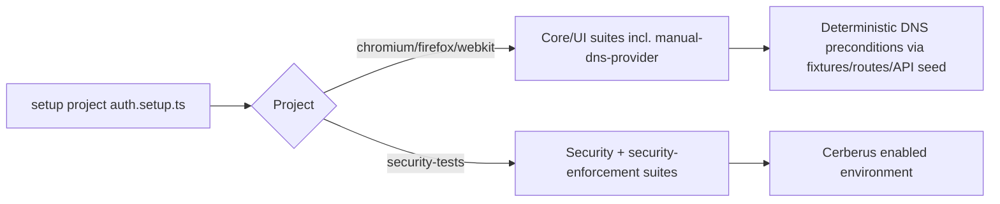

## Introduction

This specification defines how to move currently skipped E2E suites to the correct Playwright execution environment and remove skip directives so they run deterministically.

Primary objective: get all currently skipped critical-path suites executing in the right project (`security-tests` vs browser projects) with stable preconditions, even if some assertions still fail and continue into Phase 7 remediation.

Policy update (2026-02-13): E2E must be green before QA audit. Dev agents (Backend/Frontend/Playwright) must fix missing features, product bugs, and failing tests first.

## Research Findings

### Current skip inventory (confirmed)

- `tests/manual-dns-provider.spec.ts`
  - `test.describe.skip('Manual Challenge UI Display', ...)`
  - `test.describe.skip('Copy to Clipboard', ...)`
  - `test.describe.skip('Verify Button Interactions', ...)`
  - `test.describe.skip('Manual DNS Challenge Component Tests', ...)`
  - `test.describe.skip('Manual DNS Provider Error Handling', ...)`
  - `test.skip('No copy buttons found - requires DNS challenge records to be visible')`
  - `test.skip('should announce status changes to screen readers', ...)`
- `tests/core/admin-onboarding.spec.ts`
  - test title: `Emergency token can be generated`
  - inline gate: `test.skip(true, 'Cerberus must be enabled to access emergency token generation UI')`

### Playwright project routing (confirmed)

- `playwright.config.js`
  - `security-tests` project runs `tests/security/**` and `tests/security-enforcement/**`.
  - `chromium`, `firefox`, `webkit` explicitly ignore `**/security/**` and `**/security-enforcement/**`.
  - Therefore security-dependent assertions must live under security suites, not core/browser suites.

### Existing reusable patterns (confirmed)

- Deterministic DNS fixture data exists in `tests/fixtures/dns-providers.ts` (`mockManualChallenge`, `mockExpiredChallenge`, `mockVerifiedChallenge`).
- Deterministic creation helpers already exist in `tests/utils/TestDataManager.ts` (`createDNSProvider`) and are used in integration suites.
- Security suites already cover emergency and Cerberus behaviors (`tests/security/emergency-operations.spec.ts`, `tests/security-enforcement/emergency-token.spec.ts`).

### Routing mismatch requiring plan action

- `.vscode/tasks.json` contains security suite invocations using `--project=firefox` for files in `tests/security/`.
- This does not match intended project routing and can hide environment mistakes during local triage.

## Technical Specifications

### EARS requirements

- WHEN a suite requires Cerberus/security enforcement, THE SYSTEM SHALL execute it under `security-tests` only.
- WHEN a suite validates UI flows not dependent on Cerberus, THE SYSTEM SHALL execute it under `chromium`, `firefox`, and `webkit` projects.
- WHEN a test previously used `describe.skip` or `test.skip` due to missing challenge state, THE SYSTEM SHALL provide deterministic preconditions so the test executes.
- IF deterministic preconditions cannot be established from existing APIs/fixtures, THEN THE SYSTEM SHALL fail the test with explicit precondition diagnostics instead of skipping.
- WHILE Phase 7 failure remediation is in progress, THE SYSTEM SHALL keep skip count at zero for targeted suites in this plan.

### Scope boundaries

- In scope: test routing, skip removal, deterministic setup, task/script routing consistency, validation commands.
- Out of scope: feature behavior fixes needed to make all assertions pass (handled by existing failure remediation phases).

### Supervisor blocker list (session-mandated)

The following blockers are mandatory and must be resolved in dev execution before QA audit starts:

1. `auth/me` readiness failure in `tests/settings/user-lifecycle.spec.ts`.
2. Manual DNS feature wiring gap (`ManualDNSChallenge` into DNSProviders page).
3. Manual DNS test alignment/rework.
4. Security-dashboard soft-skip/skip-reason masking.
5. Deterministic sync for multi-component security propagation.

### Explicit pre-QA green gate criteria

QA execution is blocked until all criteria pass:

1. Supervisor blocker list above is resolved and verified in targeted suites.
2. Targeted E2E suites show zero failures and zero unexpected skips.
3. `tests/settings/user-lifecycle.spec.ts` is green with stable `auth/me` readiness behavior.
4. Manual DNS feature wiring is present in DNSProviders page and validated by passing tests.
5. Security-dashboard skip masking is removed (no soft-skip/skip-reason masking as failure suppression).
6. Deterministic sync is validated in:
  - `tests/core/multi-component-workflows.spec.ts`
  - `tests/core/data-consistency.spec.ts`
7. Two consecutive targeted reruns are green before QA handoff.

No-QA-until-green rule:

- QA agents and QA audit tasks SHALL NOT execute until this gate passes.
- If any criterion fails, continue dev-only remediation loop and do not invoke QA.

### Files and symbols in planned change set

- `tests/manual-dns-provider.spec.ts`
  - `test.describe('Manual DNS Provider Feature', ...)`
  - skipped blocks listed above
- `tests/core/admin-onboarding.spec.ts`
  - test: `Emergency token can be generated`
- `tests/security/security-dashboard.spec.ts` (or a new security-only file under `tests/security/`)
  - target location for Cerberus-required emergency-token UI assertions
- `.vscode/tasks.json`
  - security tasks currently using `--project=firefox` for `tests/security/*`
- Optional script normalization:
  - `package.json` (`e2e:*` scripts) if dedicated security command is added

### Data flow and environment design



### Deterministic preconditions (minimum required to run)

#### Manual DNS suite

- Precondition M1: authenticated user/session from existing fixture.
- Precondition M2: deterministic manual DNS provider presence (API create if absent via existing fixture/TestDataManager path).
- Precondition M3: deterministic challenge payload availability (use existing mock challenge fixtures and route interception where backend challenge state is non-deterministic).
- Precondition M3.1: DNS route mocks SHALL be test-scoped (inside each test case or a test-scoped helper), not shared across file scope.
- Precondition M3.2: every `page.route(...)` used for DNS challenge mocking SHALL have deterministic cleanup via `page.unroute(...)` (or equivalent scoped helper cleanup) in the same test lifecycle.
- Precondition M4: explicit page-state readiness check before assertions (`waitForLoadingComplete` + stable challenge container locator).

#### Admin onboarding Cerberus token path

- Precondition C1: test must execute in security-enabled project (`security-tests`).
- Precondition C2: Cerberus status asserted from security status API or visible security dashboard state before token assertions.
- Precondition C3: if token UI not available under security-enabled environment, fail with explicit assertion message; do not skip.
- Precondition C4: moved Cerberus-token coverage SHALL capture explicit security-state snapshots both before and after test execution (pre/post) and fail if post-state drifts unexpectedly.

### No database schema/API contract change required

- This plan relies on existing endpoints and fixtures; no backend schema migration is required for the retarget/unskip objective.

## Implementation Plan

### Phase 0: Iterative dev-only test loop (mandatory)

This loop is owned by Backend/Frontend/Playwright agents and repeats until the pre-QA green gate passes.

Execution commands:

```bash
# Iteration run: blocker-focused suites
set -a && source .env && set +a
PLAYWRIGHT_COVERAGE=0 PLAYWRIGHT_HTML_OPEN=never npx playwright test \
  tests/settings/user-lifecycle.spec.ts \
  tests/manual-dns-provider.spec.ts \
  tests/core/multi-component-workflows.spec.ts \
  tests/core/data-consistency.spec.ts \
  tests/security/security-dashboard.spec.ts \
  --project=chromium --reporter=line

# Security-specific verification run
set -a && source .env && set +a
PLAYWRIGHT_COVERAGE=0 PLAYWRIGHT_HTML_OPEN=never npx playwright test \
  tests/security/security-dashboard.spec.ts \
  tests/security-enforcement/emergency-token.spec.ts \
  --project=security-tests --reporter=line

# Gate run (repeat twice; both must be green)
set -a && source .env && set +a
PLAYWRIGHT_COVERAGE=0 PLAYWRIGHT_HTML_OPEN=never npx playwright test \
  tests/settings/user-lifecycle.spec.ts \
  tests/manual-dns-provider.spec.ts \
  tests/core/multi-component-workflows.spec.ts \
  tests/core/data-consistency.spec.ts \
  tests/security/security-dashboard.spec.ts \
  --project=chromium --project=firefox --project=webkit --project=security-tests \
  --reporter=json > /tmp/pre-qa-green-gate.json
```

Enforcement:

- No QA execution until `/tmp/pre-qa-green-gate.json` confirms gate pass and the second confirmation run is also green.

### Phase 1: Playwright Spec Alignment (behavior contract)

1. Enumerate and freeze the skip baseline for targeted files using JSON reporter.
2. Confirm target ownership:
   - `manual-dns-provider` => browser projects.
   - Cerberus token path => `security-tests`.
3. Define run contract for each moved/unskipped block in this spec before edits.

Validation commands:

```bash
npx playwright test tests/manual-dns-provider.spec.ts tests/core/admin-onboarding.spec.ts --project=chromium --reporter=json > /tmp/skip-contract-baseline.json
jq -r '.. | objects | select(.status? == "skipped") | [.projectName,.location.file,.title] | @tsv' /tmp/skip-contract-baseline.json
```

### Phase 2: Backend/Environment Preconditions (minimal, deterministic)

1. Reuse existing fixture/data helpers for manual DNS setup; do not add new backend endpoints.
2. Standardize Cerberus-enabled environment invocation for security project tests.
3. Ensure local task commands don’t misroute security suites to browser projects.

Potential task-level updates:

- `.vscode/tasks.json` security task commands should use `--project=security-tests` when targeting files under `tests/security/` or `tests/security-enforcement/`.

Validation commands:

```bash
npx playwright test tests/security/security-dashboard.spec.ts --project=security-tests
npx playwright test tests/security-enforcement/emergency-token.spec.ts --project=security-tests
```

### Phase 3: Two-Pass Retarget + Unskip Execution

#### Pass 1: Critical UI flow first

1. `tests/core/admin-onboarding.spec.ts`
  - remove Cerberus-gated skip path from core onboarding suite.
  - keep onboarding suite browser-project-safe.
2. `tests/manual-dns-provider.spec.ts`
  - unskip critical flow suites first:
    - `Provider Selection Flow`
    - `Manual Challenge UI Display`
    - `Copy to Clipboard`
    - `Verify Button Interactions`
    - `Accessibility Checks`
  - replace inline `test.skip` with deterministic preconditions and hard assertions.
3. Move Cerberus token assertion out of core onboarding and into security suite under `tests/security/**`.

Pass 1 execution + checkpoint commands:

```bash
npx playwright test tests/manual-dns-provider.spec.ts tests/core/admin-onboarding.spec.ts \
  --project=chromium --project=firefox --project=webkit \
  --grep "Provider Selection Flow|Manual Challenge UI Display|Copy to Clipboard|Verify Button Interactions|Accessibility Checks|Admin Onboarding & Setup" \
  --grep-invert "Emergency token can be generated" \
  --reporter=json > /tmp/pass1-critical-ui.json

# Checkpoint A1: zero skip-reason annotations in targeted run
jq -r '.. | objects | select(has("annotations")) | .annotations[]? | select(.type == "skip-reason") | .description' /tmp/pass1-critical-ui.json

# Checkpoint A2: zero skipped + did-not-run/not-run statuses in targeted run
jq -r '.. | objects | select(.status? != null and (.status|test("^(skipped|didNotRun|did-not-run|not-run|notrun)$"; "i"))) | [.status, (.title // ""), (.location.file // "")] | @tsv' /tmp/pass1-critical-ui.json
```

#### Pass 2: Component + error suites second

1. `tests/manual-dns-provider.spec.ts`
  - unskip and execute:
    - `Manual DNS Challenge Component Tests`
    - `Manual DNS Provider Error Handling`
2. Enforce per-test route mocking + cleanup for DNS mocks (`page.route` + `page.unroute` parity).

Pass 2 execution + checkpoint commands:

```bash
npx playwright test tests/manual-dns-provider.spec.ts \
  --project=chromium --project=firefox --project=webkit \
  --grep "Manual DNS Challenge Component Tests|Manual DNS Provider Error Handling" \
  --reporter=json > /tmp/pass2-component-error.json

# Checkpoint B1: zero skip-reason annotations in targeted run
jq -r '.. | objects | select(has("annotations")) | .annotations[]? | select(.type == "skip-reason") | .description' /tmp/pass2-component-error.json

# Checkpoint B2: zero skipped + did-not-run/not-run statuses in targeted run
jq -r '.. | objects | select(.status? != null and (.status|test("^(skipped|didNotRun|did-not-run|not-run|notrun)$"; "i"))) | [.status, (.title // ""), (.location.file // "")] | @tsv' /tmp/pass2-component-error.json

# Checkpoint B3: DNS mock anti-leakage (route/unroute parity)
ROUTES=$(grep -c "page\\.route(" tests/manual-dns-provider.spec.ts || true)
UNROUTES=$(grep -c "page\\.unroute(" tests/manual-dns-provider.spec.ts || true)
echo "ROUTES=$ROUTES UNROUTES=$UNROUTES"
test "$ROUTES" -eq "$UNROUTES"
```

### Phase 4: Integration and Remediation Sequencing

1. Run anti-duplication guard for Cerberus token assertion:
  - removed from `tests/core/admin-onboarding.spec.ts`.
  - present exactly once in security suite (`tests/security/**`) only.
2. Run explicit security-state pre/post snapshot checks around moved Cerberus token coverage.
3. Re-run skip census for targeted suites and verify `skipped=0` plus `did-not-run/not-run=0` only for intended file/project pairs.
4. Ignore `did-not-run/not-run` records produced by intentionally excluded project/file combinations (for example, browser projects ignoring security suites).
5. Hand off remaining failures (if any) to existing remediation sequence:
   - Phase 7: failure cluster remediation.
   - Phase 8: skip debt closure check.
   - Phase 9: re-baseline freeze.

Validation commands:

```bash
npx playwright test tests/manual-dns-provider.spec.ts tests/core/admin-onboarding.spec.ts tests/security/security-dashboard.spec.ts tests/security-enforcement/emergency-token.spec.ts --project=chromium --project=firefox --project=webkit --project=security-tests --reporter=json > /tmp/retarget-unskip-validation.json

# Anti-duplication: Cerberus token assertion removed from core, present once in security suite only
CORE_COUNT=$(grep -RIn "Emergency token can be generated" tests/core/admin-onboarding.spec.ts | wc -l)
SEC_COUNT=$(grep -RIn --include='*.spec.ts' "Emergency token can be generated" tests/security tests/security-enforcement | wc -l)
echo "CORE_COUNT=$CORE_COUNT SEC_COUNT=$SEC_COUNT"
test "$CORE_COUNT" -eq 0
test "$SEC_COUNT" -eq 1

# Security-state snapshot presence checks around moved security test
jq -r '[.. | objects | select(has("annotations")) | .annotations[]? | select(.type == "security-state-pre")] | length' /tmp/retarget-unskip-validation.json
jq -r '[.. | objects | select(has("annotations")) | .annotations[]? | select(.type == "security-state-post")] | length' /tmp/retarget-unskip-validation.json

# Final JSON census (intent-scoped): skipped + did-not-run/not-run + skip-reason annotations
# - Browser projects (chromium/firefox/webkit): only non-security targeted files
# - security-tests project: only security targeted files
jq -r '
  ..
  | objects
  | select(.status? != null and .projectName? != null and .location.file? != null)
  | select(
      (
        (.projectName | test("^(chromium|firefox|webkit)$"))
        and
        (.location.file | test("^tests/manual-dns-provider\\.spec\\.ts$|^tests/core/admin-onboarding\\.spec\\.ts$"))
      )
      or
      (
        (.projectName == "security-tests")
        and
        (.location.file | test("^tests/security/|^tests/security-enforcement/"))
      )
    )
  | select(.status | test("^(skipped|didNotRun|did-not-run|not-run|notrun)$"; "i"))
  | [.projectName, .location.file, (.title // ""), .status]
  | @tsv
' /tmp/retarget-unskip-validation.json
jq -r '.. | objects | select(has("annotations")) | .annotations[]? | select(.type == "skip-reason") | .description' /tmp/retarget-unskip-validation.json
```

### Phase 5: Documentation + CI Gate Alignment

1. Update `docs/reports/e2e_skip_registry_2026-02-13.md` with post-retarget status.
2. Update `docs/plans/CI_REMEDIATION_MASTER_PLAN.md` Phase 8 progress checkboxes with concrete completion state.
3. Ensure CI split jobs continue to run security suites in security context and non-security suites in browser shards.

## Risks and Mitigations

- Risk: manual DNS challenge UI is unavailable in normal flow.
  - Mitigation: deterministic route/API fixture setup to force visible challenge state for test runtime.
- Risk: duplicated emergency-token coverage across core and security suites.
  - Mitigation: single source of truth in security suite; core suite retains only non-Cerberus onboarding checks.
- Risk: local task misrouting causes false confidence.
  - Mitigation: update task commands to use `security-tests` for security files.

## Acceptance Criteria

- [ ] E2E is green before QA audit starts (hard gate).
- [ ] Dev agents fix missing features, product bugs, and failing tests first.
- [ ] Supervisor blocker list is fully resolved before QA execution.
- [ ] Iterative dev-only loop is used until gate pass is achieved.
- [ ] No QA execution occurs until pre-QA gate criteria pass.
- [ ] No `test.skip`/`describe.skip` remains in `tests/manual-dns-provider.spec.ts` and `tests/core/admin-onboarding.spec.ts` for the targeted paths.
- [ ] Cerberus-dependent emergency token test executes under `security-tests` (not browser projects).
- [ ] Manual DNS suite executes under browser projects with deterministic preconditions.
- [ ] Pass 1 (critical UI flow) completes with zero `skip-reason` annotations and zero skipped/did-not-run/not-run statuses.
- [ ] Pass 2 (component/error suites) completes with zero `skip-reason` annotations and zero skipped/did-not-run/not-run statuses.
- [ ] Cerberus token assertion is removed from `tests/core/admin-onboarding.spec.ts` and appears exactly once under `tests/security/**`.
- [ ] Moved Cerberus token test emits/validates explicit `security-state-pre` and `security-state-post` snapshots.
- [ ] DNS route mocks are per-test scoped and cleaned up deterministically (`page.route`/`page.unroute` parity).
- [ ] Any remaining failures are assertion/behavior failures only and are tracked in Phase 7 remediation queue.

## Actionable Phase Summary

1. Normalize routing first (security assertions in `security-tests`, browser-safe assertions in browser projects).
2. Remove skip directives in `manual-dns-provider` and onboarding emergency-token path.
3. Add deterministic preconditions (existing fixtures/routes/helpers only) so tests run consistently.
4. Re-run targeted matrix and verify `skipped=0` for targeted files.
5. Continue with Phase 7 failure remediation for remaining non-skip failures.
