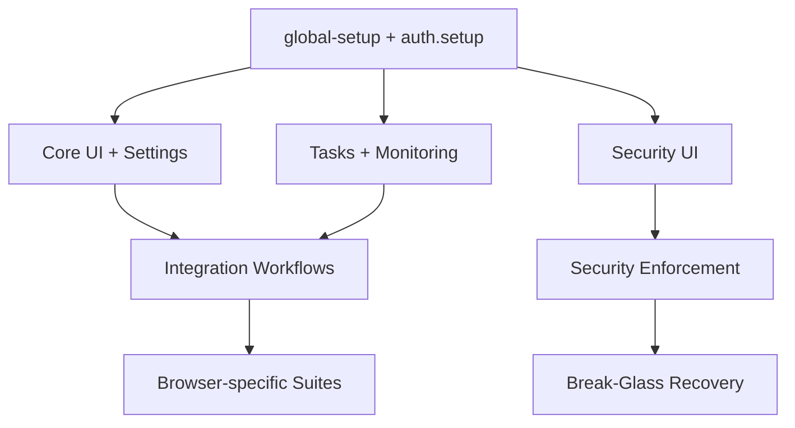

# E2E Playwright Shard Timeout Investigation — Current Spec

Last updated: 2026-02-10

## Goal
- Concise summary: investigate GitHub Actions run https://github.com/Wikid82/Charon/actions/runs/21865692694 where the E2E Playwright job reports Shard 3 stopping at ~30 minutes despite configured timeouts of ~40 minutes. Produce reproducible diagnostics, collect artifacts/logs, identify root cause hypotheses, and provide prioritized remediations and short-term unblock steps.

## Phases
- Discover: collect logs and artifacts.
- Analyze: review config and correlate shard → tests.
- Remediate: short-term and long-term fixes.
- Verify: reproduce and confirm the fix.

---

## 1) Discover — exact places to collect logs & artifacts

### GitHub Actions (run-level)
- Run page: https://github.com/Wikid82/Charon/actions/runs/21865692694
- Run logs (zip): GET https://api.github.com/repos/Wikid82/Charon/actions/runs/21865692694/logs
  - Programmatic commands:
    ```bash
    export GITHUB_OWNER=Wikid82
    export GITHUB_REPO=Charon
    export RUN_ID=21865692694
    # Requires GITHUB_TOKEN set with repo access
    curl -H "Accept: application/vnd.github+json" \
      -H "Authorization: token $GITHUB_TOKEN" \
      -L "https://api.github.com/repos/$GITHUB_OWNER/$GITHUB_REPO/actions/runs/$RUN_ID/logs" \
      -o run-${RUN_ID}-logs.zip
    unzip -d run-${RUN_ID}-logs run-${RUN_ID}-logs.zip
    ```
- Artifacts list (API):
  ```bash
  curl -H "Authorization: token $GITHUB_TOKEN" \
    "https://api.github.com/repos/$GITHUB_OWNER/$GITHUB_REPO/actions/runs/$RUN_ID/artifacts" | jq '.'
  ```
- gh CLI (interactive/script):
  ```bash
  gh run view $RUN_ID --repo $GITHUB_OWNER/$GITHUB_REPO --log > run-$RUN_ID-summary.log
  gh run download $RUN_ID --repo $GITHUB_OWNER/$GITHUB_REPO --dir artifacts-$RUN_ID
  ```

### GitHub Actions (job-level)
- List jobs for the run and find Playwright shard job(s):
  ```bash
  curl -H "Authorization: token $GITHUB_TOKEN" \
    "https://api.github.com/repos/$GITHUB_OWNER/$GITHUB_REPO/actions/runs/$RUN_ID/jobs" | jq '.jobs[] | {id: .id, name: .name, runner_name: .runner_name, started_at: .started_at, completed_at: .completed_at}'
  ```
- For JOB_ID identified as the shard job, download job logs:
  ```bash
  curl -H "Authorization: token $GITHUB_TOKEN" -L \
    "https://api.github.com/repos/$GITHUB_OWNER/$GITHUB_REPO/actions/jobs/$JOB_ID/logs" -o job-${JOB_ID}-logs.zip
  unzip -d job-${JOB_ID}-logs job-${JOB_ID}-logs.zip
  ```

### Playwright test outputs used by this project
- Search and collect the following files in the repo root (or workflow-run directories):
  - `playwright.config.ts`, `playwright.config.js`, `playwright.config.mjs`
  - `package.json` scripts invoking Playwright (e.g., `test:e2e`, `e2e:ci`)
  - `.github/workflows/*` steps that run Playwright
- Typical Playwright outputs to collect (per-shard):
  - `<outputDir>/trace.zip`
  - `<outputDir>/test-results.json` or `test-results/*`
  - `<outputDir>/video/*`
  - `<outputDir>/*.log` (stdout/stderr)

Observed local example (for context): the developer ran
`npx playwright test --project=chromium --output=/tmp/playwright-chromium-output --reporter=list > /tmp/playwright-chromium.log 2>&1` — look for similar invocations in workflows/scripts.

### Repository container logs (containers/)
- containers/charon:
  - Files to check: `containers/charon/docker-compose.yml`, any `logs/` or `data/` directories under `containers/charon/`.
  - Local commands (when reproducing):
    ```bash
    docker compose -f containers/charon/docker-compose.yml logs --no-color --timestamps > containers-charon-logs.txt
    docker logs --timestamps --since "1h" charon-e2e > charon-e2e.log 2>&1 || true
    ```
- containers/caddy:
  - Files: `containers/caddy/Caddyfile`, `containers/caddy/config/`, `containers/caddy/logs/`
  - Local checks:
    ```bash
    docker logs --timestamps caddy > caddy.log 2>&1 || true
    curl -sS http://127.0.0.1:2019/ || true  # admin
    curl -sS http://127.0.0.1:2020/ || true  # emergency
    ```

---

## 2) Analyze — specific files and config to review (exact paths)

- Workflows (search these paths):
  - `.github/workflows/*.yml` — likely candidates: `.github/workflows/e2e.yml`, `.github/workflows/ci.yml`, `.github/workflows/playwright.yml` (run `grep -R "playwright" .github/workflows || true`).
  - Look for `timeout-minutes:` either at top-level workflow or under `jobs:<job>.timeout-minutes`.

- Playwright config files:
  - `/projects/Charon/playwright.config.ts`
  - `/projects/Charon/playwright.config.js`
  - `/projects/Charon/playwright.config.mjs`
  - Inspect `projects`, `workers`, `retries`, `outputDir`, `reporter` sections.

- package.json and scripts:
  - `/projects/Charon/package.json` — inspect `scripts` for e.g. `test:e2e`, `e2e:ci` and the exact Playwright CLI flags used by CI.

- GitHub skill scripts & E2E runner:
  - `.github/skills/scripts/skill-runner.sh` — used in `docs` and testing instructions; check for `docker-rebuild-e2e`, `test-e2e-playwright-coverage`.
  - Commands:
    ```bash
    sed -n '1,240p' .github/skills/scripts/skill-runner.sh
    grep -n "docker-rebuild-e2e\|test-e2e-playwright-coverage\|playwright" -n .github/skills || true
    ```

- Makefile:
  - `/projects/Charon/Makefile` — search for targets related to `e2e`, `playwright`, `rebuild`.

---

## 3) Steps to download GitHub Actions logs & artifacts for run 21865692694

### Programmatic (API)
1. List artifacts for run:
```bash
curl -H "Authorization: token $GITHUB_TOKEN" \
  "https://api.github.com/repos/Wikid82/Charon/actions/runs/21865692694/artifacts" | jq '.'
```
2. Download run logs (zip):
```bash
curl -H "Authorization: token $GITHUB_TOKEN" -L \
  "https://api.github.com/repos/Wikid82/Charon/actions/runs/21865692694/logs" -o run-21865692694-logs.zip
unzip -d run-21865692694-logs run-21865692694-logs.zip
```
3. List jobs to find Playwright shard job id(s):
```bash
curl -H "Authorization: token $GITHUB_TOKEN" \
  "https://api.github.com/repos/Wikid82/Charon/actions/runs/21865692694/jobs" | jq '.jobs[] | {id: .id, name: .name, runner_name: .runner_name, started_at: .started_at, completed_at: .completed_at}'
```
4. Download job logs by JOB_ID:
```bash
curl -H "Authorization: token $GITHUB_TOKEN" -L \
  "https://api.github.com/repos/Wikid82/Charon/actions/jobs/$JOB_ID/logs" -o job-$JOB_ID-logs.zip
unzip -d job-$JOB_ID-logs job-$JOB_ID-logs.zip
```

### Using gh CLI
```bash
gh run view 21865692694 --repo Wikid82/Charon --log > run-21865692694-summary.log
gh run download 21865692694 --repo Wikid82/Charon --dir artifacts-21865692694
```

### Manual web UI
- Visit run page and download artifacts and job logs from the job view.

---

## 4) How to locate shard-specific logs and correlate shard indices to tests

- Typical patterns to inspect:
  - Look for Playwright CLI flags in the job step (e.g., `--shard=INDEX/TOTAL`, `--output=/tmp/...`).
  - If the job ran `npx playwright test --output=/tmp/...`, search the downloaded job logs for that exact command to find the shard index.

- Commands to list tests assigned to a shard (dry-run):
```bash
# Show which tests a given shard would run (no execution)
npx playwright test --list --shard=INDEX/TOTAL

# Or run with reporter=list (shows test items as executed)
npx playwright test --shard=INDEX/TOTAL --reporter=list
```

- Note: Playwright shard index is zero-based. If CI logs show `--shard=3/4`, double-check whether the team used zero-based numbering; confirm by re-running the `--list` command.

Expected per-shard artifact names (if implemented):
- `e2e-shard-<INDEX>-output` containing `trace.zip`, `video/*`, `test-results.json`, and shard-specific logs (stdout/stderr files).

---

## 5) Runner/container logs to inspect

- GitHub-hosted runner: review the Actions job logs for runner messages and any `Runner` diagnostic lines. You cannot access host-level logs.

- Self-hosted runner (if used): retrieve host system logs (requires access to runner host):
  ```bash
  sudo journalctl -u actions.runner.* -n 1000 > runner-service-journal.log
  sudo journalctl -k --since "1 hour ago" | grep -i oom > runner-kernel-oom.log || true
  sudo journalctl -u docker.service -n 200 > docker-journal.log
  ```

- Docker container logs (charon, caddy, charon-e2e):
  ```bash
  docker ps -a --filter "name=charon" --format "{{.Names}} {{.Status}}" > containers-ps.txt
  docker logs --since "1h" charon-e2e > charon-e2e.log 2>&1 || true
  docker logs --since "1h" caddy > caddy.log 2>&1 || true
  ```

Check Caddy admin/emergency ports (2019 & 2020) to confirm the proxy was healthy during the test run:
```bash
curl -sS --max-time 5 http://127.0.0.1:2019/ || echo "admin not responding"
curl -sS --max-time 5 http://127.0.0.1:2020/ || echo "emergency not responding"
```

---

## 6) Hypotheses for why Shard 3 stopped at ~30m (descriptions + exact artifacts to search)

H1 — Workflow/job timeout configured smaller than expected
- Search:
  - `.github/workflows/*` for `timeout-minutes:`
  - job logs for `Timeout` or `Job execution time exceeded`
- Commands:
  ```bash
  grep -n "timeout-minutes" .github/workflows -R || true
  grep -i "timeout" -R run-${RUN_ID}-logs || true
  ```
- Confirmed by: `timeout-minutes: 30` or job logs showing `aborting execution due to timeout`.

H2 — Runner preemption / connection loss
- Search job logs for: `Runner lost`, `The runner has been shutdown`, `Connection to the server was lost`.
- Commands:
  ```bash
  grep -iE "runner lost|runner.*shutdown|connection.*lost|Job canceled|cancelled by" -R run-${RUN_ID}-logs || true
  ```
- Confirmed by: runner disconnect lines and abrupt end of logs with no Playwright stack trace.

H3 — E2E environment container (charon/caddy) died or became unhealthy
- Search container logs for crash/fatal/panic messages and timestamps matching the job stop time.
- Commands:
  ```bash
  docker ps -a --filter "name=charon" --format '{{.Names}} {{.Status}}'
  docker logs charon-e2e --since "2h" | sed -n '1,200p'
  grep -iE "panic|fatal|segfault|exited|health.*unhealthy|503|502" containers -R || true
  ```
- Confirmed by: container exit matching job finish time and Caddy returning 502/503 during run.

H4 — Playwright/Node process killed by OOM
- Search for `Killed`, kernel `oom_reaper` lines, system `dmesg` outputs.
- Commands:
  ```bash
  grep -R "Killed" job-${JOB_ID}-logs || true
  # on self-hosted runner host
  sudo journalctl -k --since '2 hours ago' | grep -i oom || true
  ```
- Confirmed by: kernel OOM logs at same timestamp or `Killed` in job logs.

H5 — Script-level early timeout (explicit `timeout 30m` or `kill`)
- Search `.github/skills` and workflow steps for `timeout 30m`, `timeout 1800`, or `kill` calls.
- Commands:
  ```bash
  grep -R "\btimeout\b\|kill -9\|kill -15\|pkill" -n .github || true
  ```
- Confirmed by: a script with `timeout 30m` or similar wrapper used in the job.

H6 — Misinterpreted units or mis-configuration (seconds vs minutes)
- Search for numeric values used in scripts and steps (e.g., `1800` used where minutes expected).
- Commands:
  ```bash
  grep -R "\b1800\b\|\b3600\b\|timeout-minutes" -n .github || true
  ```
- Confirmed by: a value of `1800` where `timeout-minutes` or similar was expected to be minutes.

For each hypothesis, the exact lines/entries returned by the grep/journal/docker commands are the evidence to confirm or refute it. Keep timestamps to correlate with the job start/completion times in the run logs.

---

## 7) Prioritized remediation plan (short-term → long-term)

### Short-term (unblock re-runs quickly)
1. Download and attach all logs/artifacts for run 21865692694 (use `gh run download`) and share with E2E test author.
2. Temporarily bump `timeout-minutes` for the failing workflow to 60 to allow full runs while diagnosing.
3. Add an `if: always()` step to the E2E job that collects diagnostics and uploads them as artifacts (free memory, `dmesg`, `ps aux`, `docker ps -a`, `docker logs charon-e2e`).
4. Re-run just the failing shard with added `DEBUG=pw:api` and `PWDEBUG=1` and persist shard outputs.

### Medium-term
1. Persist per-shard Playwright outputs via `actions/upload-artifact@v4` for traces/videos/test-results.
2. Add Playwright `retries` for transient failures and `--trace`/`--video` options.
3. Add a CI smoke check before full shard execution to confirm env health.
4. If self-hosted, add runner health checks and alerting (memory, disk, Docker status).

### Long-term
1. Implement stable test splitting based on historical test durations rather than equal-file sharding.
2. Introduce resource constraints and monitoring to protect against OOM and flapping containers.
3. Build a golden-minimal E2E smoke job that must pass before running full shards.

---

## 8) Minimal reproduction checklist (local)

1. Rebuild E2E image used by CI (per repo skill):
```bash
.github/skills/scripts/skill-runner.sh docker-rebuild-e2e
```
2. Start the environment (example):
```bash
docker compose -f containers/charon/docker-compose.yml up -d
```
3. Set base URL and run the same shard (replace INDEX/TOTAL with values from CI):
```bash
export PLAYWRIGHT_BASE_URL=http://localhost:5173
DEBUG=pw:api PWDEBUG=1 \
  npx playwright test --shard=INDEX/TOTAL --project=chromium \
  --output=/tmp/playwright-shard-INDEX --reporter=list > /tmp/playwright-shard-INDEX.log 2>&1
```
4. If reproducing a timeout, immediately collect:
```bash
docker ps -a --format '{{.Names}} {{.Status}}' > reproduce-docker-ps.txt
docker logs --since '1h' charon-e2e > reproduce-charon-e2e.log || true
tail -n 500 /tmp/playwright-shard-INDEX.log > reproduce-pw-tail.log
```

---

## 9) Required workflow/scripts changes to improve diagnostics & prevent recurrence

- Add `timeout-minutes: 60` to `.github/workflows/<e2e workflow>.yml` while diagnosing; later set to a reasoned SLA (e.g., 50m).
- Add an `always()` step to collect diagnostics on failure and upload artifacts. Example YAML snippet:
  ```yaml
  - name: Collect diagnostics
    if: always()
    run: |
      uptime > uptime.txt
      free -m > free-m.txt
      df -h > df-h.txt
      ps aux > ps-aux.txt
      docker ps -a > docker-ps.txt || true
      docker logs --tail 500 charon-e2e > docker-charon-e2e.log || true
  - uses: actions/upload-artifact@v4
    with:
      name: e2e-diagnostics-${{ github.run_id }}
      path: |
        uptime.txt
        free-m.txt
        df-h.txt
        ps-aux.txt
        docker-ps.txt
        docker-charon-e2e.log
  ```

- Ensure each Playwright shard runs with `--output` pointing to a shard-specific path and upload that path as artifact:
  - artifact name convention: `e2e-shard-${{ matrix.index }}-output`.

---

## 10) People/roles to notify & recommended next actions

- Notify:
  - CI/Infra owner or person in `CODEOWNERS` for `.github/workflows`
  - E2E test author(s) (owners of failing tests)
  - Self-hosted runner owner (if runner_name in job JSON indicates self-hosted)

- Recommended immediate actions for them:
  1. Download run artifacts and job logs for run 21865692694 and share them with the test author.
  2. Re-run the shard with `DEBUG=pw:api` and `PWDEBUG=1` enabled and ensure per-shard artifacts are uploaded.
  3. If self-hosted, check runner host kernel logs for OOM and Docker container exits at the job time.

---

## 11) Verification steps (post-remediation)

1. Re-run E2E workflow end-to-end; verify Shard 3 completes.
2. Confirm artifacts `e2e-shard-3-output` exist and contain `trace.zip`, `video/*`, and `test-results.json`.
3. Confirm no `oom_reaper` or `Killed` messages in runner host logs during the run.

---

## Appendix — quick extraction commands summary
```bash
# Download all artifacts and logs for RUN_ID
gh run download 21865692694 --repo Wikid82/Charon --dir ./artifacts-21865692694

# List jobs and find Playwright shard job(s)
curl -H "Authorization: token $GITHUB_TOKEN" \
  "https://api.github.com/repos/Wikid82/Charon/actions/runs/21865692694/jobs" | jq '.jobs[] | {id: .id, name: .name, runner_name: .runner_name, started_at: .started_at, completed_at: .completed_at}'

# Download job logs for JOB_ID
curl -H "Authorization: token $GITHUB_TOKEN" -L \
  "https://api.github.com/repos/Wikid82/Charon/actions/jobs/$JOB_ID/logs" -o job-$JOB_ID-logs.zip
unzip -d job-$JOB_ID-logs job-$JOB_ID-logs.zip

# Grep for likely causes
grep -iE "timeout|minut|runner lost|cancelled|Killed|OOM|oom_reaper|Out of memory|panic|fatal" -R run-21865692694-logs || true
```

---

## Next three immediate actions (checklist)
1. Run `gh run download 21865692694 --repo Wikid82/Charon --dir ./artifacts-21865692694` and unzip the run logs.
2. Search the downloaded logs for `timeout-minutes`, `Runner lost`, `Killed`, and `oom_reaper` to triage H1–H4.
3. Re-run the failing shard locally with `DEBUG=pw:api PWDEBUG=1` and `--output=/tmp/playwright-shard-INDEX`, capture outputs, and upload them as artifacts.

---

If you want, I can now (A) download the run artifacts & logs for run 21865692694 using gh/API (requires your GITHUB_TOKEN) and list the job IDs, or (B) open the workflow files in `.github/workflows` and search for `timeout-minutes` and Playwright invocations. Which would you like me to do first?
---
post_title: "E2E Test Remediation Plan"
author1: "Charon Team"
post_slug: "e2e-test-remediation-plan"
microsoft_alias: "charon-team"
featured_image: "https://wikid82.github.io/charon/assets/images/featured/charon.png"
categories: ["testing"]
tags: ["playwright", "e2e", "remediation", "security"]
ai_note: "true"
summary: "Phased remediation plan for Charon Playwright E2E tests, covering
   inventory, dependencies, runtime estimates, and quick start commands."
post_date: "2026-01-28"
---

## 1. Introduction

This plan replaces the current spec with a comprehensive, phased remediation
strategy for the Playwright E2E test suite under [tests](tests). The goal is to
stabilize execution, align dependencies, and sequence remediation work so that
core management flows, security controls, and integration workflows become
reliable in Docker-based E2E runs.

## 2. Research Findings

### 2.1 Test Harness and Global Dependencies

- Global setup and teardown are enforced by
   [tests/global-setup.ts](tests/global-setup.ts),
   [tests/auth.setup.ts](tests/auth.setup.ts), and
   [tests/security-teardown.setup.ts](tests/security-teardown.setup.ts).
- Global setup validates the emergency token, checks health endpoints, and
   resets security settings, which impacts all security-enforcement suites.
- Multiple suites depend on the emergency server (port 2020) and Cerberus
   modules with explicit admin whitelist configuration.

### 2.2 Test Inventory and Feature Areas

- Core management flows: authentication, navigation, dashboard, proxy hosts,
   certificates, access lists in [tests/core](tests/core).
- DNS providers and ACME workflows: [tests/dns-provider-crud.spec.ts]
   (tests/dns-provider-crud.spec.ts),
   [tests/dns-provider-types.spec.ts](tests/dns-provider-types.spec.ts),
   [tests/manual-dns-provider.spec.ts](tests/manual-dns-provider.spec.ts).
- Monitoring: uptime and log streaming in
   [tests/monitoring](tests/monitoring).
- Settings: system, account, SMTP, notifications, encryption, user management
   in [tests/settings](tests/settings).
- Tasks and imports: backups, Caddyfile import flows, CrowdSec import, and log
   viewing in [tests/tasks](tests/tasks).
- Security UI: dashboard, WAF, CrowdSec, headers, rate limiting, and audit logs
   in [tests/security](tests/security).
- Security enforcement: ACL, WAF, rate limits, CrowdSec, emergency token, and
   break-glass recovery in [tests/security-enforcement](tests/security-enforcement).
- Integration workflows: cross-feature scenarios in
   [tests/integration](tests/integration).
- Browser-specific regressions for import flows in
   [tests/webkit-specific](tests/webkit-specific) and
   [tests/firefox-specific](tests/firefox-specific).
- Debug and diagnostics: certificates and Caddy import debug coverage in
   [tests/debug/certificates-debug.spec.ts](tests/debug/certificates-debug.spec.ts),
   [tests/tasks/caddy-import-gaps.spec.ts](tests/tasks/caddy-import-gaps.spec.ts),
   [tests/tasks/caddy-import-cross-browser.spec.ts](tests/tasks/caddy-import-cross-browser.spec.ts),
   and [tests/debug](tests/debug).
- UI triage and regression coverage: dropdown/modal coverage in
   [tests/modal-dropdown-triage.spec.ts](tests/modal-dropdown-triage.spec.ts) and
   [tests/proxy-host-dropdown-fix.spec.ts](tests/proxy-host-dropdown-fix.spec.ts).
- Shared utilities validation: wait helpers in
   [tests/utils/wait-helpers.spec.ts](tests/utils/wait-helpers.spec.ts).

### 2.3 Dependency and Ordering Constraints

- The security-enforcement suite assumes Cerberus can be toggled on, and its
   final tests intentionally restore admin whitelist state
   (see [tests/security-enforcement/zzzz-break-glass-recovery.spec.ts]
   (tests/security-enforcement/zzzz-break-glass-recovery.spec.ts)).
- Admin whitelist blocking is designed to run last using a zzz prefix
   (see [tests/security-enforcement/zzz-admin-whitelist-blocking.spec.ts]
   (tests/security-enforcement/zzz-admin-whitelist-blocking.spec.ts)).
- Emergency server tests depend on port 2020 availability
   (see [tests/security-enforcement/emergency-server](tests/security-enforcement/emergency-server)).
- Some import suites use real APIs and TestDataManager cleanup; others mock
   requests. Remediation must avoid mixing mocked and real flows in a single
   phase without clear isolation.

### 2.4 Runtime and Flake Hotspots

- Security-enforcement suites include extended retries, network propagation
   delays, and rate limit loops.
- Import debug and gap-coverage suites perform real uploads, data creation, and
   commit flows, making them sensitive to backend state and Caddy reload timing.
- Monitoring WebSocket tests require stable log streaming state.

## 3. Technical Specifications

### 3.1 Test Grouping and Shards

- **Foundation:** global setup, auth storage state, security teardown.
- **Core UI:** authentication, navigation, dashboard, proxy hosts, certificates,
   access lists.
- **Settings:** system, account, SMTP, notifications, encryption, users.
- **Tasks:** backups, logs, Caddyfile import, CrowdSec import.
- **Monitoring:** uptime monitoring and real-time logs.
- **Security UI:** Cerberus dashboard, WAF config, headers, rate limiting,
   CrowdSec config, audit logs.
- **Security Enforcement:** ACL/WAF/CrowdSec/rate limit enforcement, emergency
   token and break-glass recovery, admin whitelist blocking.
- **Integration:** proxy + cert, proxy + DNS, backup restore, import workflows,
   multi-feature workflows.
- **Browser-specific:** WebKit and Firefox import regressions.
- **Debug/POC:** diagnostics and investigation suites (Caddy import debug).

### 3.2 Dependency Graph (High-Level)



### 3.3 Runtime Estimates (Docker Mode)

| Group | Suite Examples | Expected Runtime | Prerequisites |
| --- | --- | --- | --- |
| Foundation | global setup + auth | 1-2 min | Docker E2E container, emergency token |
| Core UI | core specs | 6-10 min | Auth storage state, clean data |
| Settings | settings specs | 6-10 min | Auth storage state |
| Tasks | backups/import/logs | 10-16 min | Auth storage state, API mocks and real flows |
| Monitoring | monitoring specs | 5-8 min | WebSocket stability |
| Security UI | security specs | 10-14 min | Cerberus enabled, admin whitelist |
| Security Enforcement | enforcement specs | 15-25 min | Emergency token, port 2020, admin whitelist |
| Integration | integration specs | 12-20 min | Stable core + settings + tasks |
| Browser-specific | firefox/webkit | 8-12 min | Import baseline stable |
| Debug/POC | caddy import debug | 4-6 min | Docker logs available |

Assumed worker count: 4 (default) except security-enforcement which requires
`--workers=1`. Serial execution increases runtime for enforcement suites.

### 3.4 Environment Preconditions

- E2E container built and healthy via
   `.github/skills/scripts/skill-runner.sh docker-rebuild-e2e`.
- Ports 8080 (UI/API) and 2020 (emergency server) reachable.
- `CHARON_EMERGENCY_TOKEN` configured and valid.
- Admin whitelist includes test runner ranges when Cerberus is enabled.
- Caddy admin health endpoints reachable for import workflows.

### 3.5 Emergency Server and Security Prerequisites

- Port 2020 (emergency server) available and reachable for
   [tests/security-enforcement/emergency-server](tests/security-enforcement/emergency-server).
- Port 2019 is reserved for the Caddy admin API; use 2020 for emergency server
   tests to avoid conflicts.
- Basic Auth credentials required for emergency server tests. Defaults in test
   fixtures are `admin` / `changeme` and should match the E2E compose config.
- Admin whitelist bypass must be configured before enforcement tests that
   toggle Cerberus settings.

## 4. Implementation Plan

### Phase 1: Foundation and Test Harness Reliability

Objective: Ensure the shared test harness is stable before touching feature
flows.

- Validate global setup and storage state creation
   (see [tests/global-setup.ts](tests/global-setup.ts) and
   [tests/auth.setup.ts](tests/auth.setup.ts)).
- Confirm emergency server availability and credentials for break-glass suites.
- Establish baseline run for core login/navigation suites.

Estimated runtime: 2-4 minutes

Success criteria:

- Storage state created once and reused without re-auth flake.
- Emergency token validation passes and security reset executes.

### Phase 2: Core UI, Settings, Monitoring, and Task Flows

Objective: Remediate the highest-traffic user journeys and tasks.

- Core UI: authentication, navigation, dashboard, proxy hosts, certificates,
   access lists (core CRUD and navigation).
- Settings: system, account, SMTP, notifications, encryption, users.
- Monitoring: uptime and real-time logs.
- Tasks: backups, logs viewing, and base Caddyfile import flows.
- Include modal/dropdown triage coverage and wait helpers validation.

Estimated runtime: 25-40 minutes

Success criteria:

- Core CRUD and navigation pass without retries.
- Monitoring WebSocket tests pass without timeouts.
- Backups and log viewing flows pass with mocks and deterministic waits.

### Phase 3: Security UI and Enforcement

Objective: Stabilize Cerberus UI configuration and enforcement workflows.

- Security dashboard and configuration pages.
- WAF, headers, rate limiting, CrowdSec, audit logs.
- Enforcement suites, including emergency token and whitelist blocking order.

Estimated runtime: 30-45 minutes

Success criteria:

- Security UI toggles and pages load without state leakage.
- Enforcement suites pass with Cerberus enabled and whitelist configured.
- Break-glass recovery restores bypass state for subsequent suites.

### Phase 4: Integration, Browser-Specific, and Debug Suites

Objective: Close cross-feature and browser-specific regressions.

- Integration workflows: proxy + cert, proxy + DNS, backup restore, import to
   production, multi-feature workflows.
- Browser-specific Caddy import regressions (Firefox/WebKit).
- Debug/POC suites (Caddy import debug, diagnostics) run as opt-in,
   including caddy-import-gaps and cross-browser import coverage.

Estimated runtime: 25-40 minutes

Success criteria:

- Integration workflows pass with stable TestDataManager cleanup.
- Browser-specific import tests show consistent API request handling.
- Debug suites remain optional and do not block core pipelines.

## 5. Acceptance Criteria (EARS)

- WHEN the E2E harness initializes, THE SYSTEM SHALL validate emergency token
   and create a reusable auth state without flake.
- WHEN core management tests execute, THE SYSTEM SHALL complete CRUD flows
   without manual retries or timeouts.
- WHEN security enforcement suites execute, THE SYSTEM SHALL apply Cerberus
   settings with admin whitelist bypass and SHALL restore security state after
   completion.
- WHEN integration workflows execute, THE SYSTEM SHALL complete cross-feature
   journeys without data collisions or residual state.

## 6. Quick Start Commands

```bash
# Rebuild and start E2E container
.github/skills/scripts/skill-runner.sh docker-rebuild-e2e

# PHASE 1: Foundation
cd /projects/Charon
npx playwright test tests/global-setup.ts tests/auth.setup.ts --project=firefox

# PHASE 2: Core UI, Settings, Tasks, Monitoring
# NOTE: PLAYWRIGHT_SKIP_SECURITY_DEPS=1 is automatically set in E2E scripts
# Security suites will NOT execute as dependencies
npx playwright test tests/core --project=firefox
npx playwright test tests/settings --project=firefox
npx playwright test tests/tasks --project=firefox
npx playwright test tests/monitoring --project=firefox

# PHASE 3: Security UI and Enforcement (SERIAL)
npx playwright test tests/security --project=firefox
npx playwright test tests/security-enforcement --project=firefox --workers=1

# PHASE 4: Integration, Browser-Specific, Debug (Optional)
npx playwright test tests/integration --project=firefox
npx playwright test tests/firefox-specific --project=firefox
npx playwright test tests/webkit-specific --project=webkit
npx playwright test tests/debug --project=firefox
npx playwright test tests/tasks/caddy-import-gaps.spec.ts --project=firefox
```

## 7. Risks and Mitigations

- Risk: Security suite state leaks across tests. Mitigation: enforce admin
   whitelist reset and break-glass recovery ordering.
- Risk: File-name ordering (zzz-) not enforced without `--workers=1`.
   Mitigation: document `--workers=1` requirement and make it mandatory in
   CI and quick-start commands.
- Risk: Emergency server unavailable. Mitigation: gate enforcement suites on
   health checks and document port 2020 requirements.
- Risk: Import suites combine mocked and real flows. Mitigation: isolate by
   phase and keep debug suites opt-in.
- Risk: Missing test suites hide regressions. Mitigation: inventory now
   includes all suites and maps them to phases.

## 8. Dependencies and Impacted Files

- Harness: [tests/global-setup.ts](tests/global-setup.ts),
   [tests/auth.setup.ts](tests/auth.setup.ts),
   [tests/security-teardown.setup.ts](tests/security-teardown.setup.ts).
- Core UI: [tests/core](tests/core).
- Settings: [tests/settings](tests/settings).
- Tasks: [tests/tasks](tests/tasks).
- Monitoring: [tests/monitoring](tests/monitoring).
- Security UI: [tests/security](tests/security).
- Security enforcement: [tests/security-enforcement](tests/security-enforcement).
- Integration: [tests/integration](tests/integration).
- Browser-specific: [tests/firefox-specific](tests/firefox-specific),
   [tests/webkit-specific](tests/webkit-specific).

## 9. Confidence Score

Confidence: 79 percent

Rationale: The suite inventory and dependencies are well understood. The main
unknowns are timing-sensitive security propagation and emergency server
availability in varied environments.

## Review Feedback & Required Additions

Summary: the spec is thorough and well-structured but is missing several concrete
forensic and reproduction details needed to reliably diagnose shard timeouts
and to make CI-side fixes repeatable. The items below add those missing
artifacts, commands, and prioritized mitigations.

1) Test-forensics (how to analyze Playwright traces & map failing tests to shards)
- Extract and open traces per-shard: unzip the artifact and run:
   ```bash
   unzip e2e-shard-<INDEX>-output/trace.zip -d /tmp/trace-INDEX
   npx playwright show-trace /tmp/trace-INDEX
   ```
- Use JSON reporter to map test IDs to trace files and timestamps:
   ```bash
   # run locally to produce a reporter JSON for the shard
   npx playwright test --shard=INDEX/TOTAL --project=chromium --reporter=json --output=/tmp/playwright-shard-INDEX --trace=on > /tmp/playwright-shard-INDEX.json
   jq '.suites[].specs[]?.tests[] | {title: .title, file: .location.file, line: .location.line, duration: .duration, annotations: .annotations}' /tmp/playwright-shard-INDEX.json
   ```
- Correlate test start/stop timestamps (from reporter JSON) with job logs and container logs to find the precise point where execution stopped.
- If only one test is hanging, use `--grep` or `--file` to re-run that test with `--trace=on --debug=pw:api` and capture trace and stdout.

2) CI / Workflow checks (where to inspect timeouts and cancellation causes)
- Inspect `.github/workflows/*.yml` for both top-level `timeout-minutes:` and job-level `jobs.<job>.timeout-minutes`.
   ```bash
   grep -n "timeout-minutes" .github/workflows -R || true
   ```
- From the run/job JSON (API) check `status` and `conclusion` fields and `cancelled_by` / `cancelled_at` times:
   ```bash
   curl -H "Authorization: token $GITHUB_TOKEN" \
      "https://api.github.com/repos/$GITHUB_OWNER/$GITHUB_REPO/actions/jobs/$JOB_ID" | jq '.'
   ```
- Search job logs for runner messages indicating preemption, OOM, or cancellation:
   ```bash
   grep -iE "Job canceled|cancelled|runner lost|Runner|Killed|OOM|oom_reaper|Timeout" -R job-$JOB_ID-logs || true
   ```
- Confirm whether the runner was `self-hosted` (job JSON `runner_name` / `runner_group_id`). If self-hosted, collect `journalctl` and docker host logs for the timestamp window.

3) Reproduction instructions (how to reproduce the shard locally exactly)
- Rebuild image used by CI (recommended to match CI):
   ```bash
   .github/skills/scripts/skill-runner.sh docker-rebuild-e2e
   ```
- Start E2E environment (use the same compose used in CI):
   ```bash
   docker compose -f containers/charon/docker-compose.yml up -d
   ```
- Environment variables to set (use the values CI uses):
   - `PLAYWRIGHT_BASE_URL` – CI base URL (e.g. `http://localhost:8080` for Docker mode; `http://localhost:5173` for Vite dev).
   - `CHARON_EMERGENCY_TOKEN` – emergency token used by tests.
   - `PLAYWRIGHT_JOBS` or `PWDEBUG` as needed: `DEBUG=pw:api PWDEBUG=1`.
   - Optional toggles used in CI: `PLAYWRIGHT_SKIP_SECURITY_DEPS=1`.
- Exact shard reproduction command (example matching CI):
   ```bash
   export PLAYWRIGHT_BASE_URL=http://localhost:8080
   export CHARON_EMERGENCY_TOKEN=changeme
   DEBUG=pw:api PWDEBUG=1 \
      npx playwright test --shard=INDEX/TOTAL --project=chromium \
         --output=/tmp/playwright-shard-INDEX --reporter=json --trace=on > /tmp/playwright-shard-INDEX.log 2>&1
   ```
- To re-run a single failing test found in JSON:
   ```bash
   npx playwright test tests/path/to/spec.ts -g "Exact test title" --project=chromium --trace=on --output=/tmp/playwright-single
   ```

4) Required artifacts & evidence to collect (exact list and commands)
- Per-shard Playwright outputs: `trace.zip`, `video/*`, `test-results.json` or `reporter json` and shard stdout/stderr log. Ensure `--output` points to shard-specific path and upload as artifact.
- Job-level artifacts: GitHub Actions run logs ZIP, job logs ZIP, `gh run download` output.
- Runner/host diagnostics (self-hosted): `journalctl -u actions.runner.*`, `dmesg | grep -i oom`, `sudo journalctl -u docker.service`, `docker ps -a`, `docker logs --since` for charon-e2e and caddy.
- Capture a timestamped mapping file that lists: job start, shard start, last test start, last trace timestamp, job end. Example CSV header: `job_id,job_start,shard_index,shard_start, last_test_started_at, job_end, conclusion`.
- Attach a minimal repro package: Docker image tag, docker-compose file, the exact Playwright command-line, and the failing test id/title.

5) Prioritization of fixes and quick mitigations (concrete)
- P0 (Immediate unblock):
   - Temporarily increase `timeout-minutes` to 60 for failing workflow; add `if: always()` diagnostics step and artifact upload.
   - Ensure each shard uses `--output` per-shard and is uploaded (`actions/upload-artifact`) so traces are available even on cancellation.
   - Re-run failing shard locally with `DEBUG=pw:api PWDEBUG=1` and collect traces.
- P1 (Same-day):
   - Add CI smoke healthcheck step that validates UI and emergency server before shards start (quick `curl` checks and a small Playwright smoke test).
   - If self-hosted runner, add simple resource guard (systemd service restart prevention) and OOM monitoring alert.
   - Configure Playwright retries for flaky tests (small number) and mark expensive suites as `--workers=1`.
- P2 (Next sprint):
   - Implement historical-duration-based shard splitting to avoid heavy concentration in one shard.
   - Add test-level tagging and targeted prioritization for long-running security-enforcement suites.
   - Add CI-level telemetry: test-duration history, flaky-test dashboard.

Verdict: NEEDS CHANGES — the existing spec is a solid base, but add the forensic commands, reproducible shard reproduction steps, explicit artifact list, and CI checks above before marking this plan approved.

Actionable next steps (short list):
- Add the `always()` diagnostics step to `.github/workflows/<e2e-workflow>.yml` and upload diagnostics as artifacts.
- Modify the E2E job to set `--output` to `e2e-shard-${{ matrix.index }}-output` and upload that path.
- Run `gh run download 21865692694` and extract the per-job logs; parse the job JSON to determine if the runner was self-hosted and collect host logs if so.
- Reproduce the failing shard locally using the exact commands above and attach `trace.zip` and JSON reporter output to the issue.

If you want, I can apply the small CI YAML snippets (diagnostics + upload) as a targeted patch or download the run artifacts now (requires `GITHUB_TOKEN`).
