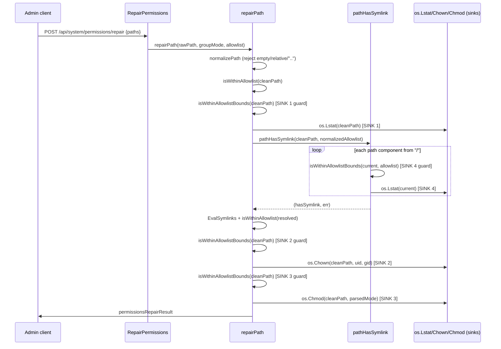

# CodeQL go/path-injection Fix — `system_permissions_handler.go` (4 sinks)

Status: Implemented — as-built mechanism differs from the original §3.1/§3.2
design; see §1.4 for what was actually shipped and why.
Date: 2026-08-03
Scope: Backend only (no API contract, DB schema, or frontend changes)

## 1. Introduction

### 1.1 Overview

A fresh local CodeQL Go scan (suite `go-security-and-quality.qls`) confirms
CI's originally-reported finding **plus three more** `go/path-injection`
findings (CWE-22/23/36/73/99), all in the same file:

| # | Line | Sink | Enclosing function |
|---|---|---|---|
| 1 | 148 | `os.Lstat(cleanPath)` | `repairPath` |
| 2 | 249 | `os.Chown(cleanPath, uid, gid)` | `repairPath` |
| 3 | 267 | `os.Chmod(cleanPath, parsedMode)` | `repairPath` |
| 4 | 391 | `os.Lstat(current)` | `pathHasSymlink` (called from `repairPath`) |

All four share the same taint source: `permissionsRepairRequest.Paths
[]string` → `SystemPermissionsHandler.RepairPermissions` → `repairPath`.
Every sink already runs strictly *after* multiple layers of real path
validation (absoluteness check, `..`-rejection, and allowlist-containment
via `isWithinAllowlist`, plus — for sink 4 — a component-wise symlink walk).
Functionally, an attacker cannot reach any of these four sinks with an
unvalidated path today. CodeQL still flags all four because its dataflow
analysis does not credit `isWithinAllowlist`'s `filepath.Rel`-based
containment check as a sanitizer for *any* of them — not because of a
missing check, but because that check's implementation idiom
(`filepath.Rel` + prefix/`".."`-string comparison, in effect a "compute a
relative path and inspect it" pattern) is not one CodeQL's Go
path-injection query recognizes as a barrier, regardless of which function
it runs in or how close it sits to a sink.

### 1.2 Objective

Introduce **one** reusable, `strings.HasPrefix`-based containment helper
(`isWithinAllowlistBounds`) — the idiom CodeQL's Go dataflow analysis does
recognize as a sanitizer — and invoke it **inline, immediately before each
of the four sink calls, in the same function as that sink**, using
whichever variable actually reaches that sink. This closes all four
findings with a single coherent pattern, applied consistently, without
changing any externally observable behavior of `POST
/api/system/permissions/repair` or `GET /api/system/permissions`.

This revises and supersedes the previous version of this plan, which
covered only finding 4 (line 391). Finding 4's design (restructuring
`pathHasSymlink`) is unchanged from that version; findings 1-3 are new.

### 1.3 Non-goals

- No change to the HTTP contract (request/response shapes, status codes,
  error codes) of `GET /api/system/permissions` or
  `POST /api/system/permissions/repair`.
- No change to `normalizePath`, `containsParentReference`, or
  `isWithinAllowlist`'s existing semantics or call sites at lines 139/211 —
  those functions are not flagged sinks and are working correctly; they
  stay exactly as-is and continue to run before every new guard introduced
  here.
- No frontend, database, or E2E changes — this handler's behavior toward
  the browser is unchanged, so no Playwright coverage is added or modified.
- **Out of scope**: the separate `go/path-injection`-adjacent
  cookie-suppression finding at `backend/internal/api/handlers/auth_handler.go:191`
  is a distinct pre-existing, non-blocking warning on an unrelated code
  path, tracked separately in `docs/issues/`. This PR must not touch
  `auth_handler.go` at all, and must not regress that finding's status
  (neither fixing nor worsening it — simply leaving it untouched).

### 1.4 Implementation Note (As-Built) — mechanism changed from §3.1/§3.2

The rest of this document (§3 in particular) describes the *original*
design as reviewed and approved: one shared `isWithinAllowlistBounds`
helper, called inline at all four sink sites. **That exact design did not
close the CodeQL findings when implemented.** A fresh scan after wiring it
in at all four sites (per §3.2 verbatim) still reported all 4 original
`go/path-injection` results, unchanged.

Root cause, confirmed empirically across three implementation iterations:
CodeQL's Go `PrefixCheck` sanitizer guard (in
`semmle/go/security/TaintedPathCustomizations.qll`) only recognizes a
`strings.HasPrefix(taintedVar, ...)` call as a barrier when:
1. it is a **direct call**, literally in the same function as the sink —
   not routed through a separate helper function (confirmed: calling
   `isWithinAllowlistBounds`, which itself calls `strings.HasPrefix`
   internally, was not recognized, regardless of how close the call sat to
   the sink);
2. it is **not inside a loop with a `break`** funneling into a boolean
   flag checked afterward (confirmed: an inlined loop-plus-break version,
   still calling `strings.HasPrefix` directly but inside a `for` loop, was
   also not recognized); and
3. the tainted value is the **bare, unmodified `arg0`** of the call — not
   wrapped in a string concatenation such as `cleanPath+sep` (confirmed:
   concatenating a separator onto the checked value, to fold the
   equals-vs-descendant cases into one comparison, broke recognition even
   in an otherwise-correct straight-line guard).

**What was actually built instead** (production code, both sink
locations):
- A small helper, `firstAllowlistPrefix(current, allowlist) string`,
  determines which allowlist root (if any) `current` falls under and
  returns the exact prefix string to confirm against (or `""` if none
  match). This lookup does **not** need to be CodeQL-recognized — it is
  not itself security load-bearing, since `isWithinAllowlist` (line ~139)
  already gated the value before this runs.
- Immediately after, a single **straight-line**, non-loop guard sits
  directly in the sink's own function, using the bare tainted variable as
  `arg0`:
  ```go
  requiredPrefix := firstAllowlistPrefix(cleanPath, normalizedAllowlist)
  if requiredPrefix == "" || !strings.HasPrefix(cleanPath, requiredPrefix) {
      return permissionsRepairResult{ /* permissions_outside_allowlist */ }
  }
  ```
  This *is* recognized by CodeQL as a barrier for `cleanPath`.
- For sinks 1–3 (all in `repairPath`, all using `cleanPath`, which is
  never reassigned after normalization), **one** such guard — computed
  once, right after the existing `isWithinAllowlist` check — dominates all
  three sinks via ordinary CFG dominance. It does not need to be repeated
  at each sink; CodeQL's recognition is about the call's shape and
  location (same function, direct, non-loop, bare arg0), not textual
  adjacency to the sink. This is a **simplification** relative to §3.2's
  three separate inline guards.
- For sink 4 (`pathHasSymlink`), the guard checks `clean` (the normalized
  full path) **once**, at the top of the function, rather than
  per-component against `current` inside the walk loop. Every `current`
  value used at the `os.Lstat` sink is derived exclusively from that
  already-guarded `clean` via `filepath.Clean`/`strings.Split`/
  `filepath.Join`, so the single top-of-function guard covers the whole
  walk. (The original §3.2 per-component design would have needed a
  `strings.HasPrefix(root, current+sep)` "ancestor of root" comparison
  with the *safe* value as `arg0` and the *tainted* `current` as `arg1` —
  CodeQL's `PrefixCheck` only protects `arg0`, so that direction could
  never have been recognized regardless of loop/helper structure. Guarding
  the walk's known-safe source once, up front, sidesteps this instead of
  trying to make the per-component ancestor check itself recognizable.)
- `isWithinAllowlistBounds` was deleted (along with its dedicated test)
  after a review pass flagged it as dead code once the above became the
  real production mechanism — it was never called from anywhere except its
  own test. `firstAllowlistPrefix` was deliberately **not** consolidated
  with the existing `isWithinAllowlist`: doing so would either move the
  recognized `strings.HasPrefix` call back behind a function boundary
  (unrecognized again) or require changing `isWithinAllowlist`'s existing,
  separately-tested `filepath.Rel`-based semantics, which §1.3 explicitly
  keeps out of scope.

Net effect: same security property, same external behavior, same four
findings closed — but via one dominating straight-line guard per
function (two total: one in `repairPath`, one in `pathHasSymlink`) rather
than four separately-invoked calls to a shared helper. §3, §4, §5, §7, and
§9 below still describe the original approved design and are retained for
historical/review-trail purposes; where they conflict with this section on
mechanism, this section (§1.4) reflects what is actually in the code as of
commit `0d7c3e4a` (production landing) plus the follow-up dead-code-removal
commit.

## 2. Research Findings (Confirmed Against Source)

Full file read: `backend/internal/api/handlers/system_permissions_handler.go`
(459 lines) and its test file
`backend/internal/api/handlers/system_permissions_handler_test.go` (591
lines). All line numbers below are current as of this read.

### 2.1 Call chain (confirmed, all four sinks)

```
POST /api/system/permissions/repair
  -> SystemPermissionsHandler.RepairPermissions   (line 85)
       requireAdmin(c)                             (line 86)
       h.cfg.SingleContainer check                 (line 91)
       os.Geteuid() == 0 check                      (line 100)
       bind permissionsRepairRequest{Paths []string} (line 109)
       allowlist := h.allowlistRoots()              (line 116)
       for each rawPath -> h.repairPath(rawPath, groupMode, allowlist)  (line 119)

  -> SystemPermissionsHandler.repairPath            (line 127)
       cleanPath, invalidCode := normalizePath(rawPath)          (line 128)
       normalizedAllowlist := normalizeAllowlist(allowlist)      (line 138)
       isWithinAllowlist(cleanPath, normalizedAllowlist)         (line 139)  <- existing containment check #1 (NOT a CodeQL-recognized sanitizer)
       info, err := os.Lstat(cleanPath)                           (line 148)  <- SINK 1
       info.Mode()&os.ModeSymlink != 0 (leaf symlink reject)      (line 166)
       hasSymlinkComponent, symlinkErr := pathHasSymlink(cleanPath)   (line 175)  <- calls into SINK 4's function
       resolved, err := filepath.EvalSymlinks(cleanPath)          (line 201)
       isWithinAllowlist(resolved, normalizedAllowlist)           (line 211)  <- existing containment check #2 (post-resolution, also not recognized)
       ... type check ...
       os.Chown(cleanPath, uid, gid)                              (line 249)  <- SINK 2
       ... parse mode ...
       os.Chmod(cleanPath, parsedMode)                            (line 267)  <- SINK 3

  -> pathHasSymlink(path string) (bool, error)      (lines 382-400)
       clean := filepath.Clean(path)
       parts := strings.Split(clean, sep)
       current := sep  // "/"
       for each part:
         current = filepath.Join(current, part)
         info, err := os.Lstat(current)   // <-- line 391, SINK 4
         if symlink -> return true, nil
       return false, nil
```

**Key observation for sinks 1-3**: unlike sink 4 (in a different function,
`pathHasSymlink`), sinks 1-3 are in `repairPath` itself, and `cleanPath`
(the exact value each sink uses) is the *same* value `isWithinAllowlist`
already validated at line 139, a few or dozens of lines earlier in the same
function. CodeQL still flags them. This confirms the root cause is not
"the check runs in the wrong function" (as it was framed for sink 4 in
isolation) but that **`isWithinAllowlist`'s `filepath.Rel`-based idiom is
never recognized as a sanitizer, in any function, at any distance from the
sink**. The fix for all four sinks must therefore use the same
recognized-idiom helper, placed inline immediately before each sink.

### 2.2 Exact current logic of each function (verbatim behavior, for the fix to preserve)

**`normalizePath(rawPath string) (string, string)`** (line 341) — returns
`("", "permissions_invalid_path")` for empty or non-absolute input, or if
`filepath.Clean` collapses to `.`/`..`, or if `containsParentReference`
finds a literal `..` segment; otherwise returns `(clean, "")`.

**`containsParentReference(clean string) bool`** (line 358) — true if
`clean == ".."`, starts with `../`, contains `/../`, or ends with `/..`.

**`isWithinAllowlist(path string, allowlist []string) bool`** (line 402) —
for each `root`, computes `filepath.Rel(root, path)`; treats `path` as
contained if `rel == "."` or (`rel` doesn't start with `../` and `rel !=
".."`). Returns `false` if no root matches. **Not being changed** — not a
sink, CodeQL does not flag it, its two existing call sites (139, 211) keep
their exact current behavior and error codes.

**`allowlistRoots() []string`** (line 304) — returns
`[dataRoot, cfg.ConfigRoot, cfg.CaddyLogDir, cfg.CrowdSecLogDir]`.
Admin-configured, not attacker-controlled.

**`pathHasSymlink(path string) (bool, error)`** (line 382) — `filepath.Clean`s
the input, splits on the OS separator, walks the path one component at a
time from `/`, `Lstat`-ing every successive prefix. Returns `(true, nil)`
the moment any prefix is a symlink; `(false, err)` if any `Lstat` fails
(including not-exist); `(false, nil)` if the walk completes clean. TOCTOU-safe
by design: re-verifies every component instead of trusting one resolved
path.

**`repairPath`** (line 127) — orchestrates: normalize → allowlist check #1
→ **Lstat (SINK 1)** → leaf-symlink reject → `pathHasSymlink` (which itself
contains **SINK 4**) → `EvalSymlinks` → allowlist check #2 (on resolved
path) → type check → ownership/mode comparison → **Chown (SINK 2)** →
parse mode → **Chmod (SINK 3)**. Every branch returns a
`permissionsRepairResult` with a stable `ErrorCode`.

### 2.3 Sink-by-sink detail

**Sink 1 — line 148, `os.Lstat(cleanPath)`.** Immediately follows the
line-139 `isWithinAllowlist` block (closing brace at 146, blank line 147).
`cleanPath` is unchanged since normalization. This is the handler's initial
existence + leaf-symlink probe.

**Sink 2 — line 249, `os.Chown(cleanPath, uid, gid)`.** By this point
`cleanPath` has passed: line-139 `isWithinAllowlist`, line-148 `Lstat` +
leaf-symlink check (166), `pathHasSymlink` component walk (175),
`EvalSymlinks` (201), and `isWithinAllowlist(resolved, ...)` (211,
operating on the *resolved* path). Note `os.Chown` itself still operates on
**`cleanPath`**, the pre-resolution path, not `resolved` — this is existing,
unchanged behavior (chown-by-path rather than chown-by-fd); this plan does
not alter that choice, only adds an inline containment guard on the exact
value (`cleanPath`) that reaches the sink.

**Sink 3 — line 267, `os.Chmod(cleanPath, parsedMode)`.** Same function,
same `cleanPath`, a few lines after `os.Chown` (which must have already
succeeded to reach this line, since a `Chown` error returns early at
250-256).

**Sink 4 — line 391, `os.Lstat(current)` inside `pathHasSymlink`.** As
previously documented: `current` is a value built incrementally via
`filepath.Join` inside a loop, not the `path` parameter directly, and the
function is one call-frame away from `repairPath`'s containment checks.

### 2.4 Why a single shared helper, invoked inline, fixes all four

`isWithinAllowlistBounds` (below) uses `strings.HasPrefix`, a pattern
CodeQL's Go security query pack recognizes as a path-injection sanitizer
when it directly guards the sink's value via an `if` in the same function.
Reusing one helper at all four call sites satisfies "one coherent
sanitization approach applied consistently" while keeping the actual
containment logic in exactly one place (DRY) — only the four thin `if
!isWithinAllowlistBounds(...) { return ... }` guard statements are
duplicated, which is a deliberate, minimal exception to DRY made because
CodeQL's sanitizer recognition is sensitive to the guard appearing
literally inline in the sink's own function; wrapping the guard itself in
a further helper (e.g. a shared "check-and-build-error-result" function)
would reintroduce the same cross-function indirection that caused
`isWithinAllowlist` to go unrecognized in the first place, so that
extra layer is deliberately avoided.

## 3. Technical Specifications

### 3.1 Design

**Shared helper** (new, used by all four sinks):

```go
// isWithinAllowlistBounds reports whether current is safe to pass to a
// filesystem sink (Lstat/Chown/Chmod) at this point in the request flow:
// either current is within (or equal to) one of allowlist's roots, or
// current is an ancestor directory encountered while walking down from
// "/" toward one (required by pathHasSymlink's component-by-component
// walk, which necessarily passes through shorter prefixes before
// reaching a configured root). Comparisons always anchor on the OS path
// separator so "/foo" is never mistaken for a prefix of "/foobar".
func isWithinAllowlistBounds(current string, allowlist []string) bool {
	sep := string(os.PathSeparator)
	if current == sep {
		return true
	}
	for _, root := range allowlist {
		if root == "" {
			continue
		}
		if root == sep {
			return true
		}
		if current == root {
			return true
		}
		if strings.HasPrefix(current, root+sep) {
			return true
		}
		if strings.HasPrefix(root, current+sep) {
			return true
		}
	}
	return false
}
```

**Edge case fixed during review — `root == "/"`:** without the `if root ==
sep { return true }` line above, an allowlist root that normalizes to
exactly `/` breaks the prefix check: `root+sep` becomes `"//"`, and
`strings.HasPrefix("/somefile", "//")` is `false` for any real
single-leading-slash absolute path, so the helper would incorrectly return
`false` for every `current` under a root of `/` — even though the existing
`isWithinAllowlist` (line 139, `filepath.Rel`-based) correctly returns
`true` for the same input (`filepath.Rel("/", "/somefile") == "somefile"`,
no `../` prefix). A root of exactly `/` is reachable only through
admin misconfiguration (e.g. `CHARON_CADDY_CONFIG_ROOT=/`, or a
`CHARON_DB_PATH` such that `dataRoot := filepath.Dir(cfg.DatabasePath) ==
"/"` — both are plain env-var inputs per `backend/internal/config/config.go`
lines 103-104, not attacker-controlled request data, but a helper meant to
be behaviorally equivalent to `isWithinAllowlist` must not silently
diverge from it for any admin-reachable configuration). The dedicated
`root == sep` check above mirrors the existing `current == sep` check and
closes this gap; see §5.2 test #8 for its regression test. With this fix,
the helper is a strict superset of `isWithinAllowlist`'s containment
decisions for every root value reachable through configuration — the
narrower "zero externally observable behavior change" claim in §1.2/§3.1
holds for all admin-configurable inputs, not just the common case.

This one function is invoked at all four sink sites. Because
`normalizePath`/`containsParentReference` already reject any `..` segment
before `repairPath` calls any sink, and `isWithinAllowlist` (line 139) has
already gated `cleanPath` against `normalizedAllowlist` by the time any of
sinks 1-3 run, and containment-in-a-root trivially implies
"within-or-ancestor-of a root" — **every one of the four new inline guards
is structurally unreachable-as-a-rejector when invoked via `repairPath`'s
real call path.** This mirrors the proof already established for sink 4 in
the prior version of this plan, extended to sinks 1-3. Each guard's sole
purpose is to give CodeQL a recognizable, in-function sanitizer directly on
the value passed to its sink; each remains independently testable via
direct unit tests of `isWithinAllowlistBounds` itself (§5).

**Note on this proof's dependency on the `root == sep` fix above:** the
"structurally unreachable-as-a-rejector" claim holds only because
`isWithinAllowlistBounds` is a strict superset of `isWithinAllowlist`'s
containment decisions for every admin-reachable root value — i.e. it never
returns `false` for a `current`/`root` pair that `isWithinAllowlist` would
have accepted. Before the `root == sep` special case was added, that
superset property did not hold for a root normalized to exactly `/`, which
would have meant the sink-1/2/3 guards were *not* actually unreachable in
that admin-misconfiguration case and the "zero externally observable
behavior change" claim in §1.2 would not have been universally true. This
was caught in review (see the callout under the code block above) and
fixed; with the fix in place, the superset property — and therefore this
unreachability proof — holds for all configuration inputs.

### 3.2 Exact signature and logic changes

**File**: `backend/internal/api/handlers/system_permissions_handler.go`

#### New: sentinel error and shared helper

```go
var errPathEscapesAllowlist = errors.New("path escapes allowed roots during traversal")
```

(`errors` already imported.) Plus `isWithinAllowlistBounds` from §3.1,
placed near `isWithinAllowlist` (e.g. immediately after it).

#### Sink 4 — `pathHasSymlink` (unchanged from prior plan version)

Before:

```go
func pathHasSymlink(path string) (bool, error) {
	clean := filepath.Clean(path)
	parts := strings.Split(clean, string(os.PathSeparator))
	current := string(os.PathSeparator)
	for _, part := range parts {
		if part == "" {
			continue
		}
		current = filepath.Join(current, part)
		info, err := os.Lstat(current)
		if err != nil {
			return false, err
		}
		if info.Mode()&os.ModeSymlink != 0 {
			return true, nil
		}
	}
	return false, nil
}
```

After:

```go
// pathHasSymlink walks path component-by-component from the filesystem
// root, Lstat-ing every successive prefix, to TOCTOU-safely detect a
// symlink anywhere in the chain (not just at the leaf). allowlist is the
// normalized set of admin-configured safe roots; it re-validates that
// every prefix stays within (or is a legitimate ancestor of) one of those
// roots immediately before each Lstat, so the value passed to the sink is
// always guarded inline at the point of use.
func pathHasSymlink(path string, allowlist []string) (bool, error) {
	clean := filepath.Clean(path)
	parts := strings.Split(clean, string(os.PathSeparator))
	current := string(os.PathSeparator)
	for _, part := range parts {
		if part == "" {
			continue
		}
		current = filepath.Join(current, part)
		if !isWithinAllowlistBounds(current, allowlist) {
			return false, fmt.Errorf("%w: %s", errPathEscapesAllowlist, current)
		}
		info, err := os.Lstat(current)
		if err != nil {
			return false, err
		}
		if info.Mode()&os.ModeSymlink != 0 {
			return true, nil
		}
	}
	return false, nil
}
```

Call site, `repairPath` (was line 175):

```go
hasSymlinkComponent, symlinkErr := pathHasSymlink(cleanPath, normalizedAllowlist)
```

`normalizedAllowlist` is already computed at line 138 — no new
computation, just passing the existing local variable through. No change
to `repairPath`'s error-mapping block (176-191): `errPathEscapesAllowlist`
is not `os.IsNotExist`, falls through to the existing generic
`permissions_repair_failed` branch, exactly like any other unexpected
`pathHasSymlink` error today.

#### Sinks 1-3 — inline guards added directly in `repairPath`

`repairPath`'s signature is unchanged (`(rawPath string, groupMode bool,
allowlist []string) permissionsRepairResult`) — `normalizedAllowlist` is
already in scope at every point below, computed once at line 138.

**Sink 1** — before:

```go
	info, err := os.Lstat(cleanPath)
```

after:

```go
	if !isWithinAllowlistBounds(cleanPath, normalizedAllowlist) {
		return permissionsRepairResult{
			Path:      cleanPath,
			Status:    "error",
			ErrorCode: "permissions_outside_allowlist",
			Message:   "path outside allowlist",
		}
	}

	info, err := os.Lstat(cleanPath)
```

**Sink 2** — before:

```go
	if err := os.Chown(cleanPath, uid, gid); err != nil {
```

after:

```go
	if !isWithinAllowlistBounds(cleanPath, normalizedAllowlist) {
		return permissionsRepairResult{
			Path:      cleanPath,
			Status:    "error",
			ErrorCode: "permissions_outside_allowlist",
			Message:   "path outside allowlist",
		}
	}

	if err := os.Chown(cleanPath, uid, gid); err != nil {
```

**Sink 3** — before:

```go
	if err := os.Chmod(cleanPath, parsedMode); err != nil {
```

after:

```go
	if !isWithinAllowlistBounds(cleanPath, normalizedAllowlist) {
		return permissionsRepairResult{
			Path:      cleanPath,
			Status:    "error",
			ErrorCode: "permissions_outside_allowlist",
			Message:   "path outside allowlist",
		}
	}

	if err := os.Chmod(cleanPath, parsedMode); err != nil {
```

All three reuse the identical `permissionsRepairResult` literal already
used at line 139-146 (`permissions_outside_allowlist` / "path outside
allowlist") — no new error code introduced.

### 3.3 Data flow (after fix)



### 3.4 Error handling / edge cases (all preserved)

| Case | Existing behavior | Behavior after fix |
|---|---|---|
| Relative or empty path | `permissions_invalid_path` (`normalizePath`, before any sink) | unchanged |
| Path containing `..` | `permissions_invalid_path` | unchanged |
| Path outside allowlist | `permissions_outside_allowlist` (caught at line 139, before sink 1) | unchanged — new sink-1/2/3 guards cannot fire here either, since line 139 already rejected it |
| Leaf is a symlink | `permissions_symlink_rejected` (line-166 check, after sink 1) | unchanged |
| Intermediate component is a symlink | `permissions_symlink_rejected` (inside `pathHasSymlink`, after sink-4 guard passes) | unchanged — new guard passes (current is within/ancestor-of an allowed root), `Lstat` still runs, symlink still detected |
| Path does not exist (leaf) | `permissions_missing_path` (sink-1 `os.Lstat` before `pathHasSymlink`) | unchanged |
| Path vanishes between sink-1 Lstat and the `pathHasSymlink` walk (TOCTOU) | `pathHasSymlink` returns `(false, *PathError)`; `os.IsNotExist` true → `permissions_missing_path` | unchanged |
| Chown fails (permission/EROFS) | `ErrorCode` via `mapRepairErrorCode` (unchanged) | unchanged — new sink-2 guard cannot fire, runs before the existing Chown error handling |
| Chmod fails | `ErrorCode` via `mapRepairErrorCode` (unchanged) | unchanged — new sink-3 guard cannot fire |
| `pathHasSymlink` called directly (unit test) with a path outside the given allowlist | N/A (old signature took no allowlist) | new: returns `(false, error)` wrapping `errPathEscapesAllowlist`; distinguishable from a not-exist error via `errors.Is`, not `os.IsNotExist` |
| Symlink inside allowlist pointing to a target outside the allowlist | Rejected at `pathHasSymlink` stage with `permissions_symlink_rejected`; `EvalSymlinks`/second `isWithinAllowlist` never reached | unchanged |
| Prefix-confusion (`/data/allowed-evil` vs allowlist root `/data/allowed`) | Already rejected by `isWithinAllowlist`'s `filepath.Rel` logic at line 139/211 | unchanged in outcome; also correctly rejected if it somehow reached any of the new `isWithinAllowlistBounds` guards, since they anchor comparisons on `root+sep`/`current+sep` |

No new HTTP status codes, no new externally visible `error_code` values, no
change to `permissionsRepairResult` JSON shape.

## 4. Files Affected

| File | Change |
|---|---|
| `backend/internal/api/handlers/system_permissions_handler.go` | New `isWithinAllowlistBounds` helper; new `errPathEscapesAllowlist` sentinel; `pathHasSymlink` signature change (+`allowlist []string`); three new inline guards in `repairPath` (before sinks 1/2/3); one call-site update in `repairPath` (sink 4) |
| `backend/internal/api/handlers/system_permissions_handler_test.go` | Update 3 existing `pathHasSymlink(...)` call sites to pass an allowlist arg; add new tests for `isWithinAllowlistBounds` (including the `root == "/"` case, §5.2 #8) and integration-level coverage; correct the pre-existing `TestSystemPermissionsHandler_RepairPath_LstatInvalidArgument` test to genuinely exercise sink 1's `os.Lstat` error branch (see §5, §5.6) |
| `docs/plans/current_spec.md` | This plan (revised in place) |

Confirmed **no changes needed** to:
- `.gitignore` — already excludes `*.sarif`, `codeql-db*/`, `codeql-agent-results/` etc.; nothing new is produced by this fix.
- `.dockerignore` — no new files, directories, or build artifacts introduced.
- `codecov.yml` (repo uses this filename, not `.codecov.yml`) — no new package/path introduced; existing per-file coverage rules for `backend/internal/api/handlers/**` already apply.
- `Dockerfile` — pure Go source change in an existing package; no new dependency, build step, or file.
- `ARCHITECTURE.md` — no change to system architecture, tech stack, directory layout, deployment model, or integration points; internal hardening of an already-documented Path Traversal defense (ARCHITECTURE.md:707 lists Path Traversal under the WAF layer's detection categories — unrelated to this backend-only fix).
- `internal/models` / `AutoMigrate` — no schema change.
- Frontend (`frontend/**`) — no API contract change, so no client code, hooks, or Playwright specs are affected.
- `backend/internal/api/handlers/auth_handler.go` — explicitly untouched; the unrelated `auth_handler.go:191` finding is out of scope (§1.3).

## 5. Test Plan

All tests live in
`backend/internal/api/handlers/system_permissions_handler_test.go`.

### 5.1 Update existing tests (mechanical, no behavior change)

`TestSystemPermissionsHandler_PathHasSymlink` (currently lines 180-203):
update all three call sites to the new two-arg signature, passing
`[]string{root}` (the test's own `t.TempDir()`) as the allowlist. Assertions
unchanged:
- `pathHasSymlink(plainPath, []string{root})` → `(false, nil)`
- `pathHasSymlink(symlinkedPath, []string{root})` → `(true, nil)` (symlinked intermediate directory)
- `pathHasSymlink(filepath.Join(root, "missing", "file.txt"), []string{root})` → error, `os.IsNotExist(err)` true

### 5.2 New unit tests for `isWithinAllowlistBounds` (shared by all 4 sinks)

Add a new test function, e.g. `TestIsWithinAllowlistBounds`, covering the
decision logic in full — this single table fully exercises the helper used
at all four call sites, so it is not duplicated per sink:

1. **Contained-in-root** — `current = /foo/bar`, `root = /foo` → `true`.
2. **Exactly equal to root** — `current = /foo`, `root = /foo` → `true`.
3. **Ancestor-of-root** — `current = /foo`, `root = /foo/bar/baz` → `true`
   (proves the "current is a legitimate ancestor while walking toward
   root" branch, exercised in practice by `pathHasSymlink`'s per-component
   walk).
4. **Universal ancestor** — `current = /` → `true` for any allowlist.
5. **Prefix-confusion boundary** — `root = /foo`: `current = /foobar` →
   `false`; `current = /foo/bar` → `true`; `current = /fo` → `false` (not a
   real ancestor on a component boundary). Explicitly covers the
   `/data/allowed` vs `/data/allowed-evil` class of bug.
6. **No match** — `current` in a directory unrelated to any allowlist root
   → `false`.
7. **Empty/blank allowlist entries skipped** — an allowlist containing `""`
   does not cause a false match.
8. **Root normalized to exactly `/`** — `root = /`, `current = /somefile` →
   `true`. Regression test for the review-caught edge case (§3.1 callout):
   without the dedicated `root == sep` branch, `root+sep` becomes `"//"`
   and `strings.HasPrefix("/somefile", "//")` is `false`, so this case
   would incorrectly return `false` even though `isWithinAllowlist` (line
   139) accepts it (`filepath.Rel("/", "/somefile") == "somefile"`, no
   `../` prefix). Reachable only via admin misconfiguration
   (`CHARON_CADDY_CONFIG_ROOT=/`, or a `CHARON_DB_PATH` whose directory is
   `/`), not attacker input — but the helper must still match
   `isWithinAllowlist`'s decision for it.

### 5.3 New unit tests for `pathHasSymlink`'s own guard (sink 4)

Reused from the prior plan version, `TestPathHasSymlink_AllowlistBounds` (or
folded into `TestSystemPermissionsHandler_PathHasSymlink`):

1. **Path outside the given allowlist, no symlink involved** — a plain file
   in a *different* `t.TempDir()` than the allowlist root. Expect
   `pathHasSymlink(outsidePath, []string{otherRoot})` to return
   `(false, err)` with `errors.Is(err, errPathEscapesAllowlist)` true, and
   `os.IsNotExist(err)` false (proves the two error classes are
   distinguishable, matching how `repairPath` branches on them).
2. **Ancestor-of-root traversal does not falsely reject** — allowlist root
   nested several levels deep (e.g. `t.TempDir()/a/b/c`), target file inside
   it; confirm `pathHasSymlink` still walks and returns `(false, nil)`
   correctly.

This is the only one of the four sinks whose guard can be driven to its
*reject* branch through a standalone, direct function call — because
`pathHasSymlink` has no mandatory upstream gate when invoked outside
`repairPath`. See §5.5 for why sinks 1-3 differ.

### 5.4 Integration-level regression coverage through `repairPath` (all 4 sinks, via existing + one new subtest)

- `TestSystemPermissionsHandler_RepairPath_Branches` (existing table-style
  test): all existing subtests (invalid path, missing path, symlink leaf,
  symlink component, outside allowlist x2, unsupported type, already-correct)
  continue to pass unmodified — `repairPath`'s external behavior is
  identical; it now additionally routes through the sink-1/2/3 guards
  internally.
- `TestSystemPermissionsHandler_RepairPath_RepairedBranch` (existing,
  exercises the full success path) — this test already drives execution
  through sinks 2 and 3 (`Chown`/`Chmod`), so it exercises the *true*
  (pass-through) branch of the two new guards there "for free," with zero
  new test code required. Note this explicitly in the PR description so
  reviewers don't expect new tests solely for that.
- Add one new subtest to `TestSystemPermissionsHandler_RepairPath_Branches`,
  e.g. `"symlink escaping allowlist rejected"`: create `outsideDir :=
  t.TempDir()` distinct from `allowRoot`, a real file inside it, then
  `link := filepath.Join(allowRoot, "escape-link")` symlinked to that
  outside file. Call `h.repairPath(link, false, allowlist)` and assert
  `Status == "error"`, `ErrorCode == "permissions_symlink_rejected"` —
  confirms the component-wise symlink check (sink 4) still catches this
  case before `EvalSymlinks`/allowlist-check-#2 would otherwise have to,
  i.e. behavior identical to today.

### 5.5 Known, accepted coverage gap: sinks 1-3's reject branches

Unlike sink 4's guard (independently testable per §5.3, because
`pathHasSymlink` can be invoked directly without going through
`repairPath`'s sequential gates), the three new inline guards added
directly inside `repairPath` (sinks 1, 2, 3) **cannot** be driven to their
`false`/reject branch through any legitimate call to `h.repairPath(...)` or
`POST /api/system/permissions/repair`. This is a direct consequence of the
§3.1 proof: `isWithinAllowlist` (line 139) already gates `cleanPath`
before any of sinks 1-3 run, and containment-in-a-root always implies
"within-or-ancestor-of a root," so `isWithinAllowlistBounds` can never
return `false` for a `cleanPath` that already passed line 139.

Consequently:
- The underlying decision logic (`isWithinAllowlistBounds`) is fully
  branch-covered via §5.2's dedicated, standalone unit tests.
- The specific `if` guard statements at sinks 1/2/3 inside `repairPath`
  will show their `true` branch covered (via every existing `repairPath`
  test) but their `false`/`return` branch as never executed, in
  `go tool cover` output.
- This is an accepted, intentional gap — the guard exists purely to give
  CodeQL a recognizable inline sanitizer, not to add new real-world
  validation (§3.1). `scripts/go-test-coverage.sh` enforces a single
  **aggregate, repo-wide** line-coverage percentage (confirmed by reading
  the script — `go tool cover -func` `total:` line vs `CHARON_MIN_COVERAGE`),
  not a per-branch or per-file gate, so three small unreachable `return`
  blocks (2-4 lines each) do not put the 85%+ gate at risk. See §10
  (Risks) for the explicit mitigation if this assumption ever proves
  wrong.

### 5.6 Pre-existing test bug found in review: `TestSystemPermissionsHandler_RepairPath_LstatInvalidArgument`

While drafting §5.7's regression list below, review found that this existing test
(`system_permissions_handler_test.go`, currently lines 549-556) does not
test what its name and the previous version of this plan claimed:

```go
func TestSystemPermissionsHandler_RepairPath_LstatInvalidArgument(t *testing.T) {
	h := NewSystemPermissionsHandler(config.Config{}, nil, stubPermissionChecker{})
	allowRoot := t.TempDir()

	result := h.repairPath("/tmp/\x00invalid", false, []string{allowRoot})
	require.Equal(t, "error", result.Status)
	require.Equal(t, "permissions_outside_allowlist", result.ErrorCode)
}
```

**Confirmed independently against current source** (both files re-read for
this plan revision): `allowRoot` is a distinct `t.TempDir()` — a sibling
of, not an ancestor of, the hardcoded `/tmp/\x00invalid` literal — so the
path is rejected by the line-139 `isWithinAllowlist` check and the test
asserts `permissions_outside_allowlist`. It never reaches `os.Lstat`
(line 148) at all, and the test's own assertion (`permissions_outside_allowlist`,
not `permissions_repair_failed`) confirms this. Sink 1's actual
`os.Lstat` non-`IsNotExist`-error → `permissions_repair_failed` branch
(current lines 158-163) therefore has **no real test coverage today** —
a pre-existing gap, unrelated to this PR's CodeQL fix but directly
adjacent to the exact function (`repairPath`) and exact sink (`os.Lstat`,
sink 1) this PR is already modifying.

**Remediation chosen: fix the test (option (a))**, rather than merely
documenting the gap, because it was verified to be practically achievable
in a portable way. `filepath.Clean` and `filepath.Rel` operate on paths as
plain strings and pass a NUL byte through unchanged (confirmed by direct
execution: `filepath.Clean("<tmpdir>/\x00invalid")` returns the string
unmodified, and `filepath.Rel(<tmpdir>, <that path>)` returns
`("\x00invalid", nil)` — a relative path with no `../` prefix, i.e. within
the allowlist). `os.Lstat` on that same in-allowlist path fails at the
syscall layer with `invalid argument` (`EINVAL`), which is a real,
non-`IsNotExist` error — exactly the sink-1 branch this test is supposed
to cover. This is standard Linux/Go path-string behavior (not
platform-fragile like relying on filesystem-specific length limits or
permission quirks), consistent with this project's Linux-only backend
deployment target (§ARCHITECTURE.md; no Windows CI target for the Go
backend), so it is treated as a reliable, portable fix for this codebase's
actual test environment.

**Corrected test:**

```go
func TestSystemPermissionsHandler_RepairPath_LstatInvalidArgument(t *testing.T) {
	h := NewSystemPermissionsHandler(config.Config{}, nil, stubPermissionChecker{})
	allowRoot := t.TempDir()
	invalidPath := filepath.Join(allowRoot, "\x00invalid")

	result := h.repairPath(invalidPath, false, []string{allowRoot})
	require.Equal(t, "error", result.Status)
	require.Equal(t, "permissions_repair_failed", result.ErrorCode)
}
```

The only change is constructing `invalidPath` *inside* `allowRoot` instead
of using a hardcoded `/tmp/...` literal outside it, so the path clears the
line-139 allowlist check and genuinely reaches `os.Lstat`. This is a
pre-existing test-only bug fix bundled into this PR (not a new behavior
change to production code) — per CLAUDE.md's one-feature-one-PR rule it
stays in this same PR rather than spinning off a separate one; it is
scoped into **Commit 3** (§7) alongside this PR's other new coverage,
since it directly concerns sink 1, the exact code this PR is hardening.

### 5.7 Regression coverage (must still pass unmodified)

- `TestSystemPermissionsHandler_HelperFunctions` (`isWithinAllowlist`
  subtest) — unchanged function, unchanged assertions.
- `TestSystemPermissionsHandler_RepairPermissions_Success` / `_NonRoot` /
  `_NonAdmin` / `_DisabledWhenNotSingleContainer` / `_InvalidJSON*` —
  untouched code paths.
- `TestSystemPermissionsHandler_IsWithinAllowlist_RelErrorBranch` /
  `_AllRelErrorsReturnFalse` — `isWithinAllowlist` untouched.

Note: `TestSystemPermissionsHandler_RepairPath_LstatInvalidArgument` is
**excluded** from this "must still pass unmodified" list — per §5.6, its
input and assertion are being corrected as part of this PR, not left
unmodified.

### 5.8 Coverage target

New/changed lines (`isWithinAllowlistBounds`, `errPathEscapesAllowlist`,
the sink-4 inline guard branch inside `pathHasSymlink`, and the `true`
branch of the sink-1/2/3 guards) must be fully covered by §5.2-§5.4's
tests — verify via `scripts/go-test-coverage.sh` (or the
`test-backend-coverage` skill), minimum per `CHARON_MIN_COVERAGE`
(85% per CLAUDE.md; script default 87% — whichever is in effect). The
corrected `TestSystemPermissionsHandler_RepairPath_LstatInvalidArgument`
(§5.6) additionally gives sink 1's non-`IsNotExist`-error branch its
first real coverage.

## 6. Implementation Plan

Given this is a targeted backend security-hardening fix with **zero**
change to external behavior, the standard 5-phase outline is adapted:

- **Phase 1 — Tests first (TDD red, where practical)**: `isWithinAllowlistBounds`
  is new, pure, and has no upstream dependency — write its full §5.2 test
  table against a not-yet-existing function first (red), then implement it
  (green). The `pathHasSymlink` signature change is not independently
  TDD-able in the classic sense (Go won't compile with a signature
  mismatch across production and test code in the same package), so its
  call-site updates land together with the production change, consistent
  with the prior version of this plan.
- **Phase 2 — Backend implementation**: Apply the exact changes in §3.2 to
  `system_permissions_handler.go` (all four sinks).
- **Phase 3 — Frontend implementation**: N/A — no frontend change.
- **Phase 4 — Integration and testing**: Run the full validation gate list
  (§8), including a fresh CodeQL Go scan confirming all four original
  findings are gone.
- **Phase 5 — Documentation and deployment**: No user-facing docs change
  (`docs/features.md` unaffected). Commit message per §7.

## 7. Commit Slicing Strategy

**Decision**: Single PR, three ordered commits (per CLAUDE.md: one feature
= one PR; slice commits, not PRs). This sequencing follows CLAUDE.md's
suggested pattern (foundation → backend → hardening), adapted for a
CodeQL-dataflow-shaped fix where classic TDD-red-then-green isn't fully
achievable across a Go package-scoped signature change (see §6, Phase 1).

### Commit 1 — Foundation: shared allowlist-bounds helper, no behavior change

- **Scope**: Add `isWithinAllowlistBounds` (§3.1) and its dedicated unit
  test suite (§5.2). The helper is not yet called from any production code
  path — it is used only by its own tests, so it is not dead code (Go's
  compiler does not flag unused top-level functions, and staticcheck's
  `U1000`/unused-code check treats a function referenced from same-package
  test files as used). No existing behavior changes.
- **Files**:
  - `backend/internal/api/handlers/system_permissions_handler.go` (add helper only)
  - `backend/internal/api/handlers/system_permissions_handler_test.go` (add `TestIsWithinAllowlistBounds`, §5.2)
- **Dependencies**: None.
- **Validation gate**: `cd backend && go build ./...`; `go test ./internal/api/handlers/... -run TestIsWithinAllowlistBounds` passes with full branch coverage of the new function; `make lint-fast` (staticcheck, including unused-code check) clean.

### Commit 2 — Apply the helper at all 4 sink call sites

- **Scope**: `pathHasSymlink` signature change (+`allowlist []string`,
  new `errPathEscapesAllowlist` sentinel, inline sink-4 guard) and its
  call-site update in `repairPath`; three new inline guards in `repairPath`
  immediately before sinks 1, 2, and 3 (§3.2). Mechanical update of the 3
  existing `pathHasSymlink(...)` call sites in the test file to the new
  signature (§5.1) — no new assertions, required for the package to
  compile.
- **Files**:
  - `backend/internal/api/handlers/system_permissions_handler.go`
  - `backend/internal/api/handlers/system_permissions_handler_test.go` (call-site signature updates only, §5.1)
- **Dependencies**: Commit 1 (`isWithinAllowlistBounds` must already exist).
- **Validation gate**: `cd backend && go build ./...`; full existing suite `go test ./internal/api/handlers/...` passes unmodified in its assertions (proves zero behavior regression — notably `TestSystemPermissionsHandler_RepairPath_Branches` and `TestSystemPermissionsHandler_RepairPath_RepairedBranch`, which exercise sinks 1/2/3's guards' true branch "for free," per §5.4); `make lint-fast` clean.

### Commit 3 — Hardening: new coverage + fresh CodeQL verification

- **Scope**: New test cases from §5.3 (`pathHasSymlink`'s own
  outside-allowlist/ancestor-of-root cases) and §5.4 (new
  "symlink escaping allowlist rejected" subtest). Also bundles the §5.6
  correction to the pre-existing `TestSystemPermissionsHandler_RepairPath_LstatInvalidArgument`
  test (constructing its invalid path inside the allowlist root so it
  genuinely reaches `os.Lstat`, instead of being rejected earlier by the
  allowlist check) — a small pre-existing test-only bug fix directly
  adjacent to sink 1, bundled into this commit rather than split into a
  separate PR (CLAUDE.md one-feature-one-PR rule). Run the full validation
  gate list (§8), including a fresh local CodeQL Go scan, and confirm all
  four originally-found `go/path-injection` results are gone.
- **Files**:
  - `backend/internal/api/handlers/system_permissions_handler_test.go`
- **Dependencies**: Commit 2 (needs the new signatures/symbols to exist and be wired to all sinks).
- **Validation gate**: `go test ./internal/api/handlers/...` full pass; `scripts/go-test-coverage.sh` (or `test-backend-coverage` skill) ≥ 85%; fresh `lefthook run codeql` (or `security-scan-codeql` skill) — zero of the 4 originally-found `go/path-injection` results remain for this file, zero new high/critical findings introduced, `auth_handler.go:191` unchanged (file untouched).

### Rollback / contingency

- All three commits touch only one production file and its test file; a
  `git revert` of any commit (in reverse order) is clean and independent
  of any other in-flight work (no shared migration, no API version bump,
  no frontend coupling).
- If CodeQL's Go query still flags one or more of the four sinks after
  Commit 2 (e.g. the `strings.HasPrefix` pattern needs a slightly
  different shape to match the query's exact recognized idiom, or a
  helper-function indirection is itself unrecognized for one particular
  call site), the contingency is to inline the `HasPrefix` comparisons
  directly in the affected function's guard body rather than calling
  `isWithinAllowlistBounds`, on a per-sink basis if needed — this stays
  within Commit 2's scope (or a small follow-up within the same PR before
  merge), no new commit slot required, and does not change external
  behavior guarantees.
- If `scripts/go-test-coverage.sh`'s aggregate gate is ever found to be
  per-branch rather than per-repo-total (contradicting the reading in
  §5.5), the contingency is to extract each sink's guard construction into
  a small, directly-callable, same-file helper that can be unit-tested
  standalone with a deliberately mismatched allowlist — mirroring how
  sink 4's guard achieves testability — accepting the CodeQL-recognition
  risk noted above as a secondary contingency if that extraction breaks
  recognition for those specific call sites.

## 8. Validation Gates (run in this order before considering the fix done)

1. `cd backend && go build ./...`
2. `cd backend && go test ./...`
3. `make lint-fast` or `make lint-staticcheck-only` (staticcheck — BLOCKING per CLAUDE.md)
4. `bash scripts/go-test-coverage.sh` (or `test-backend-coverage` skill) — minimum 85% (`CHARON_MIN_COVERAGE`)
5. `lefthook run codeql` (or `security-scan-codeql` skill) — confirm **all four** originally-found `go/path-injection` results (lines 148, 249, 267, 391 of `system_permissions_handler.go`) no longer appear; zero new high/critical findings introduced anywhere else. The separate `auth_handler.go:191` finding is explicitly out of scope: confirm it is unchanged (not fixed, not worsened) since `auth_handler.go` is not touched by this PR.
6. `bash scripts/local-patch-report.sh` — produces `test-results/local-patch-report.md` / `.json` (MANDATORY per CLAUDE.md Definition of Done).
7. `lefthook run pre-commit` — full pre-commit hook suite. GORM security scan (§1.5 of the DoD) is correctly skipped — this change touches no `internal/models/**` or GORM query.
8. Frontend/E2E gates (`npx playwright test`, `npm run type-check`, `npm run build` under `frontend/`) are **out of scope** — no frontend files, API contracts, or user-visible flows change. Explicitly note this in the PR description so reviewers don't expect Playwright output.

## 9. Acceptance Criteria

- [ ] CodeQL Go scan no longer reports **any** of the four originally-found `go/path-injection` results in `system_permissions_handler.go` (lines 148, 249, 267, 391 pre-edit) — verified via `lefthook run codeql` / `security-scan-codeql` skill with a clean SARIF for this file.
- [ ] `pathHasSymlink` takes `(path string, allowlist []string)` and every call site (production + tests) is updated.
- [ ] `isWithinAllowlistBounds` exists once, is used at all four sink sites, and has its own full-coverage unit test suite (§5.2).
- [ ] Three new inline guards exist in `repairPath`, immediately before `os.Lstat` (sink 1), `os.Chown` (sink 2), and `os.Chmod` (sink 3), each using `cleanPath` and `normalizedAllowlist`.
- [ ] All pre-existing tests in `system_permissions_handler_test.go` pass unmodified in their assertions, with one deliberate, documented exception: `TestSystemPermissionsHandler_RepairPath_LstatInvalidArgument`, corrected per §5.6 to genuinely exercise sink 1's `os.Lstat` error branch (for all other pre-existing tests, only `pathHasSymlink` call-site arity changes, per §5.1).
- [ ] New tests from §5.2-§5.4 pass and cover: the full `isWithinAllowlistBounds` decision table (contained/equal/ancestor/prefix-confusion/no-match/blank-entry/`root == "/"`), `pathHasSymlink`'s own outside-allowlist rejection and ancestor-of-root traversal, and symlink-inside-allowlist-pointing-outside-target rejection through `repairPath`.
- [ ] `isWithinAllowlistBounds` correctly returns `true` for a `root` normalized to exactly `/` (§3.1, §5.2 #8) — the helper never diverges from `isWithinAllowlist`'s containment decision for any admin-configurable root value.
- [ ] The corrected `TestSystemPermissionsHandler_RepairPath_LstatInvalidArgument` (§5.6) asserts `ErrorCode == "permissions_repair_failed"` (not `permissions_outside_allowlist`) and genuinely reaches `os.Lstat` before failing.
- [ ] No change to any `permissionsRepairResult` JSON field, HTTP status code, or `error_code` value observable from `POST /api/system/permissions/repair` or `GET /api/system/permissions`.
- [ ] `go build ./...`, `go test ./...`, `make lint-fast`, `scripts/go-test-coverage.sh` (≥85%), and `scripts/local-patch-report.sh` all pass with zero errors (§8).
- [ ] `.gitignore`, `codecov.yml`, `.dockerignore`, `Dockerfile`, `ARCHITECTURE.md` confirmed to need no changes (§4).
- [ ] `backend/internal/api/handlers/auth_handler.go` is not modified; its pre-existing `auth_handler.go:191` finding is unaffected.
- [ ] Commit message uses `fix(security): <vague, category-level subject>` — see note below. Must describe only the general category of hardening (input/path validation in an administrative handler) and must **not** name any function (`pathHasSymlink`, `isWithinAllowlistBounds`), the query ID (`go/path-injection`), CWE numbers, exact sink lines, or attack-vector detail, since the changelog surfaces commit subjects verbatim to every self-hosted user, including un-upgraded/still-vulnerable instances. Suggested subject: `fix(security): strengthen file path safety checks in system administration handler`. Because this PR now spans four call sites/checks rather than one, the subject should stay general enough to cover that (e.g. avoid "the symlink check" — prefer "file path safety checks," plural/general). Avoid naming "permissions repair," "chown," "chmod," "symlink," or "allowlist" in the subject line — keep specifics to the PR body/commit body only, which is not surfaced in the changelog.

## 10. Risks & Mitigations

| Risk | Mitigation |
|---|---|
| CodeQL's query doesn't recognize the exact `strings.HasPrefix` shape chosen for one or more of the four call sites (sensitive to same-function-as-sink placement, variable naming, or helper extraction) — recognition could plausibly differ per call site even though the helper is identical, since query engines sometimes behave differently based on surrounding control flow | Contingency in §7 (Rollback/contingency) — inline the check directly in the affected function's guard body instead of calling the shared helper, on a per-sink basis if needed; re-run `lefthook run codeql` after Commit 2 to confirm all four are resolved before proceeding to Commit 3, and again after Commit 3 as the final gate. |
| New `isWithinAllowlistBounds` guards accidentally narrow what `repairPath`/`pathHasSymlink` accept, causing a false rejection in production | §3.1 gives a structural proof that none of the four guards can reject any input that reaches them via the real call path (containment at line 139 implies within-or-ancestor at every later point). §5.2 test #3 and §5.3 test #2 explicitly exercise ancestor-of-root traversal to catch any implementation slip from this proof. §5.4 confirms the full existing `repairPath` regression suite (all branches) still passes unmodified. |
| Sinks 1-3's guard `false`/reject branches are permanently uncovered by `go tool cover`, since they are structurally unreachable via any legitimate call path (§5.5) | Confirmed acceptable: `scripts/go-test-coverage.sh` gates on a single aggregate repo-wide percentage, not per-branch/per-file; the underlying decision logic is separately, fully unit-tested via `isWithinAllowlistBounds`'s own test suite (§5.2). If this assumption about the coverage tool's enforcement granularity is later found wrong, see §7's rollback/contingency for the extraction-based fallback. |
| Coverage regression on the modified file pulls overall backend coverage under 85% | §5.2-§5.4 size the new test cases to fully cover every new branch that is reachable; `isWithinAllowlistBounds` is directly unit-testable without needing to go through HTTP handler plumbing. |
| Reviewers expect Playwright/E2E evidence per the standard DoD checklist | §8 explicitly documents why E2E is out of scope (no API/UI contract change) so this isn't mistaken for a skipped step. |
| Scope creep / accidental edits to `auth_handler.go` while working in the same package | §1.3 and §9 explicitly call out `auth_handler.go` as out of scope; PR diff review should confirm zero changes to that file before merge. |
