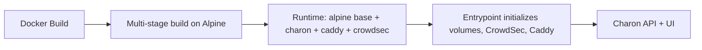

## 1. Introduction

This plan defines the migration of the Charon Docker image base from
Debian Trixie Slim to Alpine Linux to address inherited glibc CVEs and
reduce image size (Issue #631). The plan consolidates the prior Alpine
migration research and translates it into a minimal-change, test-first
implementation path aligned with current CI and container workflows.

Objectives:

- Replace Debian-based runtime with Alpine 3.23.x while maintaining
  feature parity.
- Eliminate Debian glibc HIGH CVEs in the runtime image.
- Keep build stages compatible with multi-arch Buildx and existing
  supply chain checks.
- Validate DNS resolution, SQLite (CGO) behavior, and security suite
  functionality under musl.
- Review and update .gitignore, codecov.yml, .dockerignore, and
  Dockerfile as needed.

## 2. Research Findings

### 2.1 Existing Plans and Security Context

- Alpine migration specification already exists and is comprehensive:
  docs/plans/alpine_migration_spec.md.
- Debian CVE acceptance is temporary and explicitly tied to Alpine
  migration:
  docs/security/VULNERABILITY_ACCEPTANCE.md.
- Past Alpine-related issues and trade-offs are documented, including
  musl DNS differences:
  docs/analysis/crowdsec_integration_failure_analysis.md.

### 2.2 Current Docker and CI Touchpoints

Primary files that must be considered for the migration:

- Dockerfile (multi-stage build with Debian runtime base).
- .docker/docker-entrypoint.sh (uses user/group management and tools
  that differ on Alpine).
- .docker/compose/docker-compose.yml (image tag references).
- .github/workflows/docker-build.yml (base image digest resolution and
  build args).
- .github/workflows/security-pr.yml and supply-chain-pr.yml (build and
  scan behaviors depend on the container layout).
- tools/dockerfile_check.sh (package manager validation).

### 2.3 Compatibility Summary (musl vs glibc)

Based on alpine_migration_spec.md and current runtime behavior:

- Go services and Caddy/CrowdSec are Go binaries and compatible with
  musl.
- SQLite is CGO-backed; ensure CGO remains enabled and libsqlite3 is
  available under musl, then validate runtime CRUD behavior.
- DNS resolution differences are the primary operational risk;
  mitigation is available via $GODEBUG=netdns=go.
- Entrypoint uses Debian-specific user/group tools; Alpine requires
  adduser/addgroup or the shadow package.

## 3. Technical Specifications

### 3.1 Target Base Image

- Runtime base: alpine:3.23.x pinned by digest (Renovate-managed).
- Build stages: switch to alpine-based golang/node images where required
  to use apk/xx-apk consistently.
- Build-stage images should be digest-pinned when feasible. If a digest
  pin is not practical (e.g., multi-arch tag compatibility), document
  the reason and keep the tag Renovate-managed.

### 3.2 Dockerfile Changes (Stage-by-Stage)

Stages and expected changes (paths and stage names are current):

1) gosu-builder (Dockerfile):
   - Replace apt-get with apk.
   - Replace xx-apt with xx-apk.
   - Expected packages: git, clang, lld, gcc, musl-dev.

2) frontend-builder (Dockerfile):
   - Use node:24.x-alpine.
   - Keep npm_config_rollup_skip_nodejs_native settings for cross-arch
     builds.

3) backend-builder (Dockerfile):
   - Replace apt-get with apk.
   - Replace xx-apt with xx-apk.
   - Expected packages: clang, lld, gcc, musl-dev, sqlite-dev.

4) caddy-builder (Dockerfile):
   - Replace apt-get with apk.
   - Expected packages: git.

5) crowdsec-builder (Dockerfile):
   - Replace apt-get with apk.
   - Replace xx-apt with xx-apk.
   - Expected packages: git, clang, lld, gcc, musl-dev.

6) crowdsec-fallback (Dockerfile):
   - Replace debian:trixie-slim with alpine:3.23.x.
   - Use apk add curl ca-certificates (tar is provided by busybox).

7) final runtime stage (Dockerfile):
   - Replace CADDY_IMAGE base from Debian to Alpine.
   - Replace apt-get with apk add.
   - Runtime packages: bash, ca-certificates, sqlite-libs, sqlite,
     tzdata, curl, gettext, libcap, c-ares, binutils, libc-utils
     (for getent), busybox-extras or coreutils (for timeout),
     libcap-utils (for setcap).
   - Add ENV GODEBUG=netdns=go to mitigate musl DNS edge cases.

### 3.3 Entrypoint Adjustments

File: .docker/docker-entrypoint.sh

Functions and command usage that must be Alpine-safe:

- is_root(): no change.
- run_as_charon(): no change.
- Docker socket group handling:
  - Replace groupadd/usermod with addgroup/adduser if shadow tools are
    not installed.
  - If using getent, ensure libc-utils is installed or implement a
    /etc/group parsing fallback.
- CrowdSec initialization:
  - Ensure sed -i usage is compatible with busybox sed.
  - Verify timeout is available (busybox provides timeout).

### 3.4 CI and Workflow Updates

File: .github/workflows/docker-build.yml

- Replace "Resolve Debian base image digest" step to pull and resolve
  alpine:3.23.x digest.
- Update CADDY_IMAGE build-arg to use the Alpine digest.
- Ensure buildx cache and tag logic remain unchanged.

No changes are expected to security-pr.yml and supply-chain-pr.yml
unless the container layout changes (paths used for binary extraction
and SBOM remain consistent).

### 3.5 Data Flow and Runtime Behavior

### 3.6 Requirements (EARS Notation)

- WHEN the Docker image is built, THE SYSTEM SHALL use Alpine 3.23.x
  as the runtime base image.
- WHEN the container starts, THE SYSTEM SHALL create the charon user
  and groups using Alpine-compatible tools.
- WHEN DNS resolution is performed, THE SYSTEM SHALL use the Go DNS
  resolver to avoid musl NSS limitations.
- WHEN SQLite-backed operations run, THE SYSTEM SHALL read and write
  data with CGO enabled and no schema errors under musl.
- IF Alpine package CVEs reappear at HIGH or CRITICAL, THEN THE SYSTEM
  SHALL fail the security gate and block release.

## 4. Implementation Plan (Minimal-Request Phases)

### Phase 1: Playwright Tests (Behavior Baseline)

- Rebuild the E2E container when Docker build inputs change, then run
  E2E smoke tests before any unit or integration tests to establish the
  UI baseline (tests/). Focus on login, proxy host CRUD, security
  toggles.
- Record baseline timings for key flows to compare after migration.

### Phase 2: Backend Implementation (Runtime and Container)

- Update Dockerfile stages to Alpine equivalents (see Section 3.2).
- Update .docker/docker-entrypoint.sh for Alpine user/group commands and
  tool availability (see Section 3.3).
- Add ENV GODEBUG=netdns=go to Dockerfile runtime stage.
- Update tools/dockerfile_check.sh to validate apk and xx-apk usage in
  Alpine-based stages, replacing any Debian-specific checks.
- Run tools/dockerfile_check.sh and capture results for apk/xx-apk
  verification.
- Validate crowdsec and caddy binaries remain in the same paths:
  /usr/bin/caddy, /usr/local/bin/crowdsec, /usr/local/bin/cscli.

### Phase 3: Frontend Implementation

- No application-level frontend changes expected.
- Ensure frontend build stage uses node:24.x-alpine in Dockerfile.

### Phase 4: Integration and Testing

- Rebuild E2E container and run Playwright suite (Docker mode).
- Run targeted integration tests:
  - CrowdSec integration workflows.
  - WAF and rate-limit workflows.
- Validate DNS challenges for at least one provider (Cloudflare).
- Validate SQLite CGO operations using health endpoints and basic CRUD.
- Validate multi-arch Buildx output and supply-chain workflows for the
  Docker image:
  - .github/workflows/docker-build.yml
  - .github/workflows/security-pr.yml
  - .github/workflows/supply-chain-pr.yml
- Run Trivy image scan and verify no HIGH/CRITICAL findings.

### Phase 5: Documentation and Deployment

- Update ARCHITECTURE.md to reflect Alpine base image.
- Update docs/security/VULNERABILITY_ACCEPTANCE.md to close the Debian
  CVE acceptance and note Alpine status.
- Update any Docker guidance in README or .docker/README.md if it
  references Debian.

## 5. Config Hygiene Review (Requested Files)

### 5.1 .gitignore

- No new ignore patterns required for Alpine migration.
- Verify no new build artifacts are introduced (apk cache is in-image
  only).

### 5.2 .dockerignore

- No changes required; keep excluding docs and CI artifacts to minimize
  build context size.

### 5.3 codecov.yml

- No changes required; migration does not add new code paths that should
  be excluded from coverage.

### 5.4 Dockerfile (Required)

- Update base images and package manager usage per Section 3.2.
- Add GODEBUG=netdns=go in runtime stage.
- Replace useradd/groupadd with adduser/addgroup or add shadow tools if
  preferred.

## 6. Acceptance Criteria

- The Docker image builds on Alpine with no build-stage failures.
- Runtime container starts with non-root user and no permission errors.
- All Playwright E2E tests pass against the Alpine-based container.
- Integration tests (CrowdSec, WAF, Rate Limit) pass without regressions.
- Trivy image scan reports zero HIGH/CRITICAL CVEs in the runtime image.
- tools/dockerfile_check.sh passes with apk and xx-apk checks for all
  Alpine-based stages.
- Multi-arch Buildx validation succeeds and supply-chain workflows
  (docker-build.yml, security-pr.yml, supply-chain-pr.yml) complete with
  no regressions.
- ARCHITECTURE.md and security acceptance docs reflect Alpine as the
  runtime base.

## 7. Risks and Mitigations

- Risk: musl DNS resolver differences cause ACME or webhook failures.
  - Mitigation: set GODEBUG=netdns=go and run DNS provider tests.

- Risk: Alpine user/group tooling mismatch breaks Docker socket handling.
  - Mitigation: adjust entrypoint to use adduser/addgroup or install
    shadow tools and libc-utils for getent.

- Risk: SQLite CGO compatibility issues.
  - Mitigation: run database integrity checks and CRUD tests.

## 8. Confidence Score

Confidence: 84 percent

Rationale: Alpine migration has a detailed existing spec and low code
surface change, but runtime differences (musl DNS, user/group tooling)
require careful validation.
